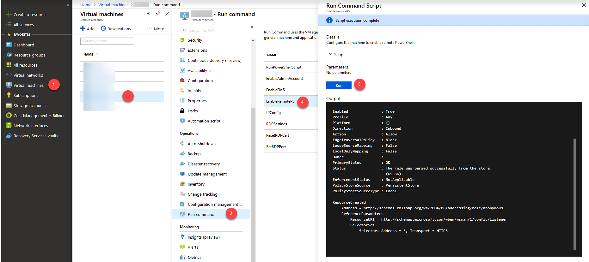
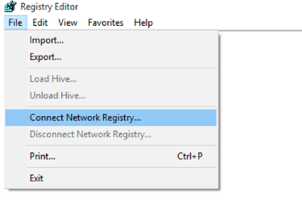
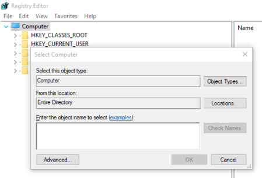
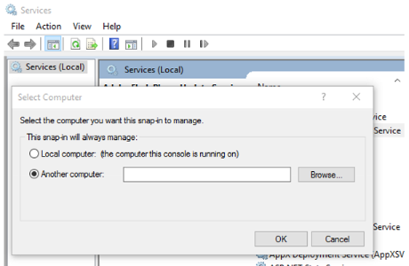

# Use remote tools to troubleshoot Azure VM issues

When you troubleshoot issues on an Azure virtual machine (VM), you can connect to the VM by using the remote tools that are discussed in this article instead of using the Remote Desktop Protocol (RDP).

## Serial console

Use a [serial console for Azure Virtual Machines](serial-console-windows.md) to run commands on the remote Azure VM.

## Remote CMD

Download [PsExec](https://docs.microsoft.com/sysinternals/downloads/psexec). Connect to the VM by running the following command:

```cmd
psexec \\<computer>-u user -s cmd
```

>[!NOTE]
>* The command must be run on a computer that's in the same virtual network.
>* DIP or HostName can be used to replace \<computer>.
>* The -s parameter makes sure that the command is invoked by using System Account (administrator permission).
>* PsExec uses TCP ports 135 and 445. As a result, the two ports have to be open on the firewall.

## Run command

For more information about how to use the run command feature to run scripts on the VM, see [Run PowerShell scripts in your Windows VM with run command](../windows/run-command.md).

## Custom Script Extension

You can use the Custom Script Extension feature to run a custom script on the target VM. To use this feature, the following conditions must be met:

* The VM has connectivity.
* Azure Virtual Machine Agent is installed and is working as expected on the VM.
* The extension wasn't previously installed on the VM.
 
  The extension injects the script only the first time that it's used. If you use this feature later, the extension recognizes that it was already used and doesn't upload the new script.

Upload your script to a storage account, and generate its own container. Then, run the following script in Azure PowerShell on a computer that has connectivity to the VM.

### For classic deployment model VMs

[!INCLUDE [classic-vm-deprecation](../../../includes/classic-vm-deprecation.md)]


```powershell
#Set up the basic variables.
$subscriptionID = "<<SUBSCRIPTION ID>>" 
$storageAccount = "<<STORAGE ACCOUNT>>" 
$localScript = "<<FULL PATH OF THE PS1 FILE TO EXECUTE ON THE VM>>" 
$blobName = "file.ps1" #Name you want for the blob in the storage.
$vmName = "<<VM NAME>>" 
$vmCloudService = "<<CLOUD SERVICE>>" #Resource group or cloud service where the VM is hosted. For example, for "demo305.cloudapp.net" the cloud service is going to be demo305.

#Set up the Azure PowerShell module, and ensure the access to the subscription.
Import-Module Azure
Add-AzureAccount  #Ensure login with the account associated with the subscription ID.
Get-AzureSubscription -SubscriptionId $subscriptionID | Select-AzureSubscription

#Set up the access to the storage account, and upload the script.
$storageKey = (Get-AzureStorageKey -StorageAccountName $storageAccount).Primary
$context = New-AzureStorageContext -StorageAccountName $storageAccount -StorageAccountKey $storageKey
$container = "cse" + (Get-Date -Format yyyyMMddhhmmss)<
New-AzureStorageContainer -Name $container -Permission Off -Context $context
Set-AzureStorageBlobContent -File $localScript -Container $container -Blob $blobName  -Context $context

#Push the script into the VM.
$vm = Get-AzureVM -ServiceName $vmCloudService -Name $vmName
Set-AzureVMCustomScriptExtension "CustomScriptExtension" -VM $vm -StorageAccountName $storageAccount -StorageAccountKey $storagekey -ContainerName $container -FileName $blobName -Run $blobName | Update-AzureVM
```

### For Azure Resource Manager VMs

 

```powershell
#Set up the basic variables.
$subscriptionID = "<<SUBSCRIPTION ID>>"
$storageAccount = "<<STORAGE ACCOUNT>>"
$storageRG = "<<RESOURCE GROUP OF THE STORAGE ACCOUNT>>" 
$localScript = "<<FULL PATH OF THE PS1 FILE TO EXECUTE ON THE VM>>" 
$blobName = "file.ps1" #Name you want for the blob in the storage.
$vmName = "<<VM NAME>>" 
$vmResourceGroup = "<<RESOURCE GROUP>>"
$vmLocation = "<<DATACENTER>>" 
 
#Set up the Azure PowerShell module, and ensure the access to the subscription.
Login-AzAccount #Ensure login with the account associated with the subscription ID.
Get-AzSubscription -SubscriptionId $subscriptionID | Select-AzSubscription

#Set up the access to the storage account, and upload the script.
$storageKey = (Get-AzStorageAccountKey -ResourceGroupName $storageRG -Name $storageAccount).Value[0]
$context = New-AzureStorageContext -StorageAccountName $storageAccount -StorageAccountKey $storageKey
$container = "cse" + (Get-Date -Format yyyyMMddhhmmss)
New-AzureStorageContainer -Name $container -Permission Off -Context $context
Set-AzureStorageBlobContent -File $localScript -Container $container -Blob $blobName  -Context $context

#Push the script into the VM.
Set-AzVMCustomScriptExtension -Name "CustomScriptExtension" -ResourceGroupName $vmResourceGroup -VMName $vmName -Location $vmLocation -StorageAccountName $storageAccount -StorageAccountKey $storagekey -ContainerName $container -FileName $blobName -Run $blobName
```

## Remote PowerShell

>[!NOTE]
>TCP Port 5986 (HTTPS) must be open so that you can use this option.
>
>For Azure Resource Manager VMs, you must open port 5986 on the network security group (NSG). For more information, see Security groups. 
>
>For RDFE VMs, you must have an endpoint that has a private port (5986) and a public port. Then, you also have to open that public-facing port on the NSG.

### Set up the client computer

To use PowerShell to connect to the VM remotely, you first have to set up the client computer to allow the connection. To do this, add the VM to the PowerShell trusted hosts list by running the following command, as appropriate.

To add one VM to the trusted hosts list:

```powershell
Set-Item wsman:\localhost\Client\TrustedHosts -value <ComputerName>
```

To add multiple VMs to the trusted hosts list:

```powershell
Set-Item wsman:\localhost\Client\TrustedHosts -value <ComputerName1>,<ComputerName2>
```

To add all computers to the trusted hosts list:

```powershell
Set-Item wsman:\localhost\Client\TrustedHosts -value *
```

### Enable RemotePS on the VM

For VMs created using the classic deployment model, use the Custom Script Extension to run the following script:

```powershell
Enable-PSRemoting -Force
New-NetFirewallRule -Name "Allow WinRM HTTPS" -DisplayName "WinRM HTTPS" -Enabled True -Profile Any -Action Allow -Direction Inbound -LocalPort 5986 -Protocol TCP
$thumbprint = (New-SelfSignedCertificate -DnsName $env:COMPUTERNAME -CertStoreLocation Cert:\LocalMachine\My).Thumbprint
$command = "winrm create winrm/config/Listener?Address=*+Transport=HTTPS @{Hostname=""$env:computername""; CertificateThumbprint=""$thumbprint""}"
cmd.exe /C $command
```

For Azure Resource Manager VMs, use run commands from the portal to run the EnableRemotePS script:



### Connect to the VM

Run the following command based on the client computer location:

* Outside the virtual network or deployment

  * For a VM created using the classic deployment model, run the following command:

    ```powershell
    $Skip = New-PSSessionOption -SkipCACheck -SkipCNCheck
    Enter-PSSession -ComputerName  "<<CLOUDSERVICENAME.cloudapp.net>>" -port "<<PUBLIC PORT NUMBER>>" -Credential (Get-Credential) -useSSL -SessionOption $Skip
    ```

  * For an Azure Resource Manager VM, first add a DNS name to the public IP address. For detailed steps, see [Create a fully qualified domain name in the Azure portal for a Windows VM](../windows/portal-create-fqdn.md). Then, run the following command:

    ```powershell
    $Skip = New-PSSessionOption -SkipCACheck -SkipCNCheck
    Enter-PSSession -ComputerName "<<DNSname.DataCenter.cloudapp.azure.com>>" -port "5986" -Credential (Get-Credential) -useSSL -SessionOption $Skip
    ```

* Inside the virtual network or deployment, run the following command:
  
  ```powershell
  $Skip = New-PSSessionOption -SkipCACheck -SkipCNCheck
  Enter-PSSession -ComputerName  "<<HOSTNAME>>" -port 5986 -Credential (Get-Credential) -useSSL -SessionOption $Skip
  ```

>[!NOTE] 
>Setting the SkipCaCheck flag bypasses the requirement to import a certificate to the VM when you start the session.

You can also use the Invoke-Command cmdlet to run a script on the VM remotely.

```powershell
Invoke-Command -ComputerName "<<COMPUTERNAME>" -ScriptBlock {"<<SCRIPT BLOCK>>"}
```

## Remote Registry

>[!NOTE]
>TCP port 135 or 445 must be open in order to use this option.
>
>For Azure Resource Manager VMs, you have to open port 5986 on the NSG. For more information, see Security groups. 
>
>For RDFE VMs, you must have an endpoint that has a private port 5986 and a public port. You also have to open that public-facing port on the NSG.

1. From another VM on the same virtual network, open the registry editor (regedit.exe).

2. Select **File** > **Connect Network Registry**.

    

3. Locate the target VM by **host name** or **dynamic IP** (preferable) by entering it in the **Enter the object name to select** box.

    
 
4. Enter the credentials for the target VM.

5. Make any necessary registry changes.

## Remote services console

>[!NOTE]
>TCP ports 135 or 445 must be open in order to use this option.
>
>For Azure Resource Manager VMs, you have to open port 5986 on the NSG. For more information, see Security groups. 
>
>For RDFE VMs, you must have an endpoint that has a private port 5986 and a public port. You also have to open that public-facing port on the NSG.

1. From another VM on the same virtual network, open an instance of **Services.msc**.

2. Right-click **Services (Local)**.

3. Select **Connect to another computer**.

   

4. Enter the dynamic IP of the target VM.

   

5. Make any necessary changes to the services.

## Next steps

- For more information about the Enter-PSSession cmdlet, see [Enter-PSSession](https://technet.microsoft.com/library/hh849707.aspx).
- For more information about the Custom Script Extension for Windows using the classic deployment model, see [Custom Script Extension for Windows](../extensions/custom-script-classic.md).
- PsExec is part of the [PSTools Suite](https://download.sysinternals.com/files/PSTools.zip).
- For more information about the PSTools Suite, see [PSTools](https://docs.microsoft.com/sysinternals/downloads/pstools).


