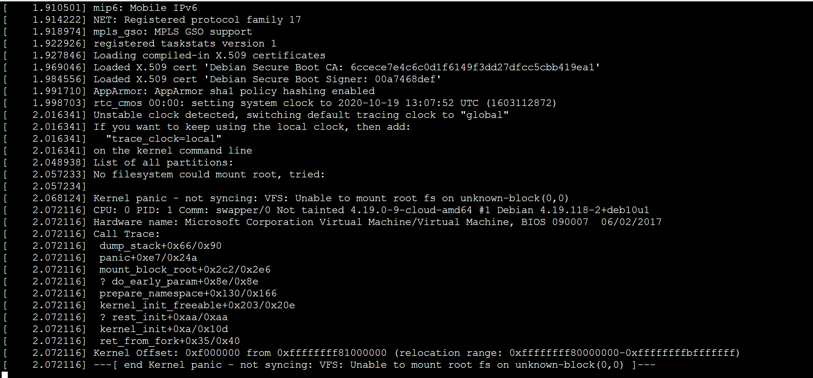
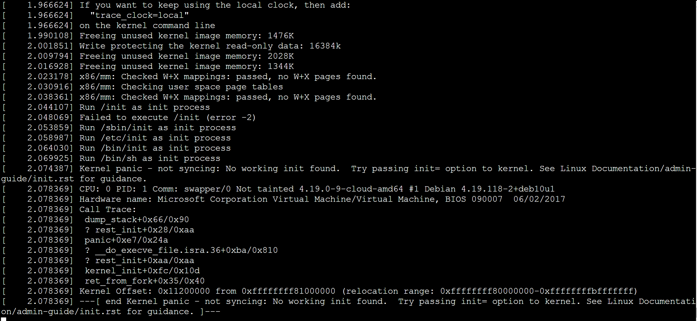
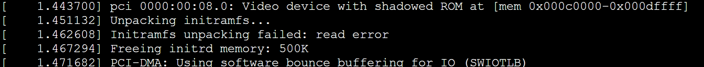

# Auto Repair a Linux VM by using Azure Linux Auto Repair (ALAR)

The ALAR scripts are integrated with the Azure Virtual Machine repair extension. With the help of those scripts a VM can be recovered without any manual step to be performed by the administrator as compared with [Repair a Linux VM by using the Azure Virtual Machine repair commands](./repair-linux-vm-using-azure-virtual-machine-repair-commands.md). 

The repair scenarios covered by ALAR are
- malformed /etc/fstab
   syntax error
   missing disk
- damaged initrd or missing initrd line in the /boot/grub/grub.cfg
- last installed kernel is not bootable

## The ALAR Scripts

**fstab**
This script does strip off any lines in the /etc/fstab file which are not needed to boot a system. It makes a copy of the original file first. So after the start of the OS the admin is able to edit the fstab again and correct any errors which didn’t allow a reboot of the system before.

Consult also this page [Troubleshoot Linux VM starting issues due to fstab errors](./linux-virtual-machine-cannot-start-fstab-errors.md) to better understand the scenarios that can arise if the information in the file `/etc/fstab` is not correct.

**kernel**
This script does change the default kernel. It modifies the configuration so that the previous kernel version gets booted. After the OS got started the admin is able to replace the broken kernel.

Consult also this page [How to recover an Azure Linux virtual machine from kernel-related boot issues](https://docs.microsoft.com/en-gb/troubleshoot/azure/virtual-machines/kernel-related-boot-issues) to understand what messages you see on the serial-console in case there is an issue with the kernel.

**initrd**
This script corrects two issues that can happen when a new kernel gets installed.

The grub.cfg file is missing an `initrd` line or the initrd image is missing at all. So it either fixes the grub.cfg file and/or creates a new initrd image.

Initrd related boot issues may show up in the following ways.


In both cases the following information is logged before.



## How to use ALAR
To use the ALAR scripts with the help of the Azure Virtual Machine repair extension you have to utilize the command ‘run’ and its option ‘--run-id’ The script-id for the automated recovery is: **linux-alar-fki**

For instance

```azurecli-interactive
az vm repair create --verbose -g centos7 -n cent7 --repair-username rescue --repair-password 'password!234’
 ```

```azurecli-interactive
az vm repair run --verbose -g centos7 -n cent7 --run-id linux-alar-fki --parameters initrd --run-on-repair
 ```

```azurecli-interactive
az vm repair restore --verbose -g centos7 -n cent7
 ```

With the above steps a repair VM is created. In the next step we use the script `initrd` to get an initrd boot issue fixed. In the last step the restor operation is performed.

  [!NOTE]
>  You can pass over either a single
> recover-operation or multiple operations, i.e.,
>  fstab; ‘fstab,initrd’. 
> Separate the recover operation with a comma – no spaces allowed!


## Limitations
- encrypted images are not supported.
- Classic VMs are not supported.
- EFI based images are not supported.


## Feedback

If any bugs are encountered or enhancement requests need to be filled for Azure Linux Auto Recover please do this on [GitHub](https://github.com/Azure/repair-script-library/issues).