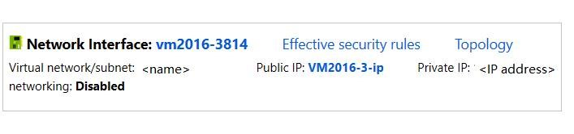
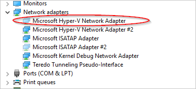

# How to reset network interface for Azure Windows VM 

[!INCLUDE [learn-about-deployment-models](../../../includes/learn-about-deployment-models-both-include.md)]

This article shows how to reset the network interface for Azure Windows VM to resolve issues when you cannot connect to Microsoft Azure Windows Virtual Machine (VM) after:

* You disable the default Network Interface (NIC). 
* You manually set a static IP for the NIC. 

[!INCLUDE [support-disclaimer](../../../includes/support-disclaimer.md)]

## Reset network interface

### For VMs deployed in Resource group model

1.	Go to the [Azure portal](https://ms.portal.azure.com).
2.	Select the affected Virtual Machine.
3.	Select **Networking** and then select the network Interface of the VM.

    
    
4.	Select **IP configurations**.
5.	Select the IP. 
6.	If the **Private IP assignment**  is not  **Static**, change it to **Static**.
7.	Change the **IP address** to another IP address that is available in the Subnet.
8. The virtual machine will restart to initialize the new NIC to the system.
9.	Try to RDP to your machine.	If successful, you can change the Private IP address back to the original if you would like. Otherwise, you can keep it. 

#### Use Azure PowerShell

1. Make sure that you have [the latest Azure PowerShell](https://docs.microsoft.com/powershell/azure/overview) installed
2. Open an elevated Azure PowerShell session (Run as administrator). Run the following commands:

    ```powershell
    #Set the variables 
    $SubscriptionID = "<Subscription ID>"​
    $VM = "<VM Name>"
    $ResourceGroup = "<Resource Group>"
    $VNET = "<Virtual Network>"
    $IP = "NEWIP"

    #Log in to the subscription​ 
    Add-AzAccount
    Select-AzSubscription -SubscriptionId $SubscriptionId 
    
    #Check whether the new IP address is available in the virtual network.
    Test-AzureStaticVNetIP –VNetName $VNET –IPAddress  $IP

    #Add/Change static IP. This process will not change MAC address
    Get-AzVM -ServiceName $ResourceGroup -Name $VM | Set-AzureStaticVNetIP -IPAddress $IP | Update-AzVM
    ```
3. Try to RDP to your machine.	If successful, you can change the Private IP address back to the original if you would like. Otherwise, you can keep it.

### For Classic VMs

To reset network interface, follow these steps:

#### Use Azure portal

1.	Go to the [Azure portal]( https://ms.portal.azure.com).
2.	Select **Virtual Machines (Classic)**.
3.	Select the affected Virtual Machine.
4.	Select **IP addresses**.
5.	If the **Private IP assignment**  is not  **Static**, change it to **Static**.
6.	Change the **IP address** to another IP address that is available in the Subnet.
7.	Select **Save**.
8.	The virtual machine will restart to initialize the new NIC to the system.
9.	Try to RDP to your machine.	If successful, you can choose to revert the Private IP address back to the original.  

#### Use Azure PowerShell

1. Make sure that you have [the latest Azure PowerShell](https://docs.microsoft.com/powershell/azure/overview) installed.
2. Open an elevated Azure PowerShell session (Run as administrator). Run the following commands:

    ```powershell
    #Set the variables 
    $SubscriptionID = "<Subscription ID>"​
    $VM = "<VM Name>"
    $CloudService = "<Cloud Service>"
    $VNET = "<Virtual Network>"
    $IP = "NEWIP"

    #Log in to the subscription​ 
    Add-AzureAccount
    Select-AzureSubscription -SubscriptionId $SubscriptionId 

    #Check whether the new IP address is available in the virtual network.
    Test-AzureStaticVNetIP –VNetName $VNET –IPAddress  $IP
    
    #Add/Change static IP. This process will not change MAC address
    Get-AzureVM -ServiceName $CloudService -Name $VM | Set-AzureStaticVNetIP -IPAddress $IP |Update-AzureVM
    ```
3. Try to RDP to your machine. If successful, you can change the Private IP address back to the original if you would like. Otherwise, you can keep it. 

## Delete the unavailable NICs
After you can remote desktop to the machine, you must delete the old NICs to avoid the potential problem:

1.	Open Device Manager.
2.	Select **View** > **Show hidden devices**.
3.	Select **Network Adapters**. 
4.	Check for the adapters named as "Microsoft Hyper-V Network Adapter".
5.	You might see an unavailable adapter that is grayed out. Right-click the adapter and then select Uninstall.

    

    > [!NOTE]
    > Only uninstall the unavailable adapters that have the name "Microsoft Hyper-V Network Adapter". If you uninstall any of the other hidden adapters, it could cause additional issues.
    >
    >

6.	Now all unavailable adapters should be cleared of your system.
