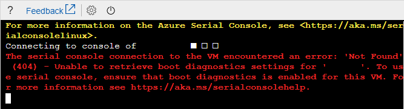
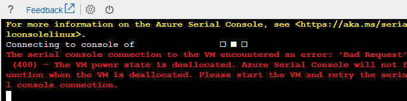
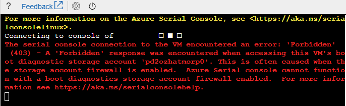

# Common errors within the Azure Serial Console
There are a set of known errors within the Azure Serial Console. This is a list of those errors and mitigation steps for them.

## Common errors

Error                            |   Mitigation
:---------------------------------|:--------------------------------------------|
Unable to retrieve boot diagnostics settings for *&lt;VMNAME&gt;*. To use the serial console, ensure that boot diagnostics is enabled for this VM.  | Ensure that the VM or virtual machine scale set has [boot diagnostics](boot-diagnostics.md) enabled. If you are using serial console on a virtual machine scale set instance, ensure that your instance has the latest model.
The VM is in a stopped deallocated state. Start the VM and retry the serial console connection.  | The VM or virtual machine scale set instance must be in a started state to access the serial console. Start your VM or virtual machine scale set instance and try again.
A "Forbidden" response was encountered when accessing this VM's boot diagnostic storage account. | Ensure that boot diagnostics doesn't have an account firewall. An accessible boot diagnostic storage account is necessary for the serial console to function.
You do not have the required permissions to use this VM with the serial console. Ensure you have at least Virtual Machine Contributor role permissions.| The serial console access requires you to have contributor level access or above on your VM or virtual machine scale set. For more information, see the [overview page](serial-console-overview.md).
The storage account '' used for boot diagnostics on this VM could not be found. Verify that boot diagnostics is enabled for this VM, this storage account has not been deleted, and you have access to this storage account. | Double check that you have not deleted the boot diagnostics storage account for your VM or virtual machine scale set
Provisioning for this VM has not yet succeeded. Please ensure the VM is fully deployed and retry the serial console connection. | Your VM or virtual machine scale set may still be provisioning. Wait some time and try again.
You do not have the required permissions to write to the boot diagnostics storage account for this VM. Please ensure you have at least VM Contributor permissions on ''. | Serial console access requires contributor level access on the boot diagnostics storage account. For more information, see the [overview page](serial-console-overview.md).
Unable to determine the resource group for the boot diagnostics storage account *&lt;STORAGEACCOUNTNAME&gt;*. Verify that boot diagnostics is enabled for this VM and you have access to this storage account. | Serial console access requires contributor level access on the boot diagnostics storage account. For more information, see the [overview page](serial-console-overview.md).
Web socket is closed or could not be opened. | You may need to add firewall access to `*.console.azure.com`. A more detailed but longer approach is to allow firewall access to the [Microsoft Azure Datacenter IP ranges](https://www.microsoft.com/download/details.aspx?id=41653), which change fairly regularly.

## Next steps
* Learn more about the [Azure Serial Console for Linux VMs](./serial-console-linux.md)
* Learn more about the [Azure Serial Console for Windows VMs](./serial-console-windows.md)