# Proactively ensuring you have access to GRUB and sysrq could save you lots of down time

Having access to the Serial Console and GRUB will improve recovery times of your IaaS Linux Virtual Machine in most cases. GRUB offers recovery options that otherwise would take longer to recover your VM. 


The reasons to perform a VM recovery are many and can be attributed to scenarios such as:

   - Corrupt file systems/kernel/MBR (Master Boot Record)
   - Failed kernel upgrades
   - Incorrect GRUB kernel parameters
   - Incorrect fstab configurations
   - Firewall configurations
   - Lost password
   - Mangled sshd configurations files
   - Networking configurations

 Many other scenarios as detailed [here](https://docs.microsoft.com/azure/virtual-machines/troubleshooting/serial-console-linux#common-scenarios-for-accessing-the-serial-console)

Verify that you can access GRUB and the Serial console on your VMs deployed in Azure. 

If you are new to Serial Console, refer to [this link](https://docs.microsoft.com/azure/virtual-machines/troubleshooting/serial-console-linux/).

> [!TIP]
> Ensure you take backups of files before making changes

Watch this video below to see how you can quickly recover your Linux VM once you have access to GRUB

[Recover Linux VM Video](https://youtu.be/KevOc3d_SG4)

There are a number of methods to help recovery of Linux VMs. In a Cloud environment, this process has been challenging.
Progress is being made continually to tooling and features to ensure services are recovered quickly.

With the Azure Serial Console, you can interact with your Linux VM as if you were at a system's console.

You can manipulate many configuration files including how the kernel will boot. 

The more experienced Linux/Unix sys admins will appreciate the **single user** and  **emergency modes** that are accessible via the Azure Serial Console making Disk Swap and VM deletion for many recovery scenarios redundant.

The method of recovery depends on the problem being experienced, for example a lost or misplaced password can be reset through Azure portal options ->  **Reset Password**. The **Reset Password** feature is known as an Extension and  communicates with the Linux Guest agent.

Other extensions such as Custom Script are available however these options require that the Linux **waagent** be up and in a healthy state which is not always the case.

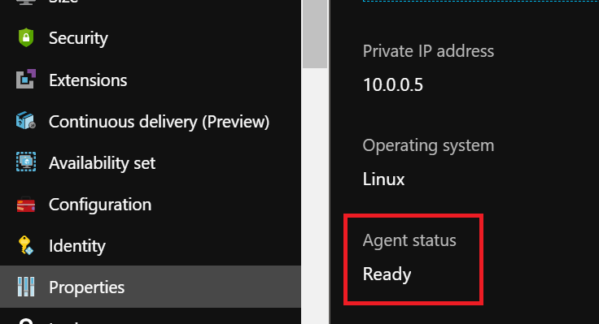


Ensuring you have access to the Azure Serial Console and GRUB means that a password change or an incorrect configuration can be rectified in a matter of minutes instead of hours. You could even force the VM to boot from an alternative kernel should you have multiple kernels on disk in the scenario where your primary kernel becomes corrupt.

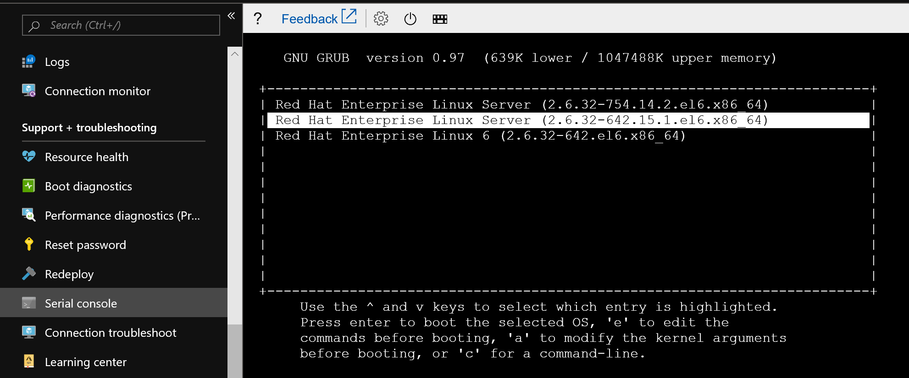

## Suggested order of recovery methods:

- Azure Serial Console

- Disk Swap – can be automated using either:

   - [PowerShell Recovery Scripts](https://github.com/Azure/azure-support-scripts/tree/master/VMRecovery/ResourceManager)
   - [bash Recovery Scripts](https://github.com/sribs/azure-support-scripts)

- Legacy Method

## Disk Swap Video:

If you do not have access to GRUB watch [this](https://youtu.be/m5t0GZ5oGAc) video and see, how you can easily automate the disk swap procedure to recover your VM

## Challenges:

Not all Linux Azure VMs are configured by default for GRUB access and neither are they all configured to be interrupted with the sysrq commands. Some older distros such as SLES 11 are not configured to display Login prompt in the Azure Serial Console

In this article, we'll review various Linux distributions and document configurations on how to make GRUB available.


## How to configure Linux VM to accept SysRq keys
The sysrq key is enabled on some newer Linux distros by default, although on others it might be configured for accepting values only for certain SysRq functions.
On older distros, it might be disabled completely.

The SysRq feature is useful for rebooting a crashed or non-responding VM directly from the Azure Serial Console, also helpful in gaining access to the GRUB menu, alternatively restarting a VM from another portal window or ssh session might drop your current console connection thus expiring GRUB Timeouts to which are used to display the GRUB menu.
The VM must be configured to accept a value of 1 for the kernel parameter, which enables all functions of sysrq or 128, which allows reboot/poweroff


[Enable sysrq video](https://youtu.be/0doqFRrHz_Mc)


To configure the VM to accept a reboot via SysRq commands on the Azure portal, you will need to set a value of 1 for the kernel parameter kernel.sysrq

For this configuration to persist a reboot, add an entry to the file **sysctl.conf**

`echo kernel.sysrq = 1 >> /etc/sysctl.conf`

To configure the kernel parameter dynamically

`sysctl -w kernel.sysrq=1`

If you do not have **root** access or sudo is broken, it will not be possible configure sysrq from a shell prompt.

You can enable sysrq in this scenario using the Azure portal. This method can be beneficial if the  **sudoers.d/waagent** file has become broken or has been deleted.

Using the Azure portal Operations -> Run Command -> RunShellScript feature, requires the waagent process be healthy you can then inject this command to enable sysrq

`sysctl -w kernel.sysrq=1 ; echo kernel.sysrq = 1 >> /etc/sysctl.conf`

As shown here:
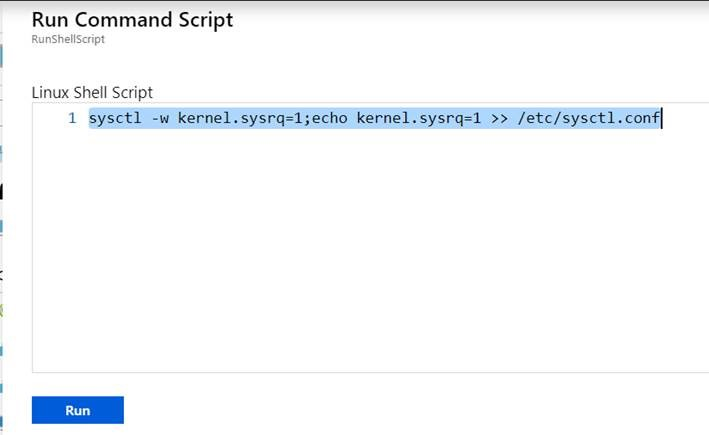

Once completed, you can then try accessing **sysrq** and should see that a reboot is possible.

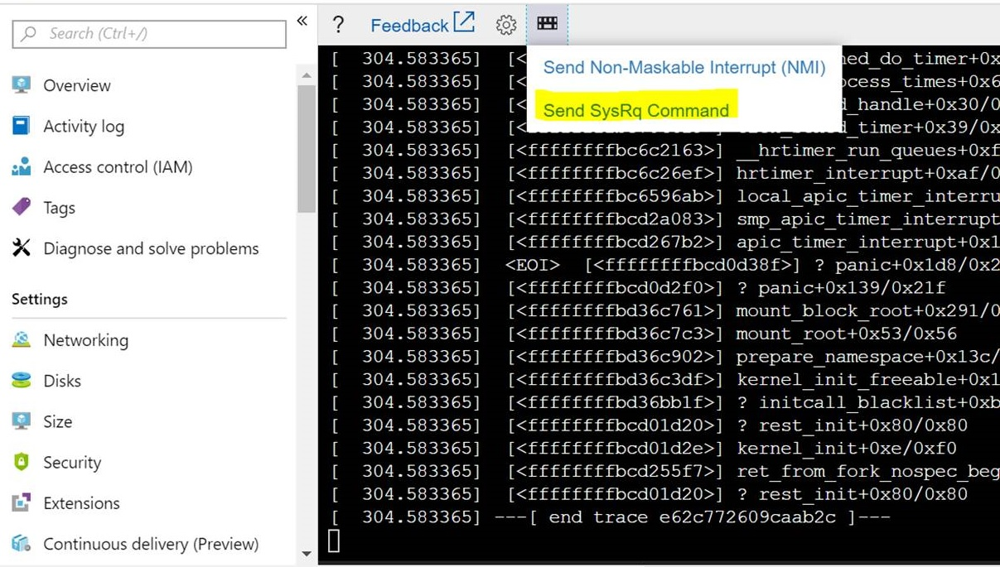

Select **Reboot** and **Send SysRq** Command

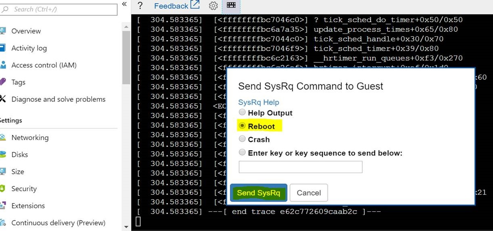

The system should log a reset message such as this

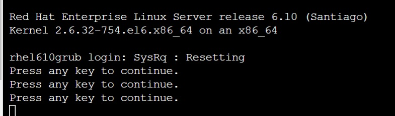


## Ubuntu GRUB configuration

By default you should be able to access GRUB by holding down **Esc** key during the VM boot, if the GRUB menu is not presented you can force and keep the GRUB menu on screen in the Azure Serial Console by using one of these  options.

**Option 1** - Forces GRUB to be displayed on Screen 

Update the file /etc/default/grub.d/50-cloudimg-settings.cfg to keep the GRUB menu on screen for the specified TIMEOUT.
You are not required to hit **Esc** as GRUB will be displayed immediately

```
GRUB_TIMEOUT=0

change to

GRUB_TIMEOUT=5
```

**Option 2** - Allows for **Esc** to be pressed before booting

Similar behavior can be experienced by making changes to the file
 /etc/default/grub and observe a 3-second timeout to hit **Esc**


Comment out these two lines:

```
#GRUB_HIDDEN_TIMEOUT=0
#GRUB_HIDDEN_TIMEOUT_QUIET=true
```
and add this line:

```
GRUB_TIMEOUT_STYLE=countdown
```


## Ubuntu 12\.04

Ubuntu 12.04 will allow access to serial console but does not offer the ability to interact. 
A **login:** prompt is not seen


For 12.04 to obtain a **login:** prompt:
1. Create a file called /etc/init/ttyS0.conf containing the following text:

    ```
    # ttyS0 - getty
    #
    # This service maintains a getty on ttyS0 from the point the system is
    # started until it is shut down again.
    start on stopped rc RUNLEVEL=[12345]
    stop on runlevel [!12345]
    
    respawn
    exec /sbin/getty -L 115200 ttyS0 vt102
    ```    

2. Ask upstart to start the getty     
    ```
    sudo start ttyS0
    ```
 
The settings required to configure serial console for Ubuntu versions can be found [here](https://help.ubuntu.com/community/SerialConsoleHowto)

## Ubuntu Recovery Mode

Additional recovery and clean-up options are available for Ubuntu via GRUB however these settings are only accessible if you configure kernel parameters accordingly.
Failure to configure this kernel boot parameter would force the Recovery menu to be sent to the Azure Diagnostics and not to the Azure Serial Console.
You can obtain access to the Ubuntu Recovery Menu by following these steps:

Interrupt the BOOT Process and access GRUB menu

Select Advanced Options for Ubuntu and press enter

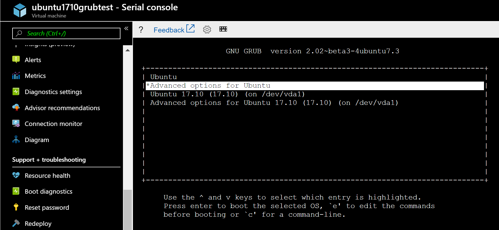

Select the line displaying *(recovery mode)* do not press enter but press “e”

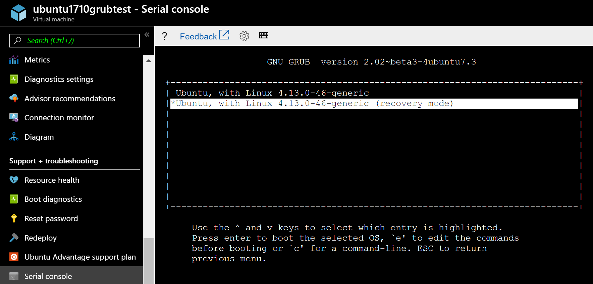

Locate the line that will load the kernel and substitute the last parameter **nomodeset** with destination as **console=ttyS0**

```
linux /boot/vmlinuz-4.15.0-1023-azure root=UUID=21b294f1-25bd-4265-9c4e-d6e4aeb57e97 ro recovery nomodeset

change to

linux /boot/vmlinuz-4.15.0-1023-azure root=UUID=21b294f1-25bd-4265-9c4e-d6e4aeb57e97 ro recovery console=ttyS0
```

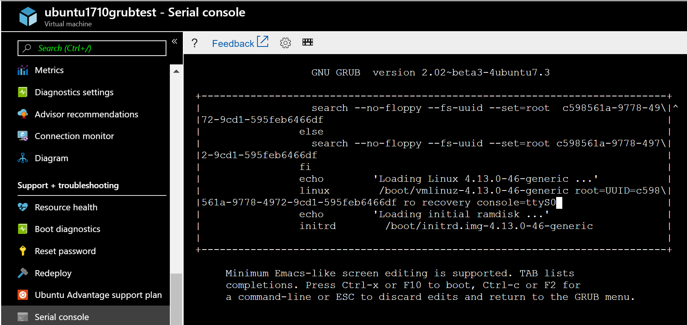

Press **Ctrl-x** to start and load the kernel.
If all goes well you will see these additional Options, which can help perform other recovery options

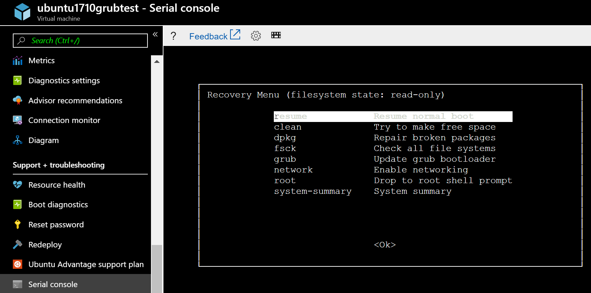


## Red Hat GRUB configuration

## Red Hat 7\.4\+ GRUB configuration
The default /etc/default/grub configuration on these versions is adequately configured

```
GRUB_TIMEOUT=5
GRUB_DISTRIBUTOR="$(sed 's, release .*$,,g' /etc/system-release)"
GRUB_DEFAULT=saved
GRUB_DISABLE_SUBMENU=true
GRUB_TERMINAL="serial console"
GRUB_SERIAL_COMMAND="serial"
GRUB_CMDLINE_LINUX="console=tty1 console=ttyS0 earlyprintk=ttyS0 rootdelay=300"
GRUB_DISABLE_RECOVERY="true"
```

Enable the SysRq key

```
sysctl -w kernel.sysrq=1;echo kernel.sysrq = 1 >> /etc/sysctl.conf;sysctl -a | grep -i sysrq
```

## Red Hat 7\.2 and 7\.3 GRUB configuration
The file to modify is /etc/default/grub – a default config looks like this example:

```
GRUB_TIMEOUT=1
GRUB_DISTRIBUTOR="$(sed 's, release .*$,,g' /etc/system-release)"
GRUB_DEFAULT=saved
GRUB_DISABLE_SUBMENU=true
GRUB_TERMINAL_OUTPUT="console"
GRUB_CMDLINE_LINUX="console=tty1 console=ttyS0 earlyprintk=ttyS0 rootdelay=300"
GRUB_DISABLE_RECOVERY="true"
```

Change the following lines in /etc/default/grub

```
GRUB_TIMEOUT=1 

to

GRUB_TIMEOUT=5
```


```
GRUB_TERMINAL_OUTPUT="console"

to

GRUB_TERMINAL="serial console"
```

Also add this line:

```
GRUB_SERIAL_COMMAND=”serial –speed=115200 –unit=0 –word=8 –parity=no –stop=1″
```

/etc/default/grub should now look similar to this example:

```
GRUB_TIMEOUT=5
GRUB_DISTRIBUTOR="$(sed 's, release .*$,,g' /etc/system-release)"
GRUB_DEFAULT=saved
GRUB_DISABLE_SUBMENU=true
GRUB_TERMINAL="serial console"
GRUB_CMDLINE_LINUX="console=tty1 console=ttyS0 earlyprintk=ttyS0 rootdelay=300"
GRUB_DISABLE_RECOVERY="true"
```
 
Complete and update grub configuration using

`grub2-mkconfig -o /boot/grub2/grub.cfg`

Set the SysRq kernel parameter:

`sysctl -w kernel.sysrq = 1;echo kernel.sysrq = 1 >> /etc/sysctl.conf;sysctl -a | grep -i sysrq`

You can alternatively configure GRUB and SysRq using a single line either in the shell or via the Run Command. 
Backup your files before running this command:


`cp /etc/default/grub /etc/default/grub.bak; sed -i 's/GRUB_TIMEOUT=1/GRUB_TIMEOUT=5/g' /etc/default/grub; sed -i 's/GRUB_TERMINAL_OUTPUT="console"/GRUB_TERMINAL="serial console"/g' /etc/default/grub; echo "GRUB_SERIAL_COMMAND=\"serial --speed=115200 --unit=0 --word=8 --parity=no --stop=1\"" >> /etc/default/grub;grub2-mkconfig -o /boot/grub2/grub.cfg;sysctl -w kernel.sysrq=1;echo kernel.sysrq = 1 /etc/sysctl.conf;sysctl -a | grep -i sysrq`


## Red Hat 6\.x GRUB configuration
The file to modify is /boot/grub/grub.conf. The `timeout` value will determine how long GRUB is shown for.

```
#boot=/dev/vda
default=0
timeout=15
splashimage=(hd0,0)/grub/splash.xpm.gz
#hiddenmenu
serial --unit=0 --speed=9600
terminal serial
terminal --timeout=5 serial console
```


The last line  *terminal –-timeout=5 serial console* will further increase **GRUB** timeout by adding a prompt of 5 seconds displaying **Press any key to continue.**

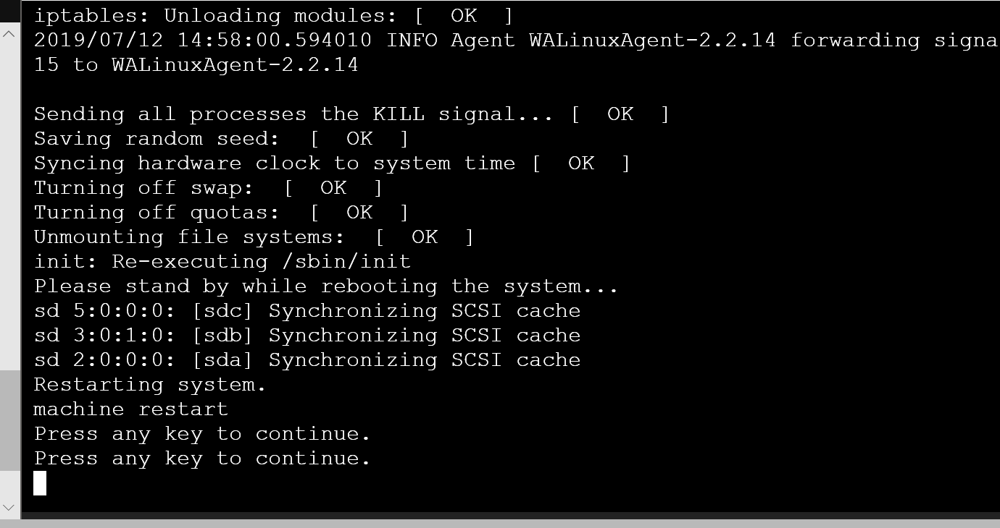

GRUB menu should appear on-screen for the configured timeout=15 without the need to press Esc. Make sure to click in the Console in the Browser to make active the menu and select the required kernel

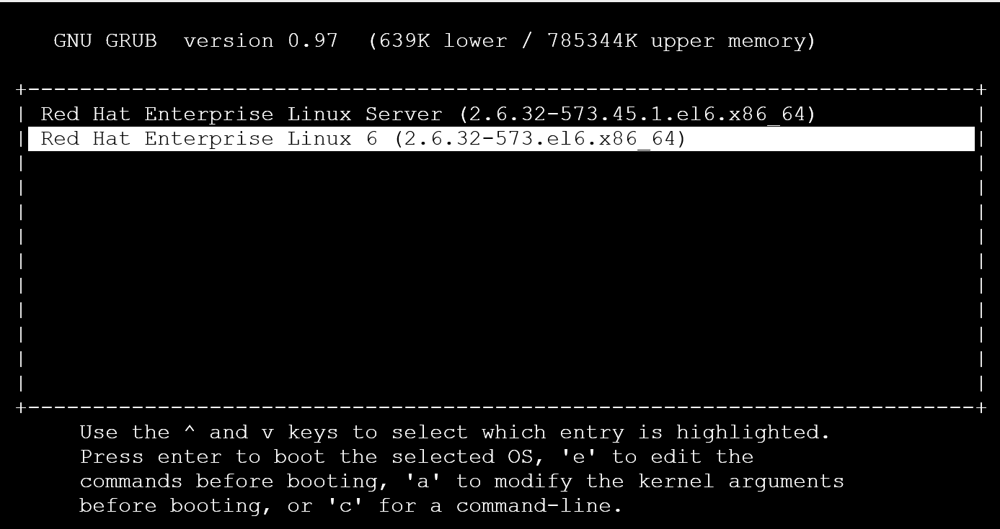

## SuSE

## SLES 12 sp1
Either use YaST bootloader as per the official [docs](https://docs.microsoft.com/azure/virtual-machines/troubleshooting/serial-console-grub-single-user-mode#grub-access-in-suse-sles)

Or add/change to /etc/default/grub the following parameters:

```
GRUB_TERMINAL=serial
GRUB_TIMEOUT=5
GRUB_SERIAL_COMMAND="serial --unit=0 --speed=9600 --parity=no"

```
Verify that ttys0 is used in the GRUB_CMDLINE_LINUX or GRUB_CMDLINE_LINUX_DEFAULT

```
GRUB_CMDLINE_LINUX_DEFAULT="console=ttyS0,9600n"
```

Recreate the grub.cfg

`grub2-mkconfig -o /boot/grub2/grub.cfg`


## SLES 11 SP4 
The Serial Console appears and displays boot messages but does not display a **login:** prompt

Open an ssh session into the VM and update the file **/etc/inittab** by un-commenting this line:

```
#S0:12345:respawn:/sbin/agetty -L 9600 ttyS0 vt102
```

Next run the command 

`telinit q`

To enable GRUB, the following changes should be made to /boot/grub/menu.lst 

```
timeout 5
serial --unit=0 --speed=9600 --parity=no
terminal --timeout=5 serial console

root (hd0,0)
kernel /boot/vmlinuz-3.0.101-108.74-default root=/dev/disk/by-uuid/ab6b62bb--
1a8c-45eb-96b1-1fbc535b9265 disk=/dev/sda  USE_BY_UUID_DEVICE_NAMES=1 earlyprinttk=ttyS0 console=ttyS0 rootdelay=300  showopts vga=0x314
```

 This configuration will enable the message **Press any key to continue** to appear on the console for 5 seconds 

It will then display the GRUB menu for an additional 5 seconds - by pressing the down arrow you will interrupt the counter and  select a kernel you want to boot either append the keyword **single** for single user mode that requires root password to be set.

Appending the command **init=/bin/bash** will load the kernel but ensures that the init program is replaced by a bash shell.

You will gain access to a shell without having to enter a password. You can then proceed to update password for Linux accounts or make other configuration changes.


## Force the kernel to a bash prompt
Having access to GRUB allows you to interrupt the initialization process this interaction is useful for many recovery procedures.
If you do not have root password and single user requires you to have a root password, you can boot the kernel replacing the init program with a bash prompt – this interrupt can be achieved by appending init=/bin/bash to the kernel boot line

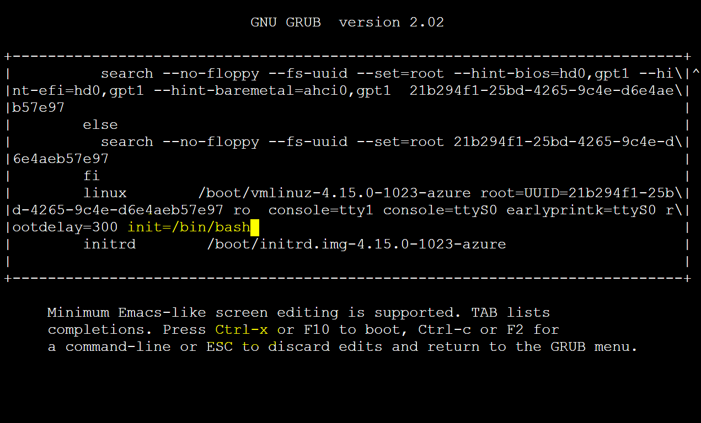

Remount your / (root) file system RW using the command

`mount -o remount,rw /`

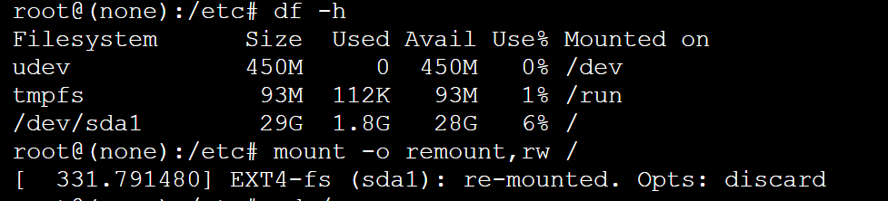


Now you can perform root password change or many other Linux configuration changes

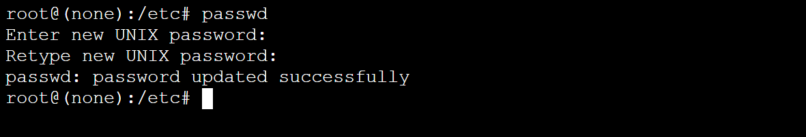

Restart the VM with 

`/sbin/reboot -f`


## Single User mode

Alternatively you might need to access the VM in single user or emergency mode. Select the kernel you wish to boot or interrupt using arrow keys.
Enter the desired mode by appending the keyword **single** or **1** to the kernel boot line. 
On RHEL systems, you can also append **rd.break**.

For more information on how to access single user mode, see [this doc](https://docs.microsoft.com/azure/virtual-machines/troubleshooting/serial-console-grub-single-user-mode#general-single-user-mode-access) 


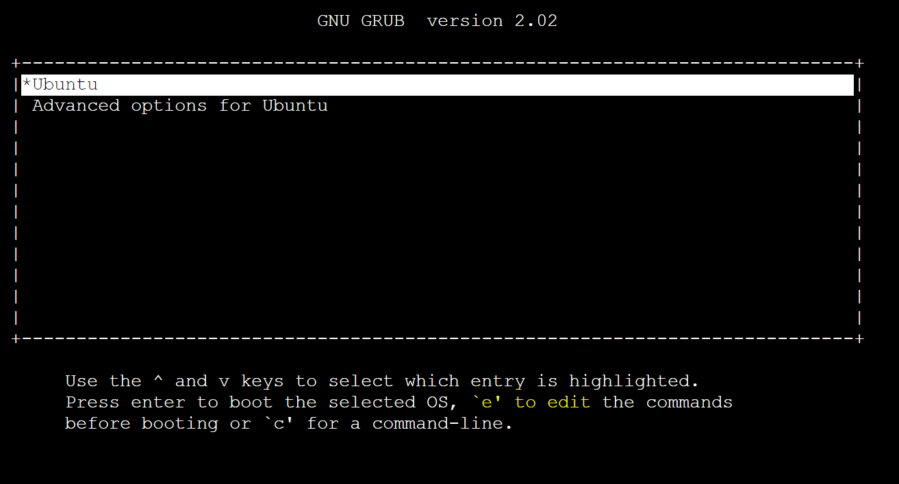


## Next steps
Learn more about [Azure Serial Console]( https://docs.microsoft.com/azure/virtual-machines/troubleshooting/serial-console-linux)
