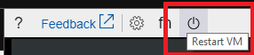

# Use Serial Console to access GRUB and Single User Mode
GRUB is the GRand Unified Bootloader, which is likely the first thing you will see when booting up a VM. Because it displays before the operating system has started, it is not accessible via SSH. From GRUB you are able to modify your boot configuration to boot into single user mode, among other things.

Single user mode is a minimal environment with minimal functionality. It can be useful for investigating boot issues, filesystem issues, or network issues. Fewer services may run in the background, and, depending on the runlevel, a filesystem may not even be automatically mounted.

Single user mode is also useful in situations where your VM may only be configured to accept SSH keys to log in. In this case, you may be able to use single user mode to create an account with password authentication. Note that the serial console service will only allow users with contributor level access or higher to access the serial console of a VM.

To enter single user mode, you will need to enter GRUB when your VM is booting up, and modify the boot configuration in GRUB. Detailed instructions for entering GRUB are below. In general, you may use the restart button within the VM serial console to restart your VM and show GRUB if your VM has been configured to show GRUB.

## General GRUB access
To access GRUB, you will need to reboot your VM while keeping the serial console blade open. Some distros will require keyboard input to show GRUB, while others will automatically show GRUB for a few seconds and allow user keyboard input to cancel the timeout.

You will want to ensure that GRUB is enabled on your VM in order to be able to access single user mode. Depending on your distro, there may be some setup work to ensure that GRUB is enabled. Distro-specific information is available below and at [this link](https://blogs.msdn.microsoft.com/linuxonazure/2018/10/23/why-proactively-ensuring-you-have-access-to-grub-and-sysrq-in-your-linux-vm-could-save-you-lots-of-down-time/).

### Restart your VM to access GRUB in Serial Console
You can restart your VM within the serial console by navigating to the power button and clicking "Restart VM". This will initiate a VM restart, and you will see a notification within the Azure portal regarding the restart.
Restarting your VM can also be done with a SysRq `'b'` command if [SysRq](./serial-console-nmi-sysrq.md) is enabled. Follow the distro-specific instructions below to learn what to expect from GRUB when you reboot.

## General Single User Mode access
Manual access to single user mode may be needed in situations where you have not configured an account with password authentication. You will need to modify the GRUB configuration to manually enter single user mode. Once you have done this, see Use Single User Mode to reset or add a password for further instructions.

In cases where the VM is unable to boot, distros will often automatically drop you into single user mode or emergency mode. Others, however, require additional setup before they can drop you into single-user or emergency mode automatically (such as setting up a root password).

### Use Single User Mode to reset or add a password
Once you are in single user mode, do the following to add a new user with sudo privileges:
1. Run `useradd <username>` to add a user
1. Run `sudo usermod -a -G sudo <username>` to grant the new user root privileges
1. Use `passwd <username>` to set the password for the new user. You will then be able to log in as the new user

## Access for Red Hat Enterprise Linux (RHEL)
RHEL will drop you into single user mode automatically if it cannot boot normally. However, if you have not set up root access for single user mode, you will not have a root password and will be unable to log in. There is a workaround (See 'Manually entering single user mode' below), but the suggestion is to set up root access initially.

### GRUB access in RHEL
RHEL comes with GRUB enabled out of the box. To enter GRUB, reboot your VM with `sudo reboot` and press any key. You will see the GRUB screen show up.

> Note: Red Hat also provides documentation for booting into Rescue Mode, Emergency Mode, Debug Mode, and resetting the root password. [Click here to access it](https://aka.ms/rhel7grubterminal).

### Set up root access for single user mode in RHEL
Single-user mode in RHEL requires the root user to be enabled, which is disabled by default. If you have a need to enable single user mode, use the following instructions:

1. Log in to the Red Hat system via SSH
1. Switch to root
1. Enable password for root user
    * `passwd root` (set a strong root password)
1. Ensure root user can only log in via ttyS0
    * `edit /etc/ssh/sshd_config` and ensure PermitRootLogIn is set to no
    * `edit /etc/securetty file` to only allow log in via ttyS0

Now if the system boots into single user mode you can log in via root password.

Alternatively for RHEL 7.4+ or 6.9+ you can enable single user mode in the GRUB prompts, see instructions [here](https://access.redhat.com/documentation/en-us/red_hat_enterprise_linux/5/html/installation_guide/s1-rescuemode-booting-single)

### Manually enter single user mode in RHEL
If you have set up GRUB and root access with the instructions above, then you can enter single user mode with the following instructions:

1. Press 'Esc' while restarting the VM to enter GRUB
1. In GRUB, press 'e' to edit the selected OS you want to boot into (usually the first line)
1. Find the kernel line - in Azure, this will start with `linux16`
1. Press Ctrl + E to go to the end of the line
1. Add the following to the end of the line: `systemd.unit=rescue.target`
    * This will boot you into single user mode. If you want to use emergency mode, add `systemd.unit=emergency.target` to the end of the line instead of `systemd.unit=rescue.target`
1. Press Ctrl + X to exit and reboot with the applied settings
1. You will be prompted for the administrator password before being able to enter single user mode - this is the same password you created in the instructions above

    

### Enter single user mode without root account enabled in RHEL
If you did not go through the steps above to enable the root user, you can still reset your  root password. Use the following instructions:

> Note: If you are using SELinux, please ensure you have taken the additional steps described in the Red Hat documentation [here](https://aka.ms/rhel7grubterminal) when resetting the root password.

1. Press 'Esc' while restarting the VM to enter GRUB
1. In GRUB, press 'e' to edit the selected OS you want to boot into (usually the first line)
1. Find the kernel line - in Azure, this will start with `linux16`
1. Add `rd.break` to the end of the line, ensuring there is a space before `rd.break` (see example below)
    - This will interrupt the boot process before control is passed from `initramfs` to `systemd`, as described in the Red Hat documentation [here](https://aka.ms/rhel7rootpassword).
1. Press Ctrl + X to exit and reboot with the applied settings
1. Once you boot, you will be dropped into emergency mode with a read-only file system. Enter  `mount -o remount,rw /sysroot` into the shell to remount the root file system with read/write permissions
1. Once you boot into single user mode, type in `chroot /sysroot` to switch into the `sysroot` jail
1. You are now root. You can reset your root password with `passwd` and then use the instructions above to enter single user mode. Type `reboot -f` to reboot once you are done.

> Note: Running through the instructions above will drop you into emergency shell, so you can also perform tasks such as editing `fstab`. However, the generally accepted suggestion is to reset your root password and use that to enter single user mode.

## Access for CentOS
Much like Red Hat Enterprise Linux, single user mode in CentOS requires GRUB and the root user to be enabled.

### GRUB access in CentOS
CentOS comes with GRUB enabled out of the box. To enter GRUB, reboot your VM with `sudo reboot` and press any key. You will see the GRUB screen show up.

### Single user mode in CentOS
Follow the instructions for RHEL above to enable single user mode in CentOS.

## Access for Ubuntu
Ubuntu images do not require a root password. If the system boots into single user mode, you can use it without additional credentials.

### GRUB access in Ubuntu
To access GRUB, press and hold 'Esc' while the VM is booting up.

By default, Ubuntu images may not automatically show the GRUB screen. This can be changed with the following instructions:
1. Open `/etc/default/grub.d/50-cloudimg-settings.cfg` in a text editor of your choice
1. Change the `GRUB_TIMEOUT` value to a non-zero value
1. Open `/etc/default/grub` in a text editor of your choice
1. Comment out the `GRUB_HIDDEN_TIMEOUT=1` line
1. Run `sudo update-grub`

### Single user mode in Ubuntu
Ubuntu will drop you into single user mode automatically if it cannot boot normally. To manually enter single user mode, use the following instructions:

1. From GRUB, press 'e' to edit your boot entry (the Ubuntu entry)
1. Look for the line that starts with `linux`, then look for `ro`
1. Add `single` after `ro`, ensuring there is a space before and after `single`
1. Press Ctrl + X to reboot with these settings and enter single user mode

### Using GRUB to invoke bash in Ubuntu
There may be situations (such as a forgotten root password) where you may still be unable to access single user mode in your Ubuntu VM after trying the instructions above. You can also tell the kernel to run /bin/bash as init, rather than the system init, which will give you a bash shell and allow for system maintenance. Use the following instructions:

1. From GRUB, press 'e' to edit your boot entry (the Ubuntu entry)
1. Look for the line that starts with `linux`, then look for `ro`
1. Replace `ro` with `rw init=/bin/bash`
    - This will mount your filesystem as read-write and use /bin/bash as the init process
1. Press Ctrl + X to reboot with these settings

## Access for CoreOS
Single user mode in CoreOS requires GRUB to be enabled.

### GRUB access in CoreOS
To access GRUB, press any key when your VM is booting up.

### Single user mode in CoreOS
CoreOS will drop you into single user mode automatically if it cannot boot normally. To manually enter single user mode, use the following instructions:
1. From GRUB, press 'e' to edit your boot entry
1. Look for the line that starts with `linux$`. There should be 2, encapsulated in different if/else clauses
1. Append `coreos.autologin=ttyS0` to the end of both `linux$` lines
1. Press Ctrl + X to reboot with these settings and enter single user mode

## Access for SUSE SLES
Newer images of SLES 12 SP3+ allow access via the serial console in case the system boots into emergency mode.

### GRUB access in SUSE SLES
GRUB access in SLES requires bootloader configuration via YaST. To do this, follow these instructions:

1. ssh into your SLES VM and run `sudo yast bootloader`. Use the `tab` key, `enter` key, and arrow keys to navigate through the menu.
1. Navigate to `Kernel Parameters`, and check `Use serial console`.
1. Add `serial --unit=0 --speed=9600 --parity=no` to the Console arguments

1. Press F10 to save your settings and exit
1. To enter GRUB, reboot your VM and press any key during boot sequence to make GRUB stay on screen
    - The default timeout for GRUB is 1s. You can modify this by changing the `GRUB_TIMEOUT` variable in `/etc/default/grub`

### Single user mode in SUSE SLES
You will be automatically dropped into emergency shell if SLES cannot boot normally. To manually enter the emergency shell, use the following instructions:

1. From GRUB, press 'e' to edit your boot entry (the SLES entry)
1. Look for the kernel line - it will start with `linux`
1. Append `systemd.unit=emergency.target` to the end of the line
1. Press Ctrl + X to reboot with these settings and enter emergency shell
   > Note that you will be dropped into emergency shell with a _read-only_ filesystem. If you want to make any edits to any files, you will need to remount the filesystem with read-write permissions. To do this, enter `mount -o remount,rw /` into the shell

## Access for Oracle Linux
Much like Red Hat Enterprise Linux, single user mode in Oracle Linux requires GRUB and the root user to be enabled.

### GRUB access in Oracle Linux
Oracle Linux comes with GRUB enabled out of the box. To enter GRUB, reboot your VM with `sudo reboot` and press 'Esc'. You will see the GRUB screen show up.

### Single user mode in Oracle Linux
Follow the instructions for RHEL above to enable single user mode in Oracle Linux.

## Next steps
* The main serial console Linux documentation page is located [here](serial-console-linux.md).
* Learn how to use Serial Console to [enable GRUB in various distros](https://blogs.msdn.microsoft.com/linuxonazure/2018/10/23/why-proactively-ensuring-you-have-access-to-grub-and-sysrq-in-your-linux-vm-could-save-you-lots-of-down-time/)
* Use Serial Console for [NMI and SysRq calls](serial-console-nmi-sysrq.md)
* The Serial Console is also available for [Windows](serial-console-windows.md) VMs
* Learn more about [boot diagnostics](boot-diagnostics.md)
