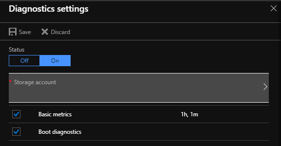
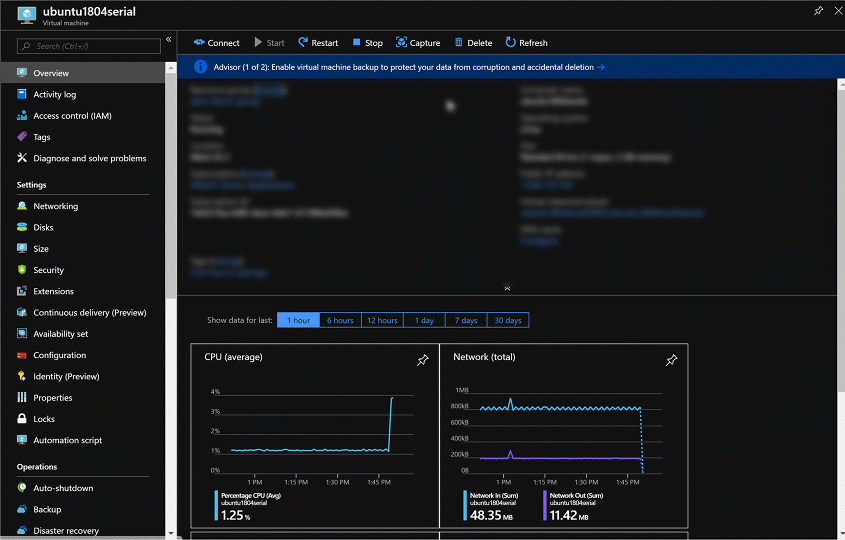
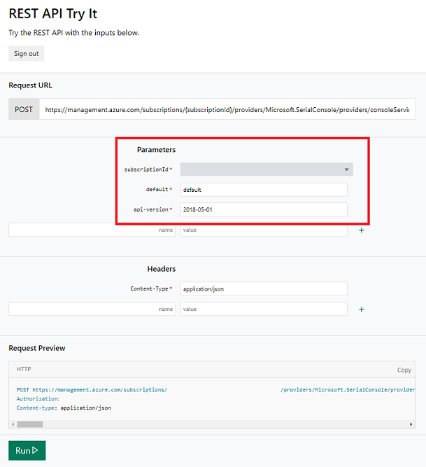

# Virtual Machine Serial Console


The Virtual Machine Serial Console on Azure provides access to a text-based console for Linux virtual machines. This serial connection is to the COM1 serial port of the virtual machine, providing access to the virtual machine that is independent of a virtual machine's network or operating system state. Access to the serial console for a virtual machine can currently only be done via the Azure portal and is allowed only for those users who have VM Contributor or above access to the virtual machine. 

For serial console documentation for Windows VMs, [click here](../windows/serial-console.md).

> [!Note] 
> Serial Console for virtual machines is generally available in global Azure regions. At this point Serial Console is not yet available in Azure Government or Azure China clouds.


## Prerequisites 

* You must be using the resource management deployment model. Classic deployments are not supported. 
* Your virtual machine  MUST have [boot diagnostics](boot-diagnostics.md) enabled - see screenshot below.

    

* The Azure account using the serial console must have [Contributor role](../../role-based-access-control/built-in-roles.md) for the VM and the [boot diagnostics](boot-diagnostics.md) storage account. 
* The virtual machine for which you are acessing serial console must also have a password-based account. You can create one with the [reset password](https://docs.microsoft.com/azure/virtual-machines/extensions/vmaccess#reset-password) functionality of the VM access extension - see the screenshot below.

    

* For settings specific to Linux distros, see [Serial Console Linux distro availability](#serial-console-linux-distro-availability)


## Get started with Serial Console
Serial console for virtual machines is only accessible via [Azure portal](https://portal.azure.com). Ensure that you have met the [prerequisites](#prerequisites) above. Below are the steps to access serial console for virtual machines via portal:

  1. Open the Azure portal
  1. (Skip this if your VM has a user that uses password authentication) Add a user with username/password authentication by clicking on the "Reset password" blade
  1. In the left menu, select virtual machines.
  1. Click on the VM in the list. The overview page for the VM will open.
  1. Scroll down to the Support + Troubleshooting section and click on the "Serial console" option. A new pane with the serial console will open and start the connection.



### 

> [!NOTE] 
> Serial console requires a local user with a password configured. At this time, VMs only configured with an SSH public key will not be able to log in to the serial console. To create a local user with password, use the [VM Access Extension](https://docs.microsoft.com/azure/virtual-machines/linux/using-vmaccess-extension),available in the portal by clicking "Reset password" in the portal, and create a local user with a password.
> You may also reset the administrator password in your account by [using GRUB to drop into single user mode](./serial-console-grub-single-user-mode.md).

## Serial Console Linux distro availability
In order for serial console to function properly, the guest operating system must be configured to read and write console messages to the serial port. Most [Endorsed Azure Linux Distributions](https://docs.microsoft.com/azure/virtual-machines/linux/endorsed-distros) have the serial console configured by default. Simply clicking the Serial Console section in the Azure portal will provide access to the console. 

Distro      | Serial Console access
:-----------|:---------------------
Red Hat Enterprise Linux    | Red Hat Enterprise Linux Images available on Azure have console access enabled by default. 
CentOS      | CentOS images available on Azure have console access enabled by default. 
Ubuntu      | Ubuntu images available on Azure have console access enabled by default.
CoreOS      | CoreOS images available on Azure have console access enabled by default.
SUSE        | Newer SLES images available on Azure have console access enabled by default. If you are using older versions (10 or below) of SLES on Azure, follow the [KB article](https://www.novell.com/support/kb/doc.php?id=3456486) to enable serial console. 
Oracle Linux        | Oracle Linux images available on Azure have console access enabled by default.
Custom Linux images     | To enable serial console for your custom Linux VM image, enable console access in `/etc/inittab` to run a terminal on `ttyS0`. Here is an example to add this in the inittab file: `S0:12345:respawn:/sbin/agetty -L 115200 console vt102`. For more information on properly creating custom images see [Create and upload a Linux VHD in Azure](https://aka.ms/createuploadvhd). If you are building a custom kernel, some kernel flags to consider enabling are `CONFIG_SERIAL_8250=y` and `CONFIG_MAGIC_SYSRQ_SERIAL=y`. The config file is often located under /boot/ for further exploration.

## Common scenarios for accessing serial console 
Scenario          | Actions in serial console                
:------------------|:-----------------------------------------
Broken FSTAB file | `Enter` key to continue and fix fstab file using a text editor. You may need to be in single user mode for this. See [how to fix fstab issues](https://support.microsoft.com/help/3206699/azure-linux-vm-cannot-start-because-of-fstab-errors) and [Using Serial Console to access GRUB and Single User Mode](serial-console-grub-single-user-mode.md) to get started.
Incorrect firewall rules | Access serial console and fix iptables. 
Filesystem corruption/check | Access serial console and recover filesystem. 
SSH/RDP configuration issues | Access serial console and change settings. 
Network lock down system| Access serial console via portal to manage system. 
Interacting with bootloader | Access GRUB via the serial console. Go to [Using Serial Console to access GRUB and Single User Mode](serial-console-grub-single-user-mode.md) to get started. 

## Disable Serial Console
By default, all subscriptions have serial console access enabled for all VMs. You may disable serial console at either the subscription level or VM level.

> [!Note] 
> In order to enable or disable serial console for a subscription, you must have write permissions to the subscription. This includes, but is not limited to, administrator or owner roles. Custom roles may also have write permissions.

### Subscription-level disable
Serial console can be disabled for an entire subscription by through the [Disable Console REST API call](https://aka.ms/disableserialconsoleapi). You may use the "Try It" functionality available on the API Documentation page to disable and enable Serial Console for a subscription. Enter your `subscriptionId`, "default" in the `default` field, and click Run. Azure CLI commands are not yet available and will arrive at a later date. [Try the REST API call here](https://aka.ms/disableserialconsoleapi).



Alternatively, you may use the set of commands below in Cloud Shell (bash commands shown) to disable, enable, and view the disbled status of serial console for a subscription. 

* To get the disabled status of serial console for a subscription:
    ```azurecli-interactive
    $ export ACCESSTOKEN=($(az account get-access-token --output=json | jq .accessToken | tr -d '"')) 

    $ export SUBSCRIPTION_ID=$(az account show --output=json | jq .id -r)

    $ curl "https://management.azure.com/subscriptions/$SUBSCRIPTION_ID/providers/Microsoft.SerialConsole/consoleServices/default?api-version=2018-05-01" -H "Authorization: Bearer $ACCESSTOKEN" -H "Content-Type: application/json" -H "Accept: application/json" -s | jq .properties
    ```
* To disable serial console for a subscription:
    ```azurecli-interactive
    $ export ACCESSTOKEN=($(az account get-access-token --output=json | jq .accessToken | tr -d '"')) 

    $ export SUBSCRIPTION_ID=$(az account show --output=json | jq .id -r)

    $ curl -X POST "https://management.azure.com/subscriptions/$SUBSCRIPTION_ID/providers/Microsoft.SerialConsole/consoleServices/default/disableConsole?api-version=2018-05-01" -H "Authorization: Bearer $ACCESSTOKEN" -H "Content-Type: application/json" -H "Accept: application/json" -s -H "Content-Length: 0"
    ```
* To enable serial console for a subscription:
    ```azurecli-interactive
    $ export ACCESSTOKEN=($(az account get-access-token --output=json | jq .accessToken | tr -d '"')) 

    $ export SUBSCRIPTION_ID=$(az account show --output=json | jq .id -r)

    $ curl -X POST "https://management.azure.com/subscriptions/$SUBSCRIPTION_ID/providers/Microsoft.SerialConsole/consoleServices/default/enableConsole?api-version=2018-05-01" -H "Authorization: Bearer $ACCESSTOKEN" -H "Content-Type: application/json" -H "Accept: application/json" -s -H "Content-Length: 0"
    ```

### VM-level disable
Serial console can be disabled for specific VMs by disabling that VM's boot diagnostics setting. Simply turn off boot diagnostics from the Azure portal and serial console will be disabled for the VM.

## Serial Console security 

### Access security 
Access to Serial console is limited to users who have [VM Contributors](../../role-based-access-control/built-in-roles.md#virtual-machine-contributor) or above access to the virtual machine. If your AAD tenant requires Multi-Factor Authentication then access to the serial console will also need MFA as its access is via [Azure portal](https://portal.azure.com).

### Channel security
All data that is sent back and forth is encrypted on the wire.

### Audit logs
All access to the serial console is currently logged in the [boot diagnostics](https://docs.microsoft.com/azure/virtual-machines/linux/boot-diagnostics) logs of the virtual machine. Access to these logs are owned and controlled by the Azure virtual machine administrator.  

>[!CAUTION] 
While no access passwords for the console are logged, if commands run within the console contain or output passwords, secrets, user names or any other form of Personally Identifiable Information (PII), those will be written to the virtual machine boot diagnostics logs, along with all other visible text, as part of the implementation of the serial console's scrollback functionality. These logs are circular and only individuals with read permissions to the diagnostics storage account have access to them, however we recommend following the best practice of using the SSH console for anything that may involve secrets and/or PII. 

### Concurrent usage
If a user is connected to serial console and another user successfully requests access to that same virtual machine, the first user will be disconnected and the second user connected in a manner akin to the first user standing up and leaving the physical console and a new user sitting down.

>[!CAUTION] 
This means that the user who gets disconnected will not be logged out! The ability to enforce a logout upon disconnect (via SIGHUP or similar mechanism) is still in the roadmap. For Windows there is an automatic timeout enabled in SAC, however for Linux you can configure terminal timeout setting. To do this simply add `export TMOUT=600` in your .bash_profile or .profile for the user you logon in the console with, to timeout the session after 10 minutes.

## Accessibility
Accessibility is a key focus for the Azure serial console. To that end, we have ensured that the serial console is accessible for those with visual and hearing impairments, as well as people who may not be able to use a mouse.

### Keyboard navigation
Use the `tab` key on your keyboard to navigate around the serial console interface within the Aure portal. Your location will be highlighted on screen. To leave the focus of the serial console blade, press `Ctrl + F6` on your keyboard.

### Use serial console with a screen reader
Serial console comes with screen reader support built in. Navigating around with a screen reader turned on will allow the alt text for the currently selected button to be read aloud by the screen reader.

## Errors
Most errors are transient in nature and retrying the serial console connection often addresses these. The table below shows a list of errors and mitigations

Error                            |   Mitigation 
:---------------------------------|:--------------------------------------------|
Unable to retrieve boot diagnostics settings for '<VMNAME>'. To use the serial console, ensure that boot diagnostics is enabled for this VM. | Ensure that the VM has [boot diagnostics](boot-diagnostics.md) enabled. 
The VM is in a stopped deallocated state. Start the VM and retry the serial console connection. | Virtual machine must be in a started state to access the serial console
You do not have the required permissions to use this VM the serial console. Ensure you have at least VM Contributor role permissions.| Serial console access requires certain permission to access. See [access requirements](#prerequisites) for details
Unable to determine the resource group for the boot diagnostics storage account '<STORAGEACCOUNTNAME>'. Verify that boot diagnostics is enabled for this VM and you have access to this storage account. | Serial console access requires certain permission to access. See [access requirements](#prerequisites) for details
Web socket is closed or could not be opened. | You may need to whitelist `*.console.azure.com`. A more detailed but longer approach is to whitelist the [Microsoft Azure Datacenter IP ranges](https://www.microsoft.com/en-us/download/details.aspx?id=41653), which change fairly regularly.
A 'Forbidden' response was encountered when accessing this VM's boot diagnostic storage account. | Ensure that boot diagnostics does not have an account firewall. An accessible boot diagnostic storage account is necessary for serial console to function.

## Known issues 
We are aware of some issues with the serial console. Here is a list of these issues and steps for mitigation.

Issue                           |   Mitigation 
:---------------------------------|:--------------------------------------------|
Hitting enter after the connection banner does not show a log in prompt | Please see this page: [Hitting enter does nothing](https://github.com/Microsoft/azserialconsole/blob/master/Known_Issues/Hitting_enter_does_nothing.md). This may happen if you are running a custom VM, hardened appliance, or GRUB config that causes Linux to fail to properly connect to the serial port.
Serial console text only takes up a portion of the screen size (often after using a text editor) | Serial consoles do not support negotiating about window size ([RFC 1073](https://www.ietf.org/rfc/rfc1073.txt)), which means that there will be no SIGWINCH signal sent to update screen size and the VM will have no knowledge of your terminal's size. We recommend instaling xterm or some other similar utility that gives you the 'resize' command. Running 'resize' will fix this.
Pasting very long strings does not work | Serial console limits the length of strings pasted into the terminal to 2048 characters. This is to prevent overwhelming the serial port bandwidth.


## Frequently asked questions 
**Q. How can I send feedback?**

A. Provide feedback as an issue by going to https://aka.ms/serialconsolefeedback. Alternatively (less preferred), send feedback via azserialhelp@microsoft.com or in the virtual machine category of http://feedback.azure.com

**Q. Does serial console support copy/paste?**

A. Yes it does. Use Ctrl + Shift + C and Ctrl + Shift + V to copy and paste into the terminal.

**Q. Can I use serial console instead of an SSH connection?**

A. While this may seem technically possible, serial console is intended to be used primarily as a troubleshooting tool in situations where connectivity via SSH is not possible. We recommend against using serial console as an SSH replacement for two reasons:

1. Serial console does not have as much bandwidth as SSH - it is a text-only connection, so more GUI-heavy interactions will be difficult in serial console.
1. Serial console access is currently only by username and password. SSH keys are far more secure than username/password combinations, so from a login security perspective we recommend SSH over serial console.

**Q. Who can enable or disable serial console for my subscription?**

A. In order to enable or disable serial console at a subscription-wide level, you must have write permissions to the subscription. Roles that have write permission include, but are not limited to, administrator or owner roles. Custom roles may also have write permissions.

**Q. Who can access serial console for my VM?**

A. You must have contributor level access or higher to a VM in order to access the VM's serial console. 

**Q. My serial console is not showing anything, what do I do?**

A. Your image is likely misconfigured for serial console access. See 
[Serial Console Linux distro availability](#serial-console-linux-distro-availability) for details on configuring your image to enable serial console.

**Q. Is serial console available for Virtual Machine Scale Sets?**

A. At this time, access to the serial console for virtual machine scale set instances is not supported.

**Q. I set up my VM using only SSH key authentication, can I still use serial console to connect to my VM?**
A. Yes. Serial console does not require SSH keys, so all you have to do is set up a username/password combination. You can do this by using the "Reset Password" blade in the portal and using those credentials to log into serial console.

## Next steps
* Use Serial Console to [boot into GRUB and enter single user mode](serial-console-grub-single-user-mode.md)
* Use Serial Console for [NMI and SysRq calls](serial-console-nmi-sysrq.md)
* The Serial Console is also available for [Windows](../windows/serial-console.md) VMs
* Learn more about [boot diagnostics](boot-diagnostics.md)