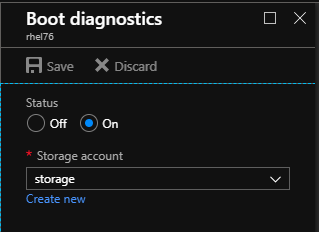
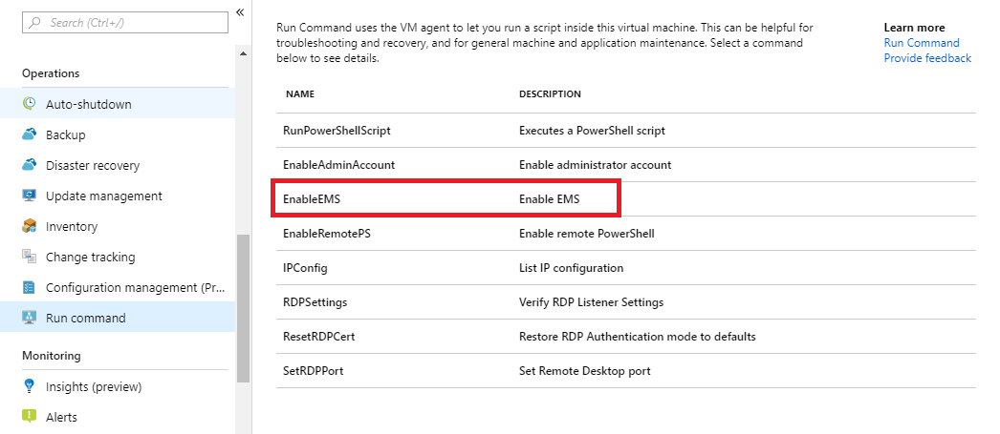
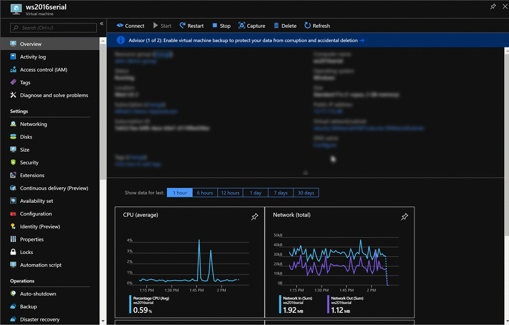
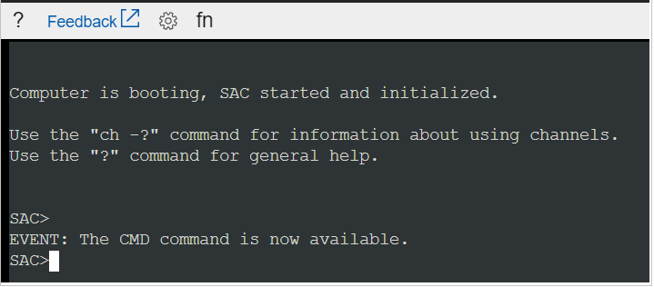
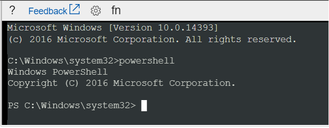

# Azure Serial Console for Windows

The Serial Console in the Azure portal provides access to a text-based console for Windows virtual machines (VMs) and virtual machine scale set instances. This serial connection connects to the COM1 serial port of the VM or virtual machine scale set instance, providing access to it independent of the network or operating system state. The serial console can only be accessed by using the Azure portal and is allowed only for those users who have an access role of Contributor or higher to the VM or virtual machine scale set.

Serial Console works in the same manner for VMs and virtual machine scale set instances. In this doc, all mentions to VMs will implicitly include virtual machine scale set instances unless otherwise stated.

For serial console documentation for Linux VMs and virtual machine scale set, see [Azure Serial Console for Linux](serial-console-linux.md).

> [!NOTE]
> The Serial Console is generally available in global Azure regions. It is not yet available in Azure government or Azure China clouds.


## Prerequisites

* Your VM or virtual machine scale set instance must use the resource management deployment model. Classic deployments aren't supported.

- Your account that uses serial console must have the [Virtual Machine Contributor role](../../role-based-access-control/built-in-roles.md#virtual-machine-contributor) for the VM and the [boot diagnostics](boot-diagnostics.md) storage account

- Your VM or virtual machine scale set instance must have a password-based user. You can create one with the [reset password](https://docs.microsoft.com/azure/virtual-machines/extensions/vmaccess#reset-password) function of the VM access extension. Select **Reset password** from the **Support + troubleshooting** section.

* The VM in which you're accessing a serial console must have [boot diagnostics](boot-diagnostics.md) enabled.

    

## Get started with the serial console
The Serial Console for VMs and virtual machine scale set is accessible only through the Azure portal:

### Serial Console for Virtual Machines
Serial Console for VMs is as straightforward as clicking on **Serial console** within the **Support + troubleshooting** section in the Azure portal.
  1. Open the [Azure portal](https://portal.azure.com).

  1. Navigate to **All resources** and select a Virtual Machine. The overview page for the VM opens.

  1. Scroll down to the **Support + troubleshooting** section and select **Serial console**. A new pane with the serial console opens and starts the connection.

### Serial Console for Virtual Machine Scale Sets
Serial Console is available on a per-instance basis for virtual machine scale sets. You will have to navigate to the individual instance of a virtual machine scale set before seeing the **Serial console** button. If your virtual machine scale set does not have boot diagnostics enabled, ensure you update your virtual machine scale set model to enable boot diagnostics, and then upgrade all instances to the new model in order to access serial console.
  1. Open the [Azure portal](https://portal.azure.com).

  1. Navigate to **All resources** and select a Virtual Machine Scale Set. The overview page for the virtual machine scale set opens.

  1. Navigate to **Instances**

  1. Select a virtual machine scale set instance

  1. From the **Support + troubleshooting** section, select **Serial console**. A new pane with the serial console opens and starts the connection.

## Enable Serial Console functionality

> [!NOTE]
> If you are not seeing anything in the serial console, make sure that boot diagnostics is enabled on your VM or virtual machine scale set.

### Enable the serial console in custom or older images
Newer Windows Server images on Azure have [Special Administrative Console](https://technet.microsoft.com/library/cc787940(v=ws.10).aspx) (SAC) enabled by default. SAC is supported on server versions of Windows but isn't available on client versions (for example, Windows 10, Windows 8, or Windows 7).

For older Windows Server images (created before February 2018), you can automatically enable the serial console through the Azure portal's run command feature. In the Azure portal, select **Run command**, then select the command named **EnableEMS** from the list.



Alternatively, to manually enable the serial console for Windows VMs/virtual machine scale set created before February 2018, follow these steps:

1. Connect to your Windows virtual machine by using Remote Desktop
1. From an administrative command prompt, run the following commands:
    - `bcdedit /ems {current} on`
    - `bcdedit /emssettings EMSPORT:1 EMSBAUDRATE:115200`
1. Reboot the system for the SAC console to be enabled.

    

If needed, the SAC can be enabled offline as well:

1. Attach the windows disk for which you want SAC configured as a data disk to the existing VM.

1. From an administrative command prompt, run the following commands:
   - `bcdedit /store <mountedvolume>\boot\bcd /ems {default} on`
   - `bcdedit /store <mountedvolume>\boot\bcd /emssettings EMSPORT:1 EMSBAUDRATE:115200`

#### How do I know if SAC is enabled?

If [SAC](https://technet.microsoft.com/library/cc787940(v=ws.10).aspx) isn't enabled, the serial console won't display the SAC prompt. In some cases, VM health information is shown, and in other cases it's blank. If you're using a Windows Server image created before February 2018, SAC probably won't be enabled.

### Enable the Windows boot menu in the serial console

If you need to enable Windows boot loader prompts to display in the serial console, you can add the following additional options to your boot configuration data. For more information, see [bcdedit](https://docs.microsoft.com/windows-hardware/drivers/devtest/bcdedit--set).

1. Connect to your Windows VM or virtual machine scale set instance by using Remote Desktop.

1. From an administrative command prompt, run the following commands:
   - `bcdedit /set {bootmgr} displaybootmenu yes`
   - `bcdedit /set {bootmgr} timeout 10`
   - `bcdedit /set {bootmgr} bootems yes`

1. Reboot the system for the boot menu to be enabled

> [!NOTE]
> The timeout that you set for the boot manager menu to display will impact your OS boot time. If you think the 10-second timeout value is too short or too long, set it to a different value.

## Use Serial Console

### Use CMD or PowerShell in Serial Console

1. Connect to the serial console. If you successfully connect, the prompt is **SAC>**:

    

1.	Enter `cmd` to create a channel that has a CMD instance.

1.	Enter `ch -si 1` to switch to the channel that's running the CMD instance.

1.	Press **Enter**, and then enter sign-in credentials with administrative permissions.

1.	After you've entered valid credentials, the CMD instance opens.

1.	To start a PowerShell instance, enter `PowerShell` in the CMD instance, and then press **Enter**.

    

### Use the serial console for NMI calls
A non-maskable interrupt (NMI) is designed to create a signal that software on a virtual machine won't ignore. Historically, NMIs have been used to monitor for hardware issues on systems that required specific response times. Today, programmers and system administrators often use NMI as a mechanism to debug or troubleshoot systems that are not responding.

The serial console can be used to send an NMI to an Azure virtual machine by using the keyboard icon in the command bar. After the NMI is delivered, the virtual machine configuration will control how the system responds. Windows can be configured to crash and create a memory dump file when receiving an NMI.

 <br>

For information on configuring Windows to create a crash dump file when it receives an NMI, see [How to generate a crash dump file by using an NMI](https://support.microsoft.com/help/927069/how-to-generate-a-complete-crash-dump-file-or-a-kernel-crash-dump-file).

### Use function keys in serial console
Function keys are enabled for usage for serial console in Windows VMs. The F8 in the serial console dropdown provides the convenience of easily entering the Advanced Boot Settings menu, but serial console is compatible with all other function keys. You may need to press **Fn** + **F1** (or F2, F3, etc.) on your keyboard depending on the computer you are using serial console from.

### Use WSL in serial console
The Windows Subsystem for Linux (WSL) has been enabled for Windows Server 2019 or later, so it is also possible to enable WSL for use within the serial console if you are running Windows Server 2019 or later. This may be beneficial for users that also have a familiarity with Linux commands. For instructions to enable WSL for Windows Server, see the [Installation guide](https://docs.microsoft.com/windows/wsl/install-on-server).

### Restart your Windows VM/virtual machine scale set instance within Serial Console
You can initiate a restart within the serial console by navigating to the power button and clicking "Restart VM". This will initiate a VM restart, and you will see a notification within the Azure portal regarding the restart.

This is useful in situations where you may want to access the boot menu without leaving the serial console experience.


## Disable serial console
By default, all subscriptions have serial console access enabled for all VMs. You can disable the serial console at either the subscription level or the VM level.

### VM/virtual machine scale set-level disable
The serial console can be disabled for a specific VM or virtual machine scale set by disabling the boot diagnostics setting. Turn off boot diagnostics from the Azure portal to disable the serial console for the VM or the virtual machine scale set. If you are using serial console on a virtual machine scale set, ensure you upgrade your virtual machine scale set instances to the latest model.

> [!NOTE]
> To enable or disable the serial console for a subscription, you must have write permissions to the subscription. These permissions include, but are not limited to, administrator or owner roles. Custom roles can also have write permissions.

### Subscription-level disable
The serial console can be disabled for an entire subscription through the [Disable Console REST API call](/rest/api/serialconsole/console/disableconsole). This action requires contributor level access or above to the subscription. You can use the **Try It** function available on this API documentation page to disable and enable the serial console for a subscription. Enter your subscription ID for **subscriptionId**, enter "default" for **default**, and then select **Run**. Azure CLI commands aren't yet available.

To reenable serial console for a subscription, use the [Enable Console REST API call](/rest/api/serialconsole/console/enableconsole).


Alternatively, you can use the following set of bash commands in Cloud Shell to disable, enable, and view the disabled status of the serial console for a subscription:

* To get the disabled status of the serial console for a subscription:
    ```azurecli-interactive
    $ export ACCESSTOKEN=($(az account get-access-token --output=json | jq .accessToken | tr -d '"'))

    $ export SUBSCRIPTION_ID=$(az account show --output=json | jq .id -r)

    $ curl "https://management.azure.com/subscriptions/$SUBSCRIPTION_ID/providers/Microsoft.SerialConsole/consoleServices/default?api-version=2018-05-01" -H "Authorization: Bearer $ACCESSTOKEN" -H "Content-Type: application/json" -H "Accept: application/json" -s | jq .properties
    ```
* To disable the serial console for a subscription:
    ```azurecli-interactive
    $ export ACCESSTOKEN=($(az account get-access-token --output=json | jq .accessToken | tr -d '"'))

    $ export SUBSCRIPTION_ID=$(az account show --output=json | jq .id -r)

    $ curl -X POST "https://management.azure.com/subscriptions/$SUBSCRIPTION_ID/providers/Microsoft.SerialConsole/consoleServices/default/disableConsole?api-version=2018-05-01" -H "Authorization: Bearer $ACCESSTOKEN" -H "Content-Type: application/json" -H "Accept: application/json" -s -H "Content-Length: 0"
    ```
* To enable the serial console for a subscription:
    ```azurecli-interactive
    $ export ACCESSTOKEN=($(az account get-access-token --output=json | jq .accessToken | tr -d '"'))

    $ export SUBSCRIPTION_ID=$(az account show --output=json | jq .id -r)

    $ curl -X POST "https://management.azure.com/subscriptions/$SUBSCRIPTION_ID/providers/Microsoft.SerialConsole/consoleServices/default/enableConsole?api-version=2018-05-01" -H "Authorization: Bearer $ACCESSTOKEN" -H "Content-Type: application/json" -H "Accept: application/json" -s -H "Content-Length: 0"
    ```

## Serial console security

### Access security
Access to the serial console is limited to users who have an access role of [Virtual Machine Contributor](../../role-based-access-control/built-in-roles.md#virtual-machine-contributor) or higher to the virtual machine. If your Azure Active Directory tenant requires multi-factor authentication (MFA), then access to the serial console will also need MFA because the serial console's access is through the [Azure portal](https://portal.azure.com).

### Channel security
All data that is sent back and forth is encrypted on the wire.

### Audit logs
All access to the serial console is currently logged in the [boot diagnostics](https://docs.microsoft.com/azure/virtual-machines/linux/boot-diagnostics) logs of the virtual machine. Access to these logs are owned and controlled by the Azure virtual machine administrator.

> [!CAUTION]
> No access passwords for the console are logged. However, if commands run within the console contain or output passwords, secrets, user names, or any other form of personally identifiable information (PII), those will be written to the VM boot diagnostics logs. They will be written along with all other visible text, as part of the implementation of the serial console's scroll back function. These logs are circular and only individuals with read permissions to the diagnostics storage account have access to them. However, we recommend following the best practice of using the Remote Desktop for anything that may involve secrets and/or PII.

### Concurrent usage
If a user is connected to the serial console and another user successfully requests access to that same virtual machine, the first user will be disconnected and the second user connected to the same session.

> [!CAUTION]
> This means that a user who's disconnected won't be logged out. The ability to enforce a logout upon disconnect (by using SIGHUP or similar mechanism) is still in the roadmap. For Windows, there's an automatic timeout enabled in SAC; for Linux, you can configure the terminal timeout setting.

## Accessibility
Accessibility is a key focus for the Azure serial console. To that end, we've ensured that the serial console is accessible for the visual and hearing impaired, as well as people who might not be able to use a mouse.

### Keyboard navigation
Use the **Tab** key on your keyboard to navigate in the serial console interface from the Azure portal. Your location will be highlighted on screen. To leave the focus of the serial console window, press **Ctrl**+**F6** on your keyboard.

### Use the serial console with a screen reader
The serial console has screen reader support built in. Navigating around with a screen reader turned on will allow the alt text for the currently selected button to be read aloud by the screen reader.

## Common scenarios for accessing the serial console

Scenario          | Actions in the serial console
:------------------|:-----------------------------------------
Incorrect firewall rules | Access serial console and fix Windows firewall rules.
Filesystem corruption/check | Access the serial console and recover the filesystem.
RDP configuration issues | Access the serial console and change the settings. For more information, see the [RDP documentation](https://docs.microsoft.com/windows-server/remote/remote-desktop-services/clients/remote-desktop-allow-access).
Network lock down system | Access the serial console from the Azure portal to manage the system. Some network commands are listed in [Windows commands: CMD and PowerShell](serial-console-cmd-ps-commands.md).
Interacting with bootloader | Access BCD through the serial console. For information, see [Enable the Windows boot menu in the serial console](#enable-the-windows-boot-menu-in-the-serial-console).


## Errors
Because most errors are transient, retrying your connection can often fix them. The following table shows a list of errors and mitigations for both VMs and virtual machine scale set instances.

Error                            |   Mitigation
:---------------------------------|:--------------------------------------------|
Unable to retrieve boot diagnostics settings for *&lt;VMNAME&gt;*. To use the serial console, ensure that boot diagnostics is enabled for this VM. | Ensure that the VM has [boot diagnostics](boot-diagnostics.md) enabled.
The VM is in a stopped deallocated state. Start the VM and retry the serial console connection. | Virtual machine must be in a started state to access the serial console
You do not have the required permissions to use this VM serial console. Ensure you have at least Virtual Machine Contributor role permissions.| Serial console access requires certain permissions. For more information, see [Prerequisites](#prerequisites).
Unable to determine the resource group for the boot diagnostics storage account *&lt;STORAGEACCOUNTNAME&gt;*. Verify that boot diagnostics is enabled for this VM and you have access to this storage account. | Serial console access requires certain permissions. For more information, see [Prerequisites](#prerequisites).
A "Forbidden" response was encountered when accessing this VM's boot diagnostic storage account. | Ensure that boot diagnostics does not have an account firewall. An accessible boot diagnostic storage account is necessary for the serial console to function.
Web socket is closed or could not be opened. | You may need to whitelist `*.console.azure.com`. A more detailed but longer approach is to whitelist the [Microsoft Azure Datacenter IP ranges](https://www.microsoft.com/download/details.aspx?id=41653), which change fairly regularly.
Only health information is shown when connecting to a Windows VM| This error occurs if the Special Administrative Console has not been enabled for your Windows image. See [Enable the serial console in custom or older images](#enable-the-serial-console-in-custom-or-older-images) for instructions on how to manually enable SAC on your Windows VM. For more information, see [Windows health signals](https://github.com/Microsoft/azserialconsole/blob/master/Known_Issues/Windows_Health_Info.md).

## Known issues
We're aware of some issues with the serial console. Here's a list of these issues and steps for mitigation. These issues and mitigations apply for both VMs and virtual machine scale set instances.

Issue                             |   Mitigation
:---------------------------------|:--------------------------------------------|
Pressing **Enter** after the connection banner does not cause a sign-in prompt to be displayed. | For more information, see [Hitting enter does nothing](https://github.com/Microsoft/azserialconsole/blob/master/Known_Issues/Hitting_enter_does_nothing.md). This error can occur if you're running a custom VM, hardened appliance, or boot config that causes Windows to fail to properly connect to the serial port. This error will also occur if you're running a Windows 10 client VM, because only Windows Server VMs are configured to have EMS enabled.
Unable to type at SAC prompt if kernel debugging is enabled. | RDP to VM and run `bcdedit /debug {current} off` from an elevated command prompt. If you can't RDP, you can instead attach the OS disk to another Azure VM and modify it while attached as a data disk by running `bcdedit /store <drive letter of data disk>:\boot\bcd /debug <identifier> off`, then swapping the disk back.
Pasting into PowerShell in SAC results in a third character if the original content had a repeating character. | For a workaround, run `Remove-Module PSReadLine` to unload the PSReadLine module from the current session. This action will not delete or uninstall the module.
Some keyboard inputs produce strange SAC output (for example, **[A**, **[3~**). | [VT100](https://aka.ms/vtsequences) escape sequences aren't supported by the SAC prompt.
Pasting long strings doesn't work. | The serial console limits the length of strings pasted into the terminal to 2048 characters to prevent overloading the serial port bandwidth.
Serial console does not work with a storage account firewall. | Serial console by design cannot work with storage account firewalls enabled on the boot diagnostics storage account.
Serial console does not work with a storage account using Azure Data Lake Storage Gen2 with hierarchical namespaces. | This is a known issue with hierarchical namespaces. To mitigate, ensure that your VM's boot diagnostics storage account is not created using Azure Data Lake Storage Gen2. This option can only be set upon storage account creation. You may have to create a separate boot diagnostics storage account without Azure Data Lake Storage Gen2 enabled to mitigate this issue.


## Frequently asked questions

**Q. How can I send feedback?**

A. Provide feedback by creating a GitHub issue at https://aka.ms/serialconsolefeedback. Alternatively (less preferred), you can send feedback via azserialhelp@microsoft.com or in the virtual machine category of https://feedback.azure.com.

**Q. Does the serial console support copy/paste?**

A. Yes. Use **Ctrl**+**Shift**+**C** and **Ctrl**+**Shift**+**V** to copy and paste into the terminal.

**Q. Who can enable or disable the serial console for my subscription?**

A. To enable or disable the serial console at a subscription-wide level, you must have write permissions to the subscription. Roles that have write permission include administrator or owner roles. Custom roles can also have write permissions.

**Q. Who can access the serial console for my VM?**

A. You must have the Virtual Machine Contributor role or higher for a VM to access the VM's serial console.

**Q. My serial console isn't displaying anything, what do I do?**

A. Your image is likely misconfigured for serial console access. For information about configuring your image to enable the serial console, see [Enable the serial console in custom or older images](#enable-the-serial-console-in-custom-or-older-images).

**Q. Is the serial console available for virtual machine scale sets?**

A. At this time, access to the serial console for virtual machine scale set instances isn't supported.

## Next steps
* For an in-depth guide to CMD and PowerShell commands you can use in the Windows SAC, see [Windows commands: CMD and PowerShell](serial-console-cmd-ps-commands.md).
* The serial console is also available for [Linux](serial-console-linux.md) VMs.
* Learn more about [boot diagnostics](boot-diagnostics.md).
