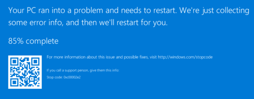
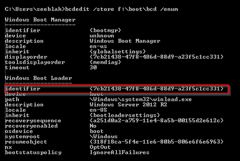
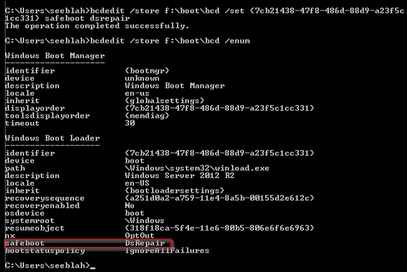

# Troubleshoot Windows stop error – directory service initialization failure

This article provides steps to resolve issues where an Active Directory domain controller virtual machine (VM) in Azure, is stuck in a loop and states that it needs to restart.

## Symptom

When you use [Boot diagnostics](https://docs.microsoft.com/azure/virtual-machines/troubleshooting/boot-diagnostics) to view the screenshot of the VM, the screenshot shows that the VM needs to restart because of an error, displaying the stop code **0xC00002E1** in Windows Server 2008 R2, or **0xC00002E2** in Windows Server 2012 or later.



## Cause

Error code **0xC00002E2** represents **STATUS_DS_INIT_FAILURE**, and error code **0xC00002E1** represents **STATUS_DS_CANT_START**. Both errors occur when there's an issue with the directory service.

As the OS boots up, it's then forced to restart automatically by the Local Security Authentication Server (**LSASS.exe**), which authenticates user logins. Authentication can't happen when the operating system on the VM is a domain controller that doesn't have read/write access to its local Active Directory database. Because of a lack of access to **Active Directory (AD)**, LSASS.exe can't authenticate, and it's forced to restart the OS.

This error can be caused by any of the following conditions:

- There's no access to the disk holding the local AD database (**NTDS.DIT**).
- The disk holding the local AD database (NTDS.DIT) has run out of free space.
- The local AD database (NTDS.DIT) file is missing.
- The VM has multiple disks and the Storage Area Network (SAN) policy is configured improperly. The SAN policy isn't set to **ONLINEALL**, and the non-OS disks are attached in offline mode on the disk manager.
- The local AD database (NTDS.DIT) file is corrupt.

## Solution

### Process overview:

1. Create and Access a Repair VM.
1. Free space on disk.
1. Check that the drive containing the AD database is attached.
1. Enable Directory Services Restore Mode.
1. **Recommended**: Before you rebuild the VM, enable serial console and memory dump collection.
1. Rebuild the VM.
1. Reconfigure the SAN Policy.

> [!NOTE]
> When encountering this error, the Guest OS isn't operational. You will be troubleshooting in offline mode to resolve the issue.

### Create and access a repair VM

1. Use [steps 1-3 of the VM Repair Commands](https://docs.microsoft.com/azure/virtual-machines/troubleshooting/repair-windows-vm-using-azure-virtual-machine-repair-commands#repair-process-example) to prepare a Repair VM.
1. Using Remote Desktop Connection connect to the Repair VM.

### Free up space on disk

As the disk is now attached to a repair VM, verify that the disk holding the Active Directory internal database has enough space to perform correctly.

1. Check whether the disk is full by right-clicking on the drive and selecting **Properties**.
1. If the disk has less than 300 Mb of free space, [expand it to a maximum of 1 Tb using PowerShell](https://docs.microsoft.com/azure/virtual-machines/windows/expand-os-disk).
1. If the disk has reached 1 Tb of used space, perform a disk cleanup.

   1. Use PowerShell to [detach the data disk](https://docs.microsoft.com/azure/virtual-machines/windows/detach-disk#detach-a-data-disk-using-powershell) from the broken VM.
   1. Once detached from the broken VM, [attach the data disk](https://docs.microsoft.com/azure/virtual-machines/windows/attach-disk-ps#attach-an-existing-data-disk-to-a-vm) to a functioning VM.
   1. Use the [Disk Cleanup tool](https://support.microsoft.com/help/4026616/windows-10-disk-cleanup) to free up additional space.

1. **Optional** - If more space is needed, open a CMD instance and enter the `defrag <LETTER ASSIGNED TO THE OS DISK>: /u /x /g` command to perform a de-fragmentation on the drive:

  * In the command, replace `<LETTER ASSIGNED TO THE OS DISK>` with the OS Disk's letter. For example, if the disk letter is `F:`, then the command would be `defrag F: /u /x /g`.

  * Depending upon the level of fragmentation, the de-fragmentation could take hours.

If there's enough space on the disk, continue to the next task.

### Check that the drive containing the Active Directory database is attached

1. Open an elevated CMD instance and run the following commands:

   1. Load registry file:

      `REG LOAD HKLM\BROKENSYSTEM f:\windows\system32\config\SYSTEM`

      The designation `f:` assumes that the disk is drive `F:`. Use the drive letter belonging to the drive containing the OS disk.

   1. Determine the drive letter and folder of **NTDS.DIT**:

      ```
      REG QUERY "HKLM\BROKENSYSTEM\ControlSet001\Services\NTDS\parameters" /v "DSA Working Directory"
      REG QUERY "HKLM\BROKENSYSTEM\ControlSet001\Services\NTDS\parameters" /v "DSA Database file"
      REG QUERY "HKLM\BROKENSYSTEM\ControlSet001\Services\NTDS\parameters" /v "Database backup path"
      REG QUERY "HKLM\BROKENSYSTEM\ControlSet001\Services\NTDS\parameters" /v "Database log files path"
      ```

   1. Unload registry file:

      `REG UNLOAD HKLM\BROKENSYSTEM`

1. Using Azure portal, verify that the drive where NTDS.DIT is set up, is added to the VM.
1. Using the Disk Management console from the guest OS, verify that the disk containing NTDS.DIT is online.
   1. The Disk Management tool can be found in **Administrative Tools > Computer Management > Storage**, or may be accessed using the `diskmgmt.msc` command in a CMD instance.
1. If the disk isn't attached to the VM, reattach the data disk to fix the issue.

   If the disk was attached normally, continue with the next task.

### Enable Directory Services Restore Mode

Set up the VM to boot on **Directory Services Restore Mode (DSRM)** mode to bypass checking the existence of the NTDS.DIT file during boot.

1. Before you continue, verify that you've completed the previous tasks to attach the disk to a repair VM, and have determined which disk the NTDS.DIT file is located in.
1. Using an elevated CMD instance, list the booting partition info on that store to find the identifier from the active partition:

   `bcdedit /store <Drive Letter>:\boot\bcd /enum`

   Replace `< Drive Letter >` with the letter determined in the previous steps.

   

1. Enable the `safeboot DsRepair` flag on the booting partition:

   `bcdedit /store <Drive Letter>:\boot\bcd /set {<Identifier>} safeboot dsrepair`

   Replace `< Drive Letter >` and `< Identifier >` with the values determined in the previous steps.

1. Query the booting options again to ensure that your change was properly set.

   

### Recommended: before you rebuild the VM, enable serial console and memory dump collection

To enable memory dump collection and Serial Console, run the following script by opening an elevated command prompt session (Run as administrator), and run the following commands.

1. Enable the Serial Console:

  ```
  bcdedit /store <VOLUME LETTER WHERE THE BCD FOLDER IS>:\boot\bcd /ems {<BOOT LOADER IDENTIFIER>} ON
  bcdedit /store <VOLUME LETTER WHERE THE BCD FOLDER IS>:\boot\bcd /emssettings EMSPORT:1 EMSBAUDRATE:115200
  ```

1. Verify that the free space on the OS disk is at least equal to the memory size (RAM) on the VM.

  1. If there's not enough space on the OS disk, change the location where the memory dump file will be created, and refer that to any data disk attached to the VM that has enough free space.

     To change the location, replace `%SystemRoot%` with the drive letter (such as, `F:`) of the data disk in the following commands.

  #### The following configuration is suggested to enable OS dump:

  **Load Broken OS Disk**:

  `REG LOAD HKLM\BROKENSYSTEM <VOLUME LETTER OF BROKEN OS DISK>:\windows\system32\config\SYSTEM`

  **Enable on ControlSet001**:

  ```
  REG ADD "HKLM\BROKENSYSTEM\ControlSet001\Control\CrashControl" /v CrashDumpEnabled /t REG_DWORD /d 1 /f
  REG ADD "HKLM\BROKENSYSTEM\ControlSet001\Control\CrashControl" /v DumpFile /t REG_EXPAND_SZ /d "%SystemRoot%\MEMORY.DMP" /f
  REG ADD "HKLM\BROKENSYSTEM\ControlSet001\Control\CrashControl" /v NMICrashDump /t REG_DWORD /d 1 /f
  ```

  **Enable on ControlSet002**:

  ```
  REG ADD "HKLM\BROKENSYSTEM\ControlSet002\Control\CrashControl" /v CrashDumpEnabled /t REG_DWORD /d 1 /f
  REG ADD "HKLM\BROKENSYSTEM\ControlSet002\Control\CrashControl" /v DumpFile /t REG_EXPAND_SZ /d "%SystemRoot%\MEMORY.DMP" /f
  REG ADD "HKLM\BROKENSYSTEM\ControlSet002\Control\CrashControl" /v NMICrashDump /t REG_DWORD /d 1 /f
  ```

  **Unload Broken OS Disk**:

  `REG UNLOAD HKLM\BROKENSYSTEM`

### Rebuild the VM

1. Use [step 5 of the VM Repair Commands](https://docs.microsoft.com/azure/virtual-machines/troubleshooting/repair-windows-vm-using-azure-virtual-machine-repair-commands#repair-process-example) to reassemble the VM.

### Reconfigure the Storage Area Network policy

1. When booting in DSRM mode, the only user available to log in is the recovery administrator, which was used when the VM was promoted to a domain controller. All other users will show an authentication error.

   1. If no other DC is available, you must log in locally using `.\administrator` or `machinename\administrator` and the DSRM password.

1. Set up the SAN policy so that all the disks are online.

   1. Open an elevated CMD instance and enter `DISKPART`.
   1. Query for the list of the disks.

      `DISKPART> list disk`

   1. Enter the following commands to select the disk that needs to be brought online and change the SAN policy:

      ```
      DISKPART> select disk 1
      Disk 1 is now the selected disk.

      DISKPART> attributes disk clear readonly
      Disk attributes cleared successfully.

      DISKPART> attributes disk
      Current Read-only State : No
      Read-only : No
      Boot Disk : No
      Pagefile Disk : No
      Hibernation File Disk : No
      Crashdump Disk : No
      Clustered Disk : No

      DISKPART> online disk
      DiskPart successfully onlined the selected disk.

      DISKPART> san
      SAN Policy : Online All
      ```

1. Once the issue is fixed, ensure that the flag `DsRepair safeboot` is removed:

   `bcdedit /deletevalue {default} safeboot dsrepair`

1. Restart your VM.

   > [!NOTE]
   > If your VM was just migrated from on-premise and you want to migrate more domain controllers from on-premise to Azure, you should consider following the steps in the article below to prevent this issue from happening in future migrations:
   >
   > [How to upload existing on-premises Hyper-V domain controllers to Azure by using Azure PowerShell](https://support.microsoft.com/help/2904015)
