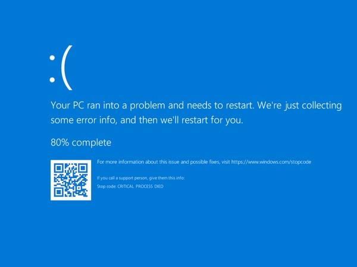

# Windows Stop Error - #0x000000EF "Critical Process Died"

This article provides steps to resolve issues where a critical process dies during boot in an Azure VM.

## Symptom

When you use [Boot diagnostics](https://docs.microsoft.com/azure/virtual-machines/troubleshooting/boot-diagnostics) to view the screenshot of the VM, you will see that the screenshot displays the error *#0x000000EF* with the message *Critical Process Died*.

## Cause

Usually, this is due to a critical system process failing during boot. You can read more about critical process issues at "[Bug Check 0xEF: CRITICAL_PROCESS_DIED](https://docs.microsoft.com/windows-hardware/drivers/debugger/bug-check-0xef--critical-process-died)".

## Solution

### Process Overview:

1. Create and Access a Repair VM.
2. Fix any OS Corruption.
3. **Recommended**: Before you rebuild the VM, enable serial console and memory dump collection.
4. Rebuild the VM.

> [!NOTE]
> When encountering this boot error, the Guest OS is not operational. You will be troubleshooting in Offline mode to resolve this issue.

### Create and Access a Repair VM

1. Use [steps 1-3 of the VM Repair Commands](https://docs.microsoft.com/azure/virtual-machines/troubleshooting/repair-windows-vm-using-azure-virtual-machine-repair-commands) to prepare a Repair VM.
2. Using Remote Desktop Connection connect to the Repair VM.

### Fix any OS Corruption

1. Open an elevated command prompt.
2. Run the following System File Checker (SFC) command:

   `sfc /scannow /offbootdir=<BOOT DISK DRIVE>:\ /offwindir=<BROKEN DISK DRIVE>:\windows`

   * Where < BOOT DISK DRIVE > is the boot volume of the Repair VM (typically "C:") and < BROKEN DISK DRIVE > will be the drive letter for the attached disk from the broken VM. Replace the greater than / less than symbols as well as the text contained within them, e.g. "< text here >", with the appropriate letter.

3. Next, use [step 5 of the VM Repair Commands](https://docs.microsoft.com/azure/virtual-machines/troubleshooting/repair-windows-vm-using-azure-virtual-machine-repair-commands#repair-process-example) to reassemble the VM and see if it boots.
4. If the VM is still not booting, then continue to collect the memory dump file.

### Collect the Memory Dump File

If the issue persists after running SFC, analysis of a memory dump file will be required to determine the cause of the issue. To collect the memory dump file, follow these steps:

### Attach the OS disk to a new Repair VM

1. Use [steps 1-3 of the VM Repair Commands](https://docs.microsoft.com/azure/virtual-machines/troubleshooting/repair-windows-vm-using-azure-virtual-machine-repair-commands) to prepare a new Repair VM.
2. Using Remote Desktop Connection connect to the Repair VM.

### Locate the dump file and submit a support ticket

3. On the repair VM, go to windows folder in the attached OS disk. If the driver letter that is assigned to the attached OS disk is *F*, you need to go to *F:\Windows*.
4. Locate the *memory.dmp* file, and then [submit a support ticket](https://portal.azure.com/?#blade/Microsoft_Azure_Support/HelpAndSupportBlade) with the memory dump file.

   > [!NOTE]
   > If you cannot find the dump file, complete the below steps to enable memory dump collection and Serial Console, then return to this section and repeat the steps in the task above to collect the memory dump file.

### Recommended: Before you rebuild the VM, enable serial console and memory dump collection

To enable memory dump collection and Serial Console, run the following script:

1. Open an elevated command prompt session (Run as administrator).
2. Run the following commands:

   Enable Serial Console

   `bcdedit /store <VOLUME LETTER WHERE THE BCD FOLDER IS>:\boot\bcd /ems {<BOOT LOADER IDENTIFIER>} ON`

   `bcdedit /store <VOLUME LETTER WHERE THE BCD FOLDER IS>:\boot\bcd /emssettings EMSPORT:1 EMSBAUDRATE:115200`

   Replace any greater than or less than symbols as well as the text within them, e.g. "< text here >".

3. Verify that the free space on the OS disk is as much as the memory size (RAM) on the VM.

If there's not enough space on the OS disk, you should change the location where the memory dump file will be created and refer that to any data disk attached to the VM that has enough free space. To change the location, replace "%SystemRoot%" with the drive letter (for example, "F:") of the data disk in the below commands.

#### Suggested configuration to enable OS Dump

**Load Broken OS Disk**:

`REG LOAD HKLM\BROKENSYSTEM <VOLUME LETTER OF BROKEN OS DISK>:\windows\system32\config\SYSTEM`

**Enable on ControlSet001:**

`REG ADD "HKLM\BROKENSYSTEM\ControlSet001\Control\CrashControl" /v CrashDumpEnabled /t REG_DWORD /d 1 /f`

`REG ADD "HKLM\BROKENSYSTEM\ControlSet001\Control\CrashControl" /v DumpFile /t REG_EXPAND_SZ /d "%SystemRoot%\MEMORY.DMP" /f`

`REG ADD "HKLM\BROKENSYSTEM\ControlSet001\Control\CrashControl" /v NMICrashDump /t REG_DWORD /d 1 /f`

**Enable on ControlSet002:**

`REG ADD "HKLM\BROKENSYSTEM\ControlSet002\Control\CrashControl" /v CrashDumpEnabled /t REG_DWORD /d 1 /f`

`REG ADD "HKLM\BROKENSYSTEM\ControlSet002\Control\CrashControl" /v DumpFile /t REG_EXPAND_SZ /d "%SystemRoot%\MEMORY.DMP" /f`

`REG ADD "HKLM\BROKENSYSTEM\ControlSet002\Control\CrashControl" /v NMICrashDump /t REG_DWORD /d 1 /f`

**Unload Broken OS Disk:**

`REG UNLOAD HKLM\BROKENSYSTEM`

### Rebuild the Original VM

Use [step 5 of the VM Repair Commands](https://docs.microsoft.com/azure/virtual-machines/troubleshooting/repair-windows-vm-using-azure-virtual-machine-repair-commands#repair-process-example) to reassemble the VM.
