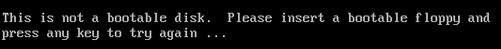
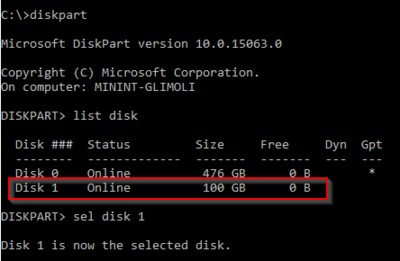
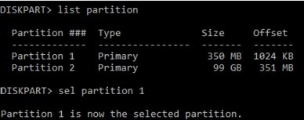
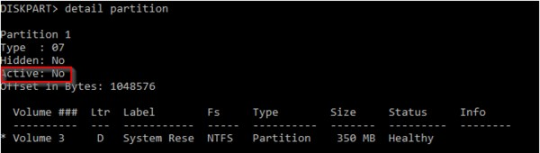
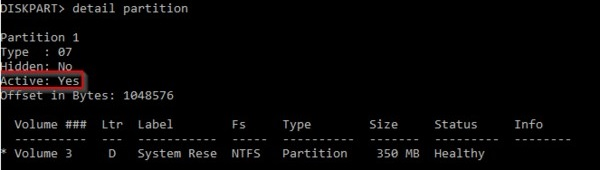

# Boot Error – This is not a Bootable Disk

This article provides steps to resolve issues where the disk isn't bootable in an Azure Virtual Machine (VM).

## Symptoms

When you use [Boot diagnostics](https://docs.microsoft.com/azure/virtual-machines/troubleshooting/boot-diagnostics) to view the screenshot of the VM, you'll see that the screenshot displays a prompt with the message 'This is not a bootable disk. Please insert a bootable floppy and press any key to try again...'.

   Figure 1

   

## Cause

This error message means the OS boot process couldn't locate an active system partition. This error could also mean that there's a missing reference in the Boot Configuration Data (BCD) store, preventing it from locating the Windows partition.

## Solution

### Process Overview

1. Create and Access a Repair VM.
2. Set Partition Status to Active.
3. Fix the Disk Partition.
4. **Recommended**: Before you rebuild the VM, enable serial console and memory dump collection.
5. Rebuild the Original VM.

   > [!NOTE]
   > When encountering this boot error, the Guest OS isn't operational. You'll be troubleshooting in offline mode to resolve this issue.

### Create and Access a Repair VM

1. Use steps 1-3 of the [VM Repair Commands](https://docs.microsoft.com/azure/virtual-machines/troubleshooting/repair-windows-vm-using-azure-virtual-machine-repair-commands) to prepare a Repair VM.
2. Using Remote Desktop Connection connect to the Repair VM.

### Set Partition Status to Active

Generation 1 VMs should first verify that the OS partition, which holds the BCD store is marked as *active*. If you have a Generation 2 VM, skip ahead to [Fix the Disk Partition](#fix-the-disk-partition), as the *Status* flag was deprecated in the later generation.

1. Open an elevated command prompt *(cmd.exe)*.
2. Enter *diskpart* to launch the DISKPART tool.
3. Enter *list disk* to list the disks on the system and identify the attached OS VHD.
4. Once the attached OS VHD is located, enter *sel disk #* to select the disk.  See Figure 2, where Disk 1 is the attached OS VHD.

   Figure 2

   

5. Once the disk is selected, enter *list partition* to list the partitions of the selected disk.
6. Once the boot partition is identified, enter *sel partition #* to select the partition.  Usually the boot partition will be around 350 MB in size.  See Figure 3, where Partition 1 is the boot partition.

   Figure 3

   

7. Enter 'detail partition' to check the status of the partition. See Figure 4, where the partition is *Active: No*, or Figure 5, where the partition is 'Active: Yes'.

   Figure 4

   

   Figure 5

   

8. If the partition is **Not Active**, enter *active* to change the *Active* flag.
9. Check that the status change was done properly by typing *detail partition*.

   Figure 6

   

10. Enter *exit* to close the DISKPART tool and save your configuration changes.

### Fix the Disk Partition

1. Open an elevated command prompt (cmd.exe).
2. Use the following command to run *CHKDSK* on the disk(s) and fix errors:

   `chkdsk <DRIVE LETTER>: /f`

   Adding the '/f' command option will fix any errors on the disk. Make 
sure to replace <DRIVE LETTER> with the letter of the attached OS VHD.

### Recommended: Before you rebuild the VM, enable serial console and memory dump collection

To enable memory dump collection and Serial Console, run the following script:

1. Open an elevated command prompt session (Run as administrator).
2. Run the following commands:

   Enable Serial Console

   `bcdedit /store <VOLUME LETTER WHERE THE BCD FOLDER IS>:\boot\bcd /ems {<BOOT LOADER IDENTIFIER>} ON`

   `bcdedit /store <VOLUME LETTER WHERE THE BCD FOLDER IS>:\boot\bcd /emssettings EMSPORT:1 EMSBAUDRATE:115200`

3. Verify that the free space on the OS disk is as much as the memory size (RAM) on the VM.

   If there's not enough space on the OS disk, you should change the location where the memory dump file will be created and refer that to any data disk attached to the VM that has enough free space. To change the location, replace "%SystemRoot%" with the drive letter (for example, "F:") of the data disk in the below commands.

#### Suggested configuration to enable OS Dump

**Load Broken OS Disk**:

`REG LOAD HKLM\BROKENSYSTEM <VOLUME LETTER OF BROKEN OS DISK>:\windows\system32\config\SYSTEM`

**Enable on ControlSet001:**

`REG ADD "HKLM\BROKENSYSTEM\ControlSet001\Control\CrashControl" /v CrashDumpEnabled /t REG_DWORD /d 1 /f`

`REG ADD "HKLM\BROKENSYSTEM\ControlSet001\Control\CrashControl" /v DumpFile /t REG_EXPAND_SZ /d "%SystemRoot%\MEMORY.DMP" /f`

`REG ADD "HKLM\BROKENSYSTEM\ControlSet001\Control\CrashControl" /v NMICrashDump /t REG_DWORD /d 1 /f`

**Enable on ControlSet002:**

`REG ADD "HKLM\BROKENSYSTEM\ControlSet002\Control\CrashControl" /v CrashDumpEnabled /t REG_DWORD /d 1 /f`

`REG ADD "HKLM\BROKENSYSTEM\ControlSet002\Control\CrashControl" /v DumpFile /t REG_EXPAND_SZ /d "%SystemRoot%\MEMORY.DMP" /f`

`REG ADD "HKLM\BROKENSYSTEM\ControlSet002\Control\CrashControl" /v NMICrashDump /t REG_DWORD /d 1 /f`

**Unload Broken OS Disk:**

`REG UNLOAD HKLM\BROKENSYSTEM`

### Rebuild the Original VM

Use [step 5 of the VM Repair Commands](https://docs.microsoft.com/azure/virtual-machines/troubleshooting/repair-windows-vm-using-azure-virtual-machine-repair-commands#repair-process-example) to reassemble the VM.
