# Troubleshoot high-CPU issues for Azure Windows virtual machines

## Summary

Performance issues occur in different operating systems or applications, and every issue requires a unique approach to troubleshoot. Most of these issues revolve around CPU, Memory, Networking, and input/output (I/O) as key locations where the issue occurs. Each of these areas generates different symptoms (sometimes simultaneously) and requires a different diagnosis and solution.

This article discusses high-CPU usage issues that occur on Azure Virtual Machines (VMs) that run the Windows operating system.

### High-CPU issues on Azure Windows VMs

Aside from the I/O and network latency issues, the CPU and Memory troubleshooting require the same tools and steps as the on-premises servers do. One of the tools that Microsoft typically supports is PerfInsights (available for both Windows and Linux). PerfInsights can provide an Azure VM best practices diagnosis in a user-friendly report. PerfInsights is also a wrapper tool that can help collect Perfmon, Xperf, and Netmon data, depending on the flags that are selected within the tool.

Most of your existing performance troubleshooting tools, such as Perfmon or Procmon, that are used for on-premises servers will work on Azure Windows VMs. However, PerfInsights is explicitly designed for Azure VMs to provide more insights, including Azure Best Practices, SQL Best Practices, high-resolution I/O latency graphs, CPU and Memory tabs, and so on.

Whether it runs as User-Mode or Kernel-Mode, any thread of an active process requires CPU cycles to run the code that it's built from. Many issues are directly related to the workload. The kind of workload that exists on the server drives resource consumption, including CPU.

#### Common factors

The following factors are common in a high-CPU situation:

- A recent code change or deployment that is mostly applicable to apps such as Internet Information Services (IIS), Microsoft SharePoint, Microsoft SQL Server, or third-party applications.

- A recent update that might be related to an OS-level update, or to application-level cumulative updates and fixes.

- A query change or outdated indexes. SQL Server and Oracle data tier applications also have a query plan optimization as another factor. Data changes or a lack of appropriate indexes can cause several queries to become more compute-intensive.

- Azure VM-specific. There are certain processes such as RDAgent, and extension-specific processes such as Monitoring Agent, MMA agent, or Security client, that can cause high-CPU consumption. These processes must be viewed from either a configuration or known issues perspective.

## Troubleshoot the issue

This article focuses on isolating the problematic process. Further analysis will be specific to the process that's driving high-CPU consumption.

For example, if the process is SQL Server (sqlservr.exe), the next steps will be to analyze which query was using the most CPU cycles in a specific time period.

### Scope the issue

Here are a few questions to ask when you troubleshoot the issue:

- Is there a pattern to the issue? For example, does the high-CPU issue occur at a certain time every day, week, or month? If so, can you correlate this issue to a job, report, or user login?

- Did the high-CPU issue start after a recent code change? Did you apply an update in Windows or in an application?

- Did the high-CPU issue start after a change in workload, such as an increase in the number of users, a higher data influx, or a larger number of reports?

- For Azure, did the high-CPU issue start in any of the following conditions?

  - After a recent redeployment or restart
  - When an SKU or VM type changed
  - When a new extension was added
  - After load balancer changes were made

### Azure caveats

Understand your workload. When you select a VM, you may underestimate the virtual CPU (vCPU) counts when you look at overall monthly hosting cost. If your workload is compute-intensive, selecting a smaller VM SKU that has one or two vCPUs may cause workload issues. Test different configurations for your workload to determine the best computing capability that's required.

There are certain VM series, such as B (Burst Mode) Series, that are recommended for quality assurance (QA) and testing. Using these series in the production environment limits the computing capability after the CPU credits are exhausted.

For known applications such as SQL Server, Oracle, RDS (Remote Desktop Services), Windows Virtual Desktop, IIS, or SharePoint, there are Azure Best Practices articles that include recommendations for minimal configuration for these workloads.

### Ongoing high-CPU issues

If the issue is occurring right now, this is the best opportunity to capture the process trace to determine what is causing the issue. You can use existing tools that you've been using for on-premises Windows servers to locate the process. The following tools are recommended by Azure Support for Azure VMs.

### PerfInsights

PerfInsights is the recommended tool from Azure support for VM performance issues. It's designed to cover best practices and dedicated analysis tabs for CPU, Memory, and high-resolution I/O graphs. You can run it OnDemand through the Azure portal, or from within the VM. You can share the data with the Azure support team.

#### Run PerfInsights

PerfInsights is available for both the [Windows](./how-to-use-perfinsights.md) and [Linux](./how-to-use-perfinsights-linux.md) OS. For Windows, here are the options.

#### Run and analyze reports through Azure portal

When it is [installed through the Azure portal](./performance-diagnostics.md), actually installs an extension on the VM. Users can also install PerfInsights as an extension by going directly to [Extensions in VM blade](./performance-diagnostics-vm-extension.md), and then choosing a performance diagnostics option.

#### Azure portal Option 1

Browse the VM blade, and select the **Performance diagnostics** option. You'll be asked to install the option (uses extensions) on the VM that you selected it for.

  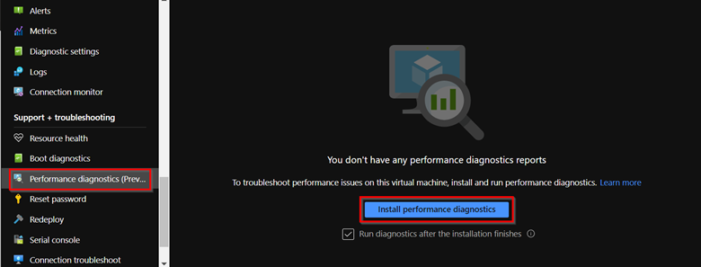

#### Azure portal Option 2

Browse to **Diagnose and Solve Problems** in the VM blade, and look for **VM Performance Issues**.

  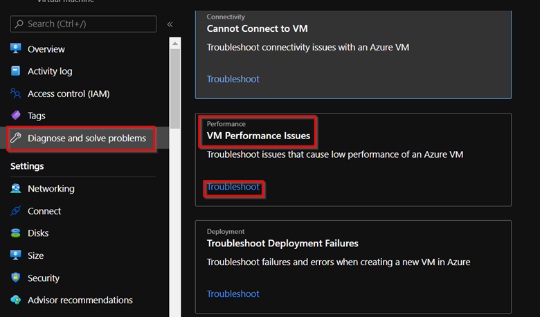

If you select **Troubleshoot**, the PerfInsights installation screen loads.

If you select **Install**, the installation provides different collection options.

  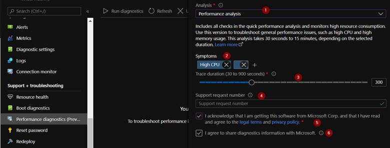

The numbered options in the screenshot relate to the following comments:

1. For the option of **High-CPU**, select **Performance Analysis** or **Advanced**.

2. When you add symptoms here, they will be added to the report, which helps you to share information with Azure Support.

3. Select the duration of data collection. For the High-CPU option, select at least 15 minutes or more. In Azure portal mode, you can collect up to 15 minutes of data. For longer periods of collection, you must run the program as an executable within the VM.

4. If you are asked by Azure Support to collect this data, you can add the ticket number here. This field is optional.

5. Select this field to accept the End User License Agreement (EULA).

6. Select this field if you intend to make this report available to Azure Support team helping on this case.

The report is stored on one of the Storage Accounts under your subscription. It's available to view and download later.

#### Run PerfInsights from within the VM

This method can be used if you intend to run PerfInsights for longer durations. The [PerfInsights article](./how-to-use-perfinsights.md#how-do-i-run-perfinsights) gives a detailed walkthrough of the different commands and flags that are required to run PerfInsights as an executable. For the purpose of high-CPU usage, you'll need either of the following modes:

- Advanced Scenario

  - `PerfInsights /run advanced xp /d 300 /AcceptDisclaimerAndShareDiagnostics`

- VM Slow (Performance) Scenario

  - `PerfInsights /run vmslow /d 300 /AcceptDisclaimerAndShareDiagnostics /sa <StorageAccountName> /sk <StorageAccountKey>`

The command output will be in the same folder where you saved the PerfInsights executable.

#### What to look for in the report

After you run the report, the location of the contents depends on whether it was run through the Azure portal or as an executable. For either option, access the generated log folder or download (if Azure portal) locally for analysis.

### Run through the Azure portal

  

  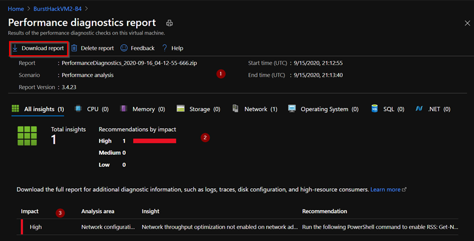

#### Run from within VM

Your folder structure should resemble the following images:

  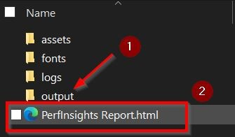

  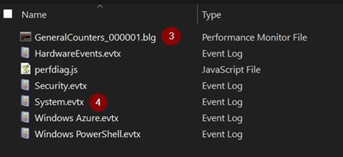

1. Any additional collections such as Perfmon, Xperf, Netmon, SMB logs, event logs, and so on, can be found in Output folder.

1. The actual report together with analysis and recommendations.

1. For both Performance (VMslow) and Advanced, the report collects **perfmon** information for the duration of the PerfInsights run.

1. The event logs show a quick view of helpful system-level or process crash details.

#### Where to start

Open the PerfInsights report. The **Findings** tab logs any outliers in terms of resource consumption. If there are instances of high-CPU usage, the **Findings** tab will categorize it as either High Impact or Medium Impact.

  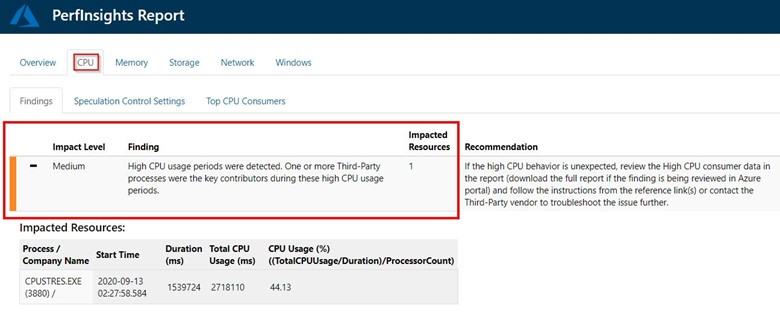

Similar to the previous example, PerfInsights was run for 30 minutes. For half that time, the highlighted process was exhausting CPU on the higher side. If the same process had been running throughout the collection time, the impact level would have changed to **HIGH**.

If you expand the **Findings** event, you'll see several key details. The tab lists the processes in descending order, per **Average CPU** consumption, and shows whether the process was related to the system, a Microsoft-owned app (SQL, IIS), or a third-party process.

#### More details

There is a dedicated subtab under **CPU** that can be used for detailed pattern analysis, per core, or per process.

The **Top CPU Consumers** tab has two separate sections of interest, and you can view per processor statistics here. The application design is frequently either Single-Threaded or pins itself to a single processor. In this scenario, one or a few cores run at 100 percent, while other cores run at expected levels. These scenarios are more complex because the average CPU on the server appears to run as expected, but the processes that are pinned on cores that have high usage will be slower than expected.

  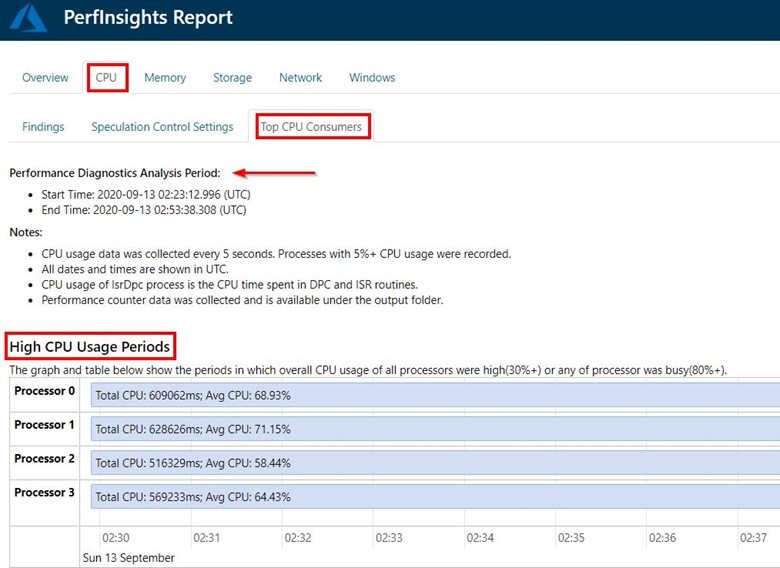

The second section (equally important), is **Top Long Running CPU Consumers**. This section shows both the process details and their CPU usage pattern. The list is sorted by having high average CPU consumers at the top.

  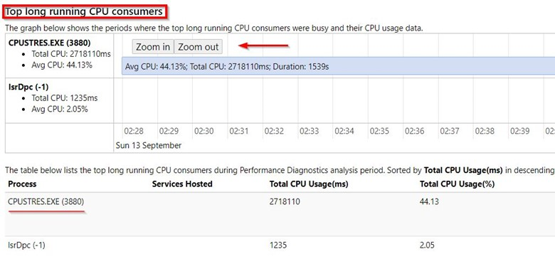

These two tabs will be enough to set the path for the next troubleshooting steps. Depending on the process that's driving the high-CPU condition, you'll have to address the questions that were asked earlier. Processes such as SQL Server (sqlservr.exe) or IIS (w3wp.exe) require a specific drill-down on query or code changes that are causing this condition. For system processes such as WMI or Lsass.exe, you have to follow a different path.

For Azure VM-related processes such as RDAgent, OMS, and monitoring extension executables, you may have to fix a new build or version by getting help from the Azure Support team.

### Perfmon

**Perfmon** is one of the earliest tools for troubleshooting a resource issue on Windows Server. It doesn't give a clear report that has recommendations or findings. Instead, it requires the user to explore the collected data and use a specific filter under the different counter categories.

PerfInsights collects Perfmon as an extra log for VMSlow and advanced scenarios. However, Perfmon can be collected independently, and has these additional benefits:

- It can be collected remotely.

- It can be scheduled through **Tasks**.

- It can be collected for longer durations or in continuous mode by using the roll-over feature.

Consider the same example that's shown in PerfInsights to see how Perfmon shows this data. The required counter categories are as follows:

- Processor Information > %Processor Time > _Total

- Process > %ProcessorTime > All Instances

#### Where to start

The output file names of Perfmon have a `.blg` extension. You can collect these files independently or by using PerfInsights. For this discussion, you'll be using the Perfmon `.blg` that is included in PerfInsights data and that were collected per the previous example.

There are no default user-ready reports available in Perfmon. There are different views that change the graph type, but the process filtration (or the work that's required to identify culprit processes) is manual.

> [!NOTE]
> The [PAL Tool](https://github.com/clinthuffman/PAL) can consume `.blg` files and generate detailed reports.

To start, select the **Add Counters** category.

1. Under **Available counters**, select the **%ProcessorTime** counter in the **Processor Information** Category.

1. Select **_Total**, which gives you the statistics of all combined cores.

1. Select **Add**. The window shows **%ProcessorTime** under  **Added counters**.

  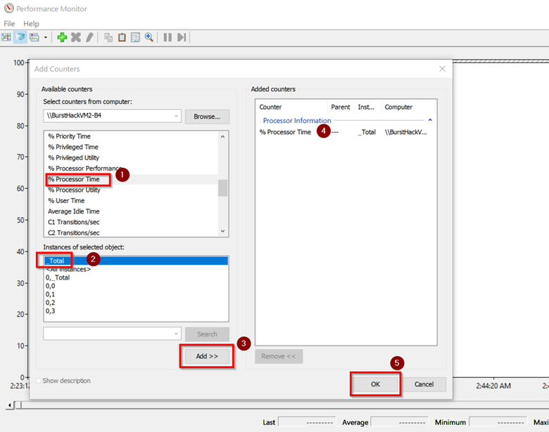

After the counters are loaded, you'll see line trend charts in the collection time frame. You can select or clear the counters. So far, you have added only one counter.

  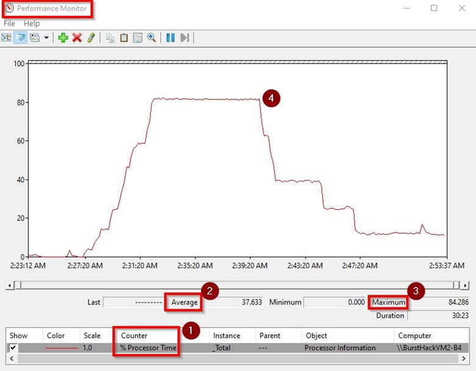

Every counter will have **Average**, **Minimum**, and **Maximum** values. Focus on both **Average** and **Maximum** values, as the average value can vary depending on the duration of the data collection. If the high-CPU activity was seen for 10 minutes while the overall collection was 40 minutes, the average values will be much lower.

The previous trend graph shows that the **Total Processor** was ranging near 80 percent for approximately 15 minutes.

#### Identify the process

We have identified that the server had high-CPU consumption for a specified amount of time, but we have not yet identified the driver. Unlike using PerfInsights, you must manually search for the culprit process in this case.

For this task you must clear or remove the **%ProcessorTime** counters previously added, and then add a new category:

- Process > %ProcessorTime > All Instances

This category will load counters for all the processes running at that time.

  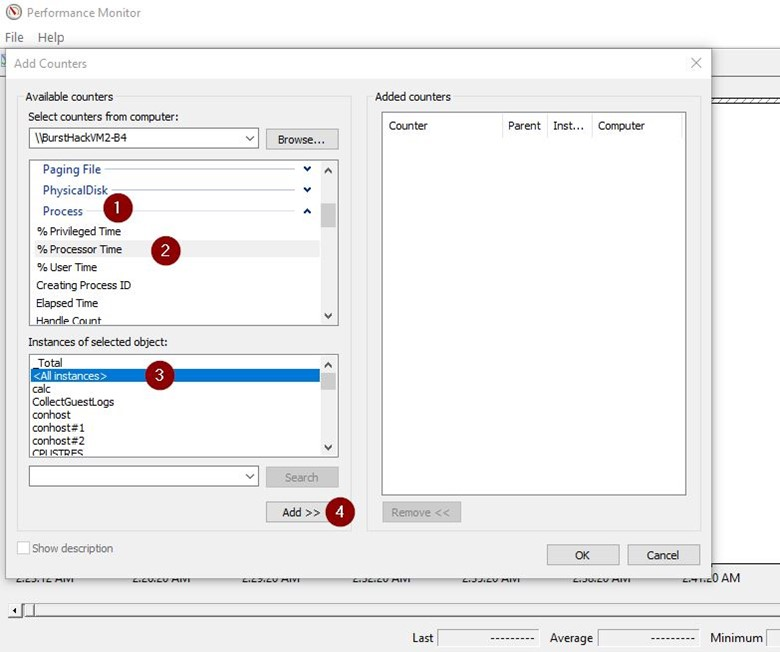

On a typical production computer, hundreds or processes can be running. Therefore, it may take a while to clear every counter that seems to have a low or flat trend graph.

To accelerate this process, use the **Histogram** view, and change the view type from **Line** to **Histogram**, which will give you a bar graph. You'll find it is easier to choose the processes that experience high-CPU usage during collection time.

Because there will always be a bar for **Total**, focus on bars that are showing a high exhaustion rate. You can delete the other bars to clean the view. Now, shift back to **Line** view.

  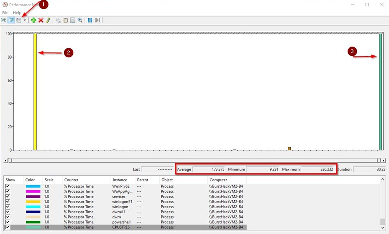

It's now easier to catch the culprit process. By default, the **Max** and **Min** values are multiples of the number of either the cores on the server, or threads of the process.

  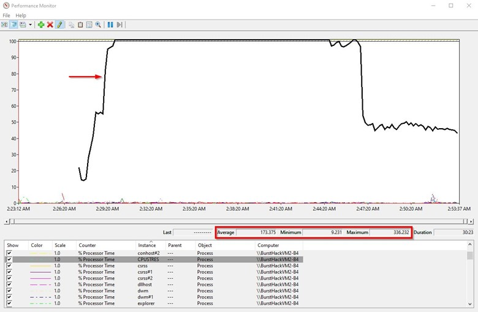

The list of available tools doesn't end at PerfInsights for Perfmon. You have access to other tools, such as **ProcessMonitor** (ProcMon) or **Xperf**. There are many third-party tools available to use as necessary.

### Azure monitoring tools

Azure VMs have reliable metrics that include basic information such as CPU, Network I/O, and I/O bytes. For advanced metrics, such as Azure Monitor, you will have to make only a few selections to configure and use a storage account that you specify.

#### Basic (default) counters

  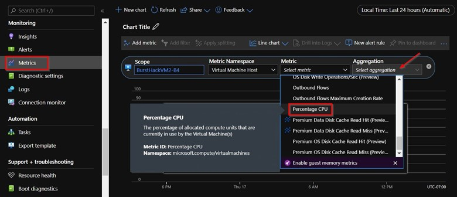

#### Enabling Azure Monitor

After you enable Azure Monitor metrics, the software installs an extension on the VM, and then starts collecting granular metrics, which includes Perfmon counters.

  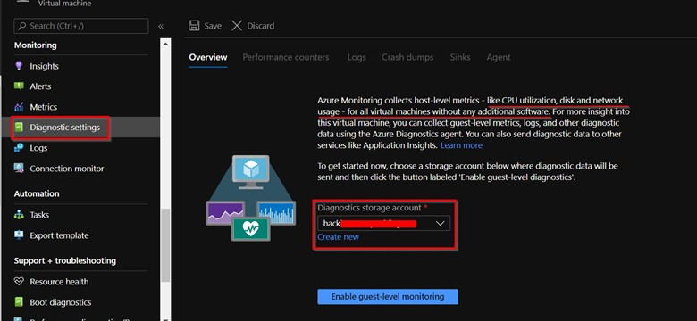

The **Basic** counter categories are set as **default**. However, you can also set a **Custom** collection.

  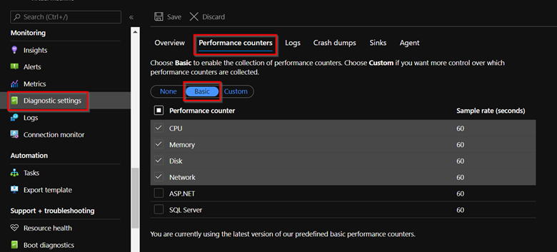

After the settings are enabled, you can view these **Guest** counters in the **Metrics** section. You can also set **Alerts** (including email messages) if the metrics reach a certain threshold.

  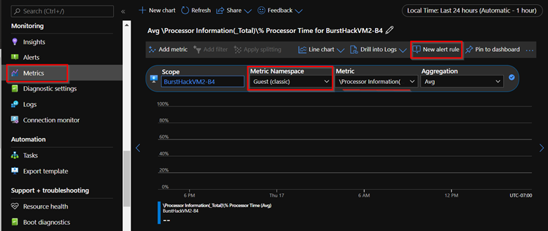

For more information about how to use Azure monitor to manage Azure VMs, see [Monitoring Azure virtual machines with Azure Monitor](../../azure-monitor/insights/monitor-vm-azure.md).

### Reactive troubleshooting

If the issue has already occurred, you must discover what caused the high-CPU issue in the first place. The reactive stance can be tricky. The data collection mode won't be as useful because the issue has already occurred.

If this issue was a one-time occurrence, it may be difficult to determine which app caused it. If the Azure VM was configured to use OMS or other diagnostics tracking, you can still get insights about what caused the issue.

If you are dealing with a repeating pattern, collect the data during the time that the issue is likely going to occur next.

PerfInsights does not yet have a **Scheduled run** capability. However, Perfmon can be run and scheduled through the command line.

### Logman command

The **Logman Create Counter** command is used to run Perfmon collection through the command line, to schedule it through **Task Manager**, or to run it remotely.

**Sample** (includes remote collection mode)

`Logman create counter LOGNAME -u DOMAIN\USERNAME * -f bincirc -v mmddhhmm -max 300 -c "\\SERVERNAME\LogicalDisk(*)\*" "\\SERVERNAME\Memory\*" "\\SERVERNAME\Network Interface(*)\*" "\\SERVERNAME\Paging File(*)\*" "\\SERVERNAME\PhysicalDisk(*)\*" "\\SERVERNAME\Process(*)\*" "\\SERVERNAME\Redirector\*" "\\SERVERNAME\Server\*" "\\SERVERNAME\System\*" "\\SERVERNAME\Terminal Services\*" "\\SERVERNAME\Processor(*)\*" "\\SERVERNAME\Cache\*" -si 00:01:00`

Logman.exe can also be started from a peer Azure VM computer in the same VNET.

To learn more about these parameters, see [logman create counter](/windows-server/administration/windows-commands/logman-create-counter).

After the Perfmon data is collected while the issue is occurring, the remaining steps to analyze the data are the same as discussed earlier.

## Conclusion

For any performance issue, understanding your workload is key to solving the problem. The options on different VM SKUs and different disk storage options must be evaluated by keeping the focus on production workload. The process of testing solutions on different VMs can help you make the best decision.

Because the user operations and amount of data varies, always keep a buffer in the computing, networking, and I/O capabilities of the VM. Now, any sudden change in workload doesn't have as great an effect.

If you foresee the workload increasing soon, move to a higher SKU that has more computing power. If the workload will be compute-intensive, choose the VM SKUs wisely.