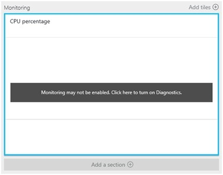
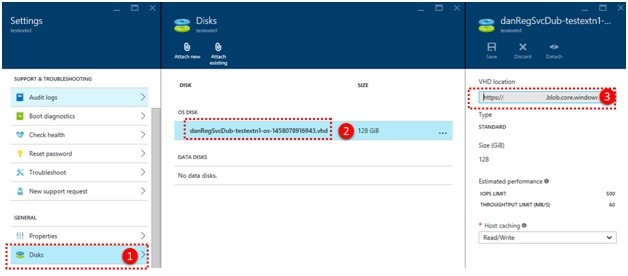
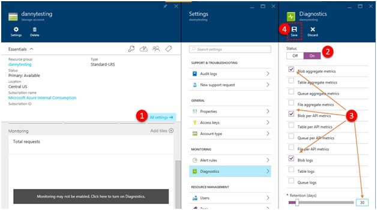
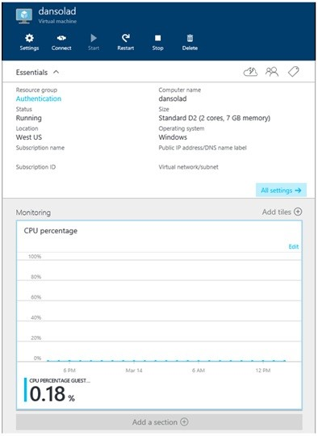
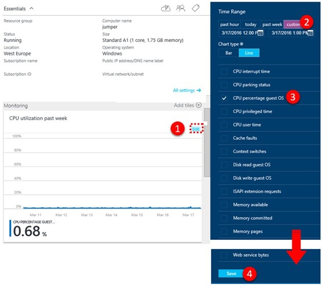
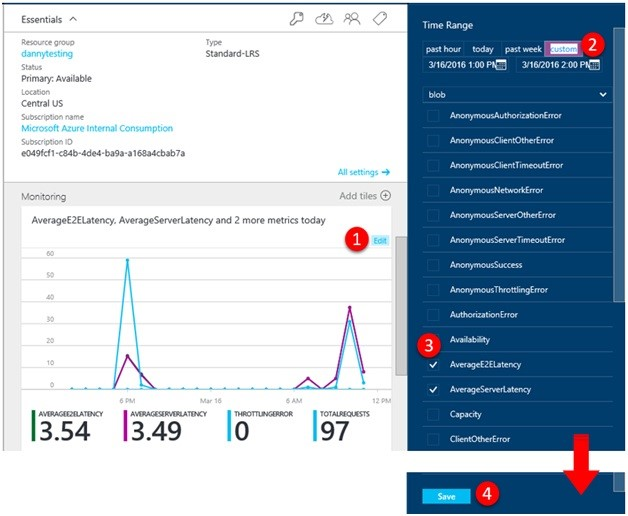

# Generic performance troubleshooting for Azure Virtual Machine running Linux or Windows

This article describes virtual machine (VM) generic performance troubleshooting through monitoring and observing bottlenecks and provides possible remediation for issues that may occur.

## Enabling Monitoring

### Azure IAAS VM Monitoring

To monitor the Guest VM, you can use the Azure VM Monitoring. This will alert you to certain high-level resource conditions. To check whether you have the VM diagnostics enabled, click [here](https://azure.microsoft.com/documentation/articles/insights-how-to-use-diagnostics/#change-settings-for-an-existing-resource). If you see the following, then you most likely do not have the diagnostics enabled:

 
### Enable VM Diagnostics through Portal

To enable VM diagnostics, go to the VM, click **Settings**, and then click **Diagnostics**.

 
### Enable Storage Account Diagnostics through Portal

First, identify which storage account(s) your VM is using. To do this, select the VM. click **Settings**, and then click **Disks**:

In the portal, go to the storage account(s) for the VM and then work through the following steps:

 
1. Select **All Settings**.
2. Turn Diagnostics On.
3. Select **Blob* Metrics** and set retention to **30** days.
4. Save the changes.

## Observing Bottlenecks

### Accessing the Monitoring

Select the Azure VM you want to investigate, and then select **Monitoring**.

 
### Timelines of Observation

To identify if you have any resource bottlenecks you will need to review your data. If your find that your machine has been running fine, but it has been reported that the performance has recently degraded, then you should review a time range of data that encompasses performance metric data before the reported changed, during and after the issue.

### Check for CPU Bottleneck

1. Edit the Graph.
2. Set the time Range.
3. You then need to add in the counter: CPU Percentage Guest OS
4. Save.

### CPU Observe Trends

When looking at performance issues, you need to be aware of the trends and understand if they affect you. In the next sections we will use the Monitoring graphs from the portal to show trends, they can also be useful for cross referencing difference resource behaviors in the same time period, this article discusses how to customize the [graphs](https://azure.microsoft.com/documentation/articles/insights-how-to-customize-monitoring/).

Spiking – this could be related to a scheduled task\known event, if you know what this task is, does it run at the required performance level? If performance is ok you may not need to increase resource.

Spike up and Constant – Could be a new workload, is it a workload you know, if not you will need to enable monitoring in the VM to find out what process(es) cause this. Once the process is recognized, is the increased consumption caused by inefficient code, or is this normal consumption? If normal consumption, does the process operate at the required performance level?

Constant – Has your VM always been like this, or since the diagnostics have been enable? If so you should identify the process(es) causing this, and consider adding more of that resource.

Steadily Increasing – Do you see constant increase in consumption? If so, this could be inefficient code or a process taking on more user workload.

### High CPU Utilization Remediation

In the case of where your application / process is not running at the correct performance level and you are seeing 95% + CPU utilization constant, you can perform either of the following tasks:

* For immediate relief - Increase the size of the VM to a size with more cores
* Understand issue – locate application \ process and troubleshoot accordingly.

If you have increased the VM and the CPU is still running 95%, is this offering better performance, higher application throughput to an acceptable level? If not, you will need to troubleshoot that individual application\process.

## Check for Memory Bottleneck

To view the metrics:

1. Add Section.
2. Add Tile.
3. Open the Gallery.
4. Select the Memory Usage and drag. When the tile is docked, right-click and select **6x4**.

### Memory Observe Trends

The Memory Usage shows you how much memory is being consumed with the VM. You should understand the trend and if it maps to the time you see issues. You should not have less than 100MB of available memory.

Spike and Constant / Constant Steady Consumption - Just because you have high memory utilization may not mean it is the cause of bad performance, some applications, such as relational database engines allocate a lot of memory and seeing this may not mean anything. However, if there are multiple memory hungry applications you may be seeing bad performance as a result of memory contention causing trimming and paging/swapping to disk, this will be a likely noticeable cause of application performance impact.

Steadily Increasing Consumption – This could be an application ‘warming up’, this is common among database engines starting up, however this could also be a sign of a memory leak in an application. You should identify the application and understand if it is expected behavior.

Page or Swap File Usage – You should check if you are using the Windows Paging file (located on D:\) or Linux Swap file (located on /dev/sdb) are being heavily used, if you have nothing on these volumes except these files, check for high Read / Writes on those disks. This is then indicative of low memory conditions have or are currently occurring.

### High Memory Utilization Remediation

To resolve these, you can perform any of the following tasks:

* For immediate relief or Page or Swap File Usage - Increase the size of the VM to a size with more memory, then monitor.
* Understand issue – locate application \ process and troubleshoot for identifying high consuming memory applications.
* If you know the application, see if the memory allocation can be capped.

If you find that after upgrading to a larger VM and you still have a constant steady increase until 100% you must identify the application\process and troubleshoot.

## Check for Disk Bottleneck

To check the storage subsystem for the VM you will need to check the diagnostics at the Azure VM level by using the counters in VM Diagnostics and also the Storage Account Diagnostics.

Note we do not have counters for Zone Redundant and Premium Storage Accounts, for issues related to these you will need to raise a support case.

### Viewing Storage Account Diagnostics in Monitoring

To work on the below you will need go into the storage account for the VM in the portal:

1. Edit the Monitoring Graph.
2. Set the time range.
3. Add the counters described in the steps below.
4. Save the changes.

### Disk Observe Trends (Standard Storage Only)

To identify issues with storage you need to look at performance metrics from the Storage Account Diagnostics and the VM Diagnostics.

For each check below, look for key trends when the issues occur within the time range of the issue.

#### Check Azure Storage Availability – Add the Storage Account Metric: Availability

If you see a drop in availability, there could be an issue with the platform, please check the [Azure Status](https://azure.microsoft.com/status/). If no issue shown there, please raise a new support request.

#### Check for Azure Storage Timeout - Add the Storage Account Metrics:

* ClientTimeOutError
* ServerTimeOutError
* AverageE2ELatency
* AverageServerLatency
* TotalRequests

If you see values in the *TimeOutError metrics an IO operation took too long and timed out, working through the next steps will help identify potential causes.

If you see AverageServerLatency increase at the same time at the TimeOutErrors, then it could be a platform issue, you will then need to raise a case.

If you see AverageE2ELatency, this represents client latency then verify how the IOPS are being performed by the application, look here for an increase or constantly high TotalRequests metric. This metric represents IOPS, if you are starting to hit the limits of the storage account or single VHD, the latency could be related to throttling.

#### Check for Azure Storage Throttling - Add the Storage Account Metrics: ThrottlingError

If you are seeing values for throttling, this means you are being throttled at storage account level, i.e. your hitting the IOPS limit of the account. You can determine if you are hitting the IOPs threshold by check the metric TotalRequests.

Note Each VHD has a limit of 500IOPS or 60MBits, but is bound by the cumulative limit of 20000IOPS per storage account.

With this metric you cannot tell which blob is causing the throttling and which are affected by it. However, what you know is that it is occurring and that you are either hitting the IOPS or Ingress/Egress limits of the storage account.

To identify if you are hitting the IOPS limit, go into the Storage Account diagnostics and check the TotalRequests, looking for to see if you are getting close 20K TotalRequests. The key here is to identify if this a change in pattern, is this the first time seen, or happens at a certain time?

#### References

* [Scalability targets for virtual machine disks](https://azure.microsoft.com/documentation/articles/storage-scalability-targets/#scalability-targets-for-virtual-machine-disks)

The bandwidth of the storage account is measured by the Storage Account Metrics : TotalIngress and TotalEgress. You have different thresholds for bandwidth depending on type of redundancy and regions:

* [Scalability targets for blobs, queues, tables, and files](https://azure.microsoft.com/documentation/articles/storage-scalability-targets/#scalability-targets-for-blobs-queues-tables-and-files)

You need to check the TotalIngress and TotalEgress against the Ingress and Egress limits for the storage account redundancy type and region.

Check Throughput Limits of the VHDs attached to the VM – Add the VM Metrics Disk Read and Write

Each VHD can support upto 60MB/s (IOPS are not exposed per VHD), look at the data to see if you are the hitting the limits of combined throughput MB of the VHD(s) at VM level using Disk Read and Write, then you need to optimize your VM storage config to scale past single VHD limits.

### High Disk Utilization/Latency Remediation

Reduce Client Latency and Optimize VM IO to scale past VHD Limits

* [Optimizing IO for Windows in Azure](https://azure.microsoft.com/documentation/articles/virtual-machines-sql-server-performance-best-practices/)

* [Optimizing IO for Linux in Azure](https://blogs.msdn.microsoft.com/igorpag/2014/10/23/azure-storage-secrets-and-linux-io-optimizations/)

#### Reduce Throttling

If hitting upper limits of storage accounts, you should rebalance the VHDs between storage accounts. Refer to [Azure Storage Scalability and Performance Targets](https://azure.microsoft.com/documentation/articles/storage-scalability-targets/).

### Increase Throughput and Reduce Latency

If you find that you have a latency sensitive application and require high throughput, then you should migrate your VHDs to Azure Premium storage. For this you will need to be using DS and GS series VM.

These articles discuss the specific scenarios:

* [Migrating to Azure Premium Storage](https://azure.microsoft.com/documentation/articles/storage-migration-to-premium-storage/)

* [Use Azure Premium Storage with SQL Server](https://azure.microsoft.com/documentation/articles/virtual-machines-sql-server-use-premium-storage/)
