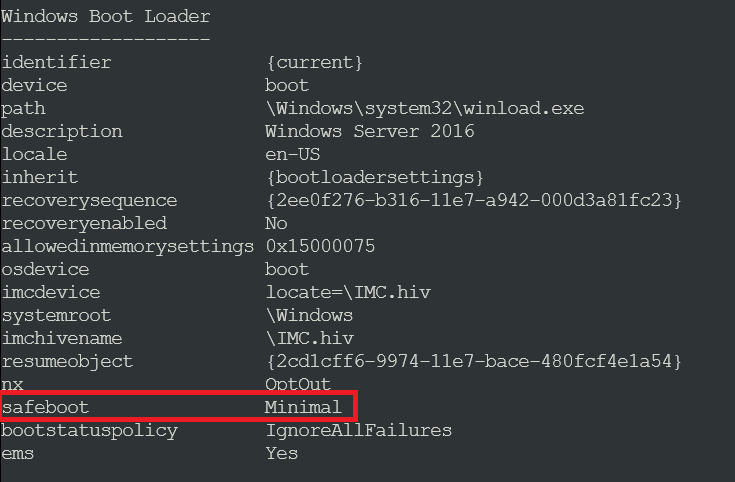
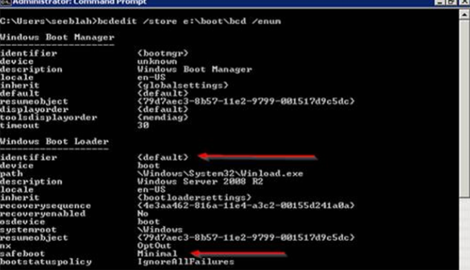

#  Cannot RDP to a VM because the VM boots into Safe Mode

This article shows how to resolve a problem in which you cannot connect to Azure Windows Virtual Machines (VMs) because the VM is configured to boot into Safe Mode.

> [!NOTE]
> Azure has two different deployment models for creating and working with resources:
[Resource Manager and classic](../../azure-resource-manager/management/deployment-models.md). This article covers using the Resource Manager deployment model, which we recommend using for new deployments instead of the classic deployment model.

## Symptoms

You cannot make an RDP connection or other connections (such as HTTP) to a VM in Azure because the VM is configured to boot into Safe Mode. When you check the screenshot in the [Boot diagnostics](../troubleshooting/boot-diagnostics.md) in the Azure portal, you might see that the VM boots normally, but the network interface is not available:


## Cause

The RDP service is not available in Safe Mode. Only essential system programs and services are loaded when the VM boots into Safe Mode. This applies for the two different versions of Safe Mode which are "Safe Boot minimal" and "Safe Boot with connectivity".


## Solution

Before you follow these steps, take a snapshot of the OS disk of the affected VM as a backup. For more information, see [Snapshot a disk](../windows/snapshot-copy-managed-disk.md).

To resolve this issue, use Serial control to configure the VM to boot into normal mode or [repair the VM offline](#repair-the-vm-offline) by using a recovery VM.

### Use Serial control

1. Connect to [Serial Console and open CMD instance](./serial-console-windows.md#use-cmd-or-powershell-in-serial-console
   ). If the Serial Console is not enabled on your VM, see [repair the VM offline](#repair-the-vm-offline).
2. Check the boot configuration data:

        bcdedit /enum

    If the VM is configured to boot into Safe Mode, you will see an extra flag under the **Windows Boot Loader** section called **safeboot**. If you do not see the **safeboot** flag, the VM is not in Safe Mode. This article does not apply to your scenario.

    The **safeboot** flag could appear with the following values:
   - Minimal
   - Network

     In either of these two modes, RDP will not be started. Therefore, the fix remains the same.

     

3. Delete the **safemoade** flag, so the VM will boot into normal mode:

	    bcdedit /deletevalue {current} safeboot

4. Check the boot configuration data to make sure that the **safeboot** flag is removed:

        bcdedit /enum

5. Restart the VM, and then check whether the issue is resolved.

### Repair the VM offline

#### Attach the OS disk to a recovery VM

1. [Attach the OS disk to a recovery VM](../windows/troubleshoot-recovery-disks-portal.md).
2. Start a Remote Desktop connection to the recovery VM.
3. Make sure that the disk is flagged as **Online** in the Disk Management console. Note the drive letter that is assigned to the attached OS disk.

#### Enable dump log and Serial Console (optional)

The dump log and Serial Console will help us to do further troubleshooting if the problem cannot be resolved by the solution in this article.

To enable dump log and Serial Console, run the following script.

1. Open an elevated command prompt session (**Run as administrator**).
2. Run the following script:

    In this script, we assume that the drive letter that is assigned to the attached OS disk is F. Replace this drive letter with the appropriate value for your VM.

    ```powershell
    reg load HKLM\BROKENSYSTEM F:\windows\system32\config\SYSTEM

    REM Enable Serial Console
    bcdedit /store F:\boot\bcd /set {bootmgr} displaybootmenu yes
    bcdedit /store F:\boot\bcd /set {bootmgr} timeout 5
    bcdedit /store F:\boot\bcd /set {bootmgr} bootems yes
    bcdedit /store F:\boot\bcd /ems {<BOOT LOADER IDENTIFIER>} ON
    bcdedit /store F:\boot\bcd /emssettings EMSPORT:1 EMSBAUDRATE:115200

    REM Suggested configuration to enable OS Dump
    REG ADD "HKLM\BROKENSYSTEM\ControlSet001\Control\CrashControl" /v CrashDumpEnabled /t REG_DWORD /d 1 /f
    REG ADD "HKLM\BROKENSYSTEM\ControlSet001\Control\CrashControl" /v DumpFile /t REG_EXPAND_SZ /d "%SystemRoot%\MEMORY.DMP" /f
    REG ADD "HKLM\BROKENSYSTEM\ControlSet001\Control\CrashControl" /v NMICrashDump /t REG_DWORD /d 1 /f

    REG ADD "HKLM\BROKENSYSTEM\ControlSet002\Control\CrashControl" /v CrashDumpEnabled /t REG_DWORD /d 1 /f
    REG ADD "HKLM\BROKENSYSTEM\ControlSet002\Control\CrashControl" /v DumpFile /t REG_EXPAND_SZ /d "%SystemRoot%\MEMORY.DMP" /f
    REG ADD "HKLM\BROKENSYSTEM\ControlSet002\Control\CrashControl" /v NMICrashDump /t REG_DWORD /d 1 /f

    reg unload HKLM\BROKENSYSTEM
    ```

#### Configure the Windows to boot into normal mode

1. Open an elevated command prompt session (**Run as administrator**).
2. Check the boot configuration data. In the following commands, we assume that the drive letter that is assigned to the attached OS disk is F. Replace this drive letter with the appropriate value for your VM.

        bcdedit /store F:\boot\bcd /enum
    Take note of the Identifier name of the partition that has the **\windows** folder. By default, the  Identifier name is "Default".

    If the VM is configured to boot into Safe Mode, you will see an extra flag under the **Windows Boot Loader** section called **safeboot**. If you do not see the **safeboot** flag, this article does not apply to your scenario.

    

3. Remove the **safeboot** flag, so the VM will boot into normal mode:

        bcdedit /store F:\boot\bcd /deletevalue {Default} safeboot
4. Check the boot configuration data to make sure that the **safeboot** flag is removed:

        bcdedit /store F:\boot\bcd /enum
5. [Detach the OS disk and recreate the VM](../windows/troubleshoot-recovery-disks-portal.md). Then check whether the issue is resolved.
