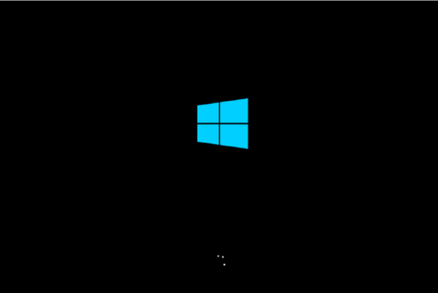

# Windows reboot loop on an Azure VM
This article describes the reboot loop you may experience on a Windows Virtual Machine (VM) in Microsoft Azure.

## Symptom

When you use [Boot diagnostics](./boot-diagnostics.md) to get the screenshots of a VM, you find the virtual machine is booting but the boot process is getting interrupted and the process is starting over.

## Cause

The reboot loop occurs because of the following causes:

### Cause 1

There is a third-party service that is flagged as critical and it cannot be started. This causes the operating system to reboot.

### Cause 2

Some changes were made to the operating system. Usually, these are related to an update installation, application installation, or a new policy. You may have to check the following logs for additional details:

- Event Logs
- CBS.logWindows
- Update.log

### Cause 3

File system corruption could cause this. However, it is difficult to diagnose and identify the change that causes the corruption of the operating system.

## Solution

To resolve this problem, [back up the OS disk](../windows/snapshot-copy-managed-disk.md), and [attach the OS disk to a rescue VM](../windows/troubleshoot-recovery-disks-portal.md), and then follow the solution options accordingly, or try the solutions one by one.

### Solution for cause 1

1. Once the OS disk is attached to a working VM, make sure that the disk is flagged as **Online** in the Disk Management console and note the drive letter of the partition that holds the **\Windows** folder.

2. If the disk is set to **Offline**, then set it to **Online**.

3. Create a copy of the **\Windows\System32\config** folder in case a rollback on the changes is needed.

4. On the rescue VM, open the Windows Registry Editor (regedit).

5. Select the **HKEY_LOCAL_MACHINE** key and then select **File** > **Load Hive** from the menu.

6. Browse to the SYSTEM file in the **\Windows\System32\config** folder.

7. Select **Open**, type **BROKENSYSTEM** for the name, expand the **HKEY_LOCAL_MACHINE** key, and then you will see an additional key called **BROKENSYSTEM**.

8. Check which ControlSet the computer is booting from. You will see its key number in the following  registry key.

    `HKEY_LOCAL_MACHINE\BROKENSYSTEM\Select\Current`

9. Check which is the criticality of the VM agent service through the following registry key.

    `HKEY_LOCAL_MACHINE\BROKENSYSTEM\ControlSet00x\Services\RDAgent\ErrorControl`

10.	If the value of the registry key is not set to **2**, then go to the next mitigation.

11.	If the value of the registry key is set to **2**, then change the value from **2** to **1**.

12.	If any of the following keys exist and they have value **2** or **3**, and then change these values to **1** accordingly:

    - `HKEY_LOCAL_MACHINE\BROKENSYSTEM\ControlSet00x\Services\AzureWLBackupCoordinatorSvc\ErrorControl`
    - `HKEY_LOCAL_MACHINE\BROKENSYSTEM\ControlSet00x\Services\AzureWLBackupInquirySvc\ErrorControl`
    - `HKEY_LOCAL_MACHINE\BROKENSYSTEM\ControlSet00x\Services\AzureWLBackupPluginSvc\ErrorControl`

13.	Select the **BROKENSYSTEM** key and then select **File** > **Unload Hive** from the menu.

14.	Detach the OS disk from the troubleshooting VM.

15.	Remove the disk from the troubleshooting VM and wait about 2 minutes for Azure to release this disk.

16.	[Create a new VM from the OS disk](../windows/create-vm-specialized.md).

17.	If the issue is fixed, then you may have to reinstall the [RDAgent](https://blogs.msdn.microsoft.com/mast/2014/04/07/install-the-vm-agent-on-an-existing-azure-vm/) (WaAppAgent.exe).

### Solution for cause 2

Restore the VM to the last known good configuration, follow the steps in [How to start Azure Windows VM with Last Known Good Configuration](https://support.microsoft.com/help/4016731/).

### Solution for cause 3
>[!NOTE]
>The following procedure should only be used as last resource. While restoring from regback may restore access to the machine, the OS is not considered stable since there is data lost in the registry between the timestamp of the hive and the current day. You need to build a new VM and make plans to migrate data.

1. Once the disk is attached to a troubleshooting VM, make sure that the disk is flagged as **Online** in the Disk Management console.

2. Create a copy of the **\Windows\System32\config** folder in case a rollback on the changes is needed.

3. Copy the files in the **\Windows\System32\config\regback** folder and replace the files in the **\Windows\System32\config** folder.

4. Remove the disk from the troubleshooting VM and wait about 2 minutes for Azure to release this disk.

5. [Create a new VM from the OS disk](../windows/create-vm-specialized.md).

