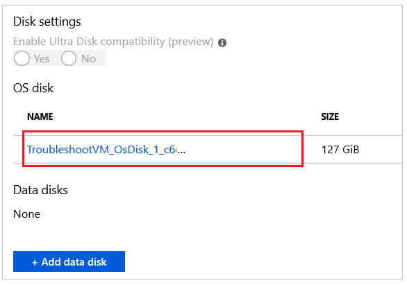
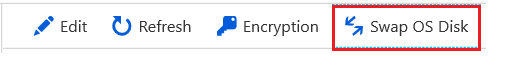

# Troubleshoot a Windows VM by attaching the OS disk to a recovery VM using the Azure portal
If your Windows virtual machine (VM) in Azure encounters a boot or disk error, you may need to perform troubleshooting steps on the virtual hard disk itself. A common example would be a failed application update that prevents the VM from being able to boot successfully. This article details how to use the Azure portal to connect your virtual hard disk to another Windows VM to fix any errors, then re-create your original VM. 

## Recovery process overview
The troubleshooting process is as follows:

1. Stop the affected VM.
1. Create a snapshot for the OS disk of the VM.
1. Create a virtual hard disk from the snapshot.
1. Attach and mount the virtual hard disk to another Windows VM for troubleshooting purposes.
1. Connect to the troubleshooting VM. Edit files or run any tools to fix issues on the original virtual hard disk.
1. Unmount and detach the virtual hard disk from the troubleshooting VM.
1. Swap the OS disk for the VM.

> [!NOTE]
> This article does not apply to the VM with unmanaged disk.

## Take a snapshot of the OS Disk
A snapshot is a full, read-only copy of a virtual hard drive (VHD). We recommend that you cleanly shut down the VM before taking a snapshot, to clear out any processes that are in progress. To take a snapshot of an OS disk, follow these steps:

1. Go to [Azure portal](https://portal.azure.com). Select **Virtual machines** from the sidebar, and then select the VM that has problem.
1. On the left pane, select **Disks**, and then select the name of the OS disk.
    
1. On the **Overview** page of the OS disk, and then select **Create snapshot**.
1. Create a snapshot in the same location as the OS disk.

## Create a disk from the snapshot
To create a disk from the snapshot, follow these steps:

1. Select **Cloud Shell** from the Azure portal.

    
1. Run the following PowerShell commands to create a managed disk from the snapshot. You should replace these sample names with the appropriate names.

    ```powershell
    #Provide the name of your resource group
    $resourceGroupName ='myResourceGroup'
    
    #Provide the name of the snapshot that will be used to create Managed Disks
    $snapshotName = 'mySnapshot' 
    
    #Provide the name of theManaged Disk
    $diskName = 'newOSDisk'
    
    #Provide the size of the disks in GB. It should be greater than the VHD file size. In this sample, the size of the snapshot is 127 GB. So we set the disk size to 128 GB.
    $diskSize = '128'
    
    #Provide the storage type for Managed Disk.  Premium_LRS or Standard_LRS.
    $storageType = 'Standard_LRS'
    
    #Provide the Azure region (e.g. westus) where Managed Disks will be located.
    #This location should be same as the snapshot location
    #Get all the Azure location using command below:
    #Get-AzLocation
    $location = 'westus'
    
    $snapshot = Get-AzSnapshot -ResourceGroupName $resourceGroupName -SnapshotName $snapshotName 
     
    $diskConfig = New-AzDiskConfig -AccountType $storageType -Location $location -CreateOption Copy -SourceResourceId $snapshot.Id
     
    New-AzDisk -Disk $diskConfig -ResourceGroupName $resourceGroupName -DiskName $diskName
    ```
3. If the commands run successfully, you will see the new disk in the resource group that you provided.

## Attach the disk to another VM
For the next few steps, you use another VM for troubleshooting purposes. After you attach the disk to the troubleshooting VM,  you can browse and edit the disk's content. This process allows you to correct any configuration errors or review additional application or system log files. To attach the disk to another VM, follow these steps:

1. Select your resource group from the portal, then select your troubleshooting VM. Select **Disks**, select **Edit**, and then click **Add data disk**:

    

2. In the **Data disks** list, select the OS disk of the VM that you identified. If you do not see the OS disk, make sure that troubleshooting VM and the OS disk is in the same region (location). 
3. Select **Save** to apply the changes.

## Mount the attached data disk to the VM

1. Open a Remote Desktop connection to the troubleshooting VM. 
2. In the troubleshoot VM, Open **Server Manager**, then select **File and Storage Services**. 

    

3. The data disk is automatically detected and attached. To see a list of the connected disks, select **Disks**. You can select your data disk to view volume information, including the drive letter. The following example shows the data disk attached and using **F:**:

    

## Fix issues on original virtual hard disk
With the existing virtual hard disk mounted, you can now perform any maintenance and troubleshooting steps as needed. Once you have addressed the issues, continue with the following steps.

## Unmount and detach original virtual hard disk
Once your errors are resolved, detach the existing virtual hard disk from your troubleshooting VM. You cannot use your virtual hard disk with any other VM until the lease attaching the virtual hard disk to the troubleshooting VM is released.

1. From the RDP session to your VM, open **Server Manager**, then select **File and Storage Services**:

    

2. Select **Disks** and then select your data disk. Right-click on your data disk and select **Take Offline**:

    

3. Now detach the virtual hard disk from the VM. Select your VM in the Azure portal and click **Disks**. 
4. Select **Edit**, select the OS disk you attached and then click **Detach**:

    

    Wait until the VM has successfully detached the data disk before continuing.

## Swap the OS disk for the VM

Azure portal now supports change the OS disk of the VM. To do this, follow these steps:

1. Go to [Azure portal](https://portal.azure.com). Select **Virtual machines** from the sidebar, and then select the VM that has problem.
1. On the left pane, select **Disks**, and then select **Swap OS disk**.
        

1. Choose the new disk that you repaired, and then type the name of the VM to confirm the change. If you do not see the disk in the list, wait 10 ~ 15 minutes after you detach the disk from the troubleshooting VM. Also make sure that the disk is in the same location as the VM.
1. Select OK.

## Next steps
If you are having issues connecting to your VM, see [Troubleshoot RDP connections to an Azure VM](troubleshoot-rdp-connection.md). For issues with accessing applications running on your VM, see [Troubleshoot application connectivity issues on a Windows VM](troubleshoot-app-connection.md).

For more information about using Resource Manager, see [Azure Resource Manager overview](../../azure-resource-manager/management/overview.md).


