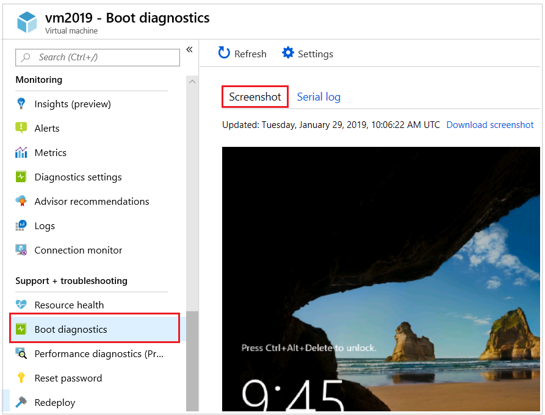
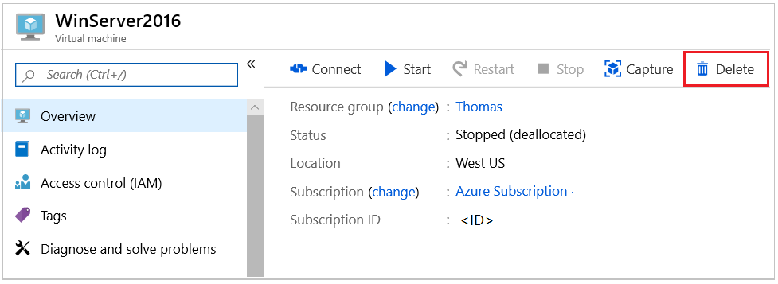
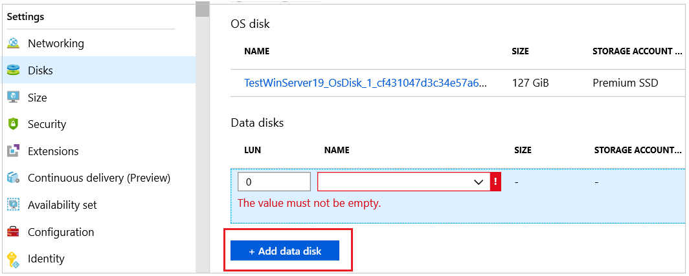
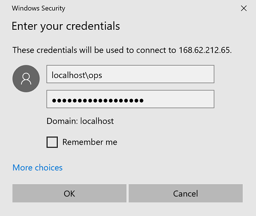
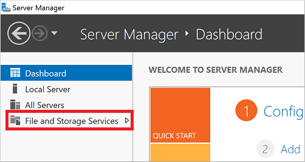
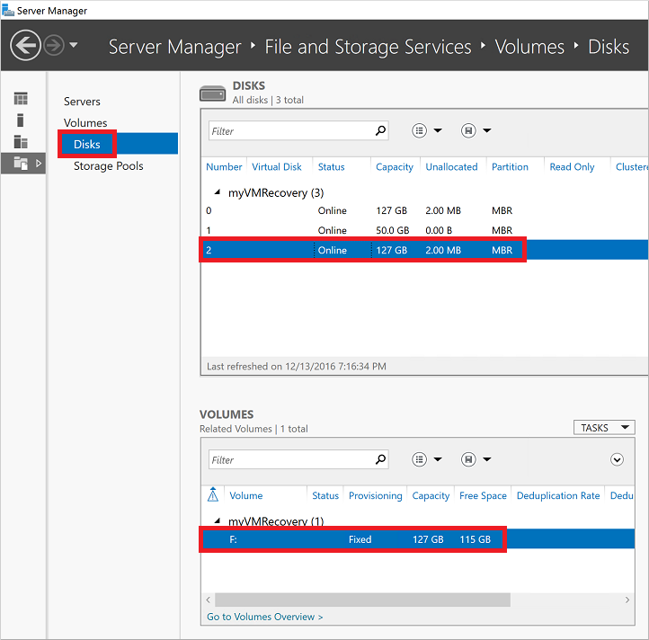
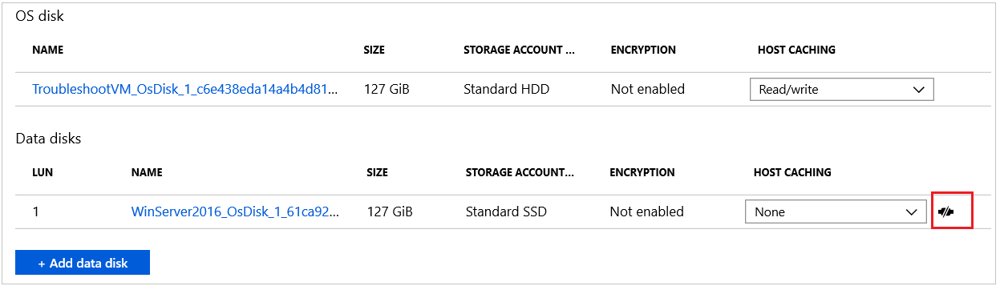
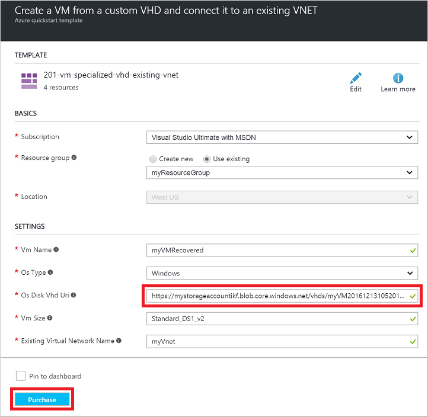

# Troubleshoot a Windows VM by attaching the OS disk to a recovery VM using the Azure portal
If your Windows virtual machine (VM) in Azure encounters a boot or disk error, you may need to perform troubleshooting steps on the virtual hard disk itself. A common example would be a failed application update that prevents the VM from being able to boot successfully. This article details how to use the Azure portal to connect your virtual hard disk to another Windows VM to fix any errors, then re-create your original VM.

## Recovery process overview
The troubleshooting process is as follows:

1. Delete the VM encountering issues, keeping the virtual hard disks.
2. Attach and mount the virtual hard disk to another Windows VM for troubleshooting purposes.
3. Connect to the troubleshooting VM. Edit files or run any tools to fix issues on the original virtual hard disk.
4. Unmount and detach the virtual hard disk from the troubleshooting VM.
5. Create a VM using the original virtual hard disk.

For the VM that uses managed disk, we can now use Azure PowerShell to change the OS disk for a VM. We no longer need to delete and recreate the VM. For more information, see [Troubleshoot a Windows VM by attaching the OS disk to a recovery VM using Azure PowerShell](troubleshoot-recovery-disks-windows.md).

## Determine boot issues
To determine why your VM is not able to boot correctly, examine the boot diagnostics VM screenshot. A common example would be a failed application update, or an underlying virtual hard disk being deleted or moved.

Select your VM in the portal and then scroll down to the **Support + Troubleshooting** section. Click **Boot diagnostics** to view the screenshot. Note any specific error messages or error codes to help determine why the VM is encountering an issue. The following example shows a VM waiting on stopping services:

You can also click **Screenshot** to download a capture of the VM screenshot.

## View existing virtual hard disk details
Before you can attach your virtual hard disk to another VM, you need to identify the name of the virtual hard disk (VHD). 

Select your resource group from the portal, then select your storage account. Click **Blobs**, as in the following example:

Typically you have a container named **vhds** that stores your virtual hard disks. Select the container to view a list of virtual hard disks. Note the name of your VHD (the prefix is usually the name of your VM):

Select your existing virtual hard disk from the list and copy the URL for use in the following steps:

## Delete existing VM
Virtual hard disks and VMs are two distinct resources in Azure. A virtual hard disk is where the operating system itself, applications, and configurations are stored. The VM itself is just metadata that defines the size or location, and references resources such as a virtual hard disk or virtual network interface card (NIC). Each virtual hard disk has a lease assigned when attached to a VM. Although data disks can be attached and detached even while the VM is running, the OS disk cannot be detached unless the VM resource is deleted. The lease continues to associate the OS disk with a VM even when that VM is in a stopped and deallocated state.

The first step to recover your VM is to delete the VM resource itself. Deleting the VM leaves the virtual hard disks in your storage account. After the VM is deleted, you attach the virtual hard disk to another VM to troubleshoot and resolve the errors.

Select your VM in the portal, then click **Delete**:

Wait until the VM has finished deleting before you attach the virtual hard disk to another VM. The lease on the virtual hard disk that associates it with the VM needs to be released before you can attach the virtual hard disk to another VM.

## Attach existing virtual hard disk to another VM
For the next few steps, you use another VM for troubleshooting purposes. You attach the existing virtual hard disk to this troubleshooting VM to be able to browse and edit the disk's content. This process allows you to correct any configuration errors or review additional application or system log files, for example. Choose or create another VM to use for troubleshooting purposes.

1. Select your resource group from the portal, then select your troubleshooting VM. Select **Disks** and then click **Attach existing**:

    

2. To select your existing virtual hard disk, click **VHD File**:

    

3. Select your storage account and container, then click your existing VHD. Click the **Select** button to confirm your choice:

    

4. With your VHD now selected, click **OK** to attach the existing virtual hard disk:

    

5. After a few seconds, the **Disks** pane for your VM lists your existing virtual hard disk connected as a data disk:

    

## Mount the attached data disk

1. Open a Remote Desktop connection to your VM. Select your VM in the portal and click **Connect**. Download and open the RDP connection file. Enter your credentials to sign in to your VM as follows:

    

2. Open **Server Manager**, then select **File and Storage Services**. 

    

3. The data disk is automatically detected and attached. To see a list of the connected disks, select **Disks**. You can select your data disk to view volume information, including the drive letter. The following example shows the data disk attached and using **F:**:

    

## Fix issues on original virtual hard disk
With the existing virtual hard disk mounted, you can now perform any maintenance and troubleshooting steps as needed. Once you have addressed the issues, continue with the following steps.

## Unmount and detach original virtual hard disk
Once your errors are resolved, detach the existing virtual hard disk from your troubleshooting VM. You cannot use your virtual hard disk with any other VM until the lease attaching the virtual hard disk to the troubleshooting VM is released.

1. From the RDP session to your VM, open **Server Manager**, then select **File and Storage Services**:

    

2. Select **Disks** and then select your data disk. Right-click on your data disk and select **Take Offline**:

    

3. Now detach the virtual hard disk from the VM. Select your VM in the Azure portal and click **Disks**. Select your existing virtual hard disk and then click **Detach**:

    

    Wait until the VM has successfully detached the data disk before continuing.

## Create VM from original hard disk
To create a VM from your original virtual hard disk, use [this Azure Resource Manager template](https://github.com/Azure/azure-quickstart-templates/tree/master/201-vm-specialized-vhd-existing-vnet). The template deploys a VM into an existing virtual network, using the VHD URL from the earlier command. Click the **Deploy to Azure** button as follows:

The template is loaded into the Azure portal for deployment. Enter the names for your new VM and existing Azure resources, and paste the URL to your existing virtual hard disk. To begin the deployment, click **Purchase**:

## Re-enable boot diagnostics
When you create your VM from the existing virtual hard disk, boot diagnostics may not automatically be enabled. To check the status of boot diagnostics and turn on if needed, select your VM in the portal. Under **Monitoring**, click **Diagnostics settings**. Ensure the status is **On**, and the check mark next to **Boot diagnostics** is selected. If you make any changes, click **Save**:

## Next steps
If you are having issues connecting to your VM, see [Troubleshoot RDP connections to an Azure VM](troubleshoot-rdp-connection.md). For issues with accessing applications running on your VM, see [Troubleshoot application connectivity issues on a Windows VM](troubleshoot-app-connection.md).

For more information about using Resource Manager, see [Azure Resource Manager overview](../../azure-resource-manager/resource-group-overview.md).

