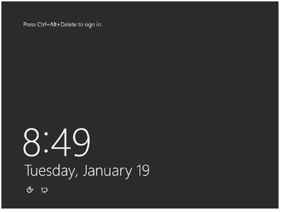
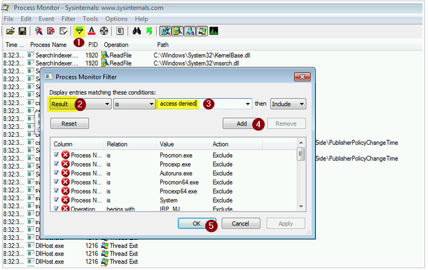

# Remote Desktop Services isn't starting on an Azure VM

This article describes how to troubleshoot issues when you connect to an Azure virtual machine (VM) and Remote Desktop Services, or TermService, isn't starting or fails to start.


## Symptoms

When you try to connect to a VM, you experience the following scenarios:

- The VM screenshot shows the operating system is fully loaded and waiting for credentials.

    

- You remotely view the event logs in the VM by using Event Viewer. You see that Remote Desktop Services, TermService, isn't starting or fails to start. The following log is a sample:

    **Log Name**:      System </br>
    **Source**:        Service Control Manager </br>
    **Date**:          12/16/2017 11:19:36 AM</br>
    **Event ID**:      7022</br>
    **Task Category**: None</br>
    **Level**:         Error</br>
    **Keywords**:      Classic</br>
    **User**:          N/A</br>
    **Computer**:      vm.contoso.com</br>
    **Description**: 
    The Remote Desktop Services service hung on starting.​ 

    You can also use the Serial Access Console feature to look for these errors by running the following query: 

        wevtutil qe system /c:1 /f:text /q:"Event[System[Provider[@Name='Service Control Manager'] and EventID=7022 and TimeCreated[timediff(@SystemTime) <= 86400000]]]" | more 

## Cause
 
This problem occurs because Remote Desktop Services isn't running on the VM. The cause can depend on the following scenarios: 

- The TermService service is set to **Disabled**. 
- The TermService service is crashing or not responding. 
- The TermService is not starting because of to an incorrect configuration.

## Solution

To troubleshoot this issue, use the Serial Console. Or else [repair the VM offline](#repair-the-vm-offline) by attaching the OS disk of the VM to a recovery VM.

### Use Serial Console

1. Access the [Serial Console](serial-console-windows.md) by selecting **Support & Troubleshooting** > **Serial console**. If the feature is enabled on the VM, you can connect the VM successfully.

2. Create a new channel for a CMD instance. Enter **CMD** to start the channel and get the channel name.

3. Switch to the channel that runs the CMD instance. In this case, it should be channel 1:

   ```
   ch -si 1
   ```

4. Select **Enter** again and enter a valid username and password, local or domain ID, for the VM.

5. Query the status of the TermService service:

   ```
   sc query TermService
   ```

6. If the service status shows **Stopped**, try to start the service:

    ```
    sc start TermService
     ``` 

7. Query the service again to make sure that the service is started successfully:

   ```
   sc query TermService
   ```
8. If the service fails to start, follow the solution based on the error you received:

    |  Error |  Suggestion |
    |---|---|
    |5- ACCESS DENIED |See [TermService service is stopped because of an Access Denied error](#termservice-service-is-stopped-because-of-an-access-denied-problem). |
    |1053 - ERROR_SERVICE_REQUEST_TIMEOUT  |See [TermService service is disabled](#termservice-service-is-disabled).  |  
    |1058 - ERROR_SERVICE_DISABLED  |See [TermService service crashes or hangs](#termservice-service-crashes-or-hangs).  |
    |1059 - ERROR_CIRCULAR_DEPENDENCY |[Contact support](https://portal.azure.com/?#blade/Microsoft_Azure_Support/HelpAndSupportBlade) to get your issue resolved quickly.|
    |1067 - ERROR_PROCESS_ABORTED  |See [TermService service crashes or hangs](#termservice-service-crashes-or-hangs).  |
    |1068 - ERROR_SERVICE_DEPENDENCY_FAIL|[Contact support](https://portal.azure.com/?#blade/Microsoft_Azure_Support/HelpAndSupportBlade) to get your issue resolved quickly.|
    |1069 - ERROR_SERVICE_LOGON_FAILED  |See [TermService service fails because of logon failure](#termservice-service-fails-because-of-logon-failure) |
    |1070 - ERROR_SERVICE_START_HANG   | See [TermService service crashes or hangs](#termservice-service-crashes-or-hangs). |
    |1077 - ERROR_SERVICE_NEVER_STARTED   | See [TermService service is disabled](#termservice-service-is-disabled).  |
    |1079 - ERROR_DIFERENCE_SERVICE_ACCOUNT   |[Contact support](https://portal.azure.com/?#blade/Microsoft_Azure_Support/HelpAndSupportBlade) to get your issue resolved quickly. |
    |1753   |[Contact support](https://portal.azure.com/?#blade/Microsoft_Azure_Support/HelpAndSupportBlade) to get your issue resolved quickly.   |
    
#### TermService service is stopped because of an Access Denied problem

1. Connect to [Serial Console](serial-console-windows.md) and open a PowerShell instance.
2. Download the Process Monitor tool by running the following script:

   ```
   remove-module psreadline  
   $source = "https://download.sysinternals.com/files/ProcessMonitor.zip" 
   $destination = "c:\temp\ProcessMonitor.zip" 
   $wc = New-Object System.Net.WebClient 
   $wc.DownloadFile($source,$destination) 
   ```

3. Now start a **procmon** trace:

   ```
   procmon /Quiet /Minimized /BackingFile c:\temp\ProcMonTrace.PML 
   ```

4. Reproduce the problem by starting the service that's giving **Access Denied**: 

   ```
   sc start TermService 
   ```

   When it fails, terminate the Process Monitor trace:

   ```   
   procmon /Terminate 
   ```

5. Collect the file **c:\temp\ProcMonTrace.PML**:

    1. [Attach a data disk to the VM](../windows/attach-managed-disk-portal.md
).
    2. Use Serial Console you can copy the file to the new drive. For example, `copy C:\temp\ProcMonTrace.PML F:\`. In this command, F is the driver letter of the attached data disk.
    3. Detach the data drive and attach it on a working VM that has Process Monitor ubstakke installed.

6. Open **ProcMonTrace.PML** by using Process Monitor the working VM. Then filter by **Result is ACCESS DENIED**, as shown in the following screenshot：

    

 
6. Fix the registry keys, folders, or files that are on the output. Usually, this problem is caused when the sign-in account that's used on the service doesn't have ACL permission to access these objects. To know the correct ACL permission for the sign-in account, you can check on a healthy VM. 

#### TermService service is disabled

1. Restore the service to its default startup value:

   ```
   sc config TermService start= demand 
   ```

2. Start the service:

   ```
   sc start TermService
   ```

3. Query its status again to make sure the service is running:

   ```
   sc query TermService 
   ```

4. Try to connect to VM by using Remote Desktop.

#### TermService service fails because of logon failure

1. This problem occurs if the startup account of this service was changed. Changed this back to its default: 

        sc config TermService obj= 'NT Authority\NetworkService'
2. Start the service:

        sc start TermService
3. Try to connect to VM by using Remote Desktop.

#### TermService service crashes or hangs
1. If the service status is stuck in **Starting** or **Stopping**, then try to stop the service: 

        sc stop TermService
2. Isolate the service on its own ‘svchost’ container:

        sc config TermService type= own
3. Start the service:

        sc start TermService
4. If the service is still failing to start, [Contact support](https://portal.azure.com/?#blade/Microsoft_Azure_Support/HelpAndSupportBlade).

### Repair the VM offline

#### Attach the OS disk to a recovery VM

1. [Attach the OS disk to a recovery VM](../windows/troubleshoot-recovery-disks-portal.md).
2. Start a Remote Desktop connection to the recovery VM. Make sure that the attached disk is flagged as **Online** in the Disk Management console. Note the drive letter that's assigned to the attached OS disk.
3. Open an elevated command prompt instance (**Run as administrator**). Then run the following script. We assume that the drive letter that's assigned to the attached OS disk is **F**. Replace it with the appropriate value in your VM. 

   ```
   reg load HKLM\BROKENSYSTEM F:\windows\system32\config\SYSTEM.hiv
        
   REM Set default values back on the broken service 
   reg add "HKLM\BROKENSYSTEM\ControlSet001\services\TermService" /v start /t REG_DWORD /d 3 /f
   reg add "HKLM\BROKENSYSTEM\ControlSet001\services\TermService" /v ObjectName /t REG_SZ /d "NT Authority\NetworkService“ /f
   reg add "HKLM\BROKENSYSTEM\ControlSet001\services\TermService" /v type /t REG_DWORD /d 16 /f
   reg add "HKLM\BROKENSYSTEM\ControlSet002\services\TermService" /v start /t REG_DWORD /d 3 /f
   reg add "HKLM\BROKENSYSTEM\ControlSet002\services\TermService" /v ObjectName /t REG_SZ /d "NT Authority\NetworkService" /f
   reg add "HKLM\BROKENSYSTEM\ControlSet002\services\TermService" /v type /t REG_DWORD /d 16 /f
   ```

4. [Detach the OS disk and recreate the VM](../windows/troubleshoot-recovery-disks-portal.md). Then check whether the issue is resolved.

## Need help? Contact support

If you still need help, [contact support](https://portal.azure.com/?#blade/Microsoft_Azure_Support/HelpAndSupportBlade) to get your issue resolved.
