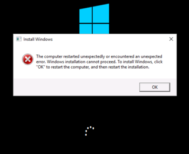
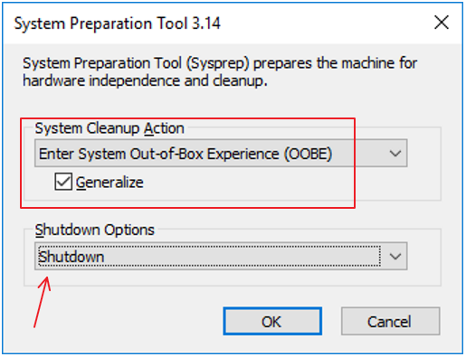

# OS start-up – Computer restarted unexpectedly or encountered an unexpected error

This article provides steps to resolve issues where the virtual machine (VM) experiences an unexpected restart or error while installing Windows.

## Symptom

When you use [Boot diagnostics](./boot-diagnostics.md) to view the screenshot of the VM, you'll see that the screenshot displays Windows installation failing with the following error:

**The computer restarted unexpectedly or encountered an unexpected error. Windows installation cannot proceed. To install Windows, click "OK" to restart the computer, and then restart the installation.**

 

## Cause

The machine is attempting to do an initial boot of a [generalized image](/windows-hardware/manufacture/desktop/sysprep--generalize--a-windows-installation), but encounters trouble due to a custom answer file (Unattend.xml) being processed. **Custom answer files are not supported in Azure**. 

The answer file is a special XML file that contains setting definitions and values for the configuration settings you want to automate during the installation of a Windows Server operating system installation. The configuration options include instructions on how to partition disks, where to find the Windows image to be installed, product keys to apply, and other commands you would like to run.

Again, custom answer files are not supported in Azure. Thus, this situation occurs when an image was prepared for use in Azure, but you specified a custom Unattend.xml file by using **SYSPREP** with a flag similar to the following command:

`sysprep /oobe /generalize /unattend:<your file’s name> /shutdown`

In Azure, use the **Enter System Out-of-Box Experience (OOBE)** option in **System Preparation tool GUI**, or use `sysprep /oobe` rather than the Unattend.xml file.

This issue is most often created while you are using sysprep with an on-premises VM to upload a generalized VM to Azure. In this situation, you may also be interested in how to properly upload a generalized VM.

## Solution

### Do not use Unattend.xml

To fix this issue, follow [the Azure guidance on preparing/capturing an image](../windows/upload-generalized-managed.md) and prepare a new generalized image. During sysprep, **do not use `/unattend:<your file’s name>` flag**. Instead, use only the flags below:

`sysprep /oobe /generalize /shutdown`

- Out-of-box-experience (OOBE) is the supported setting for Azure VMs.

You may also use the **System Preparation tool GUI** to accomplish the same task as the command above by selecting the options shown below:

- Enter Out-of-Box-Experience
- Generalize
- Shutdown
 

