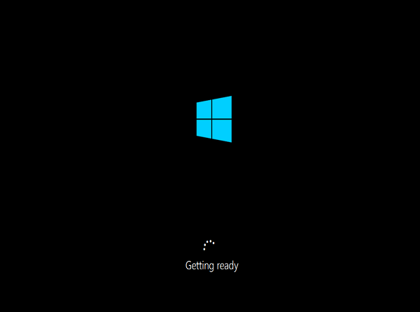
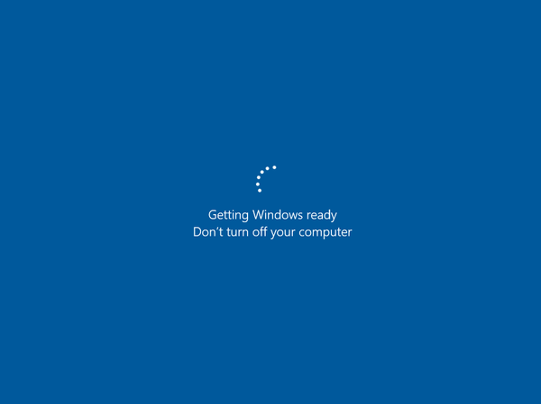

# VM startup is stuck on "Getting Windows ready. Don't turn off your computer" in Azure

This article helps you resolve the issue when your virtual machine (VM) is stuck on the "Getting Windows Ready. Don't turn off your computer" stage during startup.

[!INCLUDE [updated-for-az.md](../../../includes/updated-for-az.md)]

## Symptoms

When you use **Boot diagnostics** to get the screenshot of a VM, the operating system doesn't fully start up. The VM displays the message "Getting Windows ready. Don't turn off your computer."





## Cause

Usually this issue occurs when the server is doing the final reboot after the configuration was changed. The configuration change might be initialized by Windows updates or by the changes on the roles/feature of the server. For Windows Update, if the size of the updates was large, the operating system needs more time to reconfigure the changes.

## Back up the OS disk

Before you try to fix the issue, back up the OS disk.

### For VMs with an encrypted disk, you must unlock the disks first

Follow these steps to determine whether the VM is an encrypted VM.

1. On the Azure portal, open your VM, and then browse to the disks.

2. Look at the **Encryption** column to see whether encryption is enabled.

If the OS disk is encrypted, unlock the encrypted disk. To unlock the disk, follow these steps.

1. Create a Recovery VM that's located in the same Resource Group, Storage Account, and Location as the affected VM.

2. In the Azure portal, delete the affected VM and keep the disk.

3. Run PowerShell as an administrator.

4. Run the following cmdlet to get the secret name.

    ```Powershell
    Login-AzAccount
 
    $vmName = “VirtualMachineName”
    $vault = “AzureKeyVaultName”
 
    # Get the Secret for the C drive from Azure Key Vault
    Get-AzureKeyVaultSecret -VaultName $vault | where {($_.Tags.MachineName -eq $vmName) -and ($_.Tags.VolumeLetter -eq “C:\”) -and ($_.ContentType -eq ‘BEK‘)}

    # OR Use the below command to get BEK keys for all the Volumes
    Get-AzureKeyVaultSecret -VaultName $vault | where {($_.Tags.MachineName -eq   $vmName) -and ($_.ContentType -eq ‘BEK’)}
    ```

5. After you have the secret name, run the following commands in PowerShell.

    ```Powershell
    $secretName = 'SecretName'
    $keyVaultSecret = Get-AzureKeyVaultSecret -VaultName $vault -Name $secretname
    $bekSecretBase64 = $keyVaultSecret.SecretValueText
    ```

6. Convert the Base64-encoded value to bytes, and write the output to a file. 

    > [!Note]
    > If you use the USB unlock option, the BEK file name must match the original BEK GUID. Create a folder on your C drive named "BEK" before you follow these steps.
    
    ```Powershell
    New-Item -ItemType directory -Path C:\BEK
    $bekFileBytes = [Convert]::FromBase64String($bekSecretbase64)
    $path = “c:\BEK\$secretName.BEK”
    [System.IO.File]::WriteAllBytes($path,$bekFileBytes)
    ```

7. After the BEK file is created on your PC, copy the file to the recovery VM you have the locked OS disk attached to. Run the following commands by using the BEK file location.

    ```Powershell
    manage-bde -status F:
    manage-bde -unlock F: -rk C:\BEKFILENAME.BEK
    ```
    **Optional**: In some scenarios, it might be necessary to decrypt the disk by using this command.
   
    ```Powershell
    manage-bde -off F:
    ```

    > [!Note]
    > The previous command assumes the disk to encrypt is on letter F.

8. If you need to collect logs, go to the path **DRIVE LETTER:\Windows\System32\winevt\Logs**.

9. Detach the drive from the recovery machine.

### Create a snapshot

To create a snapshot, follow the steps in [Snapshot a disk](../windows/snapshot-copy-managed-disk.md).

## Collect an OS memory dump

Use the steps in the [Collect os dump](troubleshoot-common-blue-screen-error.md#collect-memory-dump-file) section to collect an OS dump when the VM is stuck at configuration.

## Contact Microsoft support

After you collect the dump file, contact [Microsoft support](https://portal.azure.com/?#blade/Microsoft_Azure_Support/HelpAndSupportBlade) to analyze the root cause.


## Rebuild the VM by using PowerShell

After you collect the memory dump file, follow these steps to rebuild the VM.

**For non-managed disks**

```powershell
# To log in to Azure Resource Manager
Login-AzAccount

# To view all subscriptions for your account
Get-AzSubscription

# To select a default subscription for your current session
Get-AzSubscription –SubscriptionID “SubscriptionID” | Select-AzSubscription

$rgname = "RGname"
$loc = "Location"
$vmsize = "VmSize"
$vmname = "VmName"
$vm = New-AzVMConfig -VMName $vmname -VMSize $vmsize;

$nic = Get-AzNetworkInterface -Name ("NicName") -ResourceGroupName $rgname;
$nicId = $nic.Id;

$vm = Add-AzVMNetworkInterface -VM $vm -Id $nicId;

$osDiskName = "OSdiskName"
$osDiskVhdUri = "OSdiskURI"

$vm = Set-AzVMOSDisk -VM $vm -VhdUri $osDiskVhdUri -name $osDiskName -CreateOption attach -Windows

New-AzVM -ResourceGroupName $rgname -Location $loc -VM $vm -Verbose
```

**For managed disks**

```powershell
# To log in to Azure Resource Manager
Login-AzAccount

# To view all subscriptions for your account
Get-AzSubscription

# To select a default subscription for your current session
Get-AzSubscription –SubscriptionID "SubscriptionID" | Select-AzSubscription

#Fill in all variables
$subid = "SubscriptionID"
$rgName = "ResourceGroupName";
$loc = "Location";
$vmSize = "VmSize";
$vmName = "VmName";
$nic1Name = "FirstNetworkInterfaceName";
#$nic2Name = "SecondNetworkInterfaceName";
$avName = "AvailabilitySetName";
$osDiskName = "OsDiskName";
$DataDiskName = "DataDiskName"

#This can be found by selecting the Managed Disks you wish you use in the Azure portal if the format below doesn't match
$osDiskResourceId = "/subscriptions/$subid/resourceGroups/$rgname/providers/Microsoft.Compute/disks/$osDiskName";
$dataDiskResourceId = "/subscriptions/$subid/resourceGroups/$rgname/providers/Microsoft.Compute/disks/$DataDiskName";

$vm = New-AzVMConfig -VMName $vmName -VMSize $vmSize;

#Uncomment to add Availability Set
#$avSet = Get-AzAvailabilitySet –Name $avName –ResourceGroupName $rgName;
#$vm = New-AzVMConfig -VMName $vmName -VMSize $vmSize -AvailabilitySetId $avSet.Id;

#Get NIC Resource Id and add
$nic1 = Get-AzNetworkInterface -Name $nic1Name -ResourceGroupName $rgName;
$vm = Add-AzVMNetworkInterface -VM $vm -Id $nic1.Id -Primary;

#Uncomment to add a secondary NIC
#$nic2 = Get-AzNetworkInterface -Name $nic2Name -ResourceGroupName $rgName;
#$vm = Add-AzVMNetworkInterface -VM $vm -Id $nic2.Id;

#Windows VM
$vm = Set-AzVMOSDisk -VM $vm -ManagedDiskId $osDiskResourceId -name $osDiskName -CreateOption Attach -Windows;

#Linux VM
#$vm = Set-AzVMOSDisk -VM $vm -ManagedDiskId $osDiskResourceId -name $osDiskName -CreateOption Attach -Linux;

#Uncomment to add additional Data Disk
#Add-AzVMDataDisk -VM $vm -ManagedDiskId $dataDiskResourceId -Name $dataDiskName -Caching None -DiskSizeInGB 1024 -Lun 0 -CreateOption Attach;

New-AzVM -ResourceGroupName $rgName -Location $loc -VM $vm;
```
