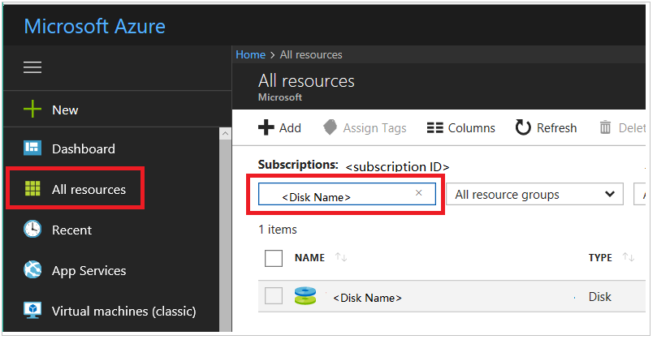

# Troubleshoot a problem Azure VM by using nested virtualization in Azure

This article shows how to create a nested virtualization environment in Microsoft Azure, so you can mount the disk of the problem VM on the Hyper-V host (Rescue VM) for troubleshooting purposes.

## Prerequisites

To mount the problem VM, the Rescue VM must meet the following prerequisites:

-   The Rescue VM must be in the same location as the problem VM.

-   The Rescue VM must be in the same resource group as the problem VM.

-   The Rescue VM must use the same type of Storage Account (Standard or Premium) as the problem VM.

## Step 1: Create a Rescue VM and install Hyper-V role

1.  Create a new Rescue VM:

    -  Operating system: Windows Server 2016 Datacenter

    -  Size: Any V3 series with at least two cores that support nested virtualization. For more information, see [Introducing the new Dv3 and Ev3 VM sizes](https://azure.microsoft.com/blog/introducing-the-new-dv3-and-ev3-vm-sizes/).

    -  Same location, Storage Account, and Resource Group as the problem VM.

    -  Select the same storage type as the problem VM (Standard or Premium).

2.  After the Rescue VM is created, remote desktop to the Rescue VM.

3.  In Server Manager, select **Manage** > **Add Roles and Features**.

4.  In the **Installation Type** section, select **Role-based or feature-based installation**.

5.  In the **Select destination server** section, make sure that the Rescue VM is selected.

6.  Select the **Hyper-V role** > **Add Features**.

7.  Select **Next** on the **Features** section.

8.  If a virtual switch is available, select it. Otherwise select **Next**.

9.  On the **Migration** section, select **Next**

10. On the **Default Stores** section, select **Next**.

11. Check the box to restart the server automatically if required.

12. Select **Install**.

13. Allow the server to install the Hyper-V role. This takes a few minutes and the server will reboot automatically.

## Step 2: Create the problem VM on the Rescue VM’s Hyper-V server

1.  Record the name of the disk in the problem VM, and then delete the problem VM. Make sure that you keep all attached disks. 

2.  Attach the OS disk of your problem VM as a data disk of the Rescue VM.

    1.  After the problem VM is deleted, go to the Rescue VM.

    2.  Select **Disks**, and then **Add data disk**.

    3.  Select the problem VM’s disk, and then select **Save**.

3.  After the disk has successfully attached, remote desktop to the Rescue VM.

4.  Open Disk Management (diskmgmt.msc). Make sure that the disk of the problem VM is set to **Offline**.

5.  Open Hyper-V Manager: In **Server Manager**, select the **Hyper-V role**. Right-click the server, and then select the **Hyper-V Manager**.

6.  In the Hyper-V Manager, right-click the Rescue VM, and then select **New** > **Virtual Machine** > **Next**.

7.  Type a name for the VM, and then select **Next**.

8.  Select **Generation 1**.

9.  Set the startup memory at 1024 MB or more.

10. If applicable select the Hyper-V Network Switch that was created. Else move to the next page.

11. Select **Attach a virtual hard disk later**.

    

12. Select **Finish** when the VM is created.

13. Right-click the VM that you created, and then select **Settings**.

14. Select **IDE Controller 0**, select **Hard Drive**, and then click **Add**.

        

15. In **Physical Hard Disk**, select the disk of the problem VM that you attached to the Azure VM. If you do not see any disks listed, check if the disk is set to offline by using Disk management.

      

17. Select **Apply**, and then select **OK**.

18. Double-click on the VM, and then start it.

19. Now you can work on the VM as the on-premises VM. You could follow any troubleshooting steps you need.

## Step 3: Re-create your Azure VM in Azure

1.  After you get the VM back online, shut down the VM in the Hyper-V manager.

2.  Go to the [Azure portal](https://portal.azure.com) and select the Rescue VM > Disks,  copy the name of the disk. You will use the name in the next step. Detach the fixed disk from the Rescue VM.

3.  Go to **All resources**, search for the disk name, and then select the disk.

          

4. Click **Create VM**.

      

You can also use Azure PowerShell to create the VM from the disk. For more information, see [Create the new VM from an existing disk by using PowerShell](../windows/create-vm-specialized.md#create-the-new-vm). 

## Next steps

If you are having issues connecting to your VM, see [Troubleshoot RDP connections to an Azure VM](troubleshoot-rdp-connection.md). For issues with accessing applications running on your VM, see [Troubleshoot application connectivity issues on a Windows VM](troubleshoot-app-connection.md).
