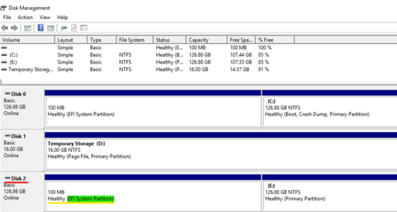
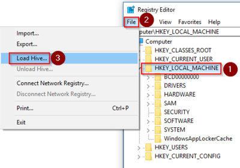
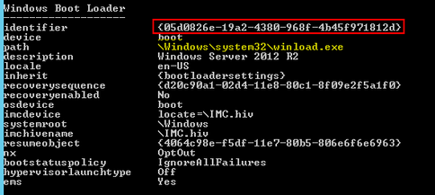

# Windows stop error - Status No Memory

This article provides steps to resolve issues where Windows fails to start and displays the status or error code #0xC0000017, also known as “Status No Memory”.

## Symptom

When you use [Boot diagnostics](https://docs.microsoft.com/azure/virtual-machines/troubleshooting/boot-diagnostics) to view the screenshot of the virtual machine (VM), you'll see that the screenshot displays the error code: `0xC0000017`. Depending upon the version of Windows you're running, you may see this code displayed in either the **Windows Boot Manager** or in the **Recovery screen**.

   **Windows Boot Manager**

   

   **Recovery Screen**
 
   

## Cause

The operating system’s disk is either full, too fragmented, or the operating system (OS) isn't able to access the memory or page file, or both.

## Solution

### Process Overview:

1. Create and Access a Repair VM
1. Free Up Space on the Disk
1. Clean out bad memory from the BCD Store
1. Restore the Page File to its default location
1. Enable serial console and memory dump collection
1. Rebuild the VM

> [!NOTE]
> When encountering this error, the Guest OS isn't operational. You'll be troubleshooting in offline mode to resolve this issue.

### Create and access a repair VM

1. Use [steps 1-3 of the VM Repair Commands](https://docs.microsoft.com/azure/virtual-machines/troubleshooting/repair-windows-vm-using-azure-virtual-machine-repair-commands) to prepare a Repair VM.
1. Using Remote Desktop Connection connect to the Repair VM.

### For Generation 2 VMs, assign a letter to the Extensible Firmware Interface (EFI) partition:

If you're using a Generation 2 VM, the EFI partition of the attached disk may not have a letter assigned to it. You'll need to follow the steps below to assign a letter to the partition before proceeding with this troubleshooting guide.

1. In Windows search, enter `diskmgmt` and open the **Disk Management console**.
1. Identify the broken disk attached to the repair VM. Typically, this disk is listed last in the console, and has the highest numerical value.
1. Note if in that disk there's a partition that holds the **EFI System Partition**, which also doesn’t have a letter value assigned to it (such as drive *F:*). If all partitions are assigned, you may skip ahead to free up space on the disk. Otherwise, continue to assign a letter to this disk.

   

1. Open an elevated command prompt as an administrator and enter `diskpart` to launch the **DISKPART** tool.
1. Enter the following commands:

   ```
   list disk
   sel disk <NUMBER OF THE ATTACHED DISK>
   list partition
   sel partition <NUMBER OF THE SYSTEM (EFI) PARTION>
   assign
   ```
   
   - In the command, replace `<NUMBER OF THE ATTACHED DISK>` with the disk number you identified in step 2.
   - In the command, replace `<NUMBER OF THE SYSTEM PARTION>` with the partition number of the EFI system partition. This partition has not been assigned a letter yet, but it should be of the type **System** and be about 100MB in size.

   > [!NOTE]
   > Comparing the partitions in the Disk Management console with those listed in the DISKPART tool, may be helpful in determining which partition number corresponds to the EFI system partition in the attached disk.

1. Close the command prompt window.

### Free up space on the disk

Now that the broken disk is attached to the repair VM, you should verify that the OS on that disk has enough space to function properly. 

1. Check if the disk is full by right-clicking on the drive of the attached disk and selecting **Properties**.
1. If the disk has **less than 300 Mb of free space**, [expand it to a maximum of 1 Tb using PowerShell](https://docs.microsoft.com/azure/virtual-machines/windows/expand-os-disk).
1. Once the disk size is **1 Tb**, you'll need to perform a disk cleanup. You can use the [Disk Cleanup tool](https://support.microsoft.com/help/4026616/windows-10-disk-cleanup) to free up space.
1. Open an elevated command prompt (run as administrator) instance and perform a de-fragmentation on the drive:

   ``
   defrag <LETTER ASSIGNED TO THE OS DISK>: /u /x /g
   ``
   
   - Depending upon the level of fragmentation, de-fragmentation could take hours.
   - In the command, replace `<LETTER ASSIGNED TO THE OS DISK>` with the OS disk’s letter (such as drive *F:*).

### Clean out bad memory from the Boot Configuration Data (BCD) store

1. Open an elevated command prompt (run as administrator).
1. Query the boot configuration file for bad memory flags with the following command:

   ``
   bcdedit /store <LETTER ASSIGNED TO THE OS DISK>:\boot\bcd /enum {badmemory}
   ``
   
   - In the command, replace `<LETTER ASSIGNED TO THE OS DISK>` with the OS disk’s letter (such as drive *F:*).

1. If the query shows no bad memory blocks, skip ahead to the next task. Otherwise, continue to step 4.
1. If bad memory blocks are identified, these blocks are preventing the creation of a ramdisk and should be deleted with the following command:

   ``
   bcdedit /store <LETTER ASSIGNED TO THE OS DISK>:\boot\bcd /deletevalue {badmemory} badmemorylist
   ``
   
   - In the command, replace `<LETTER ASSIGNED TO THE OS DISK>` with the OS disk’s letter (such as drive *F:*).

### Restore the page file to its default location

The page file stores data that cannot be held by your computer’s random-access memory (RAM) as a form of overflow/backup. It is possible that the file is hosted in a VHD rather than the temp drive, which is the default Azure location. If true, the file may not be accessible, and should be restored to the default location.

Before taking any steps, you should create a copy of the **\windows\system32\config** folder on a healthy disk. This step ensures that can undo any unwanted changes. You'll be working on important system files, so this precaution is highly recommended.

1. In Windows search, enter **regedit** and open the Registry Editor application.
1. In the Registry Editor, highlight the key **HKEY_LOCAL_MACHINE** and select **File > Load Hive...** from the menu.

   

1. In the Load Hive dialog, select **\windows\system32\config\SYSTEM** and click Open.
   1. You'll be prompted for a name, which you should enter **BROKENSYSTEM**. This name will help differentiate the affected hives while you're troubleshooting.
   1. Expand **HKEY_LOCAL_MACHINE** to see the new BROKENSYSTEM key you have added.
1. Using the Registry Editor, determine which ControlSet the machine is booting from.
   1. Navigate to **HKEY_LOCAL_MACHINE >> BROKENSYSTEM >> Select**.
   1. In the keys listed, note the data value of Current. For example, if this value is **1** or **0x00000001 (1)**, then the control set would be ControlSet001.
1. Check the location where the PageFile creation is configured.
   1. While in HKEY_LOCAL_MACHINE\BROKENSYSTEM, expand the directory matching the ControlSet number you identified in step 4, such as **ControlSet001**.
   1. Navigate to **Control >> Session Manager >> Memory Management** and note the location of the **ExistingPageFiles** key.
   1. This key should be in the default Azure location of the Temp drive. If it isn’t there and is in a VHD in another location, such as the data disk drive or OS drive, then it will need to be deleted.
   1. Browse to that location in File Explorer and then delete the **pagefile.sys** file.

### Enable the Serial Console and memory dump collection

**Recommended**: Before you rebuild the VM, enable the Serial Console and memory dump collection by running the following script:

To enable memory dump collection and Serial Console, run the following script:

1. Open an elevated command prompt session as an Administrator.
1. List the BCD store data and determine the boot loader identifier, which you'll use in the next step.

   1. For a Generation 1 VM, enter the following command and note the identifier listed:
   
      ``
      bcdedit /store <BOOT PARTITON>:\boot\bcd /enum
      ``
   
   - In the command, replace `<BOOT PARTITON>` with the letter of the partition in the attached disk that contains the boot folder.

      

   1. For a Generation 2 VM, enter the following command and note the identifier listed:
   
      ``
      bcdedit /store <LETTER OF THE EFI SYSTEM PARTITION>:EFI\Microsoft\boot\bcd /enum
      ``
   
   - In the command, replace `<LETTER OF THE EFI SYSTEM PARTITION>` with the letter of the EFI System Partition.
   - It may be helpful to launch the Disk Management console to identify the appropriate system partition labeled as **EFI System Partition**.
   - The identifier may be a unique GUID or it could be the default **bootmgr**.

1. Run the following commands to enable Serial Console:

   ```
   bcdedit /store <VOLUME LETTER WHERE THE BCD FOLDER IS>:\boot\bcd /ems {<BOOT LOADER IDENTIFIER>} ON 
   bcdedit /store <VOLUME LETTER WHERE THE BCD FOLDER IS>:\boot\bcd /emssettings EMSPORT:1 EMSBAUDRATE:115200
   ```
   
   - In the command, replace `<VOLUME LETTER WHERE THE BCD FOLDER IS>` with the letter of the BCD folder.
   - In the command, replace `<BOOT LOADER IDENTIFIER>` with the identifier you found in the previous step.

1. Verify that the free space on the OS disk is larger than the memory size (RAM) on the VM.

   If there's not enough space on the OS disk, change the location where the memory dump file will be created, and refer that location to any data disk attached to the VM that has enough free space. To change the location, replace **%SystemRoot%** with the drive letter of the data disk, such as drive **F:**, in the following commands.

   Suggested configuration to enable OS Dump:

   **Load Registry Hive from the broken OS Disk:**

   ```
   REG LOAD HKLM\BROKENSYSTEM <VOLUME LETTER OF BROKEN OS DISK>:\windows\system32\config\SYSTEM
   ```

   **Enable on ControlSet001:**

   ```
   REG ADD "HKLM\BROKENSYSTEM\ControlSet001\Control\CrashControl" /v CrashDumpEnabled /t REG_DWORD /d 1 /f 
   REG ADD "HKLM\BROKENSYSTEM\ControlSet001\Control\CrashControl" /v DumpFile /t REG_EXPAND_SZ /d "%SystemRoot%\MEMORY.DMP" /f 
   REG ADD "HKLM\BROKENSYSTEM\ControlSet001\Control\CrashControl" /v NMICrashDump /t REG_DWORD /d 1 /f 
   ```

   **Enable on ControlSet002:**

   ```
   REG ADD "HKLM\BROKENSYSTEM\ControlSet002\Control\CrashControl" /v CrashDumpEnabled /t REG_DWORD /d 1 /f 
   REG ADD "HKLM\BROKENSYSTEM\ControlSet002\Control\CrashControl" /v DumpFile /t REG_EXPAND_SZ /d "%SystemRoot%\MEMORY.DMP" /f 
   REG ADD "HKLM\BROKENSYSTEM\ControlSet002\Control\CrashControl" /v NMICrashDump /t REG_DWORD /d 1 /f 
   ```

   **Unload Broken OS Disk:**

   ```
   REG UNLOAD HKLM\BROKENSYSTEM
   ```
   
### Rebuild the VM

Use [step 5 of the VM Repair Commands](https://docs.microsoft.com/azure/virtual-machines/troubleshooting/repair-windows-vm-using-azure-virtual-machine-repair-commands#repair-process-example) to rebuild the VM.
