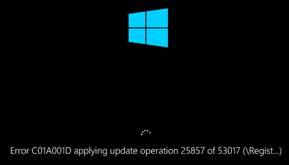

# Troubleshoot OS start up – Windows Update installation capacity

This article provides steps to resolve issues in an Azure virtual machine (VM) where Windows Update (KB) gets an error and becomes unresponsive.

## Symptom

When you use Boot diagnostics to view the screenshot of the VM, you will see that the screenshot displays Windows Update (KB) in progress, but failing with the error code: **C01A001D**. The following image shows Windows Update (KB) stuck with the message “Error C01A001D applying update operation ##### of ##### (######)”:



## Cause

In this situation, the operating system (OS) is unable to complete a Windows Update (KB) installation as a core file can't be created on the file system. Based on this error code, the operating system is unable to write any files to the disk.

## Solution

### Process Overview:

1. Create and access a Repair VM.
1. Free space on disk.
1. Enable serial console and memory dump collection.
1. Rebuild the VM.

> [!NOTE]
> When encountering this error, the Guest OS is not operational. Troubleshoot this issue in offline mode to resolve this issue.

### Create and Access a Repair VM

1. Use steps 1-3 of the [VM Repair Commands](https://docs.microsoft.com/azure/virtual-machines/troubleshooting/repair-windows-vm-using-azure-virtual-machine-repair-commands) to prepare a Repair VM.
1. Using Remote Desktop Connection, connect to the Repair VM.

### Free Up Space on the disk

To solve the issue:

- Resize the disk up to 1 TB if it is not already at the maximum size of 1 TB.
- Perform a disk cleanup.
- De-fragment the drive.

1. Check if the disk is full. If the disk size is below 1 TB, expand it up to a maximum of 1 TB [using PowerShell](https://docs.microsoft.com/azure/virtual-machines/windows/expand-os-disk).
1. If the disk is already 1 TB, you will need to perform a disk cleanup.
   1. Detach the data disk [from the broken VM](https://docs.microsoft.com/azure/virtual-machines/windows/detach-disk).
   1. Attach the data disk [to a functioning VM](https://docs.microsoft.com/azure/virtual-machines/windows/attach-disk-ps#attach-an-existing-data-disk-to-a-vm).
   1. Use the [Disk Cleanup tool](https://support.microsoft.com/help/4026616/windows-10-disk-cleanup) to free up space.
1. Once resizing and clean-up are finished, de-fragment the drive using the following command:

   ```
   defrag <LETTER ASSIGN TO THE OS DISK>: /u /x /g
   ```
   
Depending upon the level of fragmentation, de-fragmentation could take several hours.

### Enable the Serial Console and memory dump collection

**Recommended**: Before you rebuild the VM, enable the Serial Console and memory dump collection by running the following script:

1. Open an elevated command prompt session as an Administrator.
1. Run the following commands:

   **Enable the Serial Console**:
   
   ```
   bcdedit /store <VOLUME LETTER WHERE THE BCD FOLDER IS>:\boot\bcd /ems {<BOOT LOADER IDENTIFIER>} ON 
   bcdedit /store <VOLUME LETTER WHERE THE BCD FOLDER IS>:\boot\bcd /emssettings EMSPORT:1 EMSBAUDRATE:115200
   ```

1. Verify that the free space on the OS disk is larger than the memory size (RAM) on the VM.

   If there's not enough space on the OS disk, change the location where the memory dump file will be created, and refer that location to any data disk attached to the VM that has enough free space. To change the location, replace **%SystemRoot%** with the drive letter of the data disk, such as **F:**, in the following commands.

   Suggested configuration to enable OS Dump:

    **Load the broken OS Disk:**

   ```
   REG LOAD HKLM\BROKENSYSTEM <VOLUME LETTER OF BROKEN OS DISK>:\windows\system32\config\SYSTEM 
   ```
   
   **Enable on ControlSet001**:

   ```
   REG ADD "HKLM\BROKENSYSTEM\ControlSet001\Control\CrashControl" /v CrashDumpEnabled /t REG_DWORD /d 1 /f 
   REG ADD "HKLM\BROKENSYSTEM\ControlSet001\Control\CrashControl" /v DumpFile /t REG_EXPAND_SZ /d "%SystemRoot%\MEMORY.DMP" /f 
   REG ADD "HKLM\BROKENSYSTEM\ControlSet001\Control\CrashControl" /v NMICrashDump /t REG_DWORD /d 1 /f
   ```
   
   **Enable on ControlSet002**:

   ```
   REG ADD "HKLM\BROKENSYSTEM\ControlSet002\Control\CrashControl" /v CrashDumpEnabled /t REG_DWORD /d 1 /f 
   REG ADD "HKLM\BROKENSYSTEM\ControlSet002\Control\CrashControl" /v DumpFile /t REG_EXPAND_SZ /d "%SystemRoot%\MEMORY.DMP" /f 
   REG ADD "HKLM\BROKENSYSTEM\ControlSet002\Control\CrashControl" /v NMICrashDump /t REG_DWORD /d 1 /f
   ```
   
   **Unload Broken OS Disk**:

   ```
   REG UNLOAD HKLM\BROKENSYSTEM
   ```
   
### Rebuild the VM

Use [step 5 of the VM Repair Commands](https://docs.microsoft.com/azure/virtual-machines/troubleshooting/repair-windows-vm-using-azure-virtual-machine-repair-commands#repair-process-example) to rebuild the VM.
