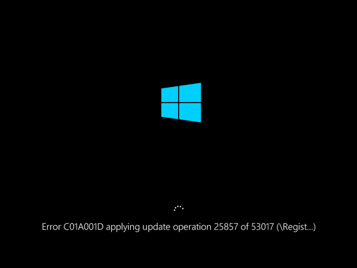

# VM is unresponsive with "C01A001D" error when applying Windows Update

This article provides steps to resolve issues where Windows Update (KB) generates an error and becomes unresponsive in an Azure VM.

## Symptoms

When using [Boot diagnostics](https://docs.microsoft.com/azure/virtual-machines/troubleshooting/boot-diagnostics) to view the screenshot of the VM, the Windows Update (KB) in progress is displayed, but fails with error code: 'C01A001D'.



## Cause

A core file can't be created in the file system. The operating system is unable to write files to the disk.

## Resolution

### Process overview

1. [Create and access a repair VM](#create-and-access-a-repair-vm).
2. [Free up space on the hard disk](#free-up-space-on-the-hard-disk).
3. [Recommended: Before rebuilding the VM, enable serial console and memory dump collection](#recommended-before-rebuilding-the-vm-enable-serial-console-and-memory-dump-collection).
4. [Rebuild the VM](#rebuild-the-vm).

> [!NOTE]
> When this error occurs, the Guest OS isn't operational. You must troubleshoot in offline mode to resolve this issue.

### Create and access a repair VM

1. Follow [steps 1-3 of the VM Repair Commands](https://docs.microsoft.com/azure/virtual-machines/troubleshooting/repair-windows-vm-using-azure-virtual-machine-repair-commands) to prepare a Repair VM.
2. Connect to the Repair VM using Remote Desktop Connection.

### Free up space on the hard disk

If the disk isn't already 1 Tb, you must resize it. Once the disk is 1 TB, perform a disk cleanup and a defragmentation of the drive.

1. Check if the disk is full. If the disk is below 1 Tb, [expand it to a maximum of 1 Tb using PowerShell](https://docs.microsoft.com/azure/virtual-machines/windows/expand-os-disk?toc=%2Fazure%2Fvirtual-machines%2Fwindows%2Ftoc.json).
2. Once the disk is 1 Tb, perform a disk cleanup.
    - [Detach the data disk from the broken VM](https://docs.microsoft.com/azure/virtual-machines/windows/detach-disk).
    - [Attach the data disk to a functioning VM](https://docs.microsoft.com/azure/virtual-machines/windows/attach-disk-ps#attach-an-existing-data-disk-to-a-vm).
    - Use the [Disk Cleanup tool](https://support.microsoft.com/help/4026616/windows-10-disk-cleanup) to free up space.
3. After resizing and cleanup, defragment the drive:

    ```
    defrag <LETTER ASSIGN TO THE OS DISK>: /u /x /g
    ```
    Depending on the level of fragmentation, this could take hours.

### Recommended: Before rebuilding the VM, enable serial console and memory dump collection

1. Open an elevated command prompt session (Run as administrator).
2. Run the following commands:

    Enable Serial Console:

    ```
    bcdedit /store <VOLUME LETTER WHERE THE BCD FOLDER IS>:\boot\bcd /ems {<BOOT LOADER IDENTIFIER>} ON
    bcdedit /store <VOLUME LETTER WHERE THE BCD FOLDER IS>:\boot\bcd /emssettings EMSPORT:1 EMSBAUDRATE:115200
    ```
3. Make sure the free space on the OS disk is at least equal to the VM memory (RAM) size.

    If there isn't enough space on the OS disk, change the location where the memory dump file will be created and refer it to a data disk attached to the VM and with sufficient free space. To change the location, replace `%SystemRoot%` with the drive letter (for example "F:") of the data disk in the below commands:

    **Enable OS dump suggested configuration:**

    Load Broken OS Disk:

    ```
    REG LOAD HKLM\BROKENSYSTEM <VOLUME LETTER OF BROKEN OS DISK>:\windows\system32\config\SYSTEM
    ```

    Enable on ControlSet001:

    ```
    REG ADD "HKLM\BROKENSYSTEM\ControlSet001\Control\CrashControl" /v CrashDumpEnabled /t REG_DWORD /d 1 /f
    REG ADD "HKLM\BROKENSYSTEM\ControlSet001\Control\CrashControl" /v DumpFile /t REG_EXPAND_SZ /d "%SystemRoot%\MEMORY.DMP" /f
    REG ADD "HKLM\BROKENSYSTEM\ControlSet001\Control\CrashControl" /v NMICrashDump /t REG_DWORD /d 1 /f
    ```

    Enable on ControlSet002:

    ```
    REG ADD "HKLM\BROKENSYSTEM\ControlSet002\Control\CrashControl" /v CrashDumpEnabled /t REG_DWORD /d 1 /f 
    REG ADD "HKLM\BROKENSYSTEM\ControlSet002\Control\CrashControl" /v DumpFile /t REG_EXPAND_SZ /d "%SystemRoot%\MEMORY.DMP" /f
    REG ADD "HKLM\BROKENSYSTEM\ControlSet002\Control\CrashControl" /v NMICrashDump /t REG_DWORD /d 1 /f
    ```

    Unload broken OS disk:

    ```
    REG UNLOAD HKLM\BROKENSYSTEM
    ```

### Rebuild the VM

Use [step 5 of the VM repair commands](https://docs.microsoft.com/azure/virtual-machines/troubleshooting/repair-windows-vm-using-azure-virtual-machine-repair-commands#repair-process-example) to reassemble the VM.
