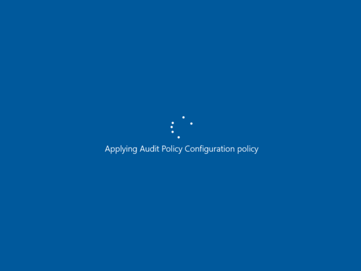
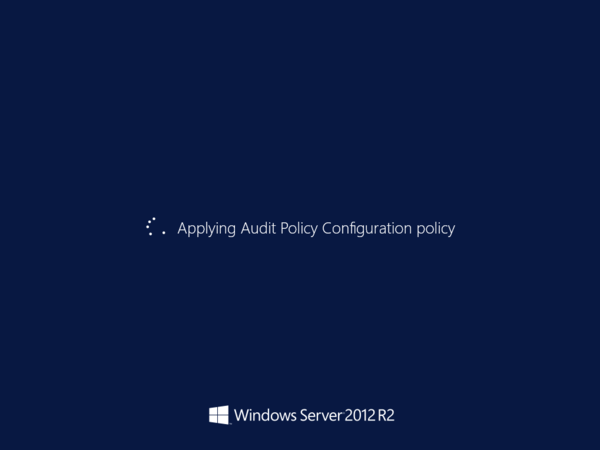
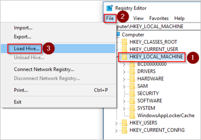
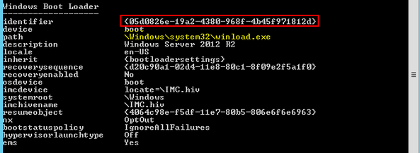

# Virtual machine is unresponsive while applying audit policy configuration policy

This article provides steps to resolve issues where the virtual machine (VM) becomes unresponsive while applying the Audit Policy Configuration policy, which prevents the booting of an Azure VM.

## Symptom

When you use [Boot diagnostics](./boot-diagnostics.md) to view the screenshot of the VM, you will see that the screenshot displays that the operating system (OS) was unresponsive during a boot with the message **Applying Audit Policy Configuration policy**.

  

  

## Cause

There are conflicting locks when the policy attempts to clean up old user profiles.

> [!NOTE]
> This applies only to Windows Server 2012 and Windows Server 2012 R2.

Here’s the problematic policy:
*Computer Configuration\Policies\Administrative Templates\System/User Profiles\Delete user profiles older than a specified number of days on system restart.*

## Solution

### Process overview

1. Create and Access a Repair VM.
1. Disable the policy.
1. Enable serial console and memory dump collection.
1. Rebuild the VM.
1. Collect the memory dump file and submit a support ticket.

### Create and access a repair VM

1. Use steps 1-3 of the [VM Repair Commands](./repair-windows-vm-using-azure-virtual-machine-repair-commands.md) to prepare a Repair VM.
1. Using Remote Desktop Connection, connect to the Repair VM.

### Disable the policy

1. On the repair VM, open the **Registry Editor**.
1. Locate the key **HKEY_LOCAL_MACHINE** and select **File > Load Hive** from the menu.

   

   - You can use Load Hive to load registry keys from an offline system. In this case, the system is the broken disk attached to the repair VM.
   - System-wide settings are stored on **HKEY_LOCAL_MACHINE** and can be abbreviated as **HKLM**.

1. In the attached disk, open the `\windows\system32\config\SOFTWARE` file.

   - When you're prompted for a name, enter **BROKENSOFTWARE**.
   - To verify that **BROKENSOFTWARE** was loaded, expand **HKEY_LOCAL_MACHINE** and look for the added **BROKENSOFTWARE** key.

1. Go to **BROKENSOFTWARE** and check if the **CleanupProfiles** key exists in the loaded hive.

   - If the key exists, the **CleanupProfiles** policy is set. Its value represents the retention policy measured in days.
   - If the key doesn't exist, the **CleanupProfiles** policy isn't set. In this situation, skip ahead to [submit a support ticket with a memory dump file](#collect-the-memory-dump-file-and-submit-a-support-ticket).

1. Delete the **CleanupProfiles** key by using this command:

   `reg delete "HKLM\BROKENSOFTWARE\Policies\Microsoft\Windows\System" /v CleanupProfiles /f`

1. Unload the **BROKENSOFTWARE** hive by using this command:

   `reg unload HKLM\BROKENSOFTWARE`

### Enable the serial console and memory dump collection

**Recommended**: Before you rebuild the VM, enable the Serial Console and memory dump collection by running the following script:

1. Open an elevated command prompt session as an Administrator.
1. List the BCD store data and determine the boot loader identifier, which you will use in the next step.

   1. For a Generation 1 VM, enter the following command and note the identifier listed:

      `bcdedit /store <BOOT PARTITON>:\boot\bcd /enum`

      - In the command, replace `<BOOT PARTITON>` with the letter of the partition in the attached disk that contains the boot folder.

        

   1. For a Generation 2 VM, enter the following command and note the identifier listed:

      `bcdedit /store <LETTER OF THE EFI SYSTEM PARTITION>:EFI\Microsoft\boot\bcd /enum`

      - In the command, replace `<LETTER OF THE EFI SYSTEM PARTITION>` with the letter of the EFI System Partition.
      - It may be helpful to launch the Disk Management console to identify the appropriate system partition labeled as **EFI System Partition**.
      - The identifier may be a unique GUID or it could be the default **bootmgr**.

1. Run the following commands:

   **Enable the Serial Console**:
   
   ```
   bcdedit /store <VOLUME LETTER WHERE THE BCD FOLDER IS>:\boot\bcd /ems {<BOOT LOADER IDENTIFIER>} ON 
   bcdedit /store <VOLUME LETTER WHERE THE BCD FOLDER IS>:\boot\bcd /emssettings EMSPORT:1 EMSBAUDRATE:115200
   ```

1. Verify that the free space on the OS disk is larger than the memory size (RAM) on the VM.

   If there's not enough space on the OS disk, change the location where the memory dump file will be created, and refer that location to any data disk attached to the VM that has enough free space. To change the location, replace **%SystemRoot%** with the drive letter of the data disk, such as **F:**, in the following commands.

   Suggested configuration to enable OS Dump:

   **Load Registry Hive from the broken OS Disk:**

   ```
   REG LOAD HKLM\BROKENSYSTEM <VOLUME LETTER OF BROKEN OS DISK>:\windows\system32\config\SYSTEM
   ```

   **Enable on ControlSet001:**

   ```
   REG ADD "HKLM\BROKENSYSTEM\ControlSet001\Control\CrashControl" /v CrashDumpEnabled /t REG_DWORD /d 1 /f 
   REG ADD "HKLM\BROKENSYSTEM\ControlSet001\Control\CrashControl" /v DumpFile /t REG_EXPAND_SZ /d "%SystemRoot%\MEMORY.DMP" /f 
   REG ADD "HKLM\BROKENSYSTEM\ControlSet001\Control\CrashControl" /v NMICrashDump /t REG_DWORD /d 1 /f 
   ```

   **Enable on ControlSet002:**

   ```
   REG ADD "HKLM\BROKENSYSTEM\ControlSet002\Control\CrashControl" /v CrashDumpEnabled /t REG_DWORD /d 1 /f 
   REG ADD "HKLM\BROKENSYSTEM\ControlSet002\Control\CrashControl" /v DumpFile /t REG_EXPAND_SZ /d "%SystemRoot%\MEMORY.DMP" /f 
   REG ADD "HKLM\BROKENSYSTEM\ControlSet002\Control\CrashControl" /v NMICrashDump /t REG_DWORD /d 1 /f 
   ```

   **Unload Broken OS Disk:**

   ```
   REG UNLOAD HKLM\BROKENSYSTEM
   ```
   
### Rebuild the virtual machine

1. Use [step 5 of the VM Repair Commands](./repair-windows-vm-using-azure-virtual-machine-repair-commands.md#repair-process-example) to rebuild the VM.

1. Test if your VM boots normally to see if the issue has fixed the issue.

   - If the issue hasn’t been fixed, then continue to [collect a dump file and submit a support ticket](#collect-the-memory-dump-file-and-submit-a-support-ticket).
   - If the issue has been fixed, then no further steps are necessary.

If the issue was fixed, the policy is now disabled locally. For a permanent solution, don't use the CleanupProfiles policy on VMs, as it will automatically delete user profiles. Use a different method to perform profile cleanups, such as a scheduled task or script.

**Don’t use this policy:**
*Machine\Admin Templates\System\User Profiles\Delete user profiles older than a specified number of days on system restart.*

### The issue should now be fixed

Test your VM to make sure it is functioning like normal. If you are still experiencing issues, then you can continue to the next section for further assistance.

### Collect the memory dump file and submit a support ticket

To resolve this problem, you would need first to gather the memory dump file for the crash and then contact support with the memory dump file. To collect the dump file, follow these steps:

#### Attach the OS disk to a new Repair VM

1. Use steps 1-3 of the [VM Repair Commands](./repair-windows-vm-using-azure-virtual-machine-repair-commands.md) to prepare a new Repair VM.
1. Using Remote Desktop Connection connect to the Repair VM.

#### Locate the dump file and submit a support ticket

1. On the repair VM, go to windows folder in the attached OS disk. If the driver letter that is assigned to the attached OS disk is labeled as *F*, then you need to go to `F:\Windows`.
1. Locate the `memory.dmp` file, and then [submit a support ticket](https://portal.azure.com/?#blade/Microsoft_Azure_Support/HelpAndSupportBlade) with the memory dump file.
1. If you are having trouble locating the `memory.dmp` file, then use [non-maskable interrupt (NMI) calls in serial console](./serial-console-windows.md#use-the-serial-console-for-nmi-calls) instead. Follow the guide to [generate a crash dump file using NMI calls here](/windows/client-management/generate-kernel-or-complete-crash-dump).