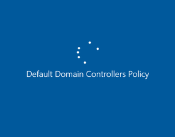

# VM is unresponsive while applying default domain controllers policy

This article provides steps to resolve issues where the Default Domain Controllers Policy prevents the booting of an Azure Virtual Machine (VM).

## Symptom

When you use [Boot diagnostics](https://docs.microsoft.com/azure/virtual-machines/troubleshooting/boot-diagnostics) to view the screenshot of the VM, you will see that the screenshot displays the OS becoming unresponsive while booting with the message **Default Domain Controllers Policy**.

  

## Cause

This issue may be due to recent changes made to the Default Domain Controllers Policy. Otherwise, a memory dump file analysis will need to be performed to determine the root cause.

## Solution

If you have recently made changes to the Default Domain Controllers Policy, you may wish to undo those changes to fix the issue. If you are not sure what is causing the issue, collect a memory dump and then submit a support ticket.

### Collect the memory dump file

To resolve this issue, you should first gather the memory dump file for the crash and then contact support with the memory dump file. To collect the dump file, follow these steps:

### Attach the OS disk to a new Repair VM

1. Use steps 1-3 of the [VM Repair Commands](https://docs.microsoft.com/azure/virtual-machines/troubleshooting/repair-windows-vm-using-azure-virtual-machine-repair-commands) to prepare a Repair VM.

1. Using Remote Desktop Connection connect to the Repair VM.

### Locate the dump file and submit a support ticket

1. On the repair VM, go to the Windows folder in the attached OS disk. If the driver letter that is assigned to the attached OS disk is `F`, you need to go to `F:\Windows`.

1. Locate the memory.dmp file, and then [submit a support ticket](https://portal.azure.com/?#blade/Microsoft_Azure_Support/HelpAndSupportBlade) with the memory dump file.

1. If you are having trouble locating the memory.dmp file, you may wish to use [non-maskable interrupt (NMI) calls in serial console](https://docs.microsoft.com/azure/virtual-machines/troubleshooting/serial-console-windows#use-the-serial-console-for-nmi-calls) instead. Follow the guide to [generate a crash dump file using NMI calls](https://docs.microsoft.com/windows/client-management/generate-kernel-or-complete-crash-dump).
