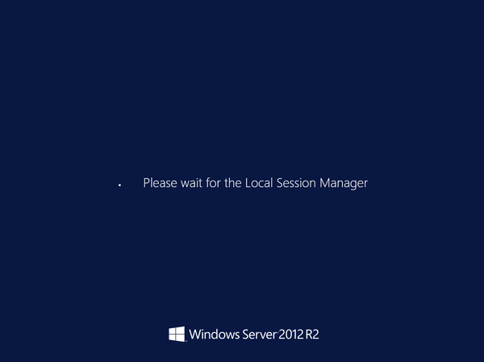

# VM is unresponsive while waiting for the local session manager

This article provides steps to resolve issues where the Guest OS is stuck waiting for the Local Session Manager to finish processing while booting an Azure virtual machine (VM).

## Symptoms

When you use [Boot diagnostics](./boot-diagnostics.md) to view the screenshot of the VM, you'll see that the screenshot displays a prompt with the message: "*Please wait for the Local Session Manager*"

## Cause

There could be multiple reasons a virtual machine is stuck waiting for the Local Session Manager. If waiting for the Local Session Manager is a persistent issue, you'll need to collect a memory dump for analysis.

## Solution

In some cases, simply waiting long enough for the process to complete will resolve your issue. If your VM is hung on the wait screen for over an hour, you should collect a memory dump and then contact Microsoft support.

### Collect the Memory Dump File

To resolve this problem, you first need to gather the memory dump file for the crash and then contact support with the memory dump file. To collect the dump file, follow these steps:

#### Attach the OS disk to a new Repair VM

1. Follow [steps 1-3 of the VM Repair Commands](./repair-windows-vm-using-azure-virtual-machine-repair-commands.md) to prepare a Repair VM.
2. Connect to the Repair VM using Remote Desktop Connection.

#### Locate the dump file and submit a support ticket

1. On the repair VM, go to the Windows folder in the attached OS disk. If the driver letter that is assigned to the attached OS disk is labeled as *F*, then you need to go to `F:\Windows`.
2. Locate the **memory.dmp** file, and then [submit a support ticket](https://portal.azure.com/?#blade/Microsoft_Azure_Support/HelpAndSupportBlade) with the memory dump file.
3. If you're having trouble locating the **memory.dmp** file, then follow the guide to [generate a crash dump file using non-maskable interrupt (NMI) calls](/windows/client-management/generate-kernel-or-complete-crash-dump).

For further information about NMI calls, see the [non-maskable interrupt (NMI) calls in serial console](./serial-console-windows.md#use-the-serial-console-for-nmi-calls) user guide.

## Next Steps

> [!div class="nextstepaction"]
> [Troubleshoot Azure Virtual Machine Boot Errors](boot-error-troubleshoot.md)