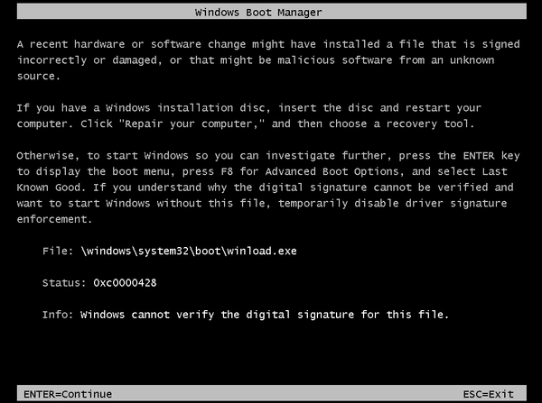
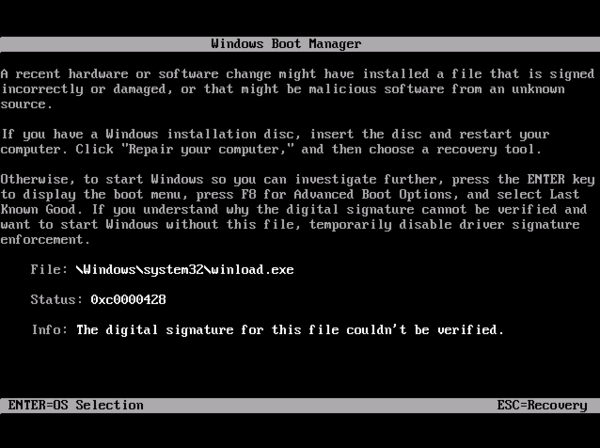

# Windows boot manager error - 0xC0000428 Status Invalid Image Hash

This article provides steps to resolve issues where a preview image was used and the trial period has expired, which prevents the booting of an Azure Virtual Machine (VM).

## Symptom

When you use [Boot diagnostics](https://docs.microsoft.com/azure/virtual-machines/troubleshooting/boot-diagnostics) to view the screenshot of the VM, you will see that the screenshot displays the Windows Boot Manager with the message:

  `File: \windows\system32\boot\winload.exe`

  `Status: 0xc0000428`

  `Info: Windows cannot verify the digital signature for this file.`

  

or the message:

  `File: \Windows\system32\winload.exe`

  `Status: 0xc0000428`

  `Info: The digital signature for this file couldn't be verified.`
	
  

## Cause

The image that was used to build the VM was a preview image with an expiration date rather than an RTM (Release to Manufacturing) image. 

Preview images have a designated lifecycle and the screenshot you see is displayed when you pass the expiration date, meaning the trial of the image is over.

### Example of preview images

`a699494373c04fc0bc8f2bb1389d6106__Windows-Server-Technical-Preview-201505.01-en.us-127GB.vhd`

You are not able to extend the expiration date of a preview image. Once the preview has expired, the VM will no longer be able to boot.

- Depending on the product, the trial period may vary. For example, Windows preview images have a 180-day trial period.

- In Azure, all images for Windows that are preview versions will include a note in their description that they are not intended for production and that they are available for use only for a specified trial period or as a "preview release".

## Solution

If your image is a preview image, there is no way to extend the expiration date for the image used, you will need to [deploy a new VM](https://docs.microsoft.com/azure/virtual-machines/windows/quick-create-portal) using a non-preview image. The steps below will assist you in identifying if you have used a preview image, as well as provide resources to assist you in transferring data from this VM into a new VM. If you have positively identified the image as a preview image, the image isn’t recoverable, as it is now expired.

Depending upon your preference, you can use either Azure PowerShell or Azure CLI to query your image to determine if it is a preview image. You can use these commands to confirm that the image is a preview image.

### Query using Azure PowerShell

1. Open the Windows PowerShell application.
1. Run the following commands:

   ```powershell
   $locName = "<LOCATION>" 
   $pubName = "<PUBLISHER NAME>" 
   $offerName = "<OFFER NAME>" 
   $skuName= "<YEAR WHEN THIS IMAGE WAS RELEASED>"
   Get-AzVMImagePublisher -Location $locName | Select $pubName
   Get-AzVMImageOffer -Location $locName -PublisherName $pubName | Select Offer
   Get-AzVMImageSku -Location $locName -PublisherName $pubName -Offer $offerName | Select Skus
   Get-AzVMImage -Location $locName -PublisherName $pubName -Offer $offerName -Skus $skuName | Select Version
   ```

- In the previous commands, replace `<LOCATION>`, `<PUBLISHER NAME>`, `<OFFER NAME>`, and `<YEAR WHEN THIS IMAGE WAS RELEASED>` with the information stated. Also remove the “<” and “>” symbols.

  See the following example:

  ```powershell
  $locName = "West US" 
  $pubName = "MicrosoftWindowsServer" 
  $offerName = "WindowsServer" 
  $skuName= "2016-Datacenter"
  Get-AzVMImagePublisher -Location $locName | Select $pubName
  Get-AzVMImageOffer -Location $locName -PublisherName $pubName | Select Offer
  Get-AzVMImageSku -Location $locName -PublisherName $pubName -Offer $offerName | Select Skus
  Get-AzVMImage -Location $locName -PublisherName $pubName -Offer $offerName -Skus $skuName | Select Version
  ```

### Query using the Azure CLI

1. If you haven’t already, you will need to [install the Azure CLI](https://docs.microsoft.com/cli/azure/install-azure-cli).
1. Once downloaded, use either Command Prompt or PowerShell to enter the `az login` command and then sign in with your account credentials.
1. Once logged in, enter the following commands:

   ```powershell
   az vm image list-publishers --location "<LOCATION>"
   az vm image list-offers --location "West US" --publisher "<PUBLISHER NAME>"
   az vm image list-skus --location "West US" --publisher "<PUBLISHER NAME>" --offer "<OFFER NAME>"
   az vm image list  --location "West US" --publisher "<PUBLISHER NAME>" --offer "<OFFER NAME>" --sku "<YEAR WHEN THIS IMAGE WAS RELEASED>"
   ```

- In the previous commands, replace `<LOCATION>`, `<PUBLISHER NAME>`, `<OFFER NAME>`, and `<YEAR WHEN THIS IMAGE WAS RELEASED>` with the information stated. Also remove the “<” and “>” symbols.

  See the following example:

  ```powershell
  az vm image list-publishers --location "West US"
  az vm image list-offers --location "West US" --publisher "MicrosoftWindowsServer"
  az vm image list-skus --location "West US" --publisher "MicrosoftWindowsServer" --offer "WindowsServer"
  az vm image list  --location "West US" --publisher "MicrosoftWindowsServer" --offer "WindowsServer" --sku "2016-Datacenter"
  ```
