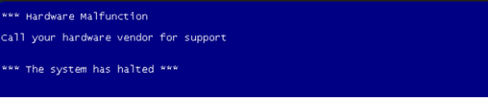
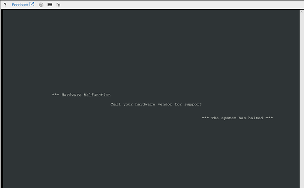
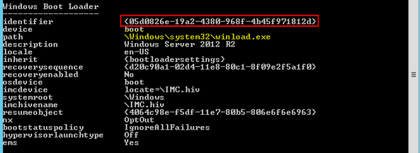

# Windows stop error - Hardware malfunction

This article provides steps to resolve issues where Windows Server 2008 virtual machines crash with an error message that states that there was a hardware malfunction.

## Symptoms

When you use [Boot diagnostics](./boot-diagnostics.md) to view the screenshot of the VM, you'll see that the screenshot displays a blue screen with the message:

**\*\*\* Hardware Malfunction**

**Call your vendor for support**

**\*\*\* The system has halted \*\*\***

#### Blue screen



#### Serial console



## Cause

This screen will appear when the Guest OS wasn't set up correctly and a Non-Maskable Interrupt (NMI) was sent. The error message indicates that a kernel-mode program generated an exception, which the handler didn't catch. You can identify which exception was generated by collecting a memory dump.

## Solution

### Process Overview 

1. Set up the Non-Maskable Interrupt (NMI) Registry Key 
2. Create and Access a Repair VM 
3. Enable Serial Console and Memory Dump Collection 
4. Rebuild the VM 

### Set up the Non-Maskable Interrupt (NMI) registry key

1. Using the Azure portal, restart the VM so that the Guest OS boots normally. 
2. Once some access to the VM has been restored, open an elevated command prompt (run as administrator). 
3. Set up the NMI registry key with the following command:

    ```
    REG ADD "HKLM\SYSTEM\CurrentControlSet\Control\CrashControl" /v NMICrashDump /t REG_DWORD /d 1 /f
    ```
    [View further information about the REG ADD command](https://docs.microsoft.com/windows-server/administration/windows-commands/reg-add)
4. *(Optional)* Setup memory dump collection:

    ```
    REG ADD "HKLM\SYSTEM\CurrentControlSet\Control\CrashControl" /v CrashDumpEnabled /t REG_DWORD /d 1 /f  
    REG ADD "HKLM\SYSTEM\CurrentControlSet\Control\CrashControl" /v DumpFile /t REG_EXPAND_SZ /d "%SystemRoot%\MEMORY.DMP" /f 

    ```
5. *(Optional)* Setup serial console access:

    ```
    BCDEDIT /ems {current} on, or bcdedit /ems '{current}' on if you are using PowerShell
    BCDEDIT /emssettings EMSPORT:1 EMSBAUDRATE:115200 
    ```
    [View further information about the BCDEDIT command](https://docs.microsoft.com/windows-server/administration/windows-commands/bcdedit)
6. Restart the VM with the following command:

    ```
    SHUTDOWN /r /t 0 /f 
    ```
    [View further information about the SHUTDOWN command](https://docs.microsoft.com/windows-server/administration/windows-commands/shutdown)

> [!IMPORTANT]
> The issue should now be fixed!

> [!NOTE]
> After restarting, test your VM to make sure it is functioning like normal. If you are still experiencing issues, then you can continue to the next section for further instructions.

> [!TIP]
> It is recommended to setup the non-maskable interrupt (NMI) registry key in the section above, however if your VM didn’t boot normally afterwards then intended changes to the Guest OS registry may not have taken place. If that’s the case, you can follow the directions below to manually add the registry settings instead.

### Create and access a repair VM

1. Use steps 1-3 of the [VM Repair Commands](./repair-windows-vm-using-azure-virtual-machine-repair-commands.md) to prepare a Repair VM.
2. Connect to the Repair VM using Remote Desktop Connection.

### Enable serial console and memory dump collection

Before rebuilding the VM, it is recommended to enable memory dump collection and Serial Console. To do so, run the following script: 

1. Open an elevated command prompt session (run as administrator). 
2. List the BCD store data and determine the boot loader identifier, which you'll use in the next step. 
    1. For a Generation 1 VM, enter the following command and note the identifier listed: 
 
        ```
        bcdedit /store <BOOT PARTITON>:\boot\bcd /enum
        ```
        In the command, replace `<BOOT PARTITON>` with the letter of the partition in the attached disk that contains the boot folder. 

        
    2. For a Generation 2 VM, enter the following command and note the identifier listed:
    
        ```
        BCDEDIT /store <LETTER OF THE EFI SYSTEM PARTITION>:EFI\Microsoft\boot\bcd /enum 
        ```
        * In the command, replace `<LETTER OF THE EFI SYSTEM PARTITION>` with the letter of the EFI System Partition.
        * It may be helpful to launch the Disk Management console to identify the appropriate system partition labeled as *EFI System Partition*.
        * The identifier may be a unique GUID or it could be the default *bootmgr*.
3. Run the following commands to enable Serial Console:

    ```
    BCDEDIT /store <VOLUME LETTER WHERE THE BCD FOLDER IS>:\boot\bcd /ems {<BOOT LOADER IDENTIFIER>} ON  
    BCDEDIT /store <VOLUME LETTER WHERE THE BCD FOLDER IS>:\boot\bcd /emssettings EMSPORT:1 EMSBAUDRATE:115200 

    ```
    * In the command, replace `<VOLUME LETTER WHERE THE BCD FOLDER IS>` with the letter of the BCD folder.
    * In the command, replace `<BOOT LOADER IDENTIFIER>` with the identifier you found in the previous step.
4. Verify that the free space on the OS disk is greater than the memory size (RAM) on the VM. 
    1. If there’s not enough space on the OS disk, you should change the location where the memory dump file will be created. Rather than creating the file on the OS disk, you can refer it to any other data disk attached to the VM that has enough free space. To change the location, replace **%SystemRoot%** with the drive letter (for example **F:**) of the data disk in the commands listed below. 
    2. Enter the commands below (suggested dump configuration):

    **Load Registry Hive from the broken OS Disk:**

    ```
    REG LOAD HKLM\BROKENSYSTEM <VOLUME LETTER OF BROKEN OS DISK>:\windows\system32\config\SYSTEM
    ```

    **Enable on ControlSet001:**

    ```
    REG ADD "HKLM\BROKENSYSTEM\ControlSet001\Control\CrashControl" /v CrashDumpEnabled /t REG_DWORD /d 1 /f 
    REG ADD "HKLM\BROKENSYSTEM\ControlSet001\Control\CrashControl" /v DumpFile /t REG_EXPAND_SZ /d "%SystemRoot%\MEMORY.DMP" /f 
    REG ADD "HKLM\BROKENSYSTEM\ControlSet001\Control\CrashControl" /v NMICrashDump /t REG_DWORD /d 1 /f 
    ```

    **Enable on ControlSet002:**

    ```
    REG ADD "HKLM\BROKENSYSTEM\ControlSet002\Control\CrashControl" /v CrashDumpEnabled /t REG_DWORD /d 1 /f 
    REG ADD "HKLM\BROKENSYSTEM\ControlSet002\Control\CrashControl" /v DumpFile /t REG_EXPAND_SZ /d "%SystemRoot%\MEMORY.DMP" /f 
    REG ADD "HKLM\BROKENSYSTEM\ControlSet002\Control\CrashControl" /v NMICrashDump /t REG_DWORD /d 1 /f 
    ```

    **Unload Broken OS Disk:**

    ```
    REG UNLOAD HKLM\BROKENSYSTEM
    ```
### Rebuild the virtual machine

* Use [step 5 of the VM Repair Commands](./repair-windows-vm-using-azure-virtual-machine-repair-commands.md#repair-process-example) to rebuild the VM.

## Next steps

> [!div class="nextstepaction"]
> [Troubleshoot Azure Virtual Machine Boot Errors](./boot-error-troubleshoot.md)