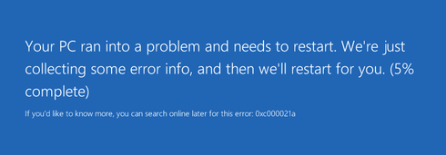

# Windows stop error - 0xC000021A Status System Process Terminated

This article provides steps to resolve issues where the operating system (OS) encounters the stop error 0xC000021A, which keeps an Azure virtual machine (VM) from booting.

## Symptom

When you use [Boot diagnostics](https://docs.microsoft.com/azure/virtual-machines/troubleshooting/boot-diagnostics) to view the screenshot of the VM, the screenshot displays the message that the OS encountered an error during boot, with the following message:

**Your PC ran into a problem and needs to restart. We're just collecting some error info, and then you can restart. (##% complete) If you'd like to know more, you can search online later for this error: 0xC000021a**.

  

## Cause

Error 0xC000021A means **STATUS_SYSTEM_PROCESS_TERMINATED**.

This error occurs when a critical process, such as WinLogon (winlogon.exe) or the Client Server Run-Time Subsystem (csrss.exe) fails. Once the kernel detects that either of those services have stopped, it raises the **STOP 0xC000021A** error. This error may have several causes, including:

- Mismatched system files have been installed.
- A Service Pack or KB update installation has failed.
- A backup program that is used to restore a hard disk did not correctly restore files that may have been in use.
- An incompatible third-party program has been installed.

## Solution

### Collect the Memory Dump File

To resolve this problem, the crash dump will need to be analyzed. Collect the memory dump file for the crash and contact support. 
To collect the dump file, follow these steps:

### Attach the OS disk to a new Repair VM

1.	Use steps 1-3 of the [VM Repair Commands](https://docs.microsoft.com/azure/virtual-machines/troubleshooting/repair-windows-vm-using-azure-virtual-machine-repair-commands) to prepare a Repair VM.
2.	Using **Remote Desktop Connection**, connect to the Repair VM.

### Locate the dump file and submit a support ticket

1.	On the repair VM, go to windows folder in the attached OS disk. If the driver letter that is assigned to the attached OS disk is F, go to F:\Windows.
2.	Locate the memory.dmp file, and then [submit a support ticket](https://portal.azure.com/?#blade/Microsoft_Azure_Support/HelpAndSupportBlade) with the memory dump file.
3.	If you are having trouble locating the memory.dmp file, you may wish to use [non-maskable interrupt (NMI) calls in serial console](https://docs.microsoft.com/azure/virtual-machines/troubleshooting/serial-console-windows#use-the-serial-console-for-nmi-calls) instead. You can follow the guide to [generate a crash dump file using NMI calls here](https://docs.microsoft.com/windows/client-management/generate-kernel-or-complete-crash-dump).

## Next Steps

- For further troubleshooting information, see [troubleshooting common boot errors](https://docs.microsoft.com/azure/virtual-machines/troubleshooting/boot-error-troubleshoot) or [how to troubleshoot a Windows VM by attaching the OS disk to a recovery VM](https://docs.microsoft.com/azure/virtual-machines/troubleshooting/troubleshoot-recovery-disks-windows). You should also familiarize yourself with [how to use boot diagnostics to troubleshoot a virtual machine](https://docs.microsoft.com/azure/virtual-machines/troubleshooting/boot-diagnostics).
- For more information about using Resource Manager, see [Azure Resource Manager overview](https://docs.microsoft.com/azure/azure-resource-manager/management/overview).
- If you cannot connect to your VM, see [Troubleshoot RDP connections to an Azure VM](https://docs.microsoft.com/azure/virtual-machines/troubleshooting/troubleshoot-rdp-connection).
