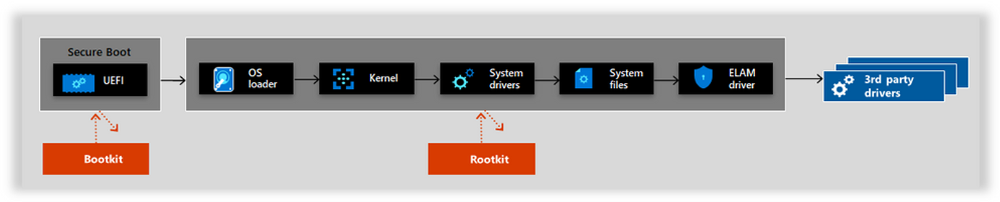

# Trusted Launch FAQ

> [!CAUTION]
> This article references CentOS, a Linux distribution that is nearing End Of Life (EOL) status. Please consider your use and planning accordingly. For more information, see the [CentOS End Of Life guidance](~/articles/virtual-machines/workloads/centos/centos-end-of-life.md).

Frequently asked questions about trusted launch. Feature use cases, support for other Azure features, and fixes for common errors.

## Use cases

### Why should I use trusted launch? What does trusted launch guard against?

Trusted launch guards against boot kits, rootkits, and kernel-level malware. These sophisticated types of malware run in kernel mode and remain hidden from users. For example:

- Firmware rootkits: these kits overwrite the firmware of the virtual machine's BIOS, so the rootkit can start before the OS.
- Boot kits: these kits replace the OS's bootloader so that the virtual machine loads the boot kit before the OS.
- Kernel rootkits: these kits replace a portion of the OS kernel so the rootkit can start automatically when the OS loads.
- Driver rootkits: these kits pretend to be one of the trusted drivers that OS uses to communicate with the virtual machine's components.

### How does trusted launch compare to Hyper-V Shielded VM?

Hyper-V Shielded VM is currently available on Hyper-V only. [Hyper-V Shielded VM](/windows-server/security/guarded-fabric-shielded-vm/guarded-fabric-and-shielded-vms) is typically deployed in with Guarded Fabric. A Guarded Fabric consists of a Host Guardian Service (HGS), one or more guarded hosts, and a set of Shielded VMs. Hyper-V Shielded VMs are used in fabrics where the data and state of the virtual machine must be protected from various actors. These actors are both fabric administrators and untrusted software that might be running on the Hyper-V hosts. Trusted launch on the other hand can be deployed as a standalone virtual machine or Virtual Machine Scale Sets on Azure without other deployment and management of HGS. All of the trusted launch features can be enabled with a simple change in deployment code or a checkbox on the Azure portal.

### Can I disable Trusted Launch for new VM deployment?

Trusted Launch VMs provide you with foundational compute security and our recommendation isn't to disable same for new VM/VMSS deployments except if your deployments have dependency on:

- [VM Size families currently not supported with Trusted Launch](trusted-launch.md#virtual-machines-sizes)
- [Feature currently not supported with Trusted Launch](trusted-launch.md#unsupported-features)
- [OS version not supported with Trusted Launch](trusted-launch.md#operating-systems-supported)

You can use parameter **securityType** with value `Standard` to disable Trusted Launch in new VM/VMSS deployments using Azure PowerShell (v10.3.0+) and CLI (v2.53.0+)

#### [CLI](#tab/cli)

```azurecli
az vm create -n MyVm -g MyResourceGroup --image Ubuntu2204 `
    --security-type 'Standard'
```

#### [PowerShell](#tab/PowerShell)

```azurepowershell
$adminUsername = <USER NAME>
$adminPassword = <PASSWORD> | ConvertTo-SecureString -AsPlainText -Force
$vmCred = New-Object System.Management.Automation.PSCredential($adminUsername, $adminPassword)
New-AzVM -Name MyVm -Credential $vmCred -SecurityType Standard
```
### Can I disable Secure Boot option for Trusted Launch VMs?

Secure Boot is NOT enabled by default but it is recommended to enable it if you are not using custom unsigned kernel or drivers. Once a VM is created with Trusted Launch and Secure Boot option enabled, you can go to VM, under Settings tab, go to Configurations and unselect 'Enable secure boot' option. 

---

## Supported features and deployments

### Is Azure Compute Gallery supported by trusted launch?
Trusted launch now allows images to be created and shared through the [Azure Compute Gallery](trusted-launch-portal.md#trusted-launch-vm-supported-images) (formerly Shared Image Gallery). The image source can be:
- an existing Azure VM that is either generalized or specialized OR,
- an existing managed disk or a snapshot OR,
- a VHD or an image version from another gallery.

For more information about deploying Trusted Launch VM using Azure Compute Gallery, see [deploy Trusted Launch VMs](trusted-launch-portal.md#deploy-a-trusted-launch-vm-from-an-azure-compute-gallery-image).

### Is Azure Backup supported by trusted launch?
Trusted launch now supports Azure Backup. For more information, see  [Support matrix for Azure VM backup](../backup/backup-support-matrix-iaas.md#vm-compute-support).

### Will Azure Backup continue working after enabling trusted launch?
Backups configured with [enhanced policy](../backup/backup-azure-vms-enhanced-policy.md) will continue to take backup of VM after enabling Trusted Launch.

### Are Ephemeral OS disks supported by trusted launch?
Trusted launch supports ephemeral OS disks. For more information, see [Trusted Launch for Ephemeral OS disks](ephemeral-os-disks.md#trusted-launch-for-ephemeral-os-disks).
> [!NOTE]
> While using ephemeral disks for Trusted Launch VMs, keys and secrets generated or sealed by the vTPM after the creation of the VM may not be persisted across operations like reimaging and platform events like service healing.


### Can virtual machine be restored using backup taken before enabling trusted launch?
Backups taken before [upgrading existing Generation 2 VM to Trusted Launch](trusted-launch-existing-vm.md) can be used to restore entire virtual machine or individual data disks. They can't be used to restore or replace OS disk only.


### How can I find VM sizes that support trusted launch?
See the list of [Generation 2 VM sizes supporting Trusted launch](trusted-launch.md#virtual-machines-sizes).

The following commands can be used to check if a [Generation 2 VM Size](../virtual-machines/generation-2.md#generation-2-vm-sizes) doesn't support Trusted launch.

#### [CLI](#tab/cli)

```azurecli
subscription="<yourSubID>"
region="westus"
vmSize="Standard_NC12s_v3"

az vm list-skus --resource-type virtualMachines  --location $region --query "[?name=='$vmSize'].capabilities" --subscription $subscription
```

#### [PowerShell](#tab/PowerShell)

```azurepowershell
$region = "southeastasia"
$vmSize = "Standard_M64"
(Get-AzComputeResourceSku | where {$_.Locations.Contains($region) -and ($_.Name -eq $vmSize) })[0].Capabilities
```

The response is similar to the following form. `TrustedLaunchDisabled True` in the output indicates that the Generation 2 VM size doesn't support Trusted launch. If it's a Generation 2 VM size and `TrustedLaunchDisabled` isn't part of the output, it implies that Trusted launch is supported for that VM size.

```
Name                                         Value
----                                         -----
MaxResourceVolumeMB                          8192000
OSVhdSizeMB                                  1047552
vCPUs                                        64
MemoryPreservingMaintenanceSupported         False
HyperVGenerations                            V1,V2
MemoryGB                                     1000
MaxDataDiskCount                             64
CpuArchitectureType                          x64
MaxWriteAcceleratorDisksAllowed              8
LowPriorityCapable                           True
PremiumIO                                    True
VMDeploymentTypes                            IaaS
vCPUsAvailable                               64
ACUs                                         160
vCPUsPerCore                                 2
CombinedTempDiskAndCachedIOPS                80000
CombinedTempDiskAndCachedReadBytesPerSecond  838860800
CombinedTempDiskAndCachedWriteBytesPerSecond 838860800
CachedDiskBytes                              1318554959872
UncachedDiskIOPS                             40000
UncachedDiskBytesPerSecond                   1048576000
EphemeralOSDiskSupported                     True
EncryptionAtHostSupported                    True
CapacityReservationSupported                 False
TrustedLaunchDisabled                        True
AcceleratedNetworkingEnabled                 True
RdmaEnabled                                  False
MaxNetworkInterfaces                         8
```

---

### How can I validate that my OS image supports trusted launch?

See the list of [OS versions supported with Trusted Launch](trusted-launch.md#operating-systems-supported),

#### Marketplace OS Images

The following commands can be used to check if a Marketplace OS image supports Trusted Launch.

##### [CLI](#tab/cli)

```azurecli
az vm image show --urn "MicrosoftWindowsServer:WindowsServer:2022-datacenter-azure-edition:latest"
```

The response is similar to the following form. **hyperVGeneration** `v2` and **SecurityType** contains `TrustedLaunch` in the output indicates that the Generation 2 OS Image supports Trusted Launch.

```json
{
  "architecture": "x64",
  "automaticOsUpgradeProperties": {
    "automaticOsUpgradeSupported": false
  },
  "dataDiskImages": [],
  "disallowed": {
    "vmDiskType": "Unmanaged"
  },
  "extendedLocation": null,
  "features": [
    {
      "name": "SecurityType",
      "value": "TrustedLaunchAndConfidentialVmSupported"
    },
    {
      "name": "IsAcceleratedNetworkSupported",
      "value": "True"
    },
    {
      "name": "DiskControllerTypes",
      "value": "SCSI, NVMe"
    },
    {
      "name": "IsHibernateSupported",
      "value": "True"
    }
  ],
  "hyperVGeneration": "V2",
  "id": "/Subscriptions/00000000-0000-0000-0000-00000000000/Providers/Microsoft.Compute/Locations/westus/Publishers/MicrosoftWindowsServer/ArtifactTypes/VMImage/Offers/WindowsServer/Skus/2022-datacenter-azure-edition/Versions/20348.1906.230803",
  "imageDeprecationStatus": {
    "alternativeOption": null,
    "imageState": "Active",
    "scheduledDeprecationTime": null
  },
  "location": "westus",
  "name": "20348.1906.230803",
  "osDiskImage": {
    "operatingSystem": "Windows",
    "sizeInGb": 127
  },
  "plan": null,
  "tags": null
}
```

##### [PowerShell](#tab/PowerShell)

```azurepowershell
Get-AzVMImage -Skus 22_04-lts-gen2 -PublisherName Canonical -Offer 0001-com-ubuntu-server-jammy -Location westus3 -Version latest
```

The output of the command can be used with [Virtual Machines - Get API](/rest/api/compute/virtual-machine-images/get). The response is similar to the following form. **hyperVGeneration** `v2` and **SecurityType** contains `TrustedLaunch` in the output indicates that the Generation 2 OS Image supports Trusted Launch.

```json
{
    "properties": {
        "hyperVGeneration": "V2",
        "architecture": "x64",
        "replicaType": "Managed",
        "replicaCount": 10,
        "disallowed": {
            "vmDiskType": "Unmanaged"
        },
        "automaticOSUpgradeProperties": {
            "automaticOSUpgradeSupported": false
        },
        "imageDeprecationStatus": {
            "imageState": "Active"
        },
        "features": [
            {
                "name": "SecurityType",
                "value": "TrustedLaunchSupported"
            },
            {
                "name": "IsAcceleratedNetworkSupported",
                "value": "True"
            },
            {
                "name": "DiskControllerTypes",
                "value": "SCSI, NVMe"
            },
            {
                "name": "IsHibernateSupported",
                "value": "True"
            }
        ],
        "osDiskImage": {
            "operatingSystem": "Linux",
            "sizeInGb": 30
        },
        "dataDiskImages": []
    },
    "location": "WestUS3",
    "name": "22.04.202309080",
    "id": "/Subscriptions/00000000-0000-0000-0000-000000000000/Providers/Microsoft.Compute/Locations/WestUS3/Publishers/Canonical/ArtifactTypes/VMImage/Offers/0001-com-ubuntu-server-jammy/Skus/22_04-lts-gen2/Versions/22.04.202309080"
}
```

---

#### Azure Compute Gallery OS Image

The following commands can be used to check if a [Azure Compute Gallery](trusted-launch-portal.md#trusted-launch-vm-supported-images) OS image supports Trusted Launch.

##### [CLI](#tab/cli)

```azurecli
az sig image-definition show `
    --gallery-image-definition myImageDefinition `
    --gallery-name myImageGallery `
    --resource-group myImageGalleryRg
```

The response is similar to the following form. **hyperVGeneration** `v2` and **SecurityType** contains `TrustedLaunch` in the output indicates that the Generation 2 OS Image supports Trusted Launch.

```json
{
  "architecture": "x64",
  "features": [
    {
      "name": "SecurityType",
      "value": "TrustedLaunchSupported"
    }
  ],
  "hyperVGeneration": "V2",
  "id": "/subscriptions/00000000-0000-0000-0000-000000000000/resourceGroups/myImageGalleryRg/providers/Microsoft.Compute/galleries/myImageGallery/images/myImageDefinition",
  "identifier": {
    "offer": "myImageDefinition",
    "publisher": "myImageDefinition",
    "sku": "myImageDefinition"
  },
  "location": "westus3",
  "name": "myImageDefinition",
  "osState": "Generalized",
  "osType": "Windows",
  "provisioningState": "Succeeded",
  "recommended": {
    "memory": {
      "max": 32,
      "min": 1
    },
    "vCPUs": {
      "max": 16,
      "min": 1
    }
  },
  "resourceGroup": "myImageGalleryRg",
  "tags": {},
  "type": "Microsoft.Compute/galleries/images"
}
```

##### [PowerShell](#tab/PowerShell)

```azurepowershell
Get-AzGalleryImageDefinition -ResourceGroupName myImageGalleryRg `
    -GalleryName myImageGallery -GalleryImageDefinitionName myImageDefinition
```

The response is similar to the following form. **hyperVGeneration** `v2` and **SecurityType** contains `TrustedLaunch` in the output indicates that the Generation 2 OS Image supports Trusted Launch.

```
ResourceGroupName : myImageGalleryRg
OsType            : Windows
OsState           : Generalized
HyperVGeneration  : V2
Identifier        :
  Publisher       : myImageDefinition
  Offer           : myImageDefinition
  Sku             : myImageDefinition
Recommended       :
  VCPUs           :
    Min           : 1
    Max           : 16
  Memory          :
    Min           : 1
    Max           : 32
ProvisioningState : Succeeded
Id                : /subscriptions/00000000-0000-0000-0000-000000000000/resourceGroups/myImageGalleryRg/providers/Microsoft.Compute/galleries/myImageGallery/images/myImageDefinition
Name              : myImageDefinition
Type              : Microsoft.Compute/galleries/images
Location          : westus3
Tags              : {}
Features[0]       :
  Name            : SecurityType
  Value           : TrustedLaunchSupported
Architecture      : x64
```

---

### How external communication drivers work with Trusted Launch VMs ?

Adding COM ports requires disabling Secure Boot. Hence, COM ports are disabled by default in Trusted Launch VMs.

## Power states

Feature specific states, boot types, and common boot issues.

### What is VM Guest State (VMGS)?  

VM Guest State (VMGS) is specific to Trusted Launch VM. It's a blob managed by Azure and contains the unified extensible firmware interface (UEFI) secure boot signature databases and other security information. The lifecycle of the VMGS blob is tied to that of the OS Disk.

### What are the differences between secure boot and measured boot?

In secure boot chain, each step in the boot process checks a cryptographic signature of the subsequent steps. For example, the BIOS checks a signature on the loader, and the loader checks signatures on all the kernel objects that it loads, and so on. If any of the objects are compromised, the signature doesn't match, and the VM doesn't boot. For more information, see [Secure Boot](/windows-hardware/design/device-experiences/oem-secure-boot). Measured boot doesn't halt the boot process, it measures or computes the hash of the next objects in the chain and stores the hashes in the Platform Configuration Registers (PCRs) on the vTPM. Measured boot records are used for boot integrity monitoring.

### Why is Trusted Launch Virtual Machine not booting correctly? 

If unsigned components are detected from the UEFI (guest firmware), bootloader, operating system, or boot drivers, a Trusted Launch Virtual Machine won't boot. The [secure boot](/windows-server/virtualization/hyper-v/learn-more/generation-2-virtual-machine-security-settings-for-hyper-v#secure-boot-setting-in-hyper-v-manager) setting in the Trusted Launch virtual machine fails to boot if unsigned or untrusted boot components are encountered during the boot process and will report as a secure boot failure.



> [!NOTE]
> Trusted Launch Virtual machines that are created directly from an Azure Marketplace image should not encounter Secure Boot failures. Azure Compute Gallery images with an original image source of Marketplace, and snapshots created from Trusted Launch VMs should also not encounter these errors. 

### How would I verify a no-boot scenario in the Azure portal? 
When a virtual machine becomes unavailable from a Secure Boot failure, 'no-boot' means that virtual machine has an operating system component that is signed by a trusted authority, which blocks booting a Trusted Launch VM. On VM deployment, customers may see information from resource health within the Azure portal stating that there's a validation error in secure boot.

To access resource health from the virtual machine configuration page, navigate to Resource Health under the 'Help' panel.

:::image type="content" source="./media/trusted-launch/resource-health-error.png" lightbox="./media/trusted-launch/resource-health-error.png" alt-text="A resource health error message alerting a failed secure boot.":::

Follow the 'Recommended Steps' outlined in the resource health screen. Instructions include a screenshot and downloadable serial log from the boot diagnostics of the virtual machine.

If you verified the no-boot was caused by a secure boot failure:
1. The image you're using is an older version that may have one or more untrusted boot components and is on a deprecation path. To remedy an outdated image, update to a supported newer image version.
1. The image you're using may have been built outside of a marketplace source or the boot components have been modified and contain unsigned or untrusted boot components. To verify if your image has unsigned or untrusted boot components, refer to 'Verifying secure boot failures'.
1. If the above two scenarios don't apply, the virtual machine is potentially infected with malware (bootkit/rootkit). Consider deleting the virtual machine and re-creating a new VM from the same source image while evaluating all software being installed.

## Verifying secure boot failures

### Linux Virtual Machines 
To verify which boot components are responsible for Secure Boot failures within an Azure Linux Virtual Machine, end-users can use the SBInfo tool from the Linux Security Package.

1. Turn off secure boot
1. Connect to your Azure Linux Trusted Launch virtual machine.
2. Install the SBInfo tool for the distro your virtual machine is running. It resides within the Linux Security Package

#### [Debian-based distros](#tab/debianbased)

These commands apply to Ubuntu, Debian, and other debian-based distros.

```bash
echo "deb [arch=amd64] http://packages.microsoft.com/repos/azurecore/ trusty main" | sudo tee -a /etc/apt/sources.list.d/azure.list

echo "deb [arch=amd64] http://packages.microsoft.com/repos/azurecore/ xenial main" | sudo tee -a /etc/apt/sources.list.d/azure.list

echo "deb [arch=amd64] http://packages.microsoft.com/repos/azurecore/ bionic main" | sudo tee -a /etc/apt/sources.list.d/azure.list

wget https://packages.microsoft.com/keys/microsoft.asc

wget https://packages.microsoft.com/keys/msopentech.asc

sudo apt-key add microsoft.asc && sudo apt-key add msopentech.asc

sudo apt update && sudo apt install azure-security

```

#### [Red Hat-based distros](#tab/rhelbased)

These commands apply to RHEL, CentOS, and other Red Hat-based distros.

```bash
echo "[packages-microsoft-com-azurecore]" | sudo tee -a /etc/yum.repos.d/azurecore.repo

echo "name=packages-microsoft-com-azurecore" | sudo tee -a /etc/yum.repos.d/azurecore.repo

echo "baseurl=https://packages.microsoft.com/yumrepos/azurecore/" | sudo tee -a /etc/yum.repos.d/azurecore.repo

echo "enabled=1" | sudo tee -a /etc/yum.repos.d/azurecore.repo

echo "gpgcheck=0" | sudo tee -a /etc/yum.repos.d/azurecore.repo

sudo yum install azure-security
```

#### [SUSE-based distros](#tab/susebased)

These commands apply to SLES, openSUSE, and other SUSE-based distros.

```bash
sudo zypper ar -t rpm-md -n "packages-microsoft-com-azurecore" --no-gpgcheck https://packages.microsoft.com/yumrepos/azurecore/ azurecore

sudo zypper install azure-security
```

---

After installing the Linux Security Package for your distro, run the 'sbinfo' command to verify which boot components are responsible for Secure Boot failures by displaying all unsigned modules, kernels, and bootloaders. 

```bash
sudo sbinfo -u -m -k -b 
```

To learn more about the SBInfo diagnostic tool, you can run 'sudo sbinfo -help'.

### Why am I getting a boot integrity monitoring fault?

Trusted launch for Azure virtual machines is monitored for advanced threats. If such threats are detected, an alert is triggered. Alerts are only available if [Defender for Cloud's enhanced security features](../security-center/enable-enhanced-security.md) are enabled.

Microsoft Defender for Cloud periodically performs attestation. If the attestation fails, a medium severity alert is triggered. Trusted launch attestation can fail for the following reasons:

- The attested information, which includes a log of the Trusted Computing Base (TCB), deviates from a trusted baseline (like when Secure Boot is enabled). Any deviation indicates an untrusted module(s) were loaded and the OS may be compromised.
- The attestation quote couldn't be verified to originate from the vTPM of the attested VM. The verification failure indicates a malware is present and may be intercepting traffic to the TPM.
- The attestation extension on the VM isn't responding. An unresponsive extension indicates a denial-of-service attack by malware or an OS admin.

## Certificates

### How can users establish root of trust with Trusted Launch VMs?  

The virtual TPM AK public certificate provides users with visibility for information on the full certificate chain (Root and Intermediate Certificates), helping them validate trust in certificate and root chain. To ensure Trusted Launch consumers continually have the highest security posture, it provides information on instance properties, so users can trace back to the full chain.

#### Download instructions

Package certificates, compromised of. p7b (Full Certificate Authority) and .cer (Intermediate CA), reveal the signing and certificate authority. Copy the relevant content and use certificate tooling to inspect and assess details of certificates.  

[!INCLUDE [json](../virtual-machines/includes/trusted-launch-tpm-certs/tpm-root-certificate-authority.md)]

[!INCLUDE [p7b](../virtual-machines/includes/trusted-launch-tpm-certs/full-certificate-authority.md)]

[!INCLUDE [json](../virtual-machines/includes/trusted-launch-tpm-certs/root-certificate-authority.md)]

[!INCLUDE [cert](../virtual-machines/includes/trusted-launch-tpm-certs/intermediate-ca.md)]
