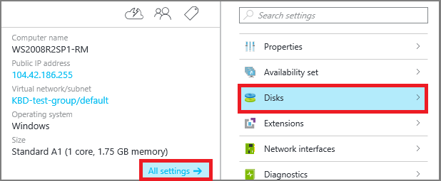
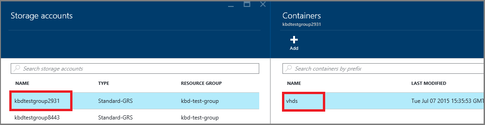

<properties
	pageTitle="How To Attach  Data Disk in the Azure Preview Portal"
	description="How to attach empty and existing data disks in Azure"
	services="virtual-machines"
	documentationCenter=""
	authors="KBDAzure"
	manager="timlt"
	editor=""
	tags="azure-resource-manager"/>

<tags
	ms.service="virtual-machines"
	ms.workload="infrastructure-services"
	ms.tgt_pltfrm="vm-windows"
	ms.devlang="na"
	ms.topic="article"
	ms.date="05/10/2015"
	ms.author="kathydav"/>

# How To Attach a Data Disk in the Azure Preview Portal

This article shows you how to attach both new and existing disks to a virtual machine through the Azure preview portal. Here's what you need to know before you do this:

- The size of the virtual machine controls how many data disks you can attach. For details, see [Sizes for virtual machines](virtual-machines-size-specs.md).
- Disks attached to virtual machines are actually .vhd files that reside in an Azure storage account. For details, see [About disks and VHDs for virtual machines](virtual-machines-disks-vhds.md).
- If you're attaching a disk to a DS-series VM, you can use either a premium or a standard storage account. Premium storage is available for DS-series virtual machines in certain regions. For details, see [Premium Storage: High-Performance Storage for Azure Virtual Machine Workloads](http://azure.microsoft.com/en-us/documentation/articles/storage-premium-storage-preview-portal/).
- For a new disk, you don't need to create it first because Azure creates it when you attach it.
- For an existing disk, the .vhd file must be available in an Azure storage account. You can use one that's already there, if it's not attached to another virtual machine, or upload your own .vhd file to the storage account.

## Find the virtual machine

1. Sign in to the [Preview portal](https://portal.azure.com).

2. On the Hub menu, click **Browse**.

3. On the search blade, scroll down and click **Virtual Machines**.

	

4.	Select the virtual machine from the list.

5. To the right, under Essentials, click **All settings**, and then click **Disks**.

	

Proceed by following instructions for attaching either a new disk or an existing disk.

## Option 1: Attach an Empty Disk

1.	On the **Disks** blade, click **Attach new**.

2.	Review the default settings, update as necessary, and then click **OK**.

 	

3.	After Azure creates the disk and attaches it to the virtual machine, it's listed in the portal under **Data Disks**.

## Option 2: Attach an Existing Disk

1.	On the **Disks** blade, click **Attach existing**.

2.	Under **Attach existing disk**, click **VHD File**.

	

3.	Under **Storage accounts**, select the account and container that holds the .vhd file.

	

4.	Select the .vhd file.

5. Under **Attach existing disk**, the file you just selected is listed under **VHD File**. Click **OK**.

6.	After Azure attaches the disk to the virtual machine, it's listed in the portal under **Data Disks**.

## Additional resources

[About Azure Storage Accounts]

<!--Link references-->

[About Azure Storage Accounts]: ../storage-whatis-account/
