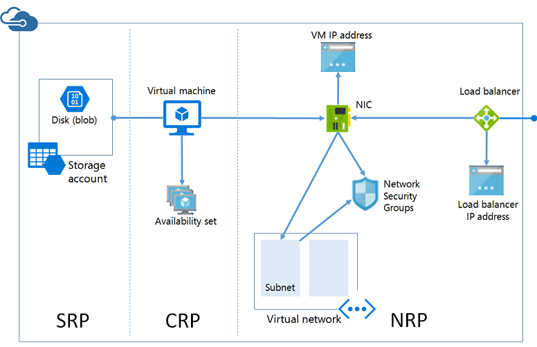

<properties
   pageTitle="Azure Resource Manager Architecture"
   description="Learn about the architecture of Resource Manager and the relationships between the compute, network, and storage resource providers."
   services="virtual-machines"
   documentationCenter=""
   authors="davidmu1"
   manager="timlt"
   editor=""
   tags="azure-resource-manager"/>

<tags
	ms.service="azure-resource-manager"
	ms.workload="infrastructure-services"
	ms.tgt_pltfrm="na"
	ms.devlang="na"
	ms.topic="article"
	ms.date="08/25/2015"
	ms.author="davidmu"/>

# Azure Resource Manager Architecture

This article provides an overview of both the Service Management and Resource Manager architectures for creating infrastructure-based applications and workloads.

## Architecture for Service Management

Before we discuss the architecture of Azure Resource Manager and the various resource providers, let's review the architecture that currently exists for Azure Service Management. In Azure Service Management, the compute, storage, or network resources for hosting virtual machines are provided by:

- A required cloud service that acts as a container for hosting virtual machines (compute). Virtual machines are automatically provided with a network interface card (NIC) and an IP address assigned by Azure. Additionally, the cloud service contains an external load balancer instance, a public IP address, and default endpoints to allow remote desktop and remote PowerShell traffic for Windows-based virtual machines and Secure Shell (SSH) traffic for Linux-based virtual machines.
- A required storage account that stores the VHDs for a virtual machine, including the operating system, temporary, and additional data disks (storage).
- An optional virtual network that acts as an additional container, in which you can create a subnetted structure and designate the subnet on which the virtual machine is located (network).

Here are the components and their relationships for Azure Service Management.

## Architecture for Resource Manager

For Azure Resource Manager, resource providers support the individual resources for creating functioning virtual machines in the configuration that you need. For virtual machines, there are three main resource providers:

- Compute Resource Provider (CRP): Supports instances of virtual machines and optional availability sets.
- Storage Resource Provider (SRP): Supports required storage accounts that store the VHDs for virtual machines, including their operating system and additional data disks.
- Network Resource Provider (NRP): Supports required NICs, virtual machine IP addresses, and subnets within virtual networks and optional load balancers, load balancer IP addresses, and Network Security Groups.

Additionally, there are relationships between the resources within the resource providers:

- A virtual machine depends on a specific storage account defined in the SRP to store its disks in blob storage (required).
- A virtual machine references a specific NIC defined in the NRP (required) and an availability set defined in the CRP (optional).
- A NIC references the virtual machine's assigned IP address (required), the subnet of the virtual network for the virtual machine (required), and to a Network Security Group (optional).
- A subnet within a virtual network references a Network Security Group (optional).
- A load balancer instance references the backend pool of IP addresses that include the NIC of a virtual machine (optional) and references a load balancer public or private IP address (optional).

The componentization of resources allows for more flexibility when configuring the infrastructure for an IT workload hosted in Azure. Azure Resource Manager templates take advantage of this flexibility to create the set of dependent resources needed for a specific configuration. When executing a template, Resource Manager ensures that the resources for a configuration are created in the correct order to preserve the dependencies and references. For example, Resource Manager will not create the NIC for a virtual machine until it has created the virtual network with a subnet and an IP address (a Network Security Group is optional).

A resource group is a logical container that holds related resources for an application, which can consist of multiple virtual machines, NICs, IP addresses, load balancers, subnets, and Network Security Groups. For example, you can manage all of the resources of the application as a single management unit. You can create, update, and delete all of them together. Here is an example application deployed in a single resource group.

This application consists of:

- Two virtual machines that use the same storage account, are in the same availability set, and on the same subnet of a virtual network.
- A single NIC and VM IP address for each virtual machine.
- An external load balancer that distributes Internet traffic to the NICs of the two virtual machines.

All of these resources of this application are managed through the single resource group that contains them.

You can also see the componentization and dependent relationships between resources when you create a Resource Manager-based virtual machine using Azure PowerShell or the Azure CLI. Before you can run the command that creates the virtual machine, you must create a resource group, a storage account, a virtual network with a subnet, and a NIC with an IP address. For more information, see [Create and preconfigure a Windows Virtual Machine with Resource Manager and Azure PowerShell](virtual-machines-ps-create-preconfigure-windows-resource-manager-vms.md).

## Next steps

[Deploy and Manage Virtual Machines using Azure Resource Manager Templates and the Azure CLI](virtual-machines-deploy-rmtemplates-azure-cli.md)

[Deploy and Manage Azure Virtual Machines using Resource Manager Templates and PowerShell](virtual-machines-deploy-rmtemplates-powershell.md)

## Additional resources

[Azure Compute, Network and Storage Providers under Azure Resource Manager](virtual-machines-azurerm-versus-azuresm.md)

[Azure Resource Manager Overview](resource-group-overview.md)
