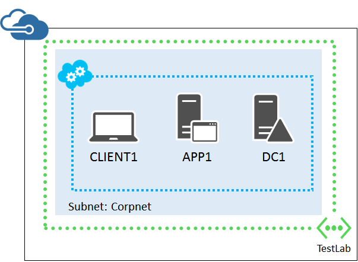
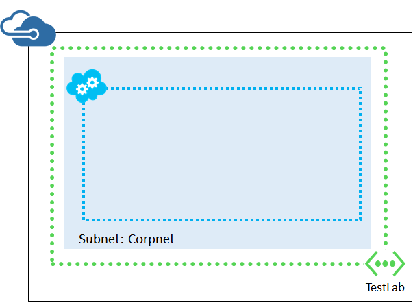
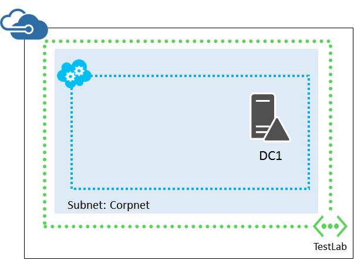
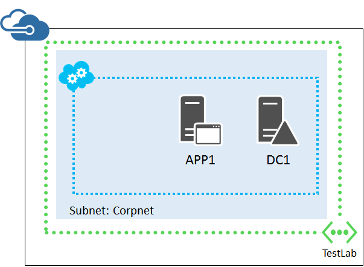

<properties
	pageTitle="Base Configuration Test Environment"
	description="Learn how to create a simple dev/test environment that simulates a simplified intranet in Microsoft Azure."
	documentationCenter=""
	services="virtual-machines"
	authors="JoeDavies-MSFT"
	manager="timlt"
	editor=""
	tags="azure-service-management"/>

<tags
	ms.service="virtual-machines"
	ms.workload="infrastructure-services"
	ms.tgt_pltfrm="vm-windows"
	ms.devlang="na"
	ms.topic="article"
	ms.date="07/07/2015"
	ms.author="josephd"/>

# Base Configuration test environment

This article provides you with step-by-step instructions to create the Base Configuration test environment in a Azure Virtual Network, using virtual machines created in Service Management.

You can use the resulting test environment:

- For application development and testing.
- For the [simulated hybrid cloud environment](../virtual-network/virtual-networks-setup-simulated-hybrid-cloud-environment-testing.md).
- To extend it with additional virtual machines and Azure services for a test environment of your own design.

The Base Configuration test environment consists of the Corpnet subnet in a cloud-only virtual network named TestLab that simulates a simplified, private intranet connected to the Internet.

It contains:

- One Azure virtual machine running Windows Server 2012 R2 named DC1 that is configured as an intranet domain controller and Domain Name System (DNS) server.
- One Azure virtual machine running Windows Server 2012 R2 named APP1 that is configured as a general application and web server.
- One Azure virtual machine running Windows Server 2012 R2 named CLIENT1 that will act as an intranet client.

This configuration allows DC1, APP1, CLIENT1, and additional Corpnet subnet computers to be:  

- Connected to the Internet to install updates, access Internet resources in real time, and participate in public cloud technologies such as Microsoft Office 365 and other Azure services.
- Remotely managed using Remote Desktop Connections from your computer that is connected to the Internet or your organization network.

There are four phases to setting up the Corpnet subnet of the Windows Server 2012 R2 Base Configuration test environment in Azure.

1.	Create the virtual network.
2.	Configure DC1.
3.	Configure APP1.
4.	Configure CLIENT1.

If you do not already have an Azure account, you can sign up for a free trial at [Try Azure](http://azure.microsoft.com/pricing/free-trial/). If you have an MSDN Subscription, see [Azure benefit for MSDN subscribers](http://azure.microsoft.com/pricing/member-offers/msdn-benefits-details/).

> [AZURE.NOTE] Virtual machines in Azure incur an ongoing monetary cost when they are running. This cost is billed against your free trial, MSDN subscription, or paid subscription. For more information about the costs of running Azure virtual machines, see [Virtual Machines Pricing Details](http://azure.microsoft.com/pricing/details/virtual-machines/) and [Azure Pricing Calculator](http://azure.microsoft.com/pricing/calculator/). To keep costs down, see [Minimizing the costs of test environment virtual machines in Azure](#costs).

[AZURE.INCLUDE [service-management-pointer-to-resource-manager](../../includes/service-management-pointer-to-resource-manager.md)]

- [Base Configuration test environment with Azure Resource Manager](virtual-machines-base-configuration-test-environment-resource-manager.md)

## Phase 1: Create the virtual network

First, you create the TestLab virtual network that will host the Corpnet subnet of the base configuration.

1.	In the task bar of the Azure Management Portal, click **New > Network Services > Virtual Network > Custom Create**.
2.	On the Virtual Network Details page, type **TestLab** in **Name**.
3.	In **Location**, select the appropriate region.
4.	Click the Next arrow.
5.	On the DNS Servers and VPN Connectivity page, in **DNS servers**, type **DC1** in **Select or enter name**, type **10.0.0.4** in **IP address**, and then click the Next arrow.
6.	On the Virtual Network Address Spaces page, in **Subnets**, click **Subnet-1** and replace the name with **Corpnet**.
7.	In the **CIDR (Address Count)** column for the Corpnet subnet, click **/24 (256)**.
8.	Click the Complete icon. Wait until the virtual network is created before continuing.

Next, use the instructions in [How to install and configure Azure PowerShell](../install-configure-powershell.md) to install Azure PowerShell on your local computer. Open an Azure PowerShell command prompt.

First, select the correct Azure subscription with these commands. Replace everything within the quotes, including the < and > characters, with the correct name.

	$subscr="<Subscription name>"
	Select-AzureSubscription -SubscriptionName $subscr –Current

You can get the subscription name from the **SubscriptionName** property of the display of the **Get-AzureSubscription** command.

Next, you create an Azure cloud service. The cloud service acts as a security boundary and logical container for the virtual machines placed in the virtual network. It also provides a way for you to remotely connect to and manage the virtual machines on the Corpnet subnet.

You must pick a unique name for your cloud service. *The cloud service name can contain only letters, numbers, and hyphens. The first and last character in the field must be a letter or number.*

For example, you could name your cloud service TestLab-*UniqueSequence*, in which *UniqueSequence* is an abbreviation of your organization. For example, if your organization is named Tailspin Toys, you could name the cloud service TestLab-Tailspin.

You can test for the uniqueness of the name with this Azure PowerShell command.

	Test-AzureName -Service <Proposed cloud service name>

If this command returns "False", your proposed name is unique. Then, create the cloud service with these commands.

	$loc="<the same location (region) as your TestLab virtual network>"
	New-AzureService -Service <Unique cloud service name> -Location $loc

Record the actual name of your cloud service.

Next, you configure a storage account that will contain the disks for your virtual machines and extra data disks. *You must pick a unique name that contains only lowercase letters and numbers.* You can test for the uniqueness of the storage account name with this Azure PowerShell command.

	Test-AzureName -Storage <Proposed storage account name>

If this command returns "False", your proposed name is unique. Then, create the storage account and set the subscription to use it with these commands.

	$stAccount="<your storage account name>"
	New-AzureStorageAccount -StorageAccountName $stAccount -Location $loc
	Set-AzureSubscription -SubscriptionName $subscr -CurrentStorageAccountName $stAccount

This is your current configuration.

## Phase 2: Configure DC1

DC1 is a domain controller for the corp.contoso.com Active Directory Domain Services (AD DS) domain and a DNS server for the virtual machines of the TestLab virtual network.

First, fill in the name of your cloud service and run these commands at the Azure PowerShell command prompt on your local computer to create an Azure Virtual Machine for DC1.

	$serviceName="<your cloud service name>"
	$cred=Get-Credential –Message "Type the name and password of the local administrator account for DC1."
	$image= Get-AzureVMImage | where { $_.ImageFamily -eq "Windows Server 2012 R2 Datacenter" } | sort PublishedDate -Descending | select -ExpandProperty ImageName -First 1
	$vm1=New-AzureVMConfig -Name DC1 -InstanceSize Small -ImageName $image
	$vm1 | Add-AzureProvisioningConfig -Windows -AdminUsername $cred.GetNetworkCredential().Username -Password $cred.GetNetworkCredential().Password
	$vm1 | Add-AzureDataDisk -CreateNew -DiskSizeInGB 20 -DiskLabel "AD" -LUN 0 -HostCaching None
	$vm1 | Set-AzureSubnet -SubnetNames Corpnet
	$vm1 | Set-AzureStaticVNetIP -IPAddress 10.0.0.4
	New-AzureVM –ServiceName $serviceName -VMs $vm1 -VNetName TestLab

Next, connect to the DC1 virtual machine.

1.	In the Azure Management Portal, click **Virtual Machines** in the left pane, and then click **Started** in the **Status** column for the DC1 virtual machine.  
2.	In the task bar, click **Connect**.
3.	When prompted to open DC1.rdp, click **Open**.
4.	When prompted with a Remote Desktop Connection message box, click **Connect**.
5.	When prompted for credentials, use the following:
- Name: **DC1\\**[Local administrator account name]
- Password: [Local administrator account password]
6.	When prompted with a Remote Desktop Connection message box referring to certificates, click **Yes**.

Next, add an extra data disk as a new volume with the drive letter F:.

1.	In the left pane of Server Manager, click **File and Storage Services**, and then click **Disks**.
2.	In the contents pane, in the **Disks** group, click **disk 2** (with the **Partition** set to **Unknown**).
3.	Click **Tasks**, and then click **New Volume**.
4.	On the Before you begin page of the New Volume Wizard, click **Next**.
5.	On the Select the server and disk page, click **Disk 2**, and then click **Next**. When prompted, click **OK**.
6.	On the Specify the size of the volume page, click **Next**.
7.	On the Assign to a drive letter or folder page, click **Next**.
8.	On the Select file system settings page, click **Next**.
9.	On the Confirm selections page, click **Create**.
10.	When complete, click **Close**.

Next, configure DC1 as a domain controller and DNS server for the corp.contoso.com domain. Run these commands at an administrator-level Windows PowerShell command prompt.

	Install-WindowsFeature AD-Domain-Services -IncludeManagementTools
	Install-ADDSForest -DomainName corp.contoso.com -DatabasePath "F:\NTDS" -SysvolPath "F:\SYSVOL" -LogPath "F:\Logs"

After DC1 restarts, reconnect to the DC1 virtual machine.

1.	On the virtual machines page of the Azure Management Portal, click **Running** in the **Status** column for the DC1 virtual machine.
2.	In the task bar, click **Connect**.
3.	When prompted to open DC1.rdp, click **Open**.
4.	When prompted with a Remote Desktop Connection message box, click **Connect**.
5.	When prompted for credentials, use the following:
- Name: **CORP\\**[Local administrator account name]
- Password: [Local administrator account password]
6.	When prompted by a Remote Desktop Connection message box referring to certificates, click **Yes**.

Next, create a user account in Active Directory that will be used when logging in to CORP domain member computers. Run these commands one at a time at an administrator-level Windows PowerShell command prompt.

	New-ADUser -SamAccountName User1 -AccountPassword (read-host "Set user password" -assecurestring) -name "User1" -enabled $true -PasswordNeverExpires $true -ChangePasswordAtLogon $false
	Add-ADPrincipalGroupMembership -Identity "CN=User1,CN=Users,DC=corp,DC=contoso,DC=com" -MemberOf "CN=Enterprise Admins,CN=Users,DC=corp,DC=contoso,DC=com","CN=Domain Admins,CN=Users,DC=corp,DC=contoso,DC=com"

Note that the first command results in a prompt to supply the User1 account password. Because this account will be used for remote desktop connections for all CORP domain member computers, choose a strong password. To check its strength, see [Password Checker: Using Strong Passwords](https://www.microsoft.com/security/pc-security/password-checker.aspx). Record the User1 account password and store it in a secured location.

Reconnect to the DC1 virtual machine using the CORP\User1 account.

Next, to allow traffic for the Ping tool, run this command at an administrator-level Windows PowerShell command prompt.

	Set-NetFirewallRule -DisplayName "File and Printer Sharing (Echo Request - ICMPv4-In)" -enabled True

This is your current configuration.

## Phase 3: Configure APP1

APP1 provides web and file sharing services.

First, fill in the name of your cloud service and run these commands at the Azure PowerShell command prompt on your local computer to create an Azure Virtual Machine for APP1.

	$serviceName="<your cloud service name>"
	$cred1=Get-Credential –Message "Type the name and password of the local administrator account for APP1."
	$cred2=Get-Credential –UserName "CORP\User1" –Message "Now type the password for the CORP\User1 account."
	$image= Get-AzureVMImage | where { $_.ImageFamily -eq "Windows Server 2012 R2 Datacenter" } | sort PublishedDate -Descending | select -ExpandProperty ImageName -First 1
	$vm1=New-AzureVMConfig -Name APP1 -InstanceSize Small -ImageName $image
	$vm1 | Add-AzureProvisioningConfig -AdminUsername $cred1.GetNetworkCredential().Username -Password $cred1.GetNetworkCredential().Password -WindowsDomain -Domain "CORP" -DomainUserName "User1" -DomainPassword $cred2.GetNetworkCredential().Password -JoinDomain "corp.contoso.com"
	$vm1 | Set-AzureSubnet -SubnetNames Corpnet
	New-AzureVM –ServiceName $serviceName -VMs $vm1 -VNetName TestLab

Next, connect to the APP1 virtual machine using the CORP\User1 credentials and open an administrator-level Windows PowerShell command prompt.

To check name resolution and network communication between APP1 and DC1, run the **ping dc1.corp.contoso.com** command and verify that there are four replies.

Next, make APP1 a web server with this command at the Windows PowerShell command prompt.

	Install-WindowsFeature Web-WebServer –IncludeManagementTools

Next, create a shared folder and a text file within the folder on APP1 with these commands.

	New-Item -path c:\files -type directory
	Write-Output "This is a shared file." | out-file c:\files\example.txt
	New-SmbShare -name files -path c:\files -changeaccess CORP\User1

This is your current configuration.

## Phase 4: Configure CLIENT1

CLIENT1 acts as a typical laptop, tablet, or desktop computer on the Contoso intranet.

First, fill in the name of your cloud service and run these commands at the Azure PowerShell command prompt on your local computer to create an Azure Virtual Machine for CLIENT1.

	$serviceName="<your cloud service name>"
	$cred1=Get-Credential –Message "Type the name and password of the local administrator account for CLIENT1."
	$cred2=Get-Credential –UserName "CORP\User1" –Message "Now type the password for the CORP\User1 account."
	$image= Get-AzureVMImage | where { $_.ImageFamily -eq "Windows Server 2012 R2 Datacenter" } | sort PublishedDate -Descending | select -ExpandProperty ImageName -First 1
	$vm1=New-AzureVMConfig -Name CLIENT1 -InstanceSize Small -ImageName $image
	$vm1 | Add-AzureProvisioningConfig -AdminUsername $cred1.GetNetworkCredential().Username -Password $cred1.GetNetworkCredential().Password -WindowsDomain -Domain "CORP" -DomainUserName "User1" -DomainPassword $cred2.GetNetworkCredential().Password -JoinDomain "corp.contoso.com"
	$vm1 | Set-AzureSubnet -SubnetNames Corpnet
	New-AzureVM –ServiceName $serviceName -VMs $vm1 -VNetName TestLab

Next, connect to the CLIENT1 virtual machine using the CORP\User1 credentials.

To check name resolution and network communication between CLIENT1 and DC1, run the **ping dc1.corp.contoso.com** command at a Windows PowerShell command prompt and verify that there are four replies.

Next, verify that you can access web and file share resources on APP1 from CLIENT1.

1.	In Server Manager, in the tree pane, click **Local Server**.
2.	In **Properties for CLIENT1**, click **On** next to **IE Enhanced Security Configuration**.
3.	In **Internet Explorer Enhanced Security Configuration**, click **Off** for **Administrators** and **Users**, and then click **OK**.
4.	From the Start screen, click **Internet Explorer**, and then click **OK**.
5.	In the Address bar, type **http://app1.corp.contoso.com/**, and then press ENTER.  You should see the default Internet Information Services web page for APP1.
6.	From the desktop taskbar, click the File Explorer icon.
7.	In the address bar, type **\\\app1\Files**, and then press ENTER.
8.	You should see a folder window with the contents of the Files shared folder.
9.	In the **Files** shared folder window, double-click the **Example.txt** file. You should see the contents of the Example.txt file.
10.	Close the **example.txt - Notepad** and the **Files** shared folder windows.

This is your final configuration.

Your base configuration in Azure is now ready for application development and testing or for additional test environments, such as the [simulated hybrid cloud environment](../virtual-network/virtual-networks-setup-simulated-hybrid-cloud-environment-testing.md).

## Additional resources

[Hybrid cloud test environments](../virtual-network/virtual-networks-setup-hybrid-cloud-environment-testing.md)

[Base Configuration test environment with Azure Resource Manager](virtual-machines-base-configuration-test-environment-resource-manager.md)

## Minimizing the costs of test environment virtual machines in Azure

To minimize the cost of running the test environment virtual machines, you can do one of the following:

- Create the test environment and perform your needed testing and demonstration as quickly as possible. When complete, delete the test environment virtual machines.
- Shut down your test environment virtual machines into a deallocated state.

To shut down the virtual machines with Azure PowerShell, fill in the cloud service name and run these commands.

	$serviceName="<your cloud service name>"
	Stop-AzureVM -ServiceName $serviceName -Name "CLIENT1"
	Stop-AzureVM -ServiceName $serviceName -Name "APP1"
	Stop-AzureVM -ServiceName $serviceName -Name "DC1" -Force -StayProvisioned

To ensure that your virtual machines work properly when starting all of them from the Stopped (Deallocated) state, you should start them in the following order:

1.	DC1
2.	APP1
3.	CLIENT1

To start the virtual machines in order with Azure PowerShell, fill in the cloud service name and run these commands.

	$serviceName="<your cloud service name>"
	Start-AzureVM -ServiceName $serviceName -Name "DC1"
	Start-AzureVM -ServiceName $serviceName -Name "APP1"
	Start-AzureVM -ServiceName $serviceName -Name "CLIENT1"
