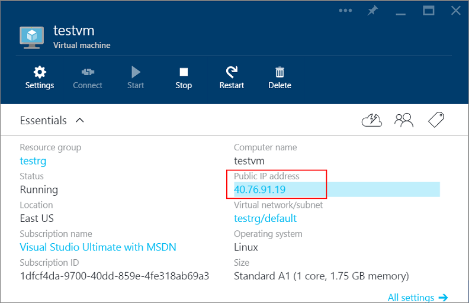
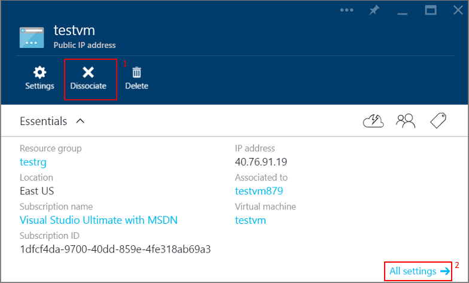
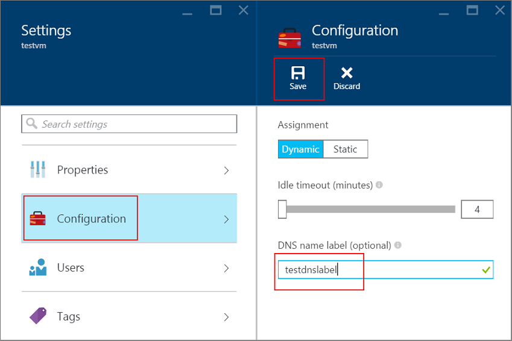
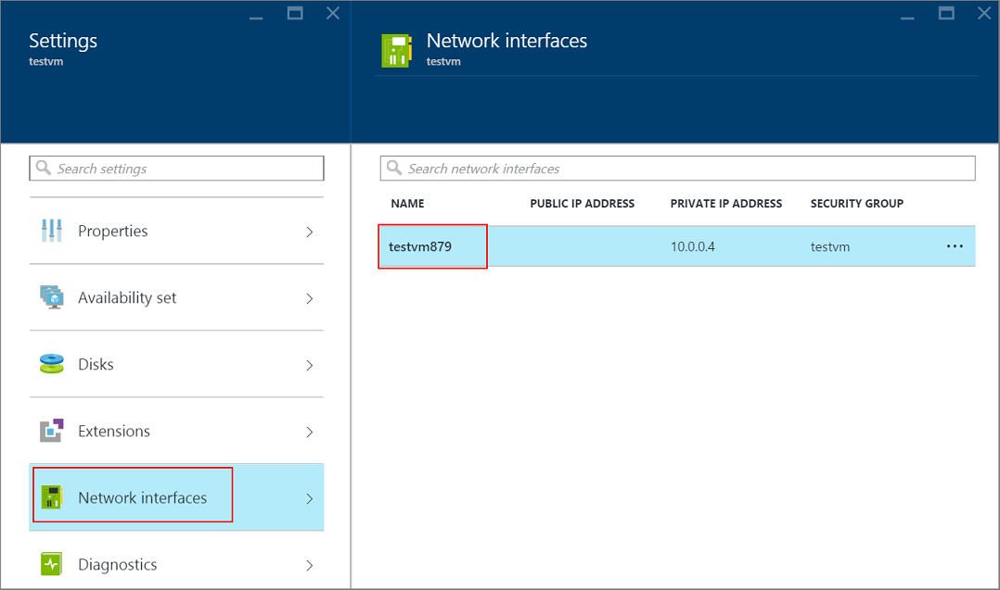
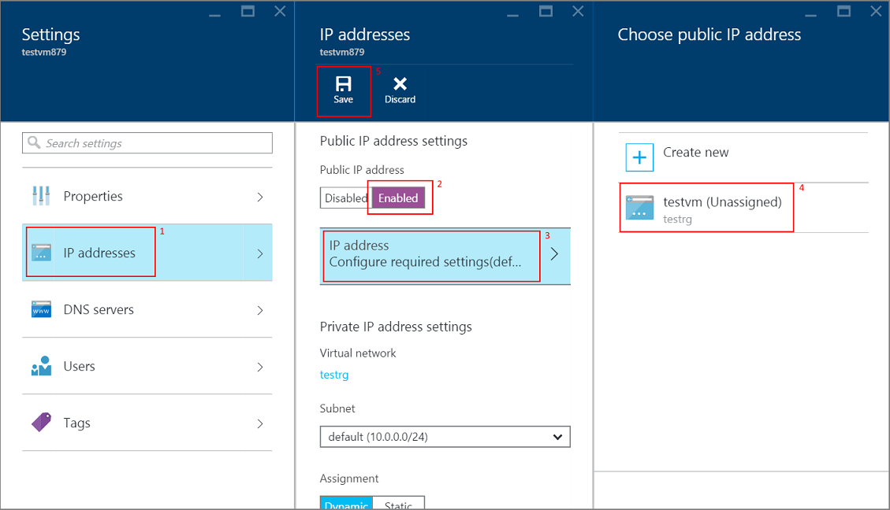
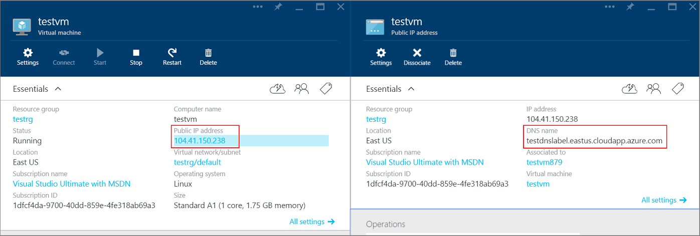

<properties
   pageTitle="Create an FQDN for a VM in the Azure Portal | Microsoft Azure"
   description="Learn how to create a Fully Qualified Domain Name or FQDN for a Resource Manager based virtual machine in the Azure preview portal."
   services="virtual-machines"
   documentationCenter=""
   authors="dsk-2015"
   manager="timlt"
   editor="tysonn"
   tags="azure-resource-management"/>

<tags
   ms.service="virtual-machines"
   ms.devlang="na"
   ms.topic="article"
   ms.tgt_pltfrm="na"
   ms.workload="infrastructure-services"
   ms.date="08/21/2015"
   ms.author="dkshir"/>

# Create a Fully Qualified Domain Name in the Azure Preview Portal

When you create a virtual machine in the [Azure preview portal](https://portal.azure.com) using the **Resource Manager** deployment model, the portal creates a public IP resource for the virtual machine. You can use this IP address to remotely access the virtual machine. However, the portal does not create a [fully qualified domain name](https://en.wikipedia.org/wiki/Fully_qualified_domain_name) or FQDN, by default. Since it would be easier to remember and use an FQDN instead of an IP address, this article demonstrates how you can add one to your virtual machine.

The article assumes that you have logged in to your subscription in the portal, and created a virtual machine with the available images, using the **Resource Manager**. Follow these steps once your virtual machine starts running.

1.  View the virtual machine settings on the portal and click on the Public IP address.

    

2.  **Dissociate** the Public IP from the virtual machine. Note that it does not yet show a domain name. After you click on the **Yes** button, it might take a few seconds before it completes the dissociation.

    

    We will associate this Public IP with the virtual machine after the following steps. If the Public IP is a _Dynamic Public IP_, then you will lose the IPV4 address and a new one will be assigned after the FQDN is configured.

3.  Once the **Dissociate** button grays out, click the **All settings** section of the Public IP and open the **Configuration** tab. Enter the desired DNS name label. **Save** this configuration.

    

4.  Go back to the virtual machine blade in the portal and click the **All settings** for the virtual machine. Open the **Network interfaces** tab and click on the Network interface resource associated with this virtual machine. This will open the **Network interface** blade in the portal.

    

5.  Note that the **Public IP address** field for the Network interface is blank. Click the **All settings** section for this Network interface and open the **IP addresses** tab. On the **IP addresses** blade, click **Enabled** for the **Public IP address** field. Select the **IP address Configure required settings** tab and select the default IP that you had dissociated earlier. Click **Save**. It might take a few moments to add back the IP resource.

    

6.  Close all other blades and go back to the **Virtual Machine** blade. Click on the Public IP resource in the settings. Notice that the Public IP blade now shows the desired FQDN as the **DNS name**.

    

    You can now connect remotely to the virtual machine using this DNS name. For example, use `SSH adminuser@testdnslabel.eastus.cloudapp.azure.com`, when connecting to a Linux virtual machine which has the fully qualified domain name of `testdnslabel.eastus.cloudapp.azure.com` and user name of `adminuser`.
