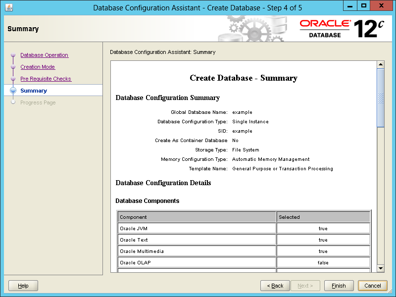

<properties title="Creating an Oracle Database virtual machine in Azure" pageTitle="Creating an Oracle Database virtual machine in Azure" description="Step through an example of creating an Oracle virtual machine in Microsoft Azure and then creating an Oracle Database on it." services="virtual-machines" authors="bbenz" documentationCenter=""/>
<tags ms.service="virtual-machines" ms.devlang="na" ms.topic="article" ms.tgt_pltfrm="na" ms.workload="infrastructure-services" ms.date="06/22/2015" ms.author="bbenz" />
#Creating an Oracle Database virtual machine in Azure
The following example shows you how you can create a virtual machine (VM) based on a Microsoft-provided Oracle Database image running on Windows Server 2012 in Azure. There are two steps. First, create the VM, and then create the Oracle Database inside the VM. The example shown is Oracle Database version 12c, but the steps are virtually identical for version 11g.

##To create an Oracle Database VM in Azure

1.	Log in to the [Azure portal](https://ms.portal.azure.com/).

2.	Click **Marketplace**, click **Compute**, and then type **Oracle** into the search box.

3.	Select one of the available Oracle Database images including **version 11g, version 12c, Standard Edition, Enterprise Edition, or one of the popular options or advanced options bundles.**  Review the information about the image you select (such as minimum recommended size), and then click **Next**.

4.	Specify a **Host Name** for the VM.

5.	Specify a **User Name** for the VM. Note that this user is for remotely logging in to the VM; this is not the Oracle database user name.

6.	Specify and confirm a password for the VM, or provide a SSH Public Key.

7.	Choose a **Pricing Tier**.  Note that Recommended Pricing Tiers are displayed by default, to see all configuration options, click **View all** on the top right.

8.	Set [Optional Configuration](https://msdn.microsoft.com/library/azure/dn763935.aspx) as needed, with these considerations:

	a. Leave **Storage Account** as-is to create a new storage account with the VM name.

	b. Leave **Availability Set** as “Not Configured”.

	c. Do not add any **endpoints** at this time.

9.	Choose or create a resource group.

10. Choose a **Subscription**.

11. Choose a **Location**.

12. Click **Create**, and the process of creating a VM will begin. After the VM has a status of **Running**, proceed to the next procedure.

##To create your database using the Oracle Database VM in Azure

1.	Log in to the [Azure portal](https://ms.portal.azure.com/).

2.	Click **Virtual Machines**.

3.	Click the name of the VM that you want to log in to.

4.	Click **Connect**.

5.	Respond to the prompts as needed to connect to the VM. When prompted for the administrator name and password, use the values that you provided when you created the VM.

6.	Create an environment variable named **ORACLE_HOSTNAME** with its value set to the computer name of the VM. You can create an environment variable using the following steps:

	a.	In Windows, click **Start**, type **Control Panel**, click the **Control Panel** icon, click **System and Security**, click **System**, and then click **Advanced system settings**.

	b.	Click the **Advanced** tab, and then click **Environment Variables**.

	c.	Under the **System variables** section, click **New** to create the variable.

	d.	In the **New system variable** dialog box, enter **ORACLE_HOSTNAME** for the name of the variable, and then enter the computer name of the VM as the value. To determine the computer name, open a command prompt and run **SET COMPUTERNAME** (the output of that command will contain the computer name).

	e.	Click **OK** to save the new environment variable and close the **New system variable** dialog box.

	f.	Close the other dialog boxes that were opened by Control Panel.

7.	In Windows, click **Start**, and then type **Database Configuration Assistant**. Click the **Database Configuration Assistant** icon.

8.	Within the **Database Configuration Assistant** wizard, provide values as needed for each dialog box step:

	a.	**Step 1:** Click **Create Database** and then click **Next**.

		

	b. **Step 2:** Enter a value for **Global Database Name**. Enter and confirm a value for **Administrative Password**. This password is for your Oracle database **SYSTEM** user. Clear **Create As Container Database**. Click **Next**.

		

	c. **Step 3:** The prerequisites check should proceed automatically, advancing to **Step 4**.

	d. **Step 4:** Review the **Create Database – Summary** options, and then click **Finish**.

		
	e. **Step 5:** The **Progress Page** will report the status of your database creation.

		
	f. After your database is created, you’ll have the option to use the **Password Management** dialog box. Modify password settings if needed for your requirements, and then close the dialog boxes to exit the **Database Configuration Assistant** wizard.

##To confirm your database is installed

1.	Still logged in to your VM, start a SQL Plus command prompt. In Windows, click *Start**, then type **SQL Plus**. Click the **SQL Plus** icon.

2.	When prompted, log in using the user name of **SYSTEM** and the password that you specified when you created the Oracle database.

3.	Run the following command at the SQL Plus command prompt.

		**select \* from GLOBAL\_NAME;**

	The result should be the global name of the database that you created.

	

##Allowing your database to be reached remotely
To allow your database to be reached remotely (for example, from a client computer running Java code), you’ll need to start the database listener, open port 1521 in your virtual machine’s firewall, and create a public endpoint for port 1521.

### Start the database listener
1.	Log in to your VM.

2.	Open a command prompt.

3.	At the command prompt, run the following command.

		**lsnrctl start**

> [AZURE.NOTE] You can run **lsnrctl status** to check the status of the listener. When you want to stop the listener, you can run **lsnrctl stop**.

### Open port 1521 in your virtual machine’s firewall

1.	While still logged in to your virtual machine, in Windows, click **Start**, type **Windows Firewall with Advanced Security**, and then click the **Windows Firewall with Advanced Security** icon. This opens the **Windows Firewall with Advanced Security** management console.

2.	Within the firewall management console, click **Inbound Rules** in the left pane (if you don’t see **Inbound Rules**, expand the top node in the left pane), and then click **New Rule** in the right pane.

3.	For **Rule Type**, select **Port** and then click **Next**.

4.	For **Protocol and Port**, select **TCP**, select **Specific local ports**, enter **1521** for the port, and then click **Next**.

5.	Select **Allow the connection** and click **Next**.

6.	Accept the defaults for the profiles for which the rule applies and then click **Next**.

7.	Specify a name for the rule and optionally a description, and then click **Finish**.

### Create a public endpoint for port 1521

1.	Log in to the [Azure portal](https://ms.portal.azure.com/).

2.	Click **Browse**.

3.  Click **Virtual Machines**.

4.	Select the virtual machine.

5.	Click **Settings**.

6.	Click **Endpoints**.

7.	Click **Add**.

8.	Specify a name for the endpoint:

	a. Use **TCP** for the protocol.

	b. Use **1521** for the public port.

	c. Use **1521** for the private port.

9.	Leave the rest of the options as-is.

10. Click **OK**.

##Enabling Oracle Database Enterprise Manager remote access
If you want to enable remote access to Oracle Database Enterprise Manager, open port 5500 in your firewall, and create a virtual machine endpoint for 5500 in the Azure portal (using the steps shown earlier for opening port 1521 and creating an endpoint for 1521). Then, to run the Oracle Enterprise Manager from the remote computer, open a browser to the URL in the form of `http://<<unique_domain_name>>:5500/em`.

> [AZURE.NOTE] You can determine the value for *\<\<unique\_domain\_name\>\>* within the [Azure portal](https://ms.portal.azure.com/) by clicking **Virtual Machines** and then selecting the virtual machine that you are using to run Oracle Database).

##Configuring Popular Options and Advanced Options Bundles
If you chose the **Oracle Database with Popular Options** or the **Oracle Database with Advanced Options bundle**, the next step is to configure the add-on features in your Oracle installation. Refer to the Oracle documentation for instruction on setting these up on Windows, as configurations can vary widely based on your needs of each individual component.

The **Oracle Database with Popular Options bundle** includes Oracle Database Enterprise Edition and license-included instances of [Partitioning](http://www.oracle.com/us/products/database/options/partitioning/overview/index.html), [Active Data Guard](http://www.oracle.com/us/products/database/options/active-data-guard/overview/index.html), [Oracle Tuning Pack for Database](http://docs.oracle.com/html/A86647_01/tun_ovw.htm), [Oracle Diagnostics Pack for Database](http://docs.oracle.com/cd/B28359_01/license.111/b28287/options.htm#CIHIHDDJ), and [Oracle Lifecycle Management Pack for Database](http://www.oracle.com/technetwork/oem/lifecycle-mgmt-495331.html).

The **Oracle Database with Advanced Options bundle** includes license-included instances of all the options in the Popular Options bundle, plus [Advanced Compression](http://www.oracle.com/us/products/database/options/advanced-compression/overview/index.html), [Advanced Security](http://www.oracle.com/us/products/database/options/advanced-security/overview/index.html), [Label Security](http://www.oracle.com/us/products/database/options/label-security/overview/index.html), [Database Vault](http://www.oracle.com/us/products/database/options/database-vault/overview/index.html), [Advanced Analytics](http://www.oracle.com/us/products/database/options/advanced-analytics/overview/index.html), [OLAP](http://docs.oracle.com/cd/E11882_01/license.112/e47877/options.htm#CIHGDEEF), [Spatial and Graph](http://docs.oracle.com/cd/E11882_01/license.112/e47877/options.htm#CIHGDEEF), [In-Memory Database Cache](http://www.oracle.com/technetwork/products/timesten/overview/timesten-imdb-cache-101293.html), [Data Masking Pack](http://docs.oracle.com/cd/E11882_01/license.112/e47877/options.htm#CHDGEEBB), and the Oracle Test Data Management Pack (as part of the Data Masking Pack).

##Additional resources
Now that you’ve set up your virtual machine and created your database, see the following topics for additional information.

-	[Oracle virtual machine images - Miscellaneous considerations](virtual-machines-miscellaneous-considerations-oracle-virtual-machine-images.md)

-	[Oracle Database 12c Documentation Library](http://www.oracle.com/pls/db1211/homepage)

-	[Connecting to Oracle Database from a Java Application](http://docs.oracle.com/cd/E11882_01/appdev.112/e12137/getconn.htm#TDPJD136)

-	[Oracle virtual machine images for Azure](virtual-machines-oracle-list-oracle-virtual-machine-images.md)

-	[Oracle Database 2 Day DBA 12c Release 1](http://docs.oracle.com/cd/E16655_01/server.121/e17643/toc.htm)
