<properties title="Creating an Oracle WebLogic Server 12c cluster in Azure" pageTitle="Creating an Oracle WebLogic Server 12c cluster in Azure" description="Step through an example of creating an Oracle WebLogic Server 12c cluster in Microsoft Azure." services="virtual-machines" authors="bbenz" documentationCenter=""/>
<tags ms.service="virtual-machines" ms.devlang="na" ms.topic="article" ms.tgt_pltfrm="na" ms.workload="infrastructure-services" ms.date="06/22/2015" ms.author="bbenz" />
#Creating an Oracle WebLogic Server 12c cluster in Azure
The following example shows you how you can create an Oracle WebLogic Server cluster in Azure, based on a Microsoft-provided Oracle WebLogic Server 12c image running on Windows Server 2012.

Each instance in a WebLogic Server cluster must be running the same version of Oracle WebLogic Server. This example uses WebLogic Server 12c Enterprise Edition.

##Create Virtual Machines to use in the cluster
You’ll create a Virtual Machine to use as the cluster administration server, and you’ll create additional Virtual Machines to use as part of the cluster.

### Create a Virtual Machine to use as the administration server

Create a Virtual Machine using the **Oracle WebLogic Server 12c Enterprise Edition on Windows Server 2012** image available in Azure. The steps for creating this Virtual Machine can be found at [Creating an Oracle WebLogic Server 12c Virtual Machine in Azure](#creating-an-oracle-weblogic-server-12c-virtual-machine-in-azure-new-article). For purposes of this tutorial, call the Virtual Machine **MYVM1-ADMIN**. Make note of the Virtual Network name of the VM, you will use that value when you create the additional VMs to add to the cluster. (The VM name and Virtual Network name can be whatever you like, as long as it is unique within Azure.)

### Create managed Virtual Machines to use in the cluster

Create additional Virtual Machines, which will be managed by the administration server, using the Oracle WebLogic Server 12c image available in Azure. For purposes of this tutorial, name the additional Virtual Machines **MYVM2-MANAGED** and **MYVM3-MANAGED**. The steps for creating these Virtual Machines can be found at [Creating an Oracle WebLogic Server 12c Virtual Machine in Azure](#creating-an-oracle-weblogic-server-12c-virtual-machine-in-azure-new-article), *except* the following change is required:

-  When creating the Virtual Machines, do not create a new Virtual Network. Specifically, in the **Optional Configuration > Virtual Network** dialog, instead of the default **Create a new Virtual Network**, select the Virtual Network that was created for your administration server VM. For example, if during the creation of your administration server you created a Virtual Network named **EXAMPLE**, select **EXAMPLE** when you create the managed cluster VMs.

##Create a domain

1. Log in to the [Azure Portal](https://ms.portal.azure.com/).

2. Click **Virtual Machines**.

3. Click the name of the Virtual Machine that you created to be the cluster administration server (for example, **MYVM1-ADMIN**).

4. Click **Connect**.

5. Respond to the prompts as needed to connect to the Virtual Machine. When prompted for the administrator name and password, use the values that you provided when you created the Virtual Machine.

6. Within **Page 1** of the **Fusion Middleware Configuration Wizard** dialog, click **Create a new domain** and then click **Next**. (If the **Fusion Middleware Configuration Wizard** dialog is not already opened, open it by clicking **Windows Start**, typing **Configuration Wizard**, and then clicking the **Configuration Wizard** icon.)

	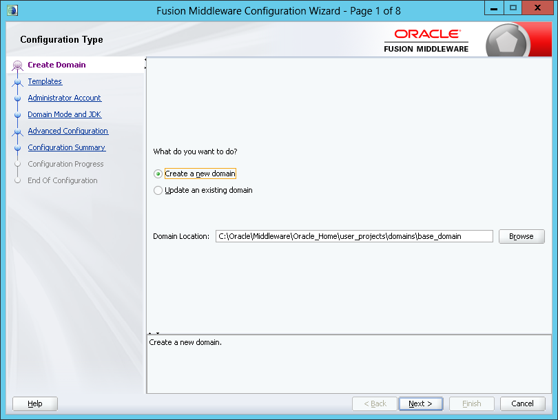

7. Within **Page 2** of the **Fusion Middleware Configuration Wizard** dialog, select the **Basic WebLogic Server Domain** template and then click **Next**.

	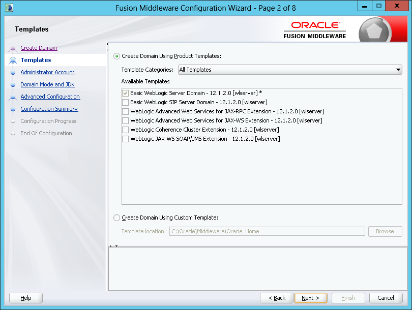

8. Within **Page 3** of the **Fusion Middleware Configuration Wizard** dialog:

	1. [Optional] Change the user name from **weblogic** to a value of your choosing.
	
	2. Specify and confirm a password for the WebLogic Server administrator.
	
	3. Click **Next**.

	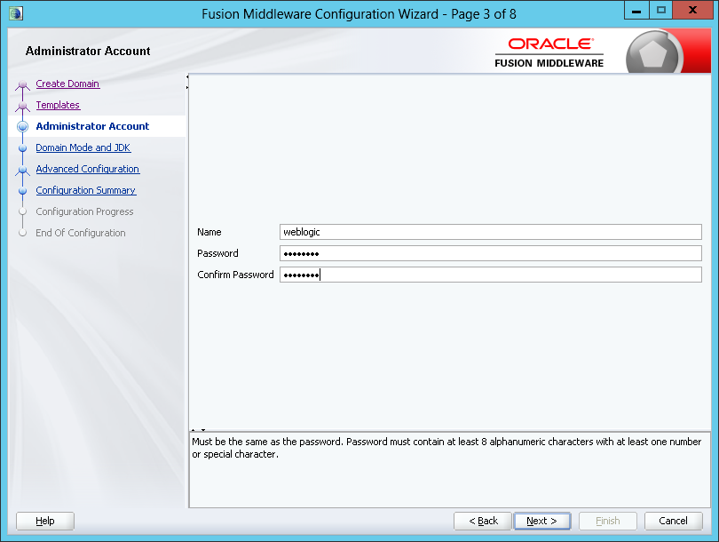

9. Within **Page 4** of the **Fusion Middleware Configuration Wizard** dialog, select **Production** for the domain mode, select the available JDK (or browse to a JDK if desired), and then click **Next**.

	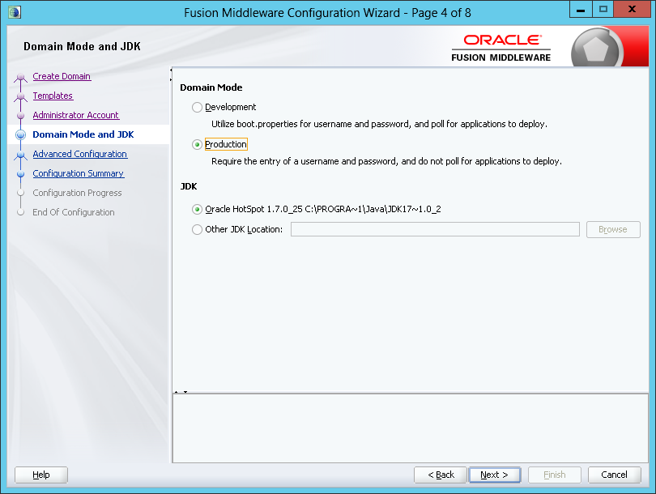

10.  Within **Page 5** of the **Fusion Middleware Configuration Wizard** dialog do not select any options, and then click **Next**.

	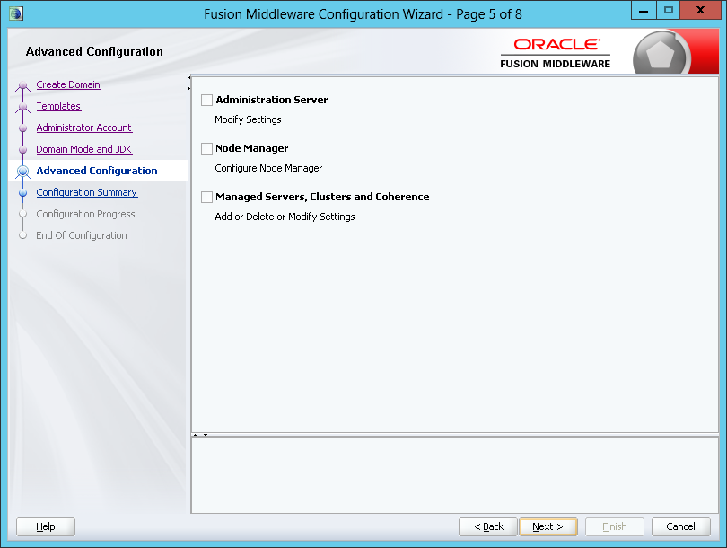

11.  Within **Page 6** of the **Fusion Middleware Configuration Wizard** dialog, click **Create**.

	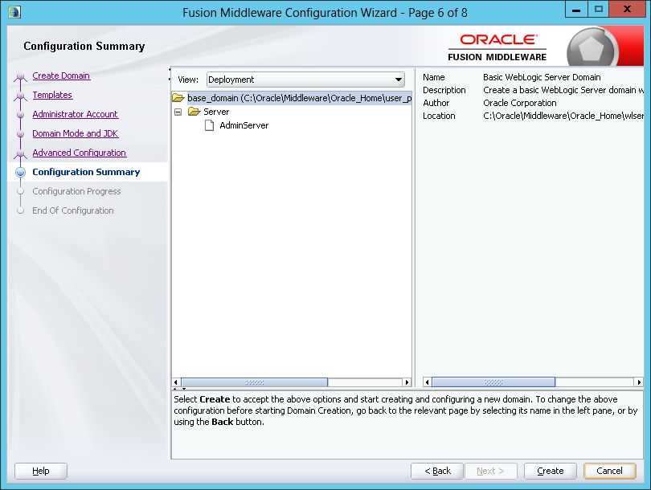

12.  Within **Page 7** of the **Fusion Middleware Configuration Wizard** dialog, after the domain has been created, click **Next**.

	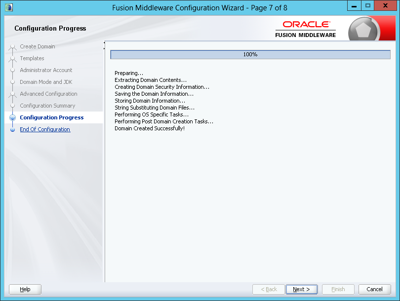

13.  Within **Page 8** of the **Fusion Middleware Configuration Wizard** dialog, check Start Admin Server and then click **Finish**.

	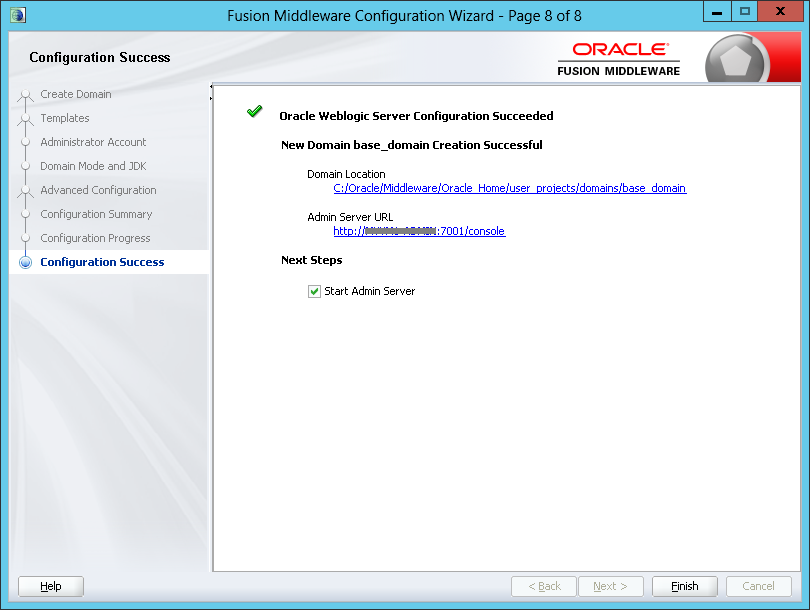

14.  A command prompt for **startWebLogic.cmd** is started. When prompted, provide your WebLogic user name and password.

##Set up the cluster

1. Still logged into the administration Virtual Machine, run the **WebLogic Server Administration Console**, <http://localhost:7001/console>. When prompted, provide your WebLogic Server user name and password.

2. In the **WebLogic Server Administration Console**, click **Lock & Edit**.

3. In the **Domain Structure** pane, expand **Environment**, and then click **Clusters**.

4. In the **Summary of Clusters** dialog, click **New**, and then click **Cluster**.

5. In the **Clusters Property** dialog:

	1. Enter a name for the cluster.

	2. Select **Unicast** for the **Messaging Mode**.

		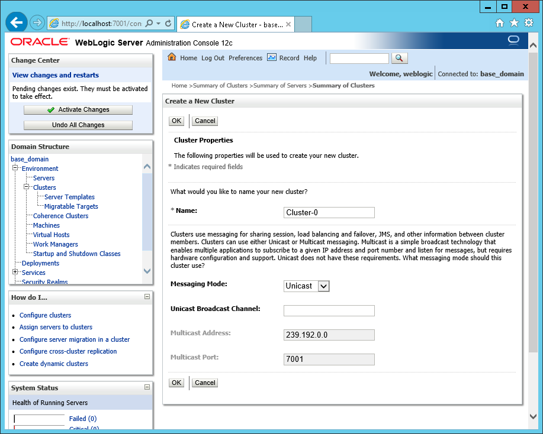  

	
	3. Click **OK**.

6. In the **Domain Structure** pane, expand **Environment**, and then click **Servers**.

7. Add your first managed server to the cluster.

	1. Click **New**.

	2. In the **Create a New Server** dialog:

		1. For **Server Name**, enter the name of your first managed server. For example**, MYVM2-MANAGED.**

		2. For **Server Listen Address**, enter the name again.

		3. For **Listen Port**, type **7008**.

		4. Check **Yes, make this server a member of an existing cluster.**

		5. In the **Select a cluster** dropdown list, select the cluster that you previously created. 

			34d27e82-bb2e-4f9c-aaad-ca3e28c0f5fc

		6. Click **Next**.

		7. Click **Finish**.

8. Add your second managed server to the cluster, using the steps above. For **Server Name** and **Server Listen Address**, use the name of the second managed computer. For **Listen Port**, use **7008.**

9. Still in the WebLogic Server Administration console, click **Activate Changes.**

10. On the admin Virtual Machine, create an environment variable named **SERVER\_HOME** with its value set to **C:\\Oracle\\Middleware\\Oracle\_Home\\wlserver.** You can create an environment variable using the following steps:  

	1. Click **Windows Start**, type **Control Panel,** click the **Control Panel** icon, click **System and Security,** click **System,** and then click **Advanced system settings.**

	2. Click the **Advanced** tab, and then click **Environment Variables.**

	3. Under the **System variables** section, click **New** to create the variable.

	4. In the **New system variable** dialog, enter **SERVER\_HOME** for the name of the variable, and enter **C:\\Oracle\\Middleware\\Oracle\_Home\\wlserver** for the value.

	5. Click **OK** to save the new environment variable and close the **New system variable** dialog.

	6. Close the other dialog boxes that were opened by the control panel.

11. Open a new command prompt (so that the **SERVER\_HOME** environment variable is in effect).

	>[AZURE.NOTE] Some of the remaining steps require the use of a command prompt after you are logged on to your Virtual Machines. To enable easily understanding which machine you are logged on to, after you open the command prompt, run **title %COMPUTERNAME%.** 
	>
	>**( %COMPUTERNAME%** is a system-defined environment variable that is automatically set to the computer name. Running the **title** **%COMPUTERNAME%** command will result in the command prompt title bar displaying the name of the computer.)

12. Run the following command: 

		%SERVER\_HOME%\\common\\bin\\pack.cmd -managed=true -domain=C:\\Oracle\\Middleware\\Oracle\_Home\\user\_projects\\domains\\base\_domain -template=c:\\mytestdomain.jar -template\_name="mytestdomain" 

	This command creates a jar named **c:\\mytestdomain.jar.** You will later copy this jar to the managed Virtual Machines in your cluster.

13. Allow an inbound connection through the firewall to port 7001.

	1. While still logged in to your Virtual Machine, click **Windows Start,** type **Windows Firewall with Advanced Security,** and then click the **Windows Firewall with Advanced Security** icon. This opens the **Windows Firewall with Advanced Security** management console.

	2. Within the firewall management console, click **Inbound Rules** in the left hand pane (if you don’t see **Inbound Rules,** expand the top node in the left hand pane), and then click **New Rule** in the right hand pane.

	3. For **Rule Type,** select **Port** and click **Next.**

	4. For **Protocol and Port**, select **TCP,** select **Specific local ports,** enter **7001** for the port, and then click **Next.**

	5. Select **Allow the connection**  and click **Next.**

	6. Accept the defaults for the profiles for which the rule applies and click **Next.**

	7. Specify a name for the rule and optionally a description, and then click **Finish.**

14. For each of the managed Virtual Machines:

	1. Log in to the Virtual Machine.

	2. Create an environment variable named **SERVER\_HOME** with its value set to **C:\\Oracle\\Middleware\\Oracle\_Home\\wlserver.** 

	3. Copy c:\\mytestdomain.jar from the administration Virtual Machine to c:\\mytestdomain.jar on the managed Virtual Machine.

	4. Open a command prompt (and remember to run **title %COMPUTERNAME%** at the command prompt, to make it clear which computer is being accessed).

	5. Run the following command:

			%SERVER\_HOME%\\common\\bin\\unpack.cmd -domain=C:\\Oracle\\Middleware\\Oracle\_Home\\user\_projects\\domains\\base\_domain -template=c:\\mytestdomain.jar

	6. Change the command prompt current directory to **C:\\Oracle\\Middleware\\Oracle\_Home\\user\_projects\\domains\\base\_domain\\bin.**

	7. Run start\<\<*MACHINENAME*>>.cmd, where \<\<*MACHINENAME*>> is the name of the managed computer. For example, **startMYVM2-MANAGED.**

	8. When prompted, provide the WebLogic Server user name and password.

	9. Allow an inbound connection through the firewall to port 7008. (Follow the steps used for opening port 7001 on the admin server, but use 7008 instead for the managed servers.)

15. On the administration Virtual Machine, open the **WebLogic Server Administration Console,** <http://localhost:7001/console>, and see the servers running.

	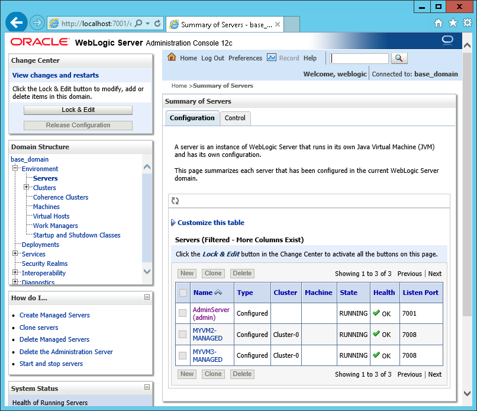

16. Create a load-balanced endpoint set for your managed Virtual Machines:

	1. Within the [Azure Portal](https://ms.portal.azure.com/), in the **Virtual Machines **section, select the first managed Virtual Machine (such as **MYVM2-MANAGED)**.

	2. Click **Settings**, Click **Endpoints,** click **Add.**

	3. Specify a name for the endpoint, specify **TCP** for the protocol, specify public port **80** and private port **7008.**  Leave the rest of the options as-is.

	4. Check **create a load-balanced set** and then click **Complete.**

	5. Specify a name for the load-balanced set, accept the defaults for the other parameters, and then click **Complete. **

17. Create an endpoint for your Virtual Machine:

	1. Log in to the [Azure Portal](https://ms.portal.azure.com/).

	2. Click **Browse**

	3. Click **Virtual Machines**

	4. Select the Virtual Machine

	5. Click **Settings**

	6. Click **Load balanced Sets**.

	7. Click **Join**.

	8. Set the Load Balanced Set type as **Internal**

	9. Specify a name for the endpoint

		1. Use **TCP** for the protocol

		2. Use **80** for the public port

		3. Use **7008** for the probe port. 

	10. Leave the rest of the options as-is

	11. Click **OK**

	12. Wait for this Virtual Machine to join the Load Balanced Set prior to proceeding to the next step.

18. Within the [Azure Portal](https://ms.portal.azure.com/), in the **Virtual Machines** section, select the second managed Virtual Machine (such as **MYVM3-MANAGED**).  Follow the steps above to join to the load-balanced set that you created for the first managed Virtual Machine.

##Deploying an application to the cluster

At this point, you could deploy your application using the following steps. Let’s assume that you’re deploying the Oracle shoppingcart application, available for download at <http://www.oracle.com/webfolder/technetwork/tutorials/obe/fmw/wls/12c/12-ManageSessions--4478/files/shoppingcart.war>.

1. Log in to your Virtual Machine that is serving as the admin for the WebLogic Server cluster (for example, **MYVM1-ADMIN**). 

2. Copy the shoppingcart.war locally. For example, create a folder named **c:\\mywar** and save the WAR at <http://www.oracle.com/webfolder/technetwork/tutorials/obe/fmw/wls/12c/12-ManageSessions--4478/files/shoppingcart.war> to **c:\\mywar**.

3. Open the **WebLogic Server Administration Console**, <http://localhost:7001/console>. When prompted, provide your WebLogic user name and password.

4. Within the **WebLogic Server Administration Console**, click **Lock & Edit**, click **Deployments**, and then click **Install**.

5. For **Path**, type **c:\\myway\\shoppingcart.war**.

	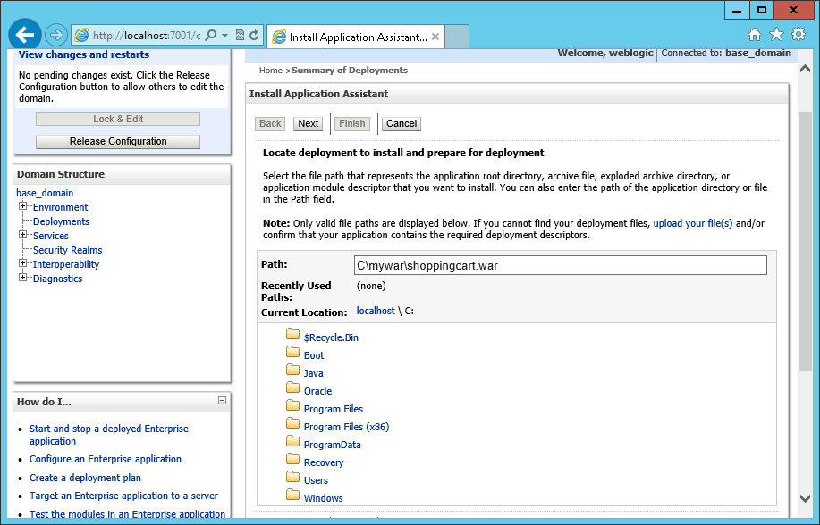

	Click **Next**.

6. Select **Install this deployment as an application** and then click **Next**.

7. Click **Finish**.

8. For **Available Targets**, select the cluster that you previously created, and ensure **All servers in the cluster** is selected, and then click **Next**.

9. Under **Source Accessibility**, select **Copy this application onto every target for me** and then click **Finish**.

10.  Within the **WebLogic Server Administration Console**, click **Save**, and then click **Activate Changes**.

11.  Click **Deployments**, select **shoppingcart**, click **Start**, and then click **Service All Requests**. When prompted to confirm, click **Yes**.

12.  To see the shopping cart application running on the Internet, open a browser to the URL in the form of `http://<<unique_domain_name>>/shoppingcart`. (You can determine the value for `<<unique_domain_name>>` within the [Azure Portal](https://ms.portal.azure.com/) by clicking Virtual Machines and then selecting the Virtual Machine that you are using to run Oracle WebLogic Server).

## Next Steps

To further see that your cluster is operating as expected, you could modify the shoppingcart.war project to display the machine name that services the browser session, start a browser session, stop the machine that serviced the browser session, and refresh the browser session to see that a different machine continues to service the browser session.

For example:

1. Modify the **DWRHeader1.jspf**  file to contain the following code at the top of the file:

		<table>
		
		<tr><td>
<b><h3><% out.println("Your request is served from " + System.getenv("computername") ); %></h3></b>
</td></tr>
		
		</table>             

2. Modify the **weblogic.xm**l file to contain the following code after the comment line `Insert session descriptor element here`.

		<session-descriptor>
			<persistent-store-type>replicated_if_clustered</persistent-store-type>
		</session-descriptor>

3. Recompile and redeploy the updated shoppingcart.war.

4. Open a browser session and run the shoppingcart application. Add some items to the shopping cart, and observe which machine is servicing the browser session.

5. Within the Azure Portal, in the **Virtual Machines** user interface, select the VM that serviced the browser session and click **Shut down**. Wait until the VM status is **Stopped (Deallocated)** before proceeding.

6. Refresh the browser session that is running the shoppingcart application, and see that a different machine is servicing the browser session.

7. Click the shopping cart link, and see the items previously added are still in the shopping cart.

## Additional Resources

Now that you’ve set up your cluster running Oracle WebLogic Server, see the following topics for additional information.

- [Oracle Virtual Machine images - Miscellaneous Considerations](virtual-machines-miscellaneous-considerations-oracle-virtual-machine-images.md)

- [Oracle WebLogic Server Product Documentation](http://www.oracle.com/technetwork/middleware/weblogic/documentation/index.html)

- [Oracle WebLogic Server 12c using Linux on Microsoft Azure](http://www.oracle.com/technetwork/middleware/weblogic/learnmore/oracle-weblogic-on-azure-wp-2020930.pdf)