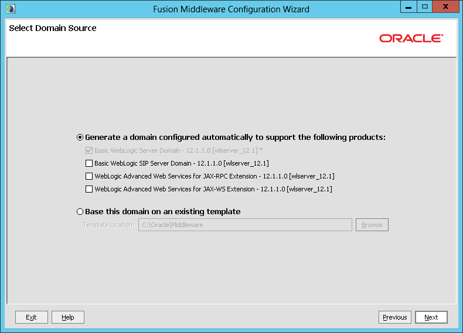
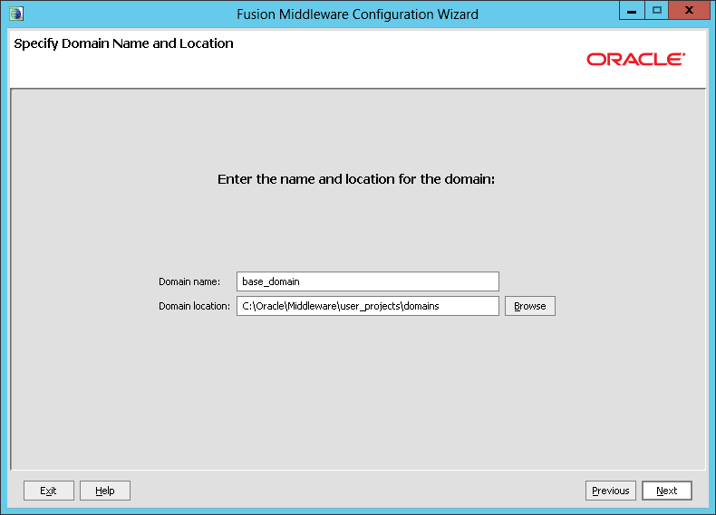
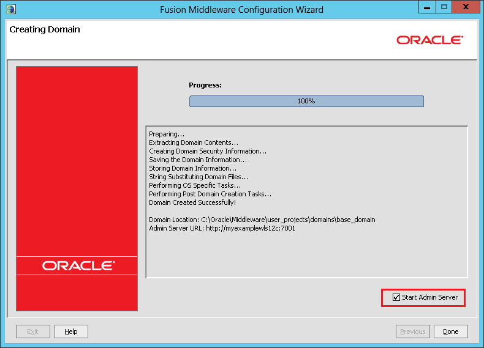

<properties title="Creating an Oracle WebLogic Server 12c Virtual Machine in Azure" pageTitle="Creating an Oracle WebLogic Server 12c Virtual Machine in Azure" description="Step through an example of creating an Oracle WebLogic Server 12c virtual machine running Windows Server 2012 in Microsoft Azure." services="virtual-machines" authors="bbenz" documentationCenter=""/>
<tags ms.service="virtual-machines" ms.devlang="na" ms.topic="article" ms.tgt_pltfrm="na" ms.workload="infrastructure-services" ms.date="06/22/2015" ms.author="bbenz" />
#Creating an Oracle WebLogic Server 12c Virtual Machine in Azure
The following example shows you how you can create a Virtual Machine based on a Microsoft-provided Oracle WebLogic Server 12c image running on Windows Server 2012 in Azure.

##To create an Oracle WebLogic Server 12c Virtual Machine in Azure

1. Log in to the [Azure Portal](https://ms.portal.azure.com/).

2. Click on the **Marketplace**, click **Compute**, then type **Oracle** into the search box.

3.	Select the **Oracle WebLogic Server 12c Standard Edition on Windows Server 2012** or **Oracle WebLogic Server 12c Enterprise Edition on Windows Server 2012** image.  Review the information about this image (such as minimum recommended size), and then click **Next**.

4.	Specify a **Host Nam**e for the VM.

5.	Specify a **User Name** for the VM. Note that this user is for remotely logging into the VM; this is not the Oracle database user name.

6.	Specify and confirm a password for the VM, or provide a SSH Public Key.

7.	Choose a **Pricing Tier**.  Note that Recommended Pricing Tiers are displayed by default, to see all configuration options, click **View all** on the top right.

8.	Set [Optional Configuration](https://msdn.microsoft.com/library/azure/dn763935.aspx) as needed, with these considerations:
	1. Leave **Storage Account** as-is to create a new storage account with the VM name.
	2. Leave **Availability Set** as “Not Configured”.
	3. Do not add any **endpoints** at this time.

9.	Choose or Create a [Resource Group](resource-group-portal.md)

10. Choose a **Subscription**

11. Choose a **Location**

##To configure your Oracle WebLogic Server 12c Virtual Machine in Azure

1. Log in to the [Azure Portal](https://ms.portal.azure.com/).

2.	Click **Virtual Machines**.

3.	Click the name of the Virtual Machine that you want to log in to.

4.	Click **Connect**.

5.	Respond to the prompts as needed to connect to the Virtual Machine. When prompted for the administrator name and password, use the values that you provided when you created the Virtual Machine.

6.	Within the **WebLogic Platform QuickStart** dialog, click **Getting Started with WebLogic Server**. (If the **WebLogic Platform QuickStart** dialog is not already opened, open it by clicking **Windows Start**, typing **Start Admin Server for WebLogic Server Domain**, and then clicking the **Start Admin Server for WebLogic Server Domain** icon.)

7.	In the **Welcome** dialog, select **Create a new WebLogic domain** and then click **Next**.

	

8.	In the **Select Domain Source** dialog, accept the default values and then click **Next**.

	

9.	In the **Specify Domain Name and Location** dialog, accept the default values and then click **Next**.

	

10.	In the **Configure Administrator User Name and Password** dialog:

	1.	[Optional] Change the user name from **weblogic** to a value of your choosing.

	2.	Specify and confirm a password for the WebLogic Server administrator.

	3.	Click **Next**.

	

11.	In the **Configure Server Start Mode and JDK** dialog, select **Production Mode**, select the available JDK (or browser to a JDK if desired), and then click **Next**.

	

12.	In the **Select Optional Configuration** dialog, do not select any options, and then click **Next**.

	

13.	In the **Configuration Summary** dialog, click **Create**.

	

14.	In the **Creating Domain** dialog, check **Start Admin Server** and then click **Done**.

	

15.	A command prompt for **startWebLogic.cmd** is started. When prompted, provide your WebLogic user name and password.

##To install an application on an Oracle WebLogic Server 12c Virtual Machine in Azure
1.	Still logged in to your Virtual Machine, copy the shoppingcart.war example available at http://www.oracle.com/webfolder/technetwork/tutorials/obe/fmw/wls/12c/12-ManageSessions--4478/files/shoppingcart.war locally. For example, create a folder named **c:\mywar** and save the WAR at http://www.oracle.com/webfolder/technetwork/tutorials/obe/fmw/wls/12c/12-ManageSessions--4478/files/shoppingcart.war to **c:\mywar**.

2.	Open the **WebLogic Server Administration Console**, http://localhost:7001/console. When prompted, provide your WebLogic user name and password.

3.	Within the **WebLogic Server Administration Console**, click **Lock & Edit**, click **Deployments**, and then click **Install**.

4.	For **Path**, type **c:\mywar\shoppingcart.war.**

	

	Click **Next**.

5.	Select I**nstall this deployment as an application** and then click **Next**.

6.	Click **Finish**.

7.	Within the **WebLogic Server Administration Console**, click **Save**, and then click **Activate Changes**.

8.	Click **Deployments**, select **shoppingcart**, click **Start**, and then click **Service All Requests**. When prompted to confirm, click **Yes**.

9.	To see the shopping cart application running locally, open a browser to <http://localhost:7001/shoppingcart>

10.	Create an endpoint for your Virtual Machine:

	1. Log in to the [Azure Portal](https://ms.portal.azure.com/).

	2.	Click **Browse**

	3.	Click **Virtual Machines**

	4.	Select the Virtual Machine

	5.	Click **Settings**

	6.	Click **Endpoints**.

	7.	Click **Add**.

	8.	Specify a name for the endpoint

		1. Use **TCP** for the protocol

		2. Use **80** for the public port

		3. Use **7001** for the private port.

	9.	Leave the rest of the options as-is

	10. Click **OK**

11.	Allow an inbound connection through the firewall to port 7001.

	1.	Log in to your Virtual Machine.

	2.	Click **Windows Start**, type **Windows Firewall with Advanced Security**, and then click the **Windows Firewall with Advanced Security** icon. This opens the **Windows Firewall with Advanced Security** management console.

	3.	Within the firewall management console, click **Inbound Rules** in the left hand pane (if you don’t see **Inbound Rules**, expand the top node in the left hand pane), and then click New Rule in the right hand pane.

	4.	For **Rule Type**, select **Port** and click **Next**.

	5.	For **Protocol and Port**, select **TCP**, select **Specific local ports**, enter **7001** for the port, and then click **Next**.

	6.	Select **Allow the connection** and click **Next**.

	7.	Accept the defaults for the profiles for which the rule applies and click **Next**.

	8.	Specify a name for the rule and optionally a description, and then click **Finish**.

12.	To see the shopping cart application running on the Internet, open a browser to the URL in the form of `http://<<unique_domain_name>>/shoppingcart`. (You can determine the value for <<*unique_domain_name*>> within the [Azure Portal](https://ms.portal.azure.com/) by clicking **Virtual Machines** and then selecting the Virtual Machine that you are using to run Oracle WebLogic Server).

##Additional resources
Now that you’ve set up your Virtual Machine running Oracle WebLogic Server, see the following topics for additional information.

-	[Oracle Virtual Machine images - Miscellaneous Considerations](virtual-machines-miscellaneous-considerations-oracle-virtual-machine-images.md)

-	[Oracle WebLogic Server Product Documentation](http://www.oracle.com/technetwork/middleware/weblogic/documentation/index.html)

-	[Oracle WebLogic Server 12c using Linux on Microsoft Azure](http://www.oracle.com/technetwork/middleware/weblogic/learnmore/oracle-weblogic-on-azure-wp-2020930.pdf)

-	[Oracle Virtual Machine images for Azure](virtual-machines-oracle-list-oracle-virtual-machine-images.md)
