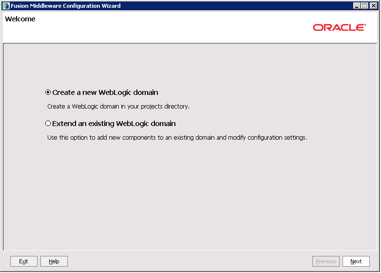
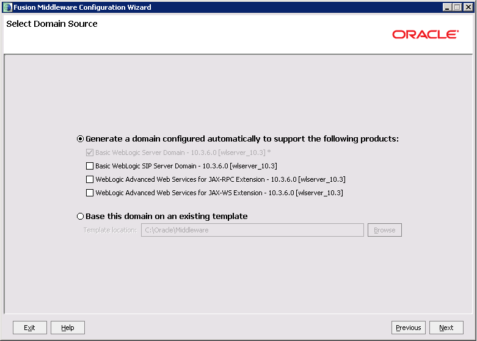
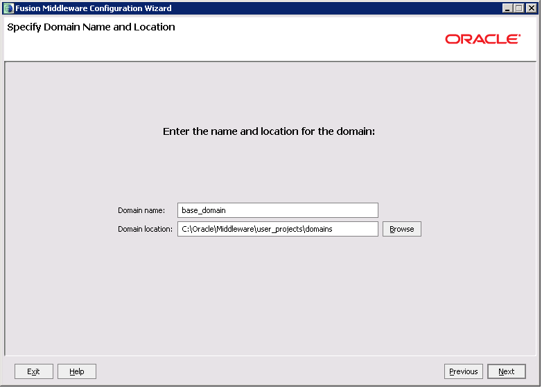
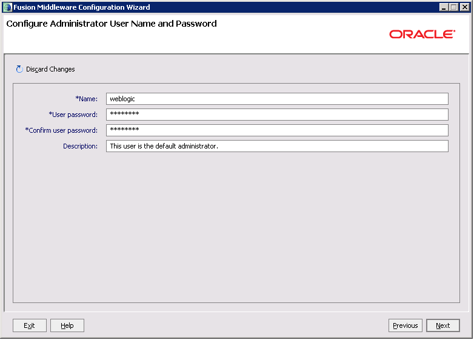
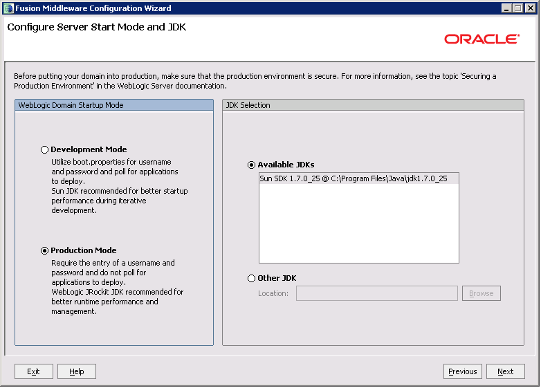
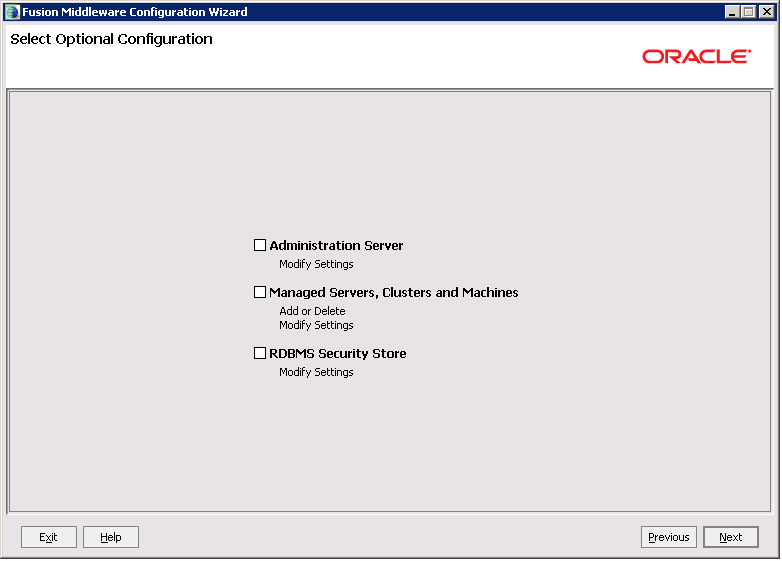
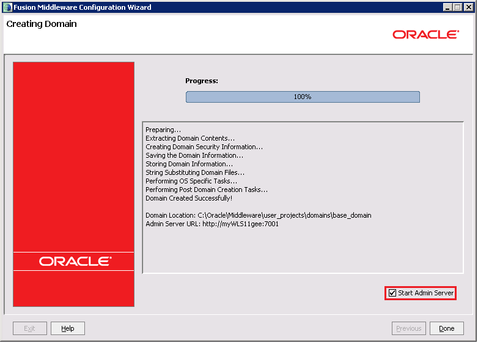
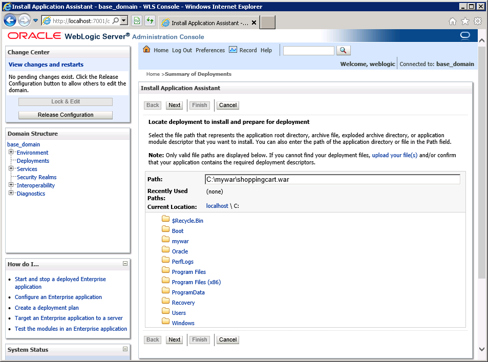

<properties title="Creating an Oracle WebLogic Server 11g virtual machine in Azure" pageTitle="Creating an Oracle WebLogic Server 11g virtual machine in Azure" description="Step through an example of creating an Oracle WebLogic Server 11g virtual machine in Microsoft Azure." services="virtual-machines" authors="bbenz" documentationCenter=""/>
<tags ms.service="virtual-machines" ms.devlang="na" ms.topic="article" ms.tgt_pltfrm="na" ms.workload="infrastructure-services" ms.date="06/22/2015" ms.author="bbenz" />
#Creating an Oracle WebLogic Server 11g virtual machine in Azure
The following example shows you how you can create a virtual machine based on a Microsoft-provided Oracle WebLogic Server 11g image running on Windows Server 2008 R2 in Azure.

##To create an Oracle WebLogic Server 11g virtual machine in Azure

1. Log in to the [Azure portal](https://ms.portal.azure.com/).

2. Click **Marketplace**, click **Compute**, and then enter **Oracle** into the search box.

3. Select the or review the information about this image (such as minimum recommended size), and then click .

4. Specify a **Host Name** for the VM.

5. Specify a **User Name** for the VM. Note that this user is for remotely logging in to the VM; this is not the Oracle database user name.

6. Specify and confirm a password for the VM, or provide a SSH Public Key.

7. Note that Recommended Pricing Tiers are displayed by default, to see all configuration options, click **View all** on the top right.

8. Set [optional configuration](https://msdn.microsoft.com/library/azure/dn763935.aspx) as needed, with these considerations:

	a. Leave **Storage Account** as-is to create a new storage account with the VM name.

	b. Leave **Availability Set** as “Not Configured”.

	c. Do not add any **endpoints** at this time.

9. Choose or Create a [resource group](resource-group-portal.md).

10. Choose a **Subscription**

11. Choose a **Location**

##To configure your Oracle WebLogic Server 11g virtual machine in Azure

1. Log in to the [Azure portal](https://ms.portal.azure.com/).

2. Click **Virtual Machines**.

3. Click the name of the virtual machine that you want to log in to.

4. Click **Connect**.

5. Respond to the prompts as needed to connect to the virtual machine. When prompted for the administrator name and password, use the values that you provided when you created the virtual machine.

6. Start Windows, click **Start** > **All Programs** > **Oracle WebLogic** > **WebLogic Server 11g R1** > **Tools**, and then click **Configuration Wizard**.

7. On the **Welcome** page, select **Create a new WebLogic domain** and then click **Next**.

	

8. On the **Select Domain Source** page, accept the default values and then click **Next**.

	

9. On the **Specify Domain Name and Location** page, accept the default values and then click **Next**.

	

10. On the **Configure Administrator User Name and Password** page:

	a. [Optional] Change the user name from **weblogic** to a value of your choosing.

	b. Specify and confirm a password for the WebLogic Server administrator.

	c. Click **Next**.

	

11. On the **Configure Server Start Mode and JDK** page, select **Production Mode**, select the available JDK (or browse to a JDK if desired), and then click **Next**.

	

12.	On the **Select Optional Configuration** page, do not select any options, and then click **Next**.

	

13.	On the **Configuration Summary** page, click **Create**.

	

14.	On the **Creating Domain** page, select **Start Admin Server** and then click **Done**.

	

15.	A command prompt for startWebLogic.cmd is started. When prompted, provide your WebLogic user name and password.

## To install an application on an Oracle WebLogic Server 11g virtual machine in Azure

1. Still logged in to your virtual machine, copy the shoppingcart.war example available at [http://www.oracle.com/webfolder/technetwork/tutorials/obe/fmw/wls/12c/12-ManageSessions--4478/files/shoppingcart.war](http://www.oracle.com/webfolder/technetwork/tutorials/obe/fmw/wls/12c/12-ManageSessions--4478/files/shoppingcart.war) locally. For example, create a folder named c:\mywar and save the WAR at [http://www.oracle.com/webfolder/technetwork/tutorials/obe/fmw/wls/12c/12-ManageSessions--4478/files/shoppingcart.war](http://www.oracle.com/webfolder/technetwork/tutorials/obe/fmw/wls/12c/12-ManageSessions--4478/files/shoppingcart.war) to c:\mywar.

2. Open the **WebLogic Server Administration Console**, [http://localhost:7001/console](http://localhost:7001/console). When prompted, provide your WebLogic user name and password.

3. In the **WebLogic Server Administration Console**, click **Lock & Edit** > **Deployments**, and then click **Install**.

4. For **Path**, type `c:\mywar\shoppingcart.war`, and then click **Next**.

	

5. Select **Install this deployment as an application**, and then click **Next**.

6. Click **Finish**.

7. In the **WebLogic Server Administration Console**, click **Activate Changes**.

8. Click **Deployments**, select **shoppingcart**, click **Start**, and then click **Servicing All Requests**. When prompted to confirm, click **Yes**.

9. To see the shopping cart application running locally, open a browser to [http://localhost:7001/shoppingcart](http://localhost:7001/shoppingcart)

10.  Allow an inbound connection through the firewall to port 7001.

	a. While still logged in to your **Virtual Machine**, in Windows, click **Start**, click **Control Panel**, click **System and Security**, click **Windows Firewall**, and then click **Advanced settings**. This opens the **Windows Firewall with Advanced Security** management console.

	b. Within the firewall management console, click **Inbound Rules** in the left pane (if you don’t see **Inbound Rule**s, expand the top node in the left pane), and then click **New Rule** in the right pane.

	c. For** Rule Type**, select **Port** and then click **Next**.

	d. For **Protocol and Port**, select **TCP**, select **Specific local ports**, enter **7001** for the port, and then click **Next**.

	e. Select **Allow the connection** and then click **Next**.

	f. Accept the defaults for the profiles for which the rule applies, and then click **Next**.

	g. Specify a name for the rule and optionally a description, and then click **Finish**.

11. Create an endpoint for your virtual machine:

	a. Log in to the [Azure portal](https://ms.portal.azure.com/).

    b. Click **Browse**.

    c. Click **Virtual Machines**.

    d. Select the virtual machine.

	e. Click **Settings**.

    f. Click **Endpoints**.

    g. Click **Add**.

    h. Specify a name for the endpoint. Use **TCP** for the protocol, use **80** for the public port, and use **7001** for the private port.

    i. Leave the other options as-is.

	j. Click **OK**

12. To see the shopping cart application running on the Internet, open a browser to the URL in the form of `http://<<unique_domain_name>>/shoppingcart`. (You can determine the value for `<<unique_domain_name>>` within the [Azure portal](https://ms.portal.azure.com/) by clicking **Virtual Machines** and then selecting the virtual machine that you are using to run Oracle WebLogic Server).

## Additional resources

Now that you’ve set up your virtual machine running Oracle WebLogic Server, see the following topics for additional information.

- [Oracle virtual machine images - Miscellaneous considerations](virtual-machines-miscellaneous-considerations-oracle-virtual-machine-images.md)

- [Oracle WebLogic Server product documentation](http://www.oracle.com/technetwork/middleware/weblogic/documentation/index.html)

- [Oracle virtual machine images for Azure](virtual-machines-oracle-list-oracle-virtual-machine-images.md)
