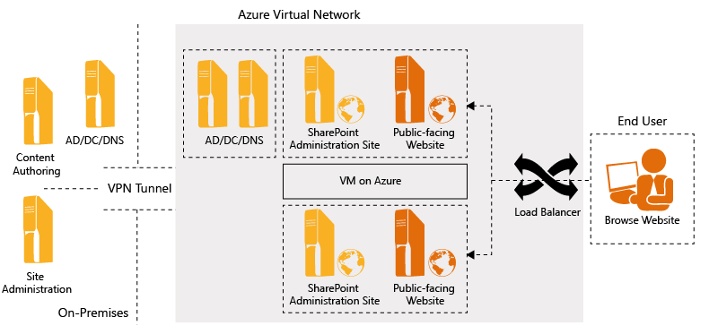
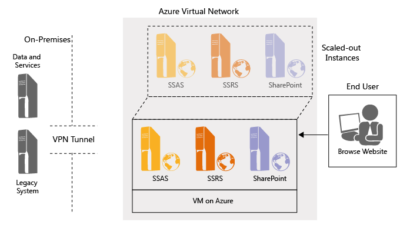
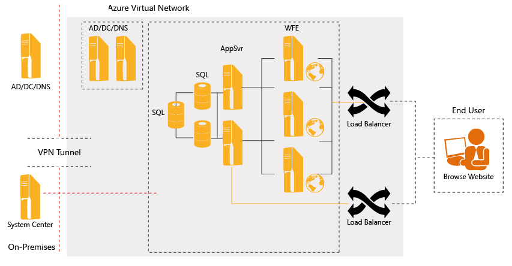

<properties
	pageTitle="SharePoint Server 2010 on Azure VMs | Microsoft Azure"
	description="Learn the value of SharePoint on Azure virtual machines, the step-by-step process, and the supported scenarios for using SharePoint 2010."
	services="virtual-machines"
	documentationCenter=""
	authors="JoeDavies-MSFT"
	manager="timlt"
	editor=""
	tags="azure-service-management"/>

<tags
	ms.service="virtual-machines"
	ms.workload="infrastructure-services"
	ms.tgt_pltfrm="vm-windows-sharepoint"
	ms.devlang="na"
	ms.topic="article"
	ms.date="07/09/2015"
	ms.author="josephd"/>

# SharePoint 2010 deployment on Azure virtual machines

Microsoft SharePoint Server 2010 provides rich deployment flexibility, which can help organizations determine the appropriate deployment scenarios to align with their business needs and objectives. Hosted and managed in Microsoft Azure, the Azure Virtual Machines offering provides complete, reliable, and available infrastructure to support various on-demand application and database workloads, such as Microsoft SQL Server and SharePoint deployments.

While Azure virtual machines support multiple workloads, this article focuses on SharePoint deployments. Azure virtual machines enable organizations to create and manage their SharePoint infrastructure by quickly provisioning and accessing nearly any host universally. It allows full control and management over processors, RAM, CPU ranges, and other resources of SharePoint virtual machines.

Azure virtual machines mitigate the need for hardware, so organizations can turn attention from handling high, upfront cost and complexity to building and managing infrastructure at scale. This means that they can innovate, experiment, and iterate in hours, as opposed to days and weeks with traditional deployments.

> [AZURE.NOTE] For information about deploying SharePoint 2013 in Azure, see [Planning for SharePoint 2013 on Azure infrastructure services](https://msdn.microsoft.com/library/dn275958.aspx) and [SharePoint farms hosted in Azure infrastructure services](virtual-machines-sharepoint-infrastructure-services.md).

## SharePoint on Azure virtual machines

SharePoint 2010 flexibly supports most of the workloads in an Azure virtual machines deployment. Azure virtual machines are an optimal fit for FIS (SharePoint Server for Internet sites) and development scenarios. Core SharePoint workloads are also supported. If an organization wants to manage and control its own SharePoint 2010 implementation while capitalizing on options for virtualization in a cloud infrastructure, Azure virtual machines are ideal for deployment.

The Azure Virtual Machines offering is hosted and managed in the cloud. It provides deployment flexibility and reduces cost by mitigating capital expenditures due to hardware procurement. With increased infrastructure agility, organizations can deploy SharePoint Server in hours, as opposed to days or weeks. Azure virtual machines also enable organizations to deploy SharePoint workloads in the cloud using a "pay-as-you-go" model. As SharePoint workloads grow, an organization can rapidly expand the infrastructure. Then, when computing needs decline, it can return the resources that are no longer needed, thereby paying only for what is used.

### Shift in IT focus

Many organizations contract out the common components of their IT infrastructure and management, such as hardware, operating systems, security, data storage, and backup, while maintaining control of mission-critical applications, such as SharePoint Server. By delegating all non-mission-critical service layers of their IT platforms to a virtual provider, organizations can shift their IT focus to core, mission-critical SharePoint services and deliver business value with SharePoint projects, instead of spending more time on setting up infrastructure.

### Faster deployment

Supporting and deploying a large SharePoint infrastructure can hamper IT's ability to move rapidly to support business requirements. The time that is required to build, test, and prepare SharePoint servers and farms and deploy them into a production environment can take weeks or even months, depending on the processes and constraints of the organization. Azure virtual machines allow organizations to quickly deploy their SharePoint workloads without capital expenditures for hardware. In this way, organizations can capitalize on infrastructure agility to deploy in hours instead of days or weeks.

### Scalability

Without the need to deploy, test, and prepare physical SharePoint servers and farms, organizations can expand and contract compute capacity on demand, at a moment's notice. As SharePoint workload requirements grow, an organization can rapidly expand its cloud infrastructure. Likewise, when computing needs decrease, the organization can diminish resources, paying only for what it uses. The Azure virtual machines reduce upfront expenses and long-term commitments, enabling organizations to build and manage SharePoint infrastructures at scale. Again, this means that these organizations can innovate, experiment, and iterate in hours, as opposed to days and weeks using traditional deployments.

### Metered usage

Azure virtual machines provide computing power, memory, and storage for SharePoint scenarios, whose prices are typically based on resource consumption. Organizations pay only for what they use, and the service provides all capacity needed for running the SharePoint infrastructure. For more information about pricing and billing, go to [Azure pricing details](http://azure.microsoft.com/pricing/). Note that there are nominal charges for storage and data transfers from Azure to an on-premises network. However, Azure does not charge for uploading data.

### Flexibility

Azure virtual machines provide developers with the flexibility to pick their desired language or runtime environment, with official support for .NET, Node.js, Java, and PHP. Developers also can choose their tools, with support for Microsoft Visual Studio, WebMatrix, Eclipse, and text editors. Further, Microsoft delivers a low-cost, low-risk path to the cloud and offers cost-effective, easy provisioning and deployment for cloud reporting needs while providing access to business intelligence (BI) across devices and locations. Finally, with the Azure offering, users not only can move VHDs to the cloud, but also can copy a VHD back down and run it locally or through another cloud provider, as long as they have the appropriate license.

## Provisioning process

The image library in Azure provides the list of available preconfigured virtual machines. Users can publish SharePoint Server, SQL Server, Windows Server, and other ISO/VHDs to the image library. To simplify the creation of virtual machines, base images are created and published to the library. Authorized users can use these images to generate the desired virtual machine. For more information, go to [Create a virtual machine running Windows in the Azure preview portal](virtual-machines-windows-tutorial.md). Figure 1 shows the basic steps for creating a virtual machine using the Azure portal.

**Figure 1: Overview of steps for creating a virtual machine**

Users also can upload a sysprepped image on the Azure Management Portal. For more information, go to [Create and upload a Windows Server VHD to Azure](virtual-machines-create-upload-vhd-windows-server.md). Figure 2 shows the basic steps for uploading an image to create a VM.

On the Azure portal, users also can upload an image on which the SysPrep tool has already been run. For more information, go to [Create and upload a Windows Server VHD to Azure](virtual-machines-create-upload-vhd-windows-server.md). Figure 2 shows the basic steps for uploading an image to create a virtual machine.

**Figure 2: Overview of steps for uploading an image**

## Deploying SharePoint 2010 on Azure 

You can deploy SharePoint 2010 on Azure by following these steps:

1. Sign in to the [Azure Management Portal](http://manage.windowsazure.com/) through your Azure subscription account. If you do not have an Azure account, [sign up for a free trial of Azure](http://azure.microsoft.com/pricing/free-trial/).
2. To create a virtual machine with the base operating system, on the Azure portal, click **New > Compute > Virtual Machine > From Gallery**.
3. The **Choose an image** dialog box appears. Click the **Windows Server 2008 R2 SP1** platform image, and then click the right arrow.
4. The **Virtual machine configuration** dialog box appears. Provide the following information:
	- Enter a **Virtual Machine Name**.
	- Select the appropriate size. For a production environment (SharePoint application server and database), we recommend to use A3 (4 Core, 7 gigabyte (GB) memory) or larger.
	- In **New User Name**, type a local administrator account name.
	- In **New Password**, type a strong password.
	- In **Confirm**, retype the password, and then click the right arrow.
5. The second **Virtual machine configuration** dialog box appears. Provide the following information:
	- In **Cloud Service**, select **Create a new cloud service**, in which case you must also provide a cloud service DNS name, or select an existing cloud service.
	- In **Region/Affinity Group/Virtual Network**, select the region where the virtual image will be hosted.
	- In the **Storage account**, click **Use an automatically generated storage account** or select an existing storage account name. Only one storage account per region is automatically created. All other virtual machines created with this setting are located in this Storage account. You are limited to 20 Storage accounts. For more information, go to [Create a Storage account in Azure](virtual-machines-create-upload-vhd-windows-server.md#step-2-create-a-storage-account-in-azure).
	- In **Availability Set**, select **(none)**, and then click the right arrow.
6. In the third **Virtual machine configuration** dialog box, click the checkmark to create the virtual machine.

To connect to the virtual machine, see [How to sign in to a virtual machine running Windows Server](virtual-machines-log-on-windows-server.md).

Build the SQL Server virtual machine using any of the following options:

- Create a SQL Server 2012 virtual machine by following steps 1 to 7 above, except in step 3, use the SQL Server 2012 image instead of the Windows Server 2008 R2 SP1 image. For more information, go to [Provisioning a SQL Server virtual machine on Azure](virtual-machines-provision-sql-server.md).
	- When you click this option, the provisioning process keeps a copy of SQL Server 2012 setup files in the C:\SQLServer_11.0_Full directory path so that you can customize the installation. For example, you can convert the evaluation installation of SQL Server 2012 to a licensed version by using your license key.

- Use the SQL Server System Preparation (SysPrep) tool to install SQL Server on the virtual machine with the base operating system (as shown above in steps 1 to 7). For more information, go to [Install SQL Server 2012 using SysPrep](http://msdn.microsoft.com/library/ee210664.aspx).

- Use the command prompt to install SQL Server. For more information, go to [Install SQL Server 2012 from the command prompt](http://msdn.microsoft.com/library/ms144259.aspx#SysPrep).

- Use supported SQL Server media and your license key to install SQL Server on the virtual machine with the base operating system (as shown above in steps 1 to 7).

Build the SharePoint farm using the following steps:

Step 1. Configure the Azure subscription using script files.

Step 2. Provision SharePoint servers by creating another virtual machine with base operating system (as shown above in steps 1 to 6). To build a SharePoint server on this virtual machine, choose one of the following options:

- Provision using the SharePoint GUI:
	- To create and provision a SharePoint farm, go to [Create a Microsoft SharePoint server farm](http://technet.microsoft.com/library/ee805948.aspx#CreateConfigure).
	- To add a web or application server to the farm, go to [Add a web or application server to the farm](http://technet.microsoft.com/library/cc261752.aspx).
	- To add a database server to an existing farm, go to [Add a database server to an existing farm](http://technet.microsoft.com/library/cc262781).
	- To use SQL Server 2012 for your SharePoint farm, you must download and install Service Pack 1 for SharePoint Server 2010 after installing the application and choosing not to configure the server. For more information, go to [Service Pack 1 for SharePoint Server 2010](http://www.microsoft.com/download/details.aspx?id=26623).
	- To take advantage of SQL Server BI features, we recommend to install SharePoint Server as a server farm instead of a standalone server. For more information, go to [Install SQL Server 2012 business intelligence features](http://technet.microsoft.com/library/hh231681.aspx).

- Provision using Windows PowerShell: You can use the Psconfig command-line tool as an alternative interface to perform several operations that control how SharePoint 2010 products are provisioned. For more information, go to [Psconfig command-line reference](http://technet.microsoft.com/library/cc263093.aspx).

Step 3. Configure SharePoint. After each SharePoint virtual machine is in the ready state, configure SharePoint Server on each server by using one of the following options:

- Configure SharePoint from the GUI.
- Configure SharePoint using Windows PowerShell. For more information, go to [Install SharePoint Server 2010 by using Windows PowerShell](http://technet.microsoft.com/library/cc262839.aspx).
- You also can use the CodePlex Project's AutoSPInstaller, which consists of Windows PowerShell scripts, an XML input file, and a standard Microsoft Windows batch file. AutoSPInstaller provides a framework for a SharePoint 2010 installation script based on Windows PowerShell. For more information, go to [CodePlex: AutoSPInstaller](http://autospinstaller.codeplex.com/).

Step 4. After the script is finished, connect to the virtual machine using the Virtual Machine Dashboard.

To verify the SharePoint configuration, sign in to the SharePoint Server, and then use Central Administration.

> [AZURE.NOTE] Be sure to configure security on the Azure portal endpoint and set an inbound port on the virtual machine's Windows Firewall. Then, confirm that you can start a remote Windows PowerShell session to one of the SharePoint application servers by opening a Windows PowerShell session with administrator credentials.

### Creating and uploading a virtual hard disk

You also can create your own images and upload them to Azure as a VHD file. For information, see [Create and upload a Windows Server VHD to Azure](virtual-machines-create-upload-vhd-windows-server.md).

## Usage scenarios

This section discusses some leading customer scenarios for SharePoint deployments using Azure virtual machines.

### Scenario 1: Simple SharePoint development and test environment

Organizations are looking for more agile ways to create SharePoint applications and set up SharePoint environments for onshore/offshore development and testing. Fundamentally, they want to shorten the time required to set up SharePoint application development projects, and decrease cost by increasing the use of their test environments. For example, an organization might want to perform on-demand load testing on SharePoint Server and execute user acceptance testing (UAT) with more concurrent users in different geographic locations. Similarly, integrating onshore/offshore teams is an increasingly important business need for many of today's organizations.

This scenario explains how organizations can use preconfigured SharePoint farms for development and test workloads. A SharePoint deployment topology looks and feels exactly as it would in an on-premises virtualized deployment. Existing IT skills translate 1:1 to an Azure virtual machines deployment, with the major benefit being an almost complete cost shift from capital expenditures to operational expenditures. No upfront physical server purchase is required. Organizations can eliminate the capital cost for server hardware and achieve flexibility by greatly reducing the provisioning time required to create, set up, or extend a SharePoint farm for a testing and development environment. IT can dynamically add and remove capacity to support the changing needs of testing and development. Plus, IT can focus more on delivering business value with SharePoint projects and less on managing infrastructure.

To fully utilize load-testing computers, organizations can configure SharePoint virtualized development and test computers on Azure with operating system support for Windows Sever 2008 R2. This enables development teams to create and test applications and easily migrate to on-premises or cloud production environments without code changes. The same frameworks and toolsets can be used on-premises and in the cloud, allowing distributed team access to the same environment. Users also can access on-premises data and applications by establishing a direct VPN connection.

Figure 3 shows a SharePoint development and testing environment on an Azure virtual machine. To build this deployment, start by using the same on-premises SharePoint development and testing environment used to develop applications. Then, upload and deploy the applications to the Azure virtual machine for testing and development. If your organization decides to move the application back on-premises, it can do so without having to modify the application.

**Figure 3: SharePoint development and testing environment on Azure virtual machines**

To implement a SharePoint development and testing environment on Azure, follow these steps:

1. Provision: First, provision a VPN connection between on-premises and Azure using Azure Virtual Network. (Because Active Directory is not used here, a VPN tunnel is needed.) For more information, go to [Virtual Network overview](../virtual-network/virtual-networks-overview.md). Then, use the Azure portal to provision a new virtual machine using a stock image from the image library.
	- You can upload the on-premises SharePoint development and testing virtual machines to your Azure storage account and reference those virtual machines through the image library for building the required environment.
	- You can use the SQL Server 2012 image instead of the Windows Server 2008 R2 SP1 image. For more information, go to [Provision a SQL Server virtual machine on Azure](virtual-machines-provision-sql-server.md).

2. Install: Install SharePoint Server, Visual Studio, and SQL Server on the virtual machines using a Remote Desktop connection.
	- Use the SharePoint 2010 Easy Setup Script to build a SharePoint developer machine. For more information, go to [SharePoint 2010 Easy Setup Script](http://www.microsoft.com/download/details.aspx?id=23415). Use Windows PowerShell. For more information, go to [Install SharePoint Server 2010 by using Windows PowerShell](http://technet.microsoft.com/library/cc262839.aspx). Use the CodePlex Project's AutoSPInstaller. For more information, go to [CodePlex: AutoSPInstaller](http://autospinstaller.codeplex.com/).
	- Install Visual Studio. For more information, go to [Visual Studio installation](http://msdn.microsoft.com/library/e2h7fzkw.aspx).
	- Install SQL Server. For more information, go to [Install SQL Server using SysPrep](http://msdn.microsoft.com/library/ee210664.aspx).
3. Develop deployment packages and scripts for applications and databases: If you plan to use an available virtual machine from the image library, the desired on-premises applications and databases can be deployed on Azure virtual machines:
	- Create deployment packages for the existing on-premises applications and databases using SQL Server Data Tools and Visual Studio.
	- Use these packages to deploy the applications and databases on Azure virtual machines.
4. Deploy SharePoint applications and databases:
	- Configure security on the Azure portal endpoint and set an inbound port in the virtual machine's Windows Firewall.
	- Deploy SharePoint applications and databases to Azure virtual machines using the deployment packages and scripts created in step 3.
- Test deployed applications and databases.
5. Manage virtual machines:
	- Monitor the virtual machines using the Azure portal.
	- Monitor the applications using Visual Studio and SQL Server Management Studio.
	- You also can monitor and manage the virtual machines using on-premises management software, like Microsoft System Center Operations Manager.

### Scenario 2: Public-facing SharePoint farm with customization

Organizations want to create an Internet presence that is hosted in the cloud and is easily scalable based on need and demand. They also want to create partner extranet websites for collaboration and implement an easy process for distributed authoring and approval of website content. Finally, to handle increasing loads, these organizations want to provide capacity on demand to their websites.

In this scenario, SharePoint Server is used as the basis for hosting a public-facing website. It enables organizations to rapidly deploy, customize, and host their business websites on a secure, scalable cloud infrastructure. With SharePoint public-facing websites on Azure, organizations can scale as traffic grows and pay only for what they use. Common tools, similar to those used on-premises, can be used for content authoring, workflow, and approval with SharePoint on Azure.

Further, using Azure Virtual Machines, organizations can easily configure staging and production environments running on virtual machines. SharePoint public-facing virtual machines created in Azure can be backed up to virtual storage. In addition, for disaster recovery purposes, the Continuous Geo-Replication feature allows organizations to automatically back up virtual machines located in one datacenter to another datacenter miles away.

Virtual machines in the Azure infrastructure are validated and supported for working with other Microsoft products, such as SQL Server and SharePoint Server. Azure and SharePoint Server are better together: Both are thoroughly integrated, supported, and tested together to provide an optimal experience. They both have a single point of support for the SharePoint application and the Azure infrastructure.

In this scenario, more front-end web servers for SharePoint Server must be added to support extra traffic. These servers require enhanced security and Active Directory Domain Services domain controllers to support user authentication and authorization. Figure 4 shows the layout for this scenario.

**Figure 4: Public-facing SharePoint farm with customization**

To implement a public-facing SharePoint farm on Azure, follow these steps:

1. Deploy Active Directory: The fundamental requirements for deploying Active Directory on Azure virtual machines are similar but not identical to deploying it on virtual machines (and, to some extent, physical machines) on-premises. For more information about the differences, guidelines, and other considerations, go to [Guidelines for deploying Active Directory on Azure Virtual Machines](http://msdn.microsoft.com/library/jj156090). To deploy Active Directory in Azure:
	- Define and create a virtual network where the virtual machines can be assigned to specific subnets.
	- Use the Azure portal to create and deploy the domain controller on a new virtual machine on Azure. You also can refer to the Windows PowerShell script to deploy a stand-alone domain in the cloud using Azure Virtual Machines and Azure Virtual Network. For more information about creating a new Active Directory forest on a virtual machine on Azure Virtual Network, go to [Install a new Active Directory forest in Azure](active-directory-new-forest-virtual-machine.md).
2. Provision a virtual machine: Use the Azure portal to provision a new virtual machine from a stock image in the image library.
3. Deploy a SharePoint farm.
	- Use the Azure portal to configure the load balancing. Configure the virtual machine endpoints, select the option to load balance traffic on an existing endpoint, and then specify the name of the load-balanced virtual machine.
	- Add another front-end web virtual machine to the existing SharePoint farm for extra traffic.
3. Manage virtual machines:
	- Monitor the virtual machines using the Azure portal.
	- Monitor the SharePoint farm using Central Administration.

### Scenario 3: Scaled-out farm for additional BI services

Business intelligence (BI) is essential to gaining key insights and making rapid, sound decisions. As organizations transition from an on-premises approach, they do not want to make changes to the BI environment while deploying existing BI applications to the cloud. They want to host reports from SQL Server Analysis Services (SSAS) or SQL Server Reporting Services (SSRS) in a highly durable and available environment, while keeping full control of the BI application - all without spending much time and budget on maintenance.

This scenario describes how organizations can use Azure virtual machines to host mission-critical BI applications. Organizations can deploy SharePoint farms in Azure virtual machines and scale out the application server virtual machine's BI components, like SSRS or Excel Services. By scaling resource-intensive components in the cloud, they can better and more easily support specialized workloads. Note that SQL Server in Azure virtual machines performs well, as it is easy to scale SQL Server instances, ranging from small to extra-large installations. This provides elasticity, enabling organizations to dynamically provision (expand) or de-provision (shrink) BI instances based on immediate workload requirements.

Migrating existing BI applications to Azure provides better scaling. With the power of SQL Server Analysis Services (SSAS), SQL Server Reporting Service (SSRS), and SharePoint Server, organizations can create powerful BI and reporting applications and dashboards that scale up or down. These applications and dashboards also can be more securely integrated with on-premises data and applications. Azure ensures datacenter compliance with support for ISO 27001. For more information, go to the [Azure trust center](http://azure.microsoft.com/support/trust-center/compliance/).

To scale out the deployment of BI components, a new application server with services such as PowerPivot, Power View, Excel Services, or PerformancePoint services must be installed. Or, SQL Server BI instances like SSAS or SSRS must be added to the existing farm to support additional query processing. The server can be added as a new Azure virtual machine with SharePoint 2010 Server or SQL Server installed. Then, the BI components can be installed, deployed, and configured on that server (Figure 5).

**Figure 5: Scaled-out SharePoint farm for additional BI services**

To scale out a BI environment on Azure, follow these steps:

1. Provision:
	- Provision a VPN connection between on-premises and Azure using Azure Virtual Network. For more information, go to [Virtual Network Overview](http://msdn.microsoft.com/library/jj156007.aspx).
	- Use the Azure portal to provision a new virtual machine from a stock image in the image library. You can upload SharePoint Server or SQL Server BI workload images to the image library and any authorized user can pick those BI component virtual machines to build the scaled-out environment.
2. Install: 
	- If your organization does not have prebuilt images of SharePoint Server or SQL Server BI components, install SharePoint Server and SQL Server on the virtual machines using a Remote Desktop connection.
	- For more information about installing SharePoint, go to [Install SharePoint Server 2010 by using Windows PowerShell](http://technet.microsoft.com/library/cc262839.aspx) or [CodePlex: AutoSPInstaller](http://autospinstaller.codeplex.com/).
	- For more information about installing SQL Server, go to [Install SQL Server using SysPrep](http://msdn.microsoft.com/library/ee210664.aspx).
3. Add the BI virtual machine:
	- Configure security on the Azure portal endpoint and set an inbound port in the virtual machine's Windows Firewall.
	- Add the newly created BI virtual machine to the existing SharePoint or SQL Server farm.
4. Manage virtual machines:
	- Monitor the virtual machines using the Azure portal.
	- Monitor the SharePoint farm using Central Administration.
	- Monitor and manage the virtual machines using on-premises management software like Microsoft System Center - Operations Manager.

### Scenario 4: Completely customized SharePoint-based website

Increasingly, organizations want to create fully customized SharePoint websites in the cloud. They need a highly durable and available environment that offers full control to maintain complex applications running in the cloud, but they do not want to spend a large amount of time and budget.

In this scenario, an organization can deploy its entire SharePoint farm in the cloud and dynamically scale all components to get additional capacity, or it can extend its on-premises deployment to the cloud to increase capacity and improve performance, when needed. The scenario focuses on organizations that want the full SharePoint experience for application development and enterprise content management. The more complex sites also can include enhanced reporting, Power View, PerformancePoint, PowerPivot, in-depth charts, and most other SharePoint site capabilities for end-to-end, full functionality.

Organizations can use Azure virtual machines to host customized applications and associated components on a cost-effective and highly secure cloud infrastructure. They also can use on-premises Microsoft System Center as a common management tool for on-premises and cloud applications.

To implement a completely customized SharePoint website on Azure, an organization must deploy an Active Directory domain in the cloud and provision new virtual machines into this domain. Then, a virtual machine running SQL Server 2012 must be created and configured as part of a SharePoint farm. Finally, the SharePoint farm must be created, load balanced, and connected to Active Directory and SQL Server (Figure 6).

**Figure 6: Completely customized SharePoint-based website**

The following steps show how to create a customized SharePoint farm environment from prebuilt images available in the image library. Note, however, that you also can upload SharePoint farm virtual machines to the image library, and authorized users can choose those virtual machines to build the required SharePoint farm on Azure.

1. Deploy Active Directory: The fundamental requirements for deploying Active Directory on Azure virtual machines are similar but not identical to deploying it on virtual machines (and, to some extent, physical machines) on-premises. For more information about the differences, guidelines, and other considerations, go to [Guidelines for deploying Active Directory on Azure virtual machines](http://msdn.microsoft.com/library/jj156090). To deploy Active Directory in Azure:
	- Define and create a virtual network where the virtual machines can be assigned to specific subnets.
	- Use the Azure Portal to create and deploy the domain controller on a new virtual machine on Azure.
	- For more information about creating a new Active Directory forest on a virtual machine on Azure Virtual Network, go to [Install a new Active Directory forest in Azure](active-directory-new-forest-virtual-machine).
2. Deploy SQL Server:
	- Use the Azure portal to provision a new virtual machine from a stock image in the image library.
	- Configure SQL Server on the virtual machine. For more information, go to [Install SQL Server using SysPrep](http://msdn.microsoft.com/library/ee210664.aspx).
	- Join the virtual machine to the newly created Active Directory domain.
3. Deploy a multi-server SharePoint farm:
	- Create a virtual network. For more information, go to [Virtual Network overview](http://msdn.microsoft.com/library/jj156007.aspx).
	- When deploying the SharePoint virtual machines, you need subnets provided for SharePoint Server so that the DNS addresses in the local Active Directory box are available during provisioning.
	- Use the Azure portal to create a virtual machine.
	- Install SharePoint Server on this virtual machine and generate a reusable image. For more information about installing SharePoint Server, go to [Install and configure SharePoint Server 2010 by using Windows PowerShell](http://technet.microsoft.com/library/cc262839.aspx) or [CodePlex: AutoSPInstaller](http://autospinstaller.codeplex.com/).
	- Configure the SharePoint virtual machine to create and connect to the SharePoint farm using the [Join-SharePointFarm](http://technet.microsoft.com/library/ff607979.aspx) command.
	- Use the Azure portal to configure the load balancing: Configure the virtual machine endpoints, select the option to load balance traffic on an existing endpoint, and then specify the name of the load-balanced virtual machine.
4. Manage the SharePoint farm through System Center:
	- Use the Operations Manager agent and new Azure Integration Pack to connect your on-premises System Center to Azure virtual machines.
	- Use on-premises App Controller and Orchestrator for management functions.

## Summary

Azure virtual machines provide a full continuum of SharePoint deployments. It is fully supported and tested to provide an optimal experience with other Microsoft applications. As such, organizations can easily set up and deploy SharePoint Server within Azure, either to provision infrastructure for a new SharePoint deployment or to expand an existing one. As business workloads grow, organizations can rapidly expand their SharePoint infrastructure. Likewise, if workload needs decline, organizations can contract resources on demand, paying only for what they use. Azure virtual machines deliver an exceptional infrastructure for a wide range of business requirements, as shown in the four SharePoint-based scenarios discussed in this article.

Successful deployment of SharePoint Server on Azure virtual machines requires solid planning, especially considering the range of critical farm architecture and deployment options. The insights and best practices outlined in this article can help to guide decisions for implementing an informed SharePoint deployment.

## Additional resources

[SharePoint on Azure virtual machines](http://msdn.microsoft.com/library/dn275955.aspx)

[SharePoint farms hosted in Azure infrastructure services](virtual-machines-sharepoint-infrastructure-services.md)

[Azure infrastructure services workload: Intranet SharePoint farm](virtual-machines-workload-intranet-sharepoint-farm)

[Azure infrastructure services implementation guidelines](virtual-machines-infrastructure-services-implementation-guidelines.md)
