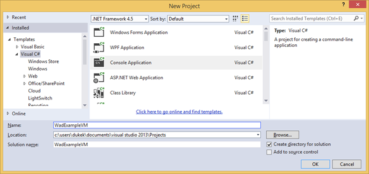

# Enabling Diagnostics in Azure Virtual Machines
See [Azure Diagnostics Overview](../monitoring-and-diagnostics/azure-diagnostics.md) for a background on Azure Diagnostics.

## How to Enable Diagnostics in a Virtual Machine
This walk through describes how to remotely install Diagnostics to an Azure virtual machine from a development computer. You also learn how to implement an application that runs on that Azure virtual machine and emits telemetry data using the .NET [EventSource Class][EventSource Class]. Azure Diagnostics is used to collect the telemetry and store it in an Azure storage account.

### Pre-requisites
This walk through assumes you have an Azure subscription and are using Visual Studio 2013 with the Azure SDK. If you do not have an Azure subscription, you can sign up for the [Free Trial][Free Trial]. Make sure to [Install and configure Azure PowerShell version 0.8.7 or later][Install and configure Azure PowerShell version 0.8.7 or later].

### Step 1: Create a Virtual Machine
1. On your development computer, launch Visual Studio 2013.
2. In the Visual Studio **Server Explorer** expand **Azure**, right-click **Virtual Machines** then select **Create Virtual Machine**.
3. Select your Azure subscription in the **Choose a Subscription** dialog and click **Next**.
4. Select **Windows Server 2012 R2 Datacenter, November 2014** in the **Select a Virtual Machine Image** dialog and click **Next**.
5. In the **Virtual Machine Basic Settings**, set the virtual machine name to "wadexample". Set your Administrator user name and password and click **Next**.
6. In the **Cloud Service Settings** dialog create a new cloud service named "wadexampleVM". Create a new Storage account named "wadexample" and click **Next**.
7. Click **Create**.

### Step 2: Create your Application
1. On your development computer, launch Visual Studio 2013.
2. Create a new Visual C# Console Application that targets .NET Framework 4.5. Name the project "WadExampleVM".
   
3. Replace the contents of Program.cs with the following code. The class **SampleEventSourceWriter** implements four logging methods: **SendEnums**, **MessageMethod**, **SetOther** and **HighFreq**. The first parameter to the WriteEvent method defines the ID for the respective event. The Run method implements an infinite loop that calls each of the logging methods implemented in the **SampleEventSourceWriter** class every 10 seconds.

    ```csharp
     using System;
     using System.Diagnostics;
     using System.Diagnostics.Tracing;
     using System.Threading;

     namespace WadExampleVM
     {
       sealed class SampleEventSourceWriter : EventSource {
         public static SampleEventSourceWriter Log = new SampleEventSourceWriter();
         public void SendEnums(MyColor color, MyFlags flags) { if (IsEnabled())  WriteEvent(1, (int)color, (int)flags); } // Cast enums to int for efficient logging.
         public void MessageMethod(string Message) { if (IsEnabled())  WriteEvent(2, Message); }
         public void SetOther(bool flag, int myInt) { if (IsEnabled())  WriteEvent(3, flag, myInt); }
         public void HighFreq(int value) { if (IsEnabled()) WriteEvent(4, value); }
       }

       enum MyColor {
         Red,
         Blue,
         Green
       }

       [Flags]
       enum MyFlags {
         Flag1 = 1,
         Flag2 = 2,
         Flag3 = 4
       }

       class Program
       {
         static void Main(string[] args) {
         Trace.TraceInformation("My application entry point called");

         int value = 0;

         while (true) {
             Thread.Sleep(10000);
             Trace.TraceInformation("Working");

             // Emit several events every time we go through the loop
             for (int i = 0; i < 6; i++) {
                 SampleEventSourceWriter.Log.SendEnums(MyColor.Blue, MyFlags.Flag2 | MyFlags.Flag3);
             }

             for (int i = 0; i < 3; i++) {
                 SampleEventSourceWriter.Log.MessageMethod("This is a message.");
                 SampleEventSourceWriter.Log.SetOther(true, 123456789);
             }

             if (value == int.MaxValue) value = 0;
             SampleEventSourceWriter.Log.HighFreq(value++);
         }

        }
      }
     }
     ```
4. Save the file and select **Build Solution** from the **Build** menu to build your code.

### Step 3: Deploy your Application
1. Right-click on the **WadExampleVM** project in **Solution Explorer** and choose **Open Folder in File Explorer**.
2. Navigate to the *bin\Debug* folder and copy all the files (WadExampleVM.*)
3. In **Server Explorer** right-click on the virtual machine and choose **Connect using Remote Desktop**.
4. Once connected to the VM create a folder named WadExampleVM and paste your application files into the folder.
5. Launch the application WadExampleVM.exe. You should see a blank console window.

### Step 4: Create your Diagnostics configuration and install the Extension
1. Download the public configuration file schema definition to your development computer by executing the following PowerShell command:

     (Get-AzureServiceAvailableExtension -ExtensionName 'PaaSDiagnostics' -ProviderNamespace 'Microsoft.Azure.Diagnostics').PublicConfigurationSchema | Out-File -Encoding utf8 -FilePath 'WadConfig.xsd'
2. Open a new XML file in Visual Studio, either in a project you already have open or in a Visual Studio instance with no open projects. In Visual Studio, select **Add** -> **New Item…** -> **Visual C# items** -> **Data** -> **XML File**. Name the file "WadExample.xml"
3. Associate the WadConfig.xsd with the configuration file. Make sure the WadExample.xml editor window is the active window. Press **F4** to open the **Properties** window. Click on the **Schemas** property in the **Properties** window. Click the **…** in the **Schemas** property. Click the **Add…** button and navigate to the location where you saved the XSD file and select the file WadConfig.xsd. Click **OK**.
4. Replace the contents of the WadExample.xml configuration file with the following XML and save the file. This configuration file defines a couple performance counters to collect: one for CPU utilization and one for memory utilization. Then the configuration defines the four events corresponding to the methods in the SampleEventSourceWriter class.

```
        <?xml version="1.0" encoding="utf-8"?>
        <PublicConfig xmlns="http://schemas.microsoft.com/ServiceHosting/2010/10/DiagnosticsConfiguration">
              <WadCfg>
                <DiagnosticMonitorConfiguration overallQuotaInMB="25000">
                  <PerformanceCounters scheduledTransferPeriod="PT1M">
                    <PerformanceCounterConfiguration counterSpecifier="\Processor(_Total)\% Processor Time" sampleRate="PT1M" unit="percent" />
                    <PerformanceCounterConfiguration counterSpecifier="\Memory\Committed Bytes" sampleRate="PT1M" unit="bytes"/>
                      </PerformanceCounters>
                      <EtwProviders>
                        <EtwEventSourceProviderConfiguration provider="SampleEventSourceWriter" scheduledTransferPeriod="PT5M">
                              <Event id="1" eventDestination="EnumsTable"/>
                              <Event id="2" eventDestination="MessageTable"/>
                              <Event id="3" eventDestination="SetOtherTable"/>
                              <Event id="4" eventDestination="HighFreqTable"/>
                              <DefaultEvents eventDestination="DefaultTable" />
                        </EtwEventSourceProviderConfiguration>
                      </EtwProviders>
                </DiagnosticMonitorConfiguration>
              </WadCfg>
        </PublicConfig>
```

### Step 5: Remotely install Diagnostics on your Azure Virtual Machine
The PowerShell cmdlets for managing Diagnostics on a VM are: Set-AzureVMDiagnosticsExtension, Get-AzureVMDiagnosticsExtension, and Remove-AzureVMDiagnosticsExtension.

1. On your developer computer, open Azure PowerShell.
2. Execute the script to remotely install Diagnostics on your VM (Replace *StorageAccountKey* with the storage account key for your wadexamplevm storage account):

     $storage_name = "wadexamplevm"
     $key = "<StorageAccountKey>"
     $config_path="c:\users\<user>\documents\visual studio 2013\Projects\WadExampleVM\WadExampleVM\WadExample.xml"
     $service_name="wadexamplevm"
     $vm_name="WadExample"
     $storageContext = New-AzureStorageContext -StorageAccountName $storage_name -StorageAccountKey $key
     $VM1 = Get-AzureVM -ServiceName $service_name -Name $vm_name
     $VM2 = Set-AzureVMDiagnosticsExtension -DiagnosticsConfigurationPath $config_path -Version "1.*" -VM $VM1 -StorageContext $storageContext
     $VM3 = Update-AzureVM -ServiceName $service_name -Name $vm_name -VM $VM2.VM

### Step 6: Look at your telemetry data
In the Visual Studio **Server Explorer** navigate to the wadexample storage account. After the VM has been running about 5 minutes you should see the tables **WADEnumsTable**, **WADHighFreqTable**, **WADMessageTable**, **WADPerformanceCountersTable** and **WADSetOtherTable**. Double-click on one of the tables to view the telemetry that has been collected.


## Configuration file schema
The Diagnostics configuration file defines values that are used to initialize diagnostic configuration settings when the diagnostics agent starts. See the [latest schema reference](https://msdn.microsoft.com/library/azure/mt634524.aspx) for valid values and examples.

## Troubleshooting
See [Troubleshooting Azure Diagnostics](../monitoring-and-diagnostics/azure-diagnostics-troubleshooting.md) for more information.

## Next steps
[See a list of virtual machine related Azure Diagnostics articles](../monitoring-and-diagnostics/azure-diagnostics.md#virtual-machines-using-azure-diagnostics) to change the data you are collecting, troubleshoot problems or learn more about diagnostics in general.

[EventSource Class]: http://msdn.microsoft.com/library/system.diagnostics.tracing.eventsource(v=vs.110).aspx

[Debugging an Azure Application]: http://msdn.microsoft.com/library/windowsazure/ee405479.aspx   
[Collect Logging Data by Using Azure Diagnostics]: http://msdn.microsoft.com/library/windowsazure/gg433048.aspx
[Free Trial]: http://azure.microsoft.com/pricing/free-trial/
[Install and configure Azure PowerShell version 0.8.7 or later]: http://azure.microsoft.com/documentation/articles/install-configure-powershell/
