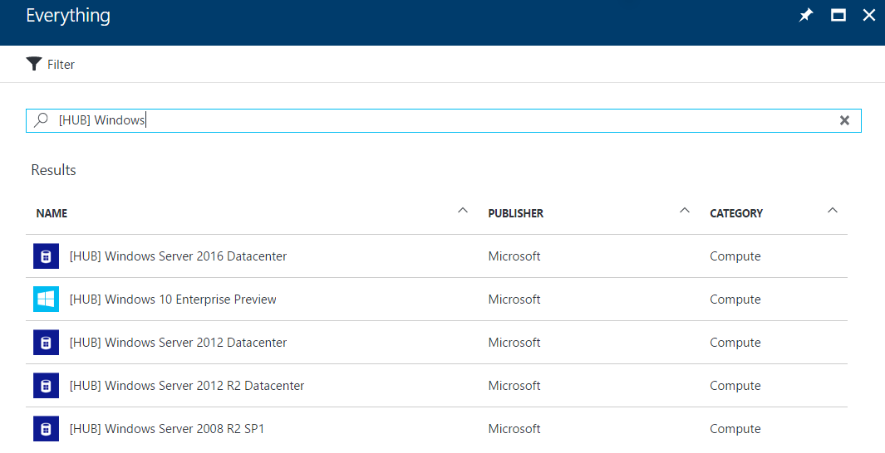

# Azure Virtual Machine Error Messages
This article describes the common error codes and messages you encounter when managing an Azure Virtual Machine(VM).  

>[!NOTE]
>Leave comments on this page for error message feedback!
>
>

## Error Response Format 
Azure VM uses the following JSON format for error response.
```json
{
  "status": "status code",
  "error": {
    "code":"Top level error code",
    "message":"Top level error message",
    "details":[
     {
      "code":"Inner evel error code",
      "message":"Inner level error message"
     }
    ]
   }
}
```

An error response always includes a status code, an error object. each error object always contains an error code, message. if the VM deployment is created through a template, then the error object also contains a details section, which contains an inner level of error codes and message. Normally, the most inner level of error message is the root failure. 


## Common Virtual Machine Management Error

This section lists the common error messages for managing your virtual machine

### AllocationFailed

| Message(s) |  
| :------- |
| Allocation failed. Please try reducing the VM size or number of VMs, retry later, or try deploying to a different Availability Set or different Azure location. |

### Invalid Parameter
| Message(s) |  
| :------- |
| Allocation failed. Please try reducing the VM size or number of VMs, retry later, or try deploying to a different Availability Set or different Azure location. |
| Allocation failed. Please try reducing the VM size or number of VMs, retry later, or try deploying to a different Availability Set or different Azure location. |
| Allocation failed. Please try reducing the VM size or number of VMs, retry later, or try deploying to a different Availability Set or different Azure location. |
| Allocation failed. Please try reducing the VM size or number of VMs, retry later, or try deploying to a different Availability Set or different Azure location. |


1. If you have an Enterprise Agreement subscription, you can [deploy VMs from specific Marketplace images](#deploy-a-vm-using-the-azure-marketplace) that are pre-configured with Azure Hybrid Use Benefit.
2. Without an Enterprise Agreement, you can [upload a custom VM](#upload-a-windows-vhd) and [deploy using a Resource Manager template](#deploy-a-vm-via-resource-manager) or [Azure PowerShell](#detailed-powershell-deployment-walkthrough).

## Deploy a VM using the Azure Marketplace
For customers with [Enterprise Agreement subscriptions](https://www.microsoft.com/Licensing/licensing-programs/enterprise.aspx), images are available in the Marketplace pre-configured with Azure Hybrid Use Benefit. These images can be deployed directly from the Azure portal, Resource Manager templates, or Azure PowerShell, for example. Images in the Marketplace are noted by the `[HUB]` name as follows:



You can deploy these images directly from the Azure portal. For use in Resource Manager templates and with Azure PowerShell, view the list of images as follows:
