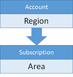
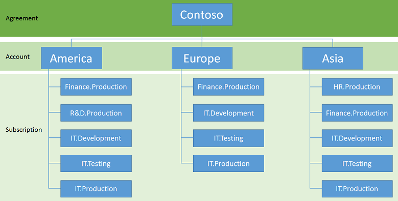
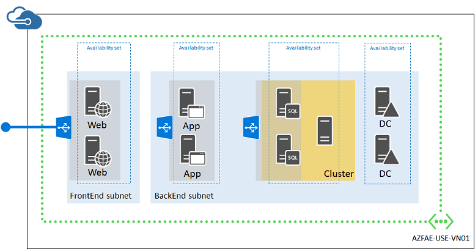

<properties
	pageTitle="Azure infrastructure services implementation guidelines"
	description="Learn about the key design and implementation guidelines for deploying an IT workload in Azure infrastructure services."
	documentationCenter=""
	services="virtual-machines"
	authors="squillace"
	manager="timlt"
	editor=""
	tags="azure-service-management,azure-resource-manager"/>

<tags
	ms.service="virtual-machines"
	ms.workload="infrastructure-services"
	ms.tgt_pltfrm="na"
	ms.devlang="na"
	ms.topic="article"
	ms.date="07/09/2015"
	ms.author="rasquill"/>

# Azure infrastructure services implementation guidelines

Azure is an excellent platform to implement dev/test or proof-of-concept configurations, because it requires very little investment to test a particular approach to an implementation of your solutions. However, you must be able to distinguish the easy practices for a dev/test environment from the more difficult, detailed practices for a fully functional, production-ready implementation of an IT workload.

This guidance identifies many areas for which planning is vital to the success of an IT workload in Azure. In addition, planning provides an order to the creation of the necessary resources. Although there is some flexibility, we recommend that you apply the order in this article to your planning and decision-making.

This article was adapted from the content in the [Azure implementation guidelines](http://blogs.msdn.com/b/thecolorofazure/archive/2014/05/13/azure-implementation-guidelines.aspx) blog post. Thanks to Santiago Cánepa (Application Development Manager for Microsoft) and Hugo Salcedo (Application Development Manager for Microsoft) for their original material.

> [AZURE.NOTE] Affinity groups have been deprecated. Their use is not described here. For more information, see [About regional VNets and affinity groups](../virtual-network/virtual-networks-migrate-to-regional-vnet.md).

## 1. Naming conventions

You should have a good naming convention in place before creating anything in Azure. A naming convention ensures that all the resources have a predictable name, which helps lower the administrative burden associated with managing those resources.

You might choose to follow a specific set of naming conventions defined for your entire organization or for a specific Azure subscription or account. Although it is easy for individuals within organizations to establish implicit rules when working with Azure resources, when a team needs to work on a project on Azure, that model does not scale well.

You should agree on a set of naming conventions up front. There are some considerations regarding naming conventions that cut across the sets of rules that make up those conventions.

### Affixes

When creating certain resources, Azure uses some defaults to simplify management of the resources that are associated with these resources. For example, when creating the first virtual machine for a new cloud service, the Azure portal attempts to use the virtual machine’s name for the name of a new cloud service for the virtual machine.

Therefore, it is beneficial to identify types of resources that need an affix to identify that type. In addition, clearly specify whether the affix will be at:

- The beginning of the name (prefix)
- The end of the name (suffix)

For instance, here are two possible names for a resource group that hosts a calculation engine:

- Rg-CalculationEngine (prefix)
- CalculationEngine-Rg (suffix)

Affixes can refer to different aspects that describe the particular resources. The following table shows some examples typically used.

Aspect | Examples | Notes
--- | --- | ---
Environment | dev, stg, prod | Depending on the purpose and name of each environment.
Location | usw (West US), use (East US 2) | Depending on the region of the datacenter or the region of the organization.
Azure component, service, or product | Rg for resource group, Svc for cloud service, VNet for virtual network | Depending on the product for which the resource provides support.
Role | sql, ora, sp, iis | Depending on the role of the virtual machine.
Instance | 01, 02, 03, etc. | For resources that have more than one instance. For example, load balanced web servers in a cloud service.

When establishing your naming conventions, make sure that they clearly state which affixes to use for each type of resource, and in which position (prefix vs suffix).

### Dates

It is often important to determine the date of creation from the name of a resource. We recommend the YYYYMMDD date format. This format ensures that not only the full date is recorded, but also that two resources whose names differ only on the date will be sorted alphabetically and chronologically at the same time.

### Naming resources

You should define each type of resource in the naming convention, which should have rules that define how to assign names to each resource that is created. These rules should apply to all types of resources, for example:

- Subscriptions
- Accounts
- Storage accounts
- Virtual networks
- Subnets
- Availability sets
- Resource groups
- Cloud services
- Virtual machines
- Endpoints
- Network security groups
- Roles

To ensure that the name provides enough information to determine to which resource it refers, you should use descriptive names.

### Computer names

When administrators create a virtual machine, Microsoft Azure requires them to provide a virtual machine name of up to 15 characters. Azure uses the virtual machine name as the Azure virtual machine resource name. Azure uses the same name as the computer name for the operating system installed in the virtual machine. However, these names might not always be the same.

In case a virtual machine is created from a .vhd image file that already contains an operating system, the virtual machine name in Azure can differ from the virtual machine’s operating system computer name. This situation can add a degree of difficulty to virtual machine management, which we therefore do not recommend. Assign the Azure virtual machine resource the same name as the computer name that you assign to the operating system of that virtual machine.

We recommend that the Azure virtual machine name be the same as the underlying operating system computer name. Because of this, follow the NetBIOS naming rules as described in [Microsoft NetBIOS computer naming conventions](https://support.microsoft.com/kb/188997/).

### Storage account names

Storage accounts have special rules governing their names. You can only use lowercase letters and numbers. See [Create a storage account](../storage/storage-create-storage-account.md#create-a-storage-account) for more information. Additionally, the storage account name, in combination with core.windows.net, should be a globally valid, unique DNS name. For instance, if the storage account is called mystorageaccount, the following resulting DNS names should be unique:

- mystorageaccount.blob.core.windows.net
- mystorageaccount.table.core.windows.net
- mystorageaccount.queue.core.windows.net

### Azure building block names

Azure building blocks are application-level services that Azure offers, typically to those applications taking advantage of PaaS features, although IaaS resources might leverage some, like SQL Database, Traffic Manager, and others.

These services rely on an array of artifacts that are created and registered in Azure. These also need to be considered in your naming conventions.

### Implementation guidelines recap for naming conventions

Decision:

- What are your naming conventions for Azure resources?

Task:

- Define the naming conventions in terms of affixes, hierarchy, string values, and other policies for Azure resources.

## 2. Subscriptions and accounts

In order to work with Azure, you need one or more Azure subscriptions. Resources, like cloud services or virtual machines, exist in the context of those subscriptions.

- Enterprise customers typically have an Enterprise Enrollment, which is the top-most resource in the hierarchy, and is associated to one or more accounts.
- For consumers and customers without an Enterprise Enrollment, the top-most resource is the account.
- Subscriptions are associated to accounts, and there can be one or more subscriptions per account. Azure records billing information at the subscription level.

Due to the limit of two hierarchy levels on the Account/Subscription relationship, it is important to align the naming convention of accounts and subscriptions to the billing needs. For instance, if a global company uses Azure, they might choose to have one account per region, and have subscriptions managed at the region level.

For instance, you might use this structure.

Following the same example, if a region decides to have more than one subscription associated to a particular group, then the naming convention should incorporate a way to encode the extra on either the account or the subscription name. This organization allows massaging billing data to generate the new levels of hierarchy during billing reports.

The organization could look like this.

Microsoft provides detailed billing via a downloadable file for a single account or for all accounts in an enterprise agreement. You can process this file, for example, by using Microsoft Excel. This process would ingest the data, partition the resources that encode more than one level of the hierarchy into separate columns, and use a pivot table or PowerPivot to provide dynamic reporting capabilities.

### Implementation guidelines recap for subscriptions and accounts

Decision:

- What set of subscriptions and accounts do you need to host your IT workload or infrastructure?

Task:

- Create the set of subscriptions and accounts using your naming convention.

## 3. Storage

Azure Storage is an integral part of many Azure solutions. Azure Storage provides services for storing file data, unstructured data, and messages, and it is also part of the infrastructure supporting virtual machines.

There are two types of storage accounts available from Azure. A standard storage account gives you access to blob storage (used for storing Azure virtual machine disks), table storage, queue storage, and file storage. Premium storage is designed for high-performance applications, such as SQL Servers in an AlwaysOn cluster, and currently supports Azure virtual machine disks only.

Storage accounts are bound to scalability targets. See [Microsoft Azure subscription and service limits, quotas, and constraints](../azure-subscription-service-limits.md#storage-limits) to become familiar with current Azure storage limits. Also see [Azure storage scalability and performance targets](../storage-scalability-targets.md).

Azure creates virtual machines with an operating system disk, a temporary disk, and zero or more optional data disks. The operating system disk and data disks are Azure page blobs, whereas the temporary disk is stored locally on the node where the machine lives. This makes the temporary disk unfit for data that must persist during a system recycle, because the machine might silently be migrated from one node to another, losing any data in that disk. Do not store anything on the temporary drive.

Operating system disks and data disks have a maximum size of 1023 gigabytes (GB) because the maximum size of a blob is 1024 GB and that must contain the metadata (footer) of the VHD file (a GB is 10243 bytes). You can implement disk striping in Windows to surpass this limit.

### Striped disks
Besides providing the ability to create disks larger than 1023 GB, in many instances, using striping for data disks enhances performance by allowing multiple blobs to back the storage for a single volume. With striping, the I/O required to write and read data from a single logical disk proceeds in parallel.

Azure imposes limits on the amount of data disks and bandwidth available, depending on the virtual machine size. For details, see [Sizes for virtual machines](virtual-machines-size-specs.md).

If you are using disk striping for Azure data disks, consider the following guidelines:

- Data disks should always be the maximum size (1023 GB)
- Attach the maximum data disks allowed for the virtual machine size
- Use storage spaces configuration
- Use storage striping configuration
- Avoid using Azure data disk caching options (caching policy = None)

For more information, see [Storage spaces - designing for performance](http://social.technet.microsoft.com/wiki/contents/articles/15200.storage-spaces-designing-for-performance.aspx).

### Multiple storage accounts

Using multiple storage accounts to back the disks associated with many virtual machines ensures that the aggregated I/O of those disks is well below the scalability targets for each one of those storage accounts.

We recommend that you start with the deployment of one virtual machine per storage account.

### Storage layout design

To implement these strategies to implement the disk subsystem of the virtual machines with good performance, an IT workload or infrastructure typically takes advantage of many storage accounts. These host many VHD blobs. In some instances, more than one blob is associated to one single volume in a virtual machine.

This situation can add complexity to the management tasks. Designing a sound strategy for storage, including appropriate naming for the underlying disks and associated VHD blobs is key.

### Implementation guidelines recap for storage

Decisions:

- Do you need disk striping to create disks larger than 500 terabytes (TB)?
- Do you need disk striping to achieve optimal performance for your workload?
- What set of storage accounts do you need to host your IT workload or infrastructure?

Task:

- Create the set of storage accounts using your naming convention. You can use the Azure preview portal, the Azure portal, or the **New-AzureStorageAccount** PowerShell cmdlet.

## 4. Cloud services

Cloud services are a fundamental building block in Azure service management, both for PaaS and IaaS services. For PaaS, cloud services represent an association of roles whose instances can communicate among each other. Cloud services are associated to a public virtual IP (VIP) address and a load balancer, which takes incoming traffic from the Internet and load balances it to the roles configured to receive that traffic.

In the case of IaaS, cloud services offer similar functionality, although in most cases, the load balancer functionality is used to forward traffic to specific TCP or UDP ports from the Internet to the many virtual machines within that cloud service.

> [AZURE.NOTE] Cloud services do not exist in Azure Resource Manager. For an introduction to the advantages of Resource Manager, see [Azure compute, network and storage providers under Azure Resource Manager](../articles/virtual-machines/virtual-machines-azurerm-versus-azuresm.md).

Cloud service names are especially important in IaaS because Azure uses them as part of the default naming convention for disks. The cloud service name can contain only letters, numbers, and hyphens. The first and last character in the field must be a letter or number.

Azure exposes the cloud service names, because they are associated to the VIP, in the domain “cloudapp.net”. For a better user experience of the application, a vanity name should be configured as needed to replace the fully qualified cloud service name. This is typically done with a CNAME record in your public DNS that maps the public DNS name of your resource (for example, www.contoso.com) to the DNS name of the cloud service hosting the resource (for example, the cloud service hosting the web servers for www.contoso.com).

In addition, the naming convention used for cloud services might need to tolerate exceptions because the cloud service names must be unique among all other Microsoft Azure cloud services, regardless of the Microsoft Azure tenant.

One important limitation of cloud services to consider is that only one virtual machine management operation can be performed at a time for all the virtual machines in the cloud service. When you perform a virtual machine management operation on one virtual machine in the cloud service, you must wait until it is finished before you can perform a new management operation on another virtual machine. Therefore, you should keep the number of virtual machines in a cloud service low.

Azure subscriptions can support a maximum of 200 cloud services.

### Implementation guidelines recap for cloud services

Decision:

- What set of cloud services do you need to host your IT workload or infrastructure?

Task:

- Create the set of cloud services using your naming convention. You can use the Azure portal or the **New-AzureService** PowerShell cmdlet.

## 5. Virtual networks

The next logical step is to create the virtual networks necessary to support the communications across the virtual machines in the solution. Although it is possible to host multiple virtual machines of an IT workload within just one cloud service, virtual networks are recommended.

Virtual networks are a container for virtual machines for which you can also specify subnets, custom addressing, and DNS configuration options. Virtual machines within the same virtual network can communicate directly with other computers within the same virtual network, regardless of which cloud service they are a member of. Within the virtual network, this communication remains private, without the need for the communication to go through the public endpoints. This communication can occur via IP address, or by name, using a DNS server installed in the virtual network, or on-premises, if the virtual machine is connected to the corporate network.

### Site connectivity
If on-premises users and computers do not require ongoing connectivity to virtual machines in an Azure virtual network, create a cloud-only virtual network.

This is typically for Internet-facing workloads, such as an Internet-based web server. You can manage these virtual machines using Remote Desktop connections, remote PowerShell sessions, Secure Shell (SSH) connections, and point-to-site VPN connections.

Because they do not connect to your on-premises network, cloud-only virtual networks can use any portion of the private IP address space.

If on-premises users and computers require ongoing connectivity to virtual machines in an Azure virtual network, create a cross-premises virtual network and connect it to your on-premises network with an ExpressRoute or site-to-site VPN connection.

In this configuration, the Azure virtual network is essentially a cloud-based extension of your on-premises network.

Because they connect to your on-premises network, cross-premises virtual networks must use a portion of the address space used by your organization that is unique, and the routing infrastructure must support routing traffic to that portion by forwarding it to your on-premises VPN device.

To allow packets to travel from your cross-premises virtual network to your on-premises network, you must configure the set of relevant on-premises address prefixes as part of the local network definition for the virtual network. Depending on the address space of the virtual network and the set of relevant on-premises locations, there can be many address prefixes in the local network.

You can convert a cloud-only virtual network to a cross-premises virtual network, but it will most likely require you to renumber your virtual network address space, your subnets, and the virtual machines that use static Azure-assigned IP addresses, known as Dynamic IPs (DIPs). Therefore, carefully consider the type of virtual networks you need (cloud-only versus cross-premises) before you create them.

### Subnets
Subnets allow you to organize resources that are related, either logically (for example, one subnet for virtual machines associated to the same application), or physically (for example, one subnet per cloud service), or to employ subnet isolation techniques for added security.

For cross-premises virtual networks, you should design subnets with the same conventions that you use for on-premises resources, keeping in mind that **Azure always uses the first three IP addresses of the address space for each subnet**. To determine the number of addresses needed for the subnet, count the number of virtual machines that you need now, estimate for future growth, and then use the following table to determine the size of the subnet.

Number of virtual machines needed | Number of host bits needed | Size of the subnet
--- | --- | ---
1–3 | 3 | /29
4–11	 | 4 | /28
12–27 | 5 | /27
28–59 | 6 | /26
60–123 | 7 | /25

> [AZURE.NOTE] For normal on-premises subnets, the maximum number of host addresses for a subnet with n host bits is 2n – 2. For an Azure subnet, the maximum number of host addresses for a subnet with n host bits is 2n – 5 (2 plus 3 for the addresses that Azure uses on each subnet).

If you choose a subnet size that is too small, you will have to renumber and redeploy the virtual machines in the subnet.

### Implementation guidelines recap for virtual networks

Decisions:

- What type of virtual network do you need to host your IT workload or infrastructure (cloud-only or cross-premises)?
- For cross-premises virtual networks, how much address space do you need to host the subnets and virtual machines now and for reasonable expansion in the future?

Tasks:

- Define the address space for the virtual network.
- Define the set of subnets and the address space for each.
- For cross-premises virtual networks, define the set of local network address spaces for the on-premises locations that the virtual machines in the virtual network need to reach.
- Create the virtual network using your naming convention. You can use the Azure preview portal or the Azure portal.

## 6. Availability sets

In Azure PaaS, cloud services contain one or more roles that execute application code. Roles can have one or more virtual machine instances that the fabric automatically provisions. At any given time, Azure might update the instances in these roles, but because they are part of the same role, Azure knows not to update all at the same time to prevent a service outage for the role.

In Azure IaaS, the concept of role is not significant, because each IaaS virtual machine represents a role with a single instance. In order to hint to Azure not to bring down two or more associated machines at the same time (for example, for operating system updates of the node where they reside), the concept of availability sets was introduced. An availability set tells Azure not to bring down all the machines in the same availability set at the same time to prevent a service outage. The virtual machine members of an availability set have a 99.95% uptime service level agreement.

Availability sets must be part of the high-availability planning of the solution. An availability set is defined as the set of virtual machines within a single cloud service that have the same availability set name. You can create availability sets after you create cloud services.

### Implementation guidelines recap for availability sets

Decision:

- How many availability sets do you need for the various roles and tiers in your IT workload or infrastructure?

Task:

- Define the set of availability sets using your naming convention. You can associate a virtual machine to an availability set when you create the virtual machines, or you can associate a virtual machine to an availability set after the virtual machine has been created.

## 7. Virtual machines

In Azure PaaS, Azure manages virtual machines and their associated disks. You must create and name cloud services and roles, and then Azure creates instances associated to those roles. In the case of Azure IaaS, it is up to you to provide names for the cloud services, virtual machines, and associated disks.

To reduce administrative burden, the Azure portal uses the computer name as a suggestion for the default name for the associated cloud service (in the case the customer chooses to create a new cloud service as part of the virtual machine creation wizard).

In addition, Azure names disks and their supporting VHD blobs using a combination of the cloud service name, the computer name, and the creation date.

In general, the number of disks is much greater than the number of virtual machines. You should be careful when manipulating virtual machines to prevent orphaning disks. Also, disks can be deleted without deleting the supporting blob. If this is the case, the blob remains in the storage account until manually deleted.

### Implementation guidelines recap for virtual machines

Decision:

- How many virtual machines do you need to provide for the IT workload or infrastructure?

Tasks:

- Define each virtual machine name using your naming convention.
- Create your virtual machines with the Azure preview portal, the Azure portal, the **New-AzureVM** PowerShell cmdlet, the Azure CLI, or with Resource Manager templates.

## Example of an IT workload: The Contoso financial analysis engine

The Contoso Corporation has developed a next-generation financial analysis engine with leading-edge proprietary algorithms to aid in futures market trading. They want to make this engine available to its customers as a set of servers in Azure, which consist of:

- Two (and eventually more) IIS-based web servers running custom web services in a web tier
- Two (and eventually more) IIS-based application servers that perform the calculations in an application tier
- A SQL Server 2014 cluster with AlwaysOn availability groups (two SQL Servers and a majority node witness) that stores historical and ongoing calculation data in a database tier
- Two Active Directory domain controllers for a self-contained forest and domain in the authentication tier, which is required by SQL Server clustering
- All of the servers are located on two subnets; a front end subnet for the web servers and a back end subnet for the application servers, a SQL Server 2014 cluster, and domain controllers

Incoming secure web traffic from the Contoso clients on the Internet needs to be load-balanced among the web servers. Calculation request traffic in the form of HTTP requests from the web servers needs to be balanced among the application servers. Additionally, the engine must be designed for high availability.

The resulting design must incorporate:

- A Contoso Azure subscription and account
- Storage accounts
- A virtual network with two subnets
- Availability sets for the sets of servers with a similar role
- Virtual machines
- A single resource group

All of the above will follow these Contoso naming conventions:

- Contoso uses [IT workload]-[location]-[Azure resource] as a prefix. For this example, "azfae" (Azure Financial Analysis Engine) is the IT workload name and "use" (East US 2) is the location, because most of Contoso's initial customers are on the East Coast of the United States.
- Storage accounts use contosoazfaeusesa[description] Note that contoso was added to the prefix to provide uniqueness, and storage account names do not support the use of hyphens.
- Virtual networks use AZFAE-USE-VN[number].
- Availability sets use azfae-use-as-[role].
- Virtual machine names use azfae-use-vm-[vmname].

### Azure subscriptions and accounts

Contoso is using their Enterprise subscription, named Contoso Enterprise Subscription, to provide billing for this IT workload.

### Storage accounts

Contoso determined that they needed two storage accounts:

- **contosoazfaeusesawebapp** for the standard storage of the web servers, application servers, and domain controlles and their extra data disks
- **contosoazfaeusesasqlclust** for the premium storage of the SQL Server cluster servers and their extra data disks

### A virtual network with subnets

Because the virtual network does not need ongoing connectivity to the Contoso on-premises network, Contoso decided on a cloud-only virtual network.

They created a cloud-only virtual network with the following settings using the Azure preview portal:

- Name: AZFAE-USE-VN01
- Location: East US 2
- Virtual network address space: 10.0.0.0/8
- First subnet:
	- Name: FrontEnd
	- Address space: 10.0.1.0/24
- Second subnet:
	- Name: BackEnd
	- Address space: 10.0.2.0/24

### Availability sets

To maintain high availability of all four tiers of their financial analysis engine, Contoso decided on four availability sets:

- **azfae-use-as-dc** for the domain controllers
- **azfae-use-as-web** for the web servers
- **azfae-use-as-app** for the application servers
- **azfae-use-as-sql** for the servers in the SQL Server cluster

These availability sets will be created along with the virtual machines.

### Virtual machines

Contoso decided on the following names for their Azure virtual machines:

- **azfae-use-vm-dc01** for the first domain controller
- **azfae-use-vm-dc02** for the second domain controller
- **azfae-use-vm-web01** for the first web server
- **azfae-use-vm-web02** for the second web server
- **azfae-use-vm-app01** for the first application server
- **azfae-use-vm-app02** for the second application server
- **azfae-use-vm-sql01** for the first SQL Server in the SQL Server cluster
- **azfae-use-vm-sql02** for the second SQL Server in the SQL Server cluster
- **azfae-use-vm-sqlmn01** for the majority node witness in the SQL Server cluster

Here is the resulting configuration.

This configuration incorporates:

- A cloud-only virtual network with two subnets (FrontEnd and BackEnd)
- Two storage accounts
- Four availability sets, one for each tier of the financial analysis engine
- The virtual machines for the four tiers
- An external load balanced set for HTTPS-based web traffic from the Internet to the web servers
- An internal load balanced set for unencrypted web traffic from the web servers to the application servers
- A single resource group

## Additional resources

[Microsoft Azure subscription and service limits, quotas, and constraints](../azure-subscription-service-limits.md#storage-limits)

[Sizes for virtual machines](virtual-machines-size-specs.md)

[Azure storage scalability and performance targets](../storage-scalability-targets.md)

[Cloud Platform integration framework (Azure architecture patterns)](../azure-architectures-cpif-overview.md)

[Datacenter extension reference architecture diagram](https://gallery.technet.microsoft.com/Datacenter-extension-687b1d84)

[Azure compute, network, and storage providers under Azure Resource Manager](../articles/virtual-machines/virtual-machines-azurerm-versus-azuresm.md)
