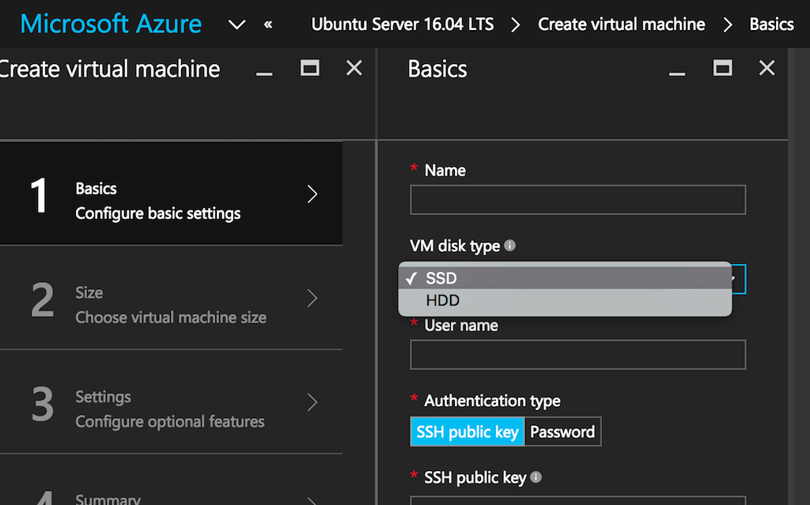

<properties
  pageTitle="Azure and Linux VM Storage | Microsoft Azure"
  description="Describes Azure Standard and Premium Storage with Linux virtual machines."
  services="virtual-machines-linux"
  documentationCenter="virtual-machines-linux"
  authors="vlivech"
  manager="timlt"
  editor=""/>

<tags
  ms.service="virtual-machines-linux"
  ms.devlang="NA"
  ms.topic="article"
  ms.tgt_pltfrm="vm-linux"
  ms.workload="infrastructure"
  ms.date="10/04/2016"
  ms.author="v-livech"/>

# Azure and Linux VM storage

Azure Storage is the cloud storage solution for modern applications that rely on durability, availability, and scalability to meet the needs of their customers.  In addition to making it possible for developers to build large-scale applications to support new scenarios, Azure Storage also provides the storage foundation for Azure Virtual Machines.

## Azure Storage: Standard and Premium

Azure VM's can be built upon standard storage disks or premium storage disks.  When using the Portal to choose your VM you must toggle a dropdown on the Basics screen to view both standard and premium disks.  The screenshot below highlights that toggle menu.  When toggled to SSD, only premium storage enabled VMs will be shown, all backed by SSD drives.  When toggled to HDD, standard storage enabled VMs backed spinning disk drives will be shown, along with premium storage VMs backed by SSD.

  

When creating a VM from the `azure-cli` you can choose between standard and premium when choosing the VM size via the `-z` or `--vm-size` cli flag.

### Create a VM with standard storage VM on the cli

The cli flag `-z` chooses Standard_A1 with A1 being a standard storage based Linux VM.

```bash
azure vm quick-create -g rbg \
exampleVMname \
-l westus \
-y Linux \
-Q Debian \
-u exampleAdminUser \
-M ~/.ssh/id_rsa.pub
-z Standard_A1
```

### Create a VM with premium storage on the cli

The cli flag `-z` chooses Standard_DS1 with DS1 being a premium storage based Linux VM.

```bash
azure vm quick-create -g rbg \
exampleVMname \
-l westus \
-y Linux \
-Q Debian \
-u exampleAdminUser \
-M ~/.ssh/id_rsa.pub
-z Standard_DS1
```

## Standard storage

Azure Standard Storage is the default type of storage.  Standard storage is cost effective while still being performant.  

## Premium storage

Azure Premium Storage delivers high-performance, low-latency disk support for virtual machines running I/O-intensive workloads. Virtual machine (VM) disks that use Premium Storage store data on solid state drives (SSDs). You can migrate your application's VM disks to Azure Premium Storage to take advantage of the speed and performance of these disks.

Premium storage features:

- Premium Storage Disks: Azure Premium Storage supports VM disks that can be attached to DS, DSv2, or GS series Azure VMs.

- Premium Page Blob: Premium Storage supports Azure Page Blobs, which are used to hold persistent disks for Azure Virtual Machines (VMs).

- Premium Locally Redundant Storage: A Premium Storage account only supports Locally Redundant Storage (LRS) as the replication option and keeps three copies of the data within a single region.

- [Premium Storage](../storage/storage-premium-storage.md)

## Premium Storage supported VMs

Premium Storage supports DS-series, DSv2-series, GS-series, and Fs-series Azure Virtual Machines (VMs). You can use both Standard and Premium storage disks with Premium Storage supported of VMs. But you cannot use Premium Storage disks with VM series, which are not Premium Storage compatible.

Following are the Linux Distributions that we validated with Premium Storage.

| Distribution | Version                 | Supported Kernel    |
|--------------|-------------------------|---------------------|
| Ubuntu       | 12.04                   | 3.2.0-75.110+       |
| Ubuntu       | 14.04                   | 3.13.0-44.73+       |
| Debian       | 7.x, 8.x                | 3.16.7-ckt4-1+      |
| SLES         | SLES 12                 | 3.12.36-38.1+       |
| SLES         | SLES 11 SP4             | 3.0.101-0.63.1+     |
| CoreOS       | 584.0.0+                | 3.18.4+             |
| Centos       | 6.5, 6.6, 6.7, 7.0, 7.1 | 3.10.0-229.1.2.el7+ |
| RHEL         | 6.8+, 7.2+              |                     |


## File storage

Azure File storage offers file shares in the cloud using the standard SMB protocol. With Azure Files, you can migrate enterprise applications that rely on file servers to Azure. Applications running in Azure can easily mount file shares from Azure virtual machines running Linux. And with the latest release of File storage, you can also mount a file share from an on-premises application that supports SMB 3.0.  Because file shares are SMB shares, you can access them via standard file system APIs.

File storage is built on the same technology as Blob, Table, and Queue storage, so File storage offers the availability, durability, scalability, and geo-redundancy that is built into the Azure storage platform. For details about File storage performance targets and limits, see Azure Storage Scalability and Performance Targets.

- [How to use Azure File Storage with Linux](../storage/storage-how-to-use-files-linux.md)

## Hot Storage

The Azure hot storage tier is optimized for storing data that is accessed frequently.  Hot storage is the default storage type for blob stores.

## Cool Storage

The Azure cool storage tier is optimized for storing data that is infrequently accessed and long-lived. Example use cases for cool storage include backups, media content, scientific data, compliance, and archival data. In general, any data that is seldom accessed is a perfect candidate for cool storage.

|                             | Hot storage tier      | Cool storage tier     |
|:----------------------------|:---------------------:|:---------------------:|
| Availability                | 99.9%                 | 99%                   |
| Availability (RA-GRS reads) | 99.99%                | 99.9%                 |
| Usage charges               | Higher storage costs  | Lower storage costs   |
|                             | Lower access          | Higher access         |
|                             | and transaction costs | and transaction costs |


## Redundancy

The data in your Microsoft Azure storage account is always replicated to ensure durability and high availability, meeting the Azure Storage SLA even in the face of transient hardware failures.

When you create a storage account, you must select one of the following replication options:

- Locally redundant storage (LRS)
- Zone-redundant storage (ZRS)
- Geo-redundant storage (GRS)
- Read-access geo-redundant storage (RA-GRS)

### Locally redundant storage

Locally redundant storage (LRS) replicates your data within the region in which you created your storage account. To maximize durability, every request made against data in your storage account is replicated three times. These three replicas each reside in separate fault domains and upgrade domains.  A request returns successfully only once it has been written to all three replicas.

### Zone-redundant storage

Zone-redundant storage (ZRS) replicates your data across two to three facilities, either within a single region or across two regions, providing higher durability than LRS. If your storage account has ZRS enabled, then your data is durable even in the case of failure at one of the facilities.

### Geo-redundant storage

Geo-redundant storage (GRS) replicates your data to a secondary region that is hundreds of miles away from the primary region. If your storage account has GRS enabled, then your data is durable even in the case of a complete regional outage or a disaster in which the primary region is not recoverable.

### Read-access geo-redundant storage

Read-access geo-redundant storage (RA-GRS) maximizes availability for your storage account, by providing read-only access to the data in the secondary location, in addition to the replication across two regions provided by GRS. In the event that data becomes unavailable in the primary region, your application can read data from the secondary region.

For a deep dive into Azure storage redundancy see:

- [Azure Storage replication](../storage/storage-redundancy.md)

## Scalability

Azure Storage is massively scalable, so you can store and process hundreds of terabytes of data to support the big data scenarios required by scientific, financial analysis, and media applications. Or you can store the small amounts of data required for a small business website. Wherever your needs fall, you pay only for the data you’re storing. Azure Storage currently stores tens of trillions of unique customer objects, and handles millions of requests per second on average.

For standard storage accounts: A standard storage account has a maximum total request rate of 20,000 IOPS. The total IOPS across all of your virtual machine disks in a standard storage account should not exceed this limit.

For premium storage accounts: A premium storage account has a maximum total throughput rate of 50 Gbps. The total throughput across all of your VM disks should not exceed this limit.

## Availability

We guarantee that at least 99.99% (99.9% for Cool Access Tier) of the time, we will successfully process requests to read data from Read Access-Geo Redundant Storage (RA-GRS) Accounts, provided that failed attempts to read data from the primary region are retried on the secondary region.

We guarantee that at least 99.9% (99% for Cool Access Tier) of the time, we will successfully process requests to read data from Locally Redundant Storage (LRS), Zone Redundant Storage (ZRS), and Geo Redundant Storage (GRS) Accounts.

We guarantee that at least 99.9% (99% for Cool Access Tier) of the time, we will successfully process requests to write data to Locally Redundant Storage (LRS), Zone Redundant Storage (ZRS), and Geo Redundant Storage (GRS) Accounts and Read Access-Geo Redundant Storage (RA-GRS) Accounts.

- [Azure SLA for Storage](https://azure.microsoft.com/support/legal/sla/storage/v1_1/)


## Regions

Azure is generally available in 30 regions around the world, and has announced plans for 4 additional regions. Geographic expansion is a priority for Azure because it enables our customers to achieve higher performance and it support their requirements and preferences regarding data location.  Azures latest region to launch is in Germany.

The Microsoft Cloud Germany provides a differentiated option to the Microsoft Cloud services already available across Europe, creating increased opportunities for innovation and economic growth for highly regulated partners and customers in Germany, the European Union (EU) and the European Free Trade Association (EFTA).

Customer data in these new datacenters, in Magdeburg and Frankfurt, is managed under the control of a data trustee, T-Systems International, an independent German company and subsidiary of Deutsche Telekom. Microsoft’s commercial cloud services in these datacenters adhere to German data handling regulations and give customers additional choices of how and where data is processed.


- [Azure regions map](https://azure.microsoft.com/regions/)

## Security

Azure Storage provides a comprehensive set of security capabilities which together enable developers to build secure applications. The storage account itself can be secured using Role-Based Access Control and Azure Active Directory. Data can be secured in transit between an application and Azure by using Client-Side Encryption, HTTPS, or SMB 3.0. Data can be set to be automatically encrypted when written to Azure Storage using Storage Service Encryption (SSE). OS and Data disks used by virtual machines can be set to be encrypted using Azure Disk Encryption. Delegated access to the data objects in Azure Storage can be granted using Shared Access Signatures.

### Management Plane Security

The management plane consists of the resources used to manage your storage account. In this section, we’ll talk about the Azure Resource Manager deployment model and how to use Role-Based Access Control (RBAC) to control access to your storage accounts. We will also talk about managing your storage account keys and how to regenerate them.

### Data Plane Security

In this section, we’ll look at allowing access to the actual data objects in your Storage account, such as blobs, files, queues, and tables, using Shared Access Signatures and Stored Access Policies. We will cover both service-level SAS and account-level SAS. We’ll also see how to limit access to a specific IP address (or range of IP addresses), how to limit the protocol used to HTTPS, and how to revoke a Shared Access Signature without waiting for it to expire.

## Encryption in Transit

This section discusses how to secure data when you transfer it into or out of Azure Storage. We’ll talk about the recommended use of HTTPS and the encryption used by SMB 3.0 for Azure File Shares. We will also take a look at Client-side Encryption, which enables you to encrypt the data before it is transferred into Storage in a client application, and to decrypt the data after it is transferred out of Storage.

## Encryption at Rest

We will talk about Storage Service Encryption (SSE), and how you can enable it for a storage account, resulting in your block blobs, page blobs, and append blobs being automatically encrypted when written to Azure Storage. We will also look at how you can use Azure Disk Encryption and explore the basic differences and cases of Disk Encryption versus SSE versus Client-Side Encryption. We will briefly look at FIPS compliance for U.S. Government computers.

- [Azure Storage security guide](../storage/storage-security-guide.md)

## Cost savings

- [Storage cost](https://azure.microsoft.com/pricing/details/storage/)

- [Storage cost calculator](https://azure.microsoft.com/pricing/calculator/?service=storage)

## Storage limits

- [Storage Service limits](../azure-subscription-service-limits.md#storage-limits)
