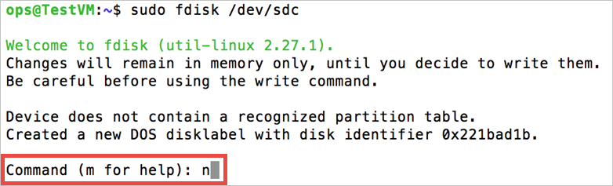
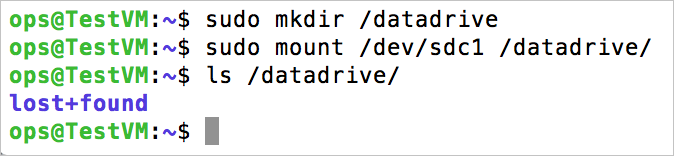

<properties
	pageTitle="Attach a disk to a Linux VM | Microsoft Azure"
	description="Learn how to attach a data disk to an Azure virtual machine running Linux and initialize it so it's ready for use."
	services="virtual-machines-linux"
	documentationCenter=""
	authors="iainfoulds"
	manager="timlt"
	editor="tysonn"
	tags="azure-service-management"/>

<tags
	ms.service="virtual-machines-linux"
	ms.workload="infrastructure-services"
	ms.tgt_pltfrm="vm-linux"
	ms.devlang="na"
	ms.topic="article"
	ms.date="06/07/2016"
	ms.author="iainfou"/>

# How to Attach a Data Disk to a Linux Virtual Machine

[AZURE.INCLUDE [learn-about-deployment-models](../../includes/learn-about-deployment-models-classic-include.md)] See how to [attach a data disk using the Resource Manager deployment model](virtual-machines-linux-add-disk.md).

You can attach both empty disks and disks that contain data to your Azure VMs. Both types of disks are .vhd files that reside in an Azure storage account. As with adding any disk to a Linux machine, after you attach the disk you'll need to initialize and format it so it's ready for use. This article details attaching both empty disks and disks already containing data to your VMs, as well as how to then initialize and format a new disk.

> [AZURE.NOTE] It's a best practice to use one or more separate disks to store a virtual machine's data. When you create an Azure virtual machine, it has an operating system disk and a temporary disk. **Do not use the temporary disk to store persistent data.** As the name implies, it provides temporary storage only. It offers no redundancy or backup because it doesn't reside in Azure storage.
> The temporary disk is typically managed by the Azure Linux Agent and automatically mounted to **/mnt/resource** (or **/mnt** on Ubuntu images). On the other hand, a data disk might be named by the Linux kernel something like `/dev/sdc`, and you'll need to partition, format, and mount this resource. See the [Azure Linux Agent User Guide][Agent] for details.

[AZURE.INCLUDE [howto-attach-disk-windows-linux](../../includes/howto-attach-disk-linux.md)]

## Initialize a new data disk in Linux

1. SSH to your VM. For further details, see [How to log on to a virtual machine running Linux][Logon].

2. Next you need to find the device identifier for the data disk to initialize. There are two ways to do that:

	a) Grep for SCSI devices in the logs, such as in the following command:

			$sudo grep SCSI /var/log/messages

	For recent Ubuntu distributions, you may need to use `sudo grep SCSI /var/log/syslog` because logging to `/var/log/messages` might be disabled by default.

	You can find the identifier of the last data disk that was added in the messages that are displayed.

	

	OR

	b) Use the `lsscsi` command to find out the device id. `lsscsi` can be installed by either `yum install lsscsi` (on Red Hat based distributions) or `apt-get install lsscsi` (on Debian based distributions). You can find the disk you are looking for by its _lun_ or **logical unit number**. For example, the _lun_ for the disks you attached can be easily seen from `azure vm disk list <virtual-machine>` as:

			~$ azure vm disk list TestVM
			info:    Executing command vm disk list
			+ Fetching disk images
			+ Getting virtual machines
			+ Getting VM disks
			data:    Lun  Size(GB)  Blob-Name                         OS
			data:    ---  --------  --------------------------------  -----
			data:         30        TestVM-2645b8030676c8f8.vhd  Linux
			data:    0    100       TestVM-76f7ee1ef0f6dddc.vhd
			info:    vm disk list command OK

	Compare this with the output of `lsscsi` for the same sample virtual machine:

			ops@TestVM:~$ lsscsi
			[1:0:0:0]    cd/dvd  Msft     Virtual CD/ROM   1.0   /dev/sr0
			[2:0:0:0]    disk    Msft     Virtual Disk     1.0   /dev/sda
			[3:0:1:0]    disk    Msft     Virtual Disk     1.0   /dev/sdb
			[5:0:0:0]    disk    Msft     Virtual Disk     1.0   /dev/sdc

	The last number in the tuple in each row is the _lun_. See `man lsscsi` for more information.

3. At the prompt, type the following command to create your new device:

		$sudo fdisk /dev/sdc

4. When prompted, type **n** to create a new partition.

	

5. When prompted, type **p** to make the partition the primary partition, type **1** to make it the first partition, and then type enter to accept the default value for the cylinder. On some systems, it can show the default values of the first and the last sectors, instead of the cylinder. You can choose to accept these defaults.

	

6. Type **p** to see the details about the disk that is being partitioned.

	

7. Type **w** to write the settings for the disk.

	

8. Now you can create the file system on the new partition. Append the partition number to the device ID (in the following example `/dev/sdc1`). The following example creates an ext4 partition on /dev/sdc1:

		# sudo mkfs -t ext4 /dev/sdc1

	

	>[AZURE.NOTE] Note that SuSE Linux Enterprise 11 systems only support read-only access for ext4 file systems. For these systems it is recommended to format the new file system as ext3 rather than ext4.

9. Make a directory to mount the new file system, as follows:

		# sudo mkdir /datadrive

10. Finally you can mount the drive, as follows:

		# sudo mount /dev/sdc1 /datadrive

	The data disk is now ready to use as **/datadrive**.
	
	

11. Add the new drive to /etc/fstab:

	To ensure the drive is re-mounted automatically after a reboot it must be added to the /etc/fstab file. In addition, it is highly recommended that the UUID (Universally Unique IDentifier) is used in /etc/fstab to refer to the drive rather than just the device name (i.e. /dev/sdc1). This avoids the incorrect disk being mounted to a given location if the OS detects a disk error during boot and any remaining data disks then being assigned those device IDs. To find the UUID of the new drive you can use the **blkid** utility:

		# sudo -i blkid

	The output will look similar to the following:

		/dev/sda1: UUID="11111111-1b1b-1c1c-1d1d-1e1e1e1e1e1e" TYPE="ext4"
		/dev/sdb1: UUID="22222222-2b2b-2c2c-2d2d-2e2e2e2e2e2e" TYPE="ext4"
		/dev/sdc1: UUID="33333333-3b3b-3c3c-3d3d-3e3e3e3e3e3e" TYPE="ext4"

	>[AZURE.NOTE] Improperly editing the **/etc/fstab** file could result in an unbootable system. If unsure, please refer to the distribution's documentation for information on how to properly edit this file. It is also recommended that a backup of the /etc/fstab file is created before editing.

	Next, open the **/etc/fstab** file in a text editor:

		# sudo vi /etc/fstab

	In this example we will use the UUID value for the new **/dev/sdc1** device that was created in the previous steps, and the mountpoint **/datadrive**. Add the following line to the end of the **/etc/fstab** file:

		UUID=33333333-3b3b-3c3c-3d3d-3e3e3e3e3e3e   /datadrive   ext4   defaults   1   2

	Or, on systems based on SuSE Linux you may need to use a slightly different format:

		/dev/disk/by-uuid/33333333-3b3b-3c3c-3d3d-3e3e3e3e3e3e   /datadrive   ext3   defaults   1   2

	You can now test that the file system is mounted properly by simply unmounting and then re-mounting the file system, i.e. using the example mount point `/datadrive` created in the earlier steps:

		# sudo umount /datadrive
		# sudo mount /datadrive

	If the `mount` command produces an error, check the /etc/fstab file for correct syntax. If additional data drives or partitions are created you will need to enter them into /etc/fstab separately as well.

	You will need to make the drive writable by using this command:

		# sudo chmod go+w /datadrive

>[AZURE.NOTE] Subsequently removing a data disk without editing fstab could cause the VM to fail to boot. If this is a common occurrence, most distributions provide either the `nofail` and/or `nobootwait` fstab options that will allow a system to boot even if the disk fails to mount at boot time. Please consult your distribution's documentation for more information on these parameters.

### TRIM/UNMAP support for Linux in Azure
Some Linux kernels will support TRIM/UNMAP operations to discard unused blocks on the disk. This is primarily useful in standard storage to inform Azure that deleted pages are no longer valid and can be discarded. This can save cost if you create large files and then delete them.

There are two ways to enable TRIM support in your Linux VM. As usual, please consult your distribution for the recommended approach:

- Use the `discard` mount option in `/etc/fstab`, for example:

		UUID=33333333-3b3b-3c3c-3d3d-3e3e3e3e3e3e   /datadrive   ext4   defaults,discard   1   2

- Alternatively, you can run the `fstrim` command manually from the command-line, or add it to your crontab to run regularly:

	**Ubuntu**

		# sudo apt-get install util-linux
		# sudo fstrim /datadrive

	**RHEL/CentOS**

		# sudo yum install util-linux
		# sudo fstrim /datadrive

## Troubleshooting
[AZURE.INCLUDE [virtual-machines-linux-lunzero](../../includes/virtual-machines-linux-lunzero.md)]

## Next Steps
You can read more about using your Linux VM in the following articles:

- [How to log on to a virtual machine running Linux][Logon]

- [How to detach a disk from a Linux virtual machine](virtual-machines-linux-classic-detach-disk.md)

- [Using the Azure CLI with the Classic deployment model](../virtual-machines-command-line-tools.md)

<!--Link references-->
[Agent]: virtual-machines-linux-agent-user-guide.md
[Logon]: virtual-machines-linux-classic-log-on.md
