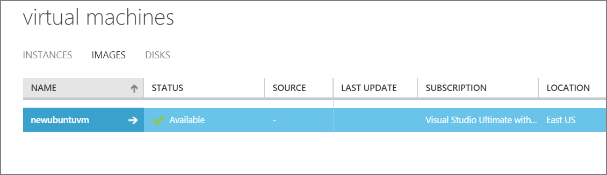

<properties
	pageTitle="Capture an image of a Linux VM | Microsoft Azure"
	description="Learn how to capture an image of a Linux-based Azure virtual machine (VM) created with the classic deployment model."
	services="virtual-machines-linux"
	documentationCenter=""
	authors="iainfoulds"
	manager="timlt"
	editor="tysonn"
	tags="azure-service-management"/>

<tags
	ms.service="virtual-machines-linux"
	ms.workload="infrastructure-services"
	ms.tgt_pltfrm="vm-linux"
	ms.devlang="na"
	ms.topic="article"
	ms.date="06/14/2016"
	ms.author="iainfou"/>

# How to capture a classic Linux virtual machine as an image

[AZURE.INCLUDE [learn-about-deployment-models](../../includes/learn-about-deployment-models-classic-include.md)] Learn how to [perform these steps using the Resource Manager model](virtual-machines-linux-capture-image.md).

This article shows you how to capture a classic Azure virtual machine running Linux as an image to create other virtual machines. This image includes the OS disk and data disks attached to the virtual machine. It doesn't include networking configuration, so you'll need to configure that when you create the other virtual machines from the image.

Azure stores the image under **Images**. This is also where any images you've uploaded are stored. For more information about images, see [About Virtual Machine Images in Azure] [].

## Before You begin

These steps assume that you've already created an Azure virtual machine using the Classic deployment model and configured the operating system, including attaching any data disks. If you haven't done this yet, read [How to Create a Linux Virtual Machine] [].

## Capture the virtual machine

1. [Connect to the virtual machine](virtual-machines-linux-classic-log-on.md) using an SSH client of your choice.

2. In the SSH window, type the following command.  Note that the output from `waagent` may vary slightly depending on the version of this utility:

	`sudo waagent -deprovision+user`

	This command will attempt to clean the system and make it suitable for re-provisioning. This operation performs the following tasks:

	- Removes SSH host keys (if Provisioning.RegenerateSshHostKeyPair is 'y' in the configuration file)
	- Clears nameserver configuration in /etc/resolv.conf
	- Removes the `root` user's password from /etc/shadow (if Provisioning.DeleteRootPassword is 'y' in the configuration file)
	- Removes cached DHCP client leases
	- Resets host name to localhost.localdomain
	- Deletes the last provisioned user account (obtained from /var/lib/waagent) **and associated data**.

	>[AZURE.NOTE] Deprovisioning deletes files and data in an effort to "generalize" the image. Only run this command on a virtual machine that you intend to capture as a new image template. It does not guarantee that the image is cleared of all sensitive information or is suitable for redistribution to third parties.

3. Type **y** to continue. You can add the `-force` parameter to avoid this confirmation step.

4. Type **Exit** to close the SSH client.

	>[AZURE.NOTE] The next steps assume you have already [installed the Azure CLI](../xplat-cli-install.md) on your client computer. All the steps below can also be done in the [Azure classic portal] [].

5. From your client computer, open Azure CLI and login to your Azure subscription. For details, read [Connect to an Azure subscription from the Azure CLI](../xplat-cli-connect.md).

6. Make sure you are in Service Management mode:

	`azure config mode asm`

7. Shut down the virtual machine which is already deprovisioned in the steps above with:

	`azure vm shutdown <your-virtual-machine-name>`

	>[AZURE.NOTE] You can find out all the virtual machines created in your subscription by using `azure vm list`

8. When the virtual machine is stopped, capture the image with the command:

	`azure vm capture -t <your-virtual-machine-name> <new-image-name>`

	Type the image name you want in place of _new-image-name_. This command creates a generalized OS image. The `-t` subcommand deletes the original virtual machine.

9.	The new image is now available in the list of images that can be used to configure any new virtual machines. You can view it with the command:

	`azure vm image list`

	On the [Azure classic portal] [], it will appear in the **IMAGES** list.

	

## Next steps
The image is ready to be used to create virtual machines. You can use the Azure CLI command `azure vm create` and supply the image name you just created. See [Using the Azure CLI with Azure Service Management](../virtual-machines-command-line-tools.md) for details about the command. Alternatively, use the [Azure classic portal] [] to create a custom virtual machine by using the **From Gallery** method and selecting the image you just created. See [How to Create a Custom Virtual Machine] [] for more details.

**See Also:** [Azure Linux Agent User Guide](virtual-machines-linux-agent-user-guide.md)

[Azure classic portal]: http://manage.windowsazure.com
[About Virtual Machine Images in Azure]: virtual-machines-linux-classic-about-images.md
[How to Create a Custom Virtual Machine]: virtual-machines-linux-classic-create-custom.md
[How to Attach a Data Disk to a Virtual Machine]: virtual-machines-windows-classic-attach-disk.md
[How to Create a Linux Virtual Machine]: virtual-machines-linux-classic-create-custom.md
