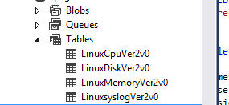

<properties
		pageTitle="Monitoring a Linux VM with a VM extension | Microsoft Azure"
		description="Learn how to use the Linux Diagnostic Extension to monitor the performance and diagnostic data of a Linux VM in Azure."
		services="virtual-machines-linux"
		documentationCenter=""
  		authors="NingKuang"
		manager="timlt"
		editor=""
  		tags="azure-service-management"/>

<tags
		ms.service="virtual-machines-linux"
		ms.workload="infrastructure-services"
		ms.tgt_pltfrm="vm-linux"
		ms.devlang="na"
		ms.topic="article"
		ms.date="12/15/2015"
		ms.author="Ning"/>

# Use the Linux Diagnostic Extension to monitor the performance and diagnostic data of a Linux VM

## Introduction

(**Note**: The Linux Diagnostic Extension is open-sourced on [Github](https://github.com/Azure/azure-linux-extensions/tree/master/Diagnostic) where the most current information on the extension is first published. You might want to check the [Github page](https://github.com/Azure/azure-linux-extensions/tree/master/Diagnostic) first.)

The Linux Diagnostic Extension helps a user monitor the Linux VMs that are running on Microsoft Azure. It has the following capabilities:

- Collects and uploads the system performance information from the Linux VM to the user's storage table, including diagnostic and syslog information.
- Enables users to customize the data metrics that will be collected and uploaded.
- Enables users to upload specified log files to a designated storage table.

In the current version 2.3, the data includes:

- All Linux Rsyslog logs, including system, security, and application logs.
- All system data that's specified on [the System Center Cross Platform Solutions site](https://scx.codeplex.com/wikipage?title=xplatproviders).
- User-specified log files.

This extension works with both the classic and Resource Manager deployment models.

### Current version of the extension and deprecation of old versions

The latest version of the extension is **2.3**, and **any old versions (2.0, 2.1, and 2.2) will be deprecated and unpublished by end of this year (2016)**. If you installed the Linux Diagnostic extension with automatic minor version upgrade disabled, it's strongly recommended that you uninstall the extension and reinstall it with automatic minor version upgrade enabled. On classic (ASM) VMs, you can achieve this by specifying '2.*' as the version if you are installing the extension through Azure XPLAT CLI or Powershell. On ARM VMs, you can achieve this by including '"autoUpgradeMinorVersion": true' in the VM deployment template. Also, any new installation of the extension should have the auto minor version upgrade option turned on.

## Enable the extension
You can enable this extension by using the [Azure portal](https://portal.azure.com/#), Azure PowerShell, or Azure CLI scripts.

To view and configure the system and performance data directly from the Azure portal, follow [these steps on the Azure blog](https://azure.microsoft.com/blog/2014/09/02/windows-azure-virtual-machine-monitoring-with-wad-extension/ "URL to the Windows blog"/).

This article focuses on how to enable and configure the extension by using Azure CLI commands. This allows you to read and view the data directly from the storage table.

Note that the configuration methods that are described here won't work for the Azure portal. To view and configure the system and performance data directly from the Azure portal, the extension must be enabled through the portal.

## Prerequisites
- **Azure Linux Agent version 2.0.6 or later**.
Note that most Azure VM Linux gallery images include version 2.0.6 or later. You can run **WAAgent -version** to confirm which version is installed on the VM. If the VM is running a version that's earlier than 2.0.6, you can follow [these instructions on GitHub](https://github.com/Azure/WALinuxAgent "instructions") to update it.

- **Azure CLI**. Follow [this guidance for installing CLI](../xplat-cli-install.md) to set up the Azure CLI environment on your machine. After Azure CLI is installed, you can use the **azure** command from your command-line interface (Bash, Terminal, or command prompt) to access the Azure CLI commands. For example:
	- Run **azure vm extension set --help** for detailed help information.
	- Run **azure login** to sign in to Azure.
	- Run **azure vm list** to list all the virtual machines that you have on Azure.
- A storage account to store the data. You will need a storage account name that was created previously and an access key to upload the data to your storage.

## Use the Azure CLI command to enable the Linux Diagnostic Extension

### Scenario 1. Enable the extension with the default data set
In version 2.3 or later, the default data that will be collected includes:

- All Rsyslog information (including system, security, and application logs).  
- A core set of basis system data. Note that the full data set is described on the [System Center Cross Platform Solutions site](https://scx.codeplex.com/wikipage?title=xplatproviders).
If you want to enable extra data, continue with the steps in Scenarios 2 and 3.

Step 1. Create a file named PrivateConfig.json with the following content:

    {
        "storageAccountName" : "the storage account to receive data",
        "storageAccountKey" : "the key of the account"
    }

Step 2. Run **azure vm extension set vm_name LinuxDiagnostic Microsoft.OSTCExtensions 2.* --private-config-path PrivateConfig.json**.

###   Scenario 2. Customize the performance monitor metrics  
This section describes how to customize the performance and diagnostic data table.

Step 1. Create a file named PrivateConfig.json with the content that was described in Scenario 1. Also create a file named PublicConfig.json. Specify the particular data you want to collect.

For all supported providers and variables, reference the [System Center Cross Platform Solutions site](https://scx.codeplex.com/wikipage?title=xplatproviders). You can have multiple queries and store them in multiple tables by appending more queries to the script.

By default, the Rsyslog data is always collected.

    {
      	"perfCfg":
      	[
      	    {
      	        "query" : "SELECT PercentAvailableMemory, AvailableMemory, UsedMemory ,PercentUsedSwap FROM SCX_MemoryStatisticalInformation",
      	        "table" : "LinuxMemory"
      	    }
      	]
    }

Step 2. Run **azure vm extension set vm_name LinuxDiagnostic Microsoft.OSTCExtensions '2.*'
--private-config-path PrivateConfig.json --public-config-path PublicConfig.json**.

###   Scenario 3. Upload your own log files
This section describes how to collect and upload specific log files to your storage account. You need to specify both the path to your log file and the name of the table where you want to store your log. You can create multiple log files by adding multiple file/table entries to the script.

Step 1. Create a file named PrivateConfig.json with the content that was described in Scenario 1. Then create another file named PublicConfig.json with the following content:

    {
        "fileCfg" :
        [
            {
                "file" : "/var/log/mysql.err",
                "table" : "mysqlerr"
             }
        ]
    }

Step 2. Run **azure vm extension set vm_name LinuxDiagnostic Microsoft.OSTCExtensions '2.*'
--private-config-path PrivateConfig.json --public-config-path PublicConfig.json**.

Note that with this setting on the extension versions prior to 2.3, all logs written to `/var/log/mysql.err` might be duplicated to `/var/log/syslog` (or `/var/log/messages` depending on the Linux distro) as well. If you'd like to avoid this duplicate logging, you can exclude logging of `local6` facility logs in your rsyslog configuration. It depends on the Linux distro, but on an Ubuntu 14.04 system, the file to modify is `/etc/rsyslog.d/50-default.conf` and you can replace the line `*.*;auth,authpriv.none -/var/log/syslog` to `*.*;auth,authpriv,local6.none -/var/log/syslog`. This issue is fixed in the latest hotfix release of 2.3 (2.3.9007), so if you have the extension version 2.3, this issue should not happen. If it still does even after restarting your VM, please contact us and help us troubleshoot why the latest hotfix version is not installed automatically.

###   Scenario 4. Stop the extension from collecting any logs
This section describes how to stop the extension from collecting logs. Note that the monitoring agent process will be still up and running even with this reconfiguration. If you'd like to stop the monitoring agent process completely, you can do so by disabling the extension. The command to disable the extension is **azure vm extension set --disable <vm_name> LinuxDiagnostic Microsoft.OSTCExtensions '2.*'**.

Step 1. Create a file named PrivateConfig.json with the content that was described in Scenario 1. Create another file named PublicConfig.json with the following content:

    {
        "perfCfg" : [],
        "enableSyslog" : "false"
    }

Step 2. Run **azure vm extension set vm_name LinuxDiagnostic Microsoft.OSTCExtensions '2.*'
--private-config-path PrivateConfig.json --public-config-path PublicConfig.json**.

## Review your data
The performance and diagnostic data are stored in an Azure Storage table. Review [How to use Azure Table Storage from Ruby](../storage/storage-ruby-how-to-use-table-storage.md) to learn how to access the data in the storage table by using Azure CLI scripts.

In addition, you can use following UI tools to access the data:

1. Visual Studio Server Explorer. Go to your storage account. After the VM runs for about five minutes, you'll see the four default tables: “LinuxCpu”, ”LinuxDisk”, ”LinuxMemory”, and ”Linuxsyslog”. Double-click the table names to view the data.

2. [Azure Storage Explorer](https://azurestorageexplorer.codeplex.com/ "Azure Storage Explorer").

If you've enabled fileCfg or perfCfg (as described in Scenarios 2 and 3), you can use Visual Studio Server Explorer and Azure Storage Explorer to view non-default data.

## Known issues
- In the current version (2.3) of the Linux Diagnostic Extension, the Rsyslog information and customer-specified log file can only be accessed via scripting.
