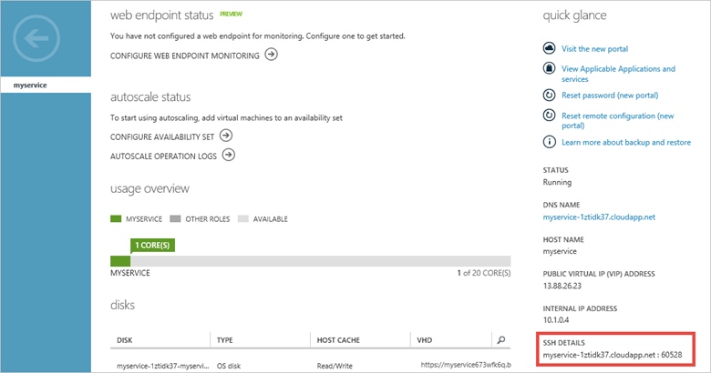
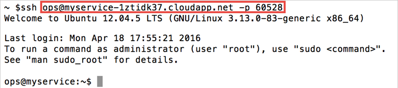

<properties
	pageTitle="Log on to a Linux VM in Azure | Microsoft Azure"
	description="Learn how to log on to an Azure virtual machine running Linux by using a Secure Shell (SSH) client."
	services="virtual-machines-linux"
	documentationCenter=""
	authors="squillace"
	manager="timlt"
	editor=""
	tags="azure-service-management"/>

<tags
	ms.service="virtual-machines-linux"
	ms.workload="infrastructure-services"
	ms.tgt_pltfrm="vm-linux"
	ms.devlang="na"
	ms.topic="article"
	ms.date="04/18/2016"
	ms.author="rasquill"/>

#How to Log on to a Virtual Machine Running Linux #

[AZURE.INCLUDE [learn-about-deployment-models](../../includes/learn-about-deployment-models-classic-include.md)] Learn how to [perform these steps using the Resource Manager deployment model](virtual-machines-linux-quick-create-portal.md).

You'll need to install an SSH client on the computer you want to use to log on to the virtual machine. There are many SSH client programs that you can choose from. The following are possible choices:

- For a virtual machine running a Linux operating system, you use a Secure Shell (SSH) client to log on; it is hard to think of a distribution that doesn't already have this installed by default. See [How to use SSH](virtual-machines-linux-ssh-from-linux.md) for a bit more information about Linux.
- On a computer running a Windows operating system, you might want to use an SSH client such as PuTTY. For more information, see the [PuTTY Download Page](http://www.chiark.greenend.org.uk/~sgtatham/putty/download.html).

>[AZURE.NOTE] For more requirements and troubleshooting tips, see [Connect to an Azure virtual machine with RDP or SSH](http://go.microsoft.com/fwlink/p/?LinkId=398294).

This procedure shows you how to use the SSH client on OS X to access the virtual machine.

1. Find the **Host Name** and **Port information** from the [Management Portal](http://manage.windowsazure.com). You can find the information that you need from the dashboard of the virtual machine. Click the virtual machine name and look for the **SSH Details** in the **Quick Glance** section of the dashboard.

	

2. Log on to the virtual machine using the account that you specified when the machine was created, along with the appropriate host name and port. For more details on how to create a virtual machine with user name and password, see [Create a Virtual Machine Running Linux](virtual-machines-linux-classic-createportal.md).

	

>[AZURE.NOTE] The VMAccess extension can help you reset the SSH key or password if you've forgotten it. If you've forgotten the user name, you can use the extension to create a new one with sudo authority. For instructions, see the [How to Reset a Password or SSH for Linux Virtual Machines].

You can now work with the virtual machine just as you would with any other server.

<!-- LINKS -->
[How to Reset a Password or SSH for Linux Virtual Machines]: http://go.microsoft.com/fwlink/p/?LinkId=512138
