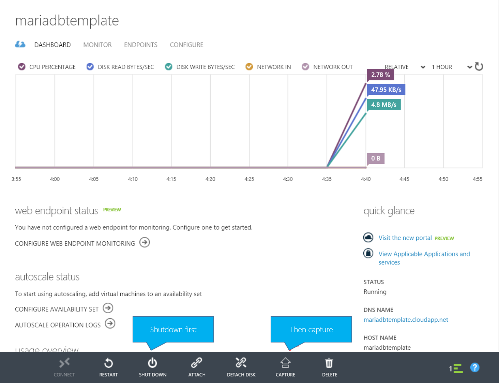

<properties
	pageTitle="Running a MariaDB (MySQL) cluster on Azure"
	description="Create a MariaDB + Galera MySQL cluster on Azure Virtual Machines"
	services="virtual-machines-linux"
	documentationCenter=""
	authors="sabbour"
	manager="timlt"
	editor=""
	tags="azure-service-management"/>

<tags
	ms.service="virtual-machines-linux"
	ms.devlang="multiple"
	ms.topic="article"
	ms.tgt_pltfrm="vm-linux"
	ms.workload="infrastructure-services"
	ms.date="04/15/2015"
	ms.author="v-ahsab"/>

# MariaDB (MySQL) cluster - Azure tutorial

[AZURE.INCLUDE [learn-about-deployment-models](../../includes/learn-about-deployment-models-classic-include.md)]

> [AZURE.NOTE]  MariaDB Enterprise cluster is now available in the Azure Marketplace.  The new offering will automatically deploy a MariaDB Galera cluster on ARM. You should use the new offering from  https://azure.microsoft.com/en-us/marketplace/partners/mariadb/cluster-maxscale/ 

We're creating a multi-Master [Galera](http://galeracluster.com/products/) cluster of [MariaDBs](https://mariadb.org/en/about/), a robust, scalable, and reliable drop-in replacement for MySQL, to work in a highly available environment on Azure Virtual Machines.

## Architecture overview

This topic performs the following steps:

1. Create A 3-node cluster
2. Separate the Data Disks from the OS Disk
3. Create the Data Disks in RAID-0/striped setting to increase IOPS
4. Use the Azure Load Balancer to balance the load for the 3 nodes
5. To minimize repetitive work, create a VM image containing MariaDB+Galera and use it to create the other cluster VMs.

> [AZURE.NOTE]  This topic uses the [Azure CLI] tools, so make sure to download them and connect them to your Azure subscription according to the instructions. If you need a reference to the commands available in the Azure CLI, check out this link for the [Azure CLI command reference]. You will also need to [create an SSH key for authentication] and make note of the **.pem file location**.

## Creating the template

### Infrastructure

1. Create an Affinity Group to hold the resources together

		azure account affinity-group create mariadbcluster --location "North Europe" --label "MariaDB Cluster"

2. Create a Virtual Network

		azure network vnet create --address-space 10.0.0.0 --cidr 8 --subnet-name mariadb --subnet-start-ip 10.0.0.0 --subnet-cidr 24 --affinity-group mariadbcluster mariadbvnet

3. Create a Storage Account to host all our disks. Note that you shouldn't be placing more than 40 heavily used disks on the same Storage Account to avoid hitting the 20,000 IOPS storage account limit. In this case, we're far off from this number so we'll store everything on the same account for simplicity

		azure storage account create mariadbstorage --label mariadbstorage --affinity-group mariadbcluster

3. Find the name of the CentOS 7 Virtual Machine image

		azure vm image list | findstr CentOS
this will output something like `5112500ae3b842c8b9c604889f8753c3__OpenLogic-CentOS-70-20140926`. Use the name in the following step.

4. Create the VM template replacing **/path/to/key.pem** with the path where you stored the generated .pem SSH key

		azure vm create --virtual-network-name mariadbvnet --subnet-names mariadb --blob-url "http://mariadbstorage.blob.core.windows.net/vhds/mariadbhatemplate-os.vhd"  --vm-size Medium --ssh 22 --ssh-cert "/path/to/key.pem" --no-ssh-password mariadbtemplate 5112500ae3b842c8b9c604889f8753c3__OpenLogic-CentOS-70-20140926 azureuser

5. Attach 4 x 500GB data disks to the VM for use in the RAID configuration

		FOR /L %d IN (1,1,4) DO azure vm disk attach-new mariadbhatemplate 512 http://mariadbstorage.blob.core.windows.net/vhds/mariadbhatemplate-data-%d.vhd

6. SSH into the template VM that you created at **mariadbhatemplate.cloudapp.net:22** and connect using your private key.

### Software

1. Obtain root

        sudo su

2. Install RAID support:

     - Install mdadm

        		yum install mdadm

     - Create the RAID0/stripe configuration with an EXT4 file system

				mdadm --create --verbose /dev/md0 --level=stripe --raid-devices=4 /dev/sdc /dev/sdd /dev/sde /dev/sdf
				mdadm --detail --scan >> /etc/mdadm.conf
				mkfs -t ext4 /dev/md0

     - Create the mount point directory

				mkdir /mnt/data

     - Retrieve the UUID of the newly created RAID device

				blkid | grep /dev/md0

     - Edit /etc/fstab

        		vi /etc/fstab

     - Add the device in there to enable auto mouting on reboot replacing the UUID with the value obtained from the **blkid** command before

        		UUID=<UUID FROM PREVIOUS>   /mnt/data ext4   defaults,noatime   1 2

     - Mount the new partition

        		mount /mnt/data

3. Install MariaDB:

     - Create the MariaDB.repo file:

              	vi /etc/yum.repos.d/MariaDB.repo

     - Fill it with the below content

				[mariadb]
				name = MariaDB
				baseurl = http://yum.mariadb.org/10.0/centos7-amd64
				gpgkey=https://yum.mariadb.org/RPM-GPG-KEY-MariaDB
				gpgcheck=1

     - Remove existing postfix and mariadb-libs to avoid conflicts

    		yum remove postfix mariadb-libs-*

     - Install MariaDB with Galera

    		yum install MariaDB-Galera-server MariaDB-client galera

4. Move the MySQL data directory to the RAID block device

     - Copy the current MySQL directory into its new location and remove the old directory

    		cp -avr /var/lib/mysql /mnt/data  
    		rm -rf /var/lib/mysql

     - Set permissions on new directory accordingly

        	chown -R mysql:mysql /mnt/data && chmod -R 755 /mnt/data/  

     - Create a symlink pointing the old directory to the new location on the RAID partition

    		ln -s /mnt/data/mysql /var/lib/mysql

5. Because [SELinux will interfere with the cluster operations](http://galeracluster.com/documentation-webpages/configuration.html#selinux), it is necessary to disable it for the current session (until a compatible version appears). Edit `/etc/selinux/config` to disable it for subsequent restarts:

	        setenforce 0

       then editing `/etc/selinux/config` to set `SELINUX=permissive`

6. Validate MySQL runs

    - Start MySQL

    		service mysql start

    - Secure the MySQL installation, set the root password, remove anonymous users, disabling remote root login and removing the test database

            mysql_secure_installation

    - Create a user on the database for cluster operations and optionally, your applications

			mysql -u root -p
			GRANT ALL PRIVILEGES ON *.* TO 'cluster'@'%' IDENTIFIED BY 'p@ssw0rd' WITH GRANT OPTION; FLUSH PRIVILEGES;
            exit

   - Stop MySQL

			service mysql stop

7. Create configuration placeholder

	- Edit the MySQL configuration to create a placeholder for the cluster settings. Do not replace the **`<Vairables>`** or uncomment now. That will happen after we create a VM from this template.

			vi /etc/my.cnf.d/server.cnf

	- Edit the **[galera]** section and clear it out

	- Edit the **[mariadb]** section

			wsrep_provider=/usr/lib64/galera/libgalera_smm.so
            binlog_format=ROW
            wsrep_sst_method=rsync
			bind-address=0.0.0.0 # When set to 0.0.0.0, the server listens to remote connections
			default_storage_engine=InnoDB
            innodb_autoinc_lock_mode=2

            wsrep_sst_auth=cluster:p@ssw0rd # CHANGE: Username and password you created for the SST cluster MySQL user
            #wsrep_cluster_name='mariadbcluster' # CHANGE: Uncomment and set your desired cluster name
            #wsrep_cluster_address="gcomm://mariadb1,mariadb2,mariadb3" # CHANGE: Uncomment and Add all your servers
            #wsrep_node_address='<ServerIP>' # CHANGE: Uncomment and set IP address of this server
			#wsrep_node_name='<NodeName>' # CHANGE: Uncomment and set the node name of this server

8. Open required ports on the firewall (using FirewallD on CentOS 7)

	- MySQL: `firewall-cmd --zone=public --add-port=3306/tcp --permanent`
    - GALERA: `firewall-cmd --zone=public --add-port=4567/tcp --permanent`
    - GALERA IST: `firewall-cmd --zone=public --add-port=4568/tcp --permanent`
    - RSYNC: `firewall-cmd --zone=public --add-port=4444/tcp --permanent`
    - Reload the firewall: `firewall-cmd --reload`

9.  Optimize the system for performance. Refer to this article on [performance tuning strategy] for more details

	- Edit the MySQL configuration file again

			vi /etc/my.cnf.d/server.cnf

	- Edit the **[mariadb]** section and append the below

	> [AZURE.NOTE] It is recommended that **innodb\_buffer\_pool_size** be 70% of your VM's memory. It has been set at 2.45GB here for the Medium Azure VM with 3.5GB of RAM.

	        innodb_buffer_pool_size = 2508M # The buffer pool contains buffered data and the index. This is usually set to 70% of physical memory.
            innodb_log_file_size = 512M #  Redo logs ensure that write operations are fast, reliable, and recoverable after a crash
            max_connections = 5000 # A larger value will give the server more time to recycle idled connections
            innodb_file_per_table = 1 # Speed up the table space transmission and optimize the debris management performance
            innodb_log_buffer_size = 128M # The log buffer allows transactions to run without having to flush the log to disk before the transactions commit
            innodb_flush_log_at_trx_commit = 2 # The setting of 2 enables the most data integrity and is suitable for Master in MySQL cluster
			query_cache_size = 0

10. Stop MySQL, disable MySQL service from running on startup to avoid messing up the cluster when adding a new node, and deprovision the machine.

		service mysql stop
        chkconfig mysql off
		waagent -deprovision

11. Capture the VM through the portal. (Currently, [issue #1268 in the Azure CLI] tools describes the fact that images captured by the Azure CLI tools do not capture the attached data disks.)

	- Shutdown the machine through the portal
    - Click on Capture and specify the image name as **mariadb-galera-image** and provide a  description and check "I have run waagent".
	
	

## Creating the cluster

Create 3 VMs out of the template you just created and then configure and start the cluster.

1. Create the first CentOS 7 VM from the **mariadb-galera-image** image you created, providing the virtual network name **mariadbvnet** and the subnet **mariadb**, machine size **Medium**, passing in the Cloud Service name to be **mariadbha** (or whatever name you want to be accessed through mariadbha.cloudapp.net), setting the name of this machine to be **mariadb1**  and the username to be **azureuser**,  and enabling SSH access and passing the SSH certificate .pem file and replacing **/path/to/key.pem** with the path where you stored the generated .pem SSH key.

	> [AZURE.NOTE] The commands below are split over multiple lines for clarity, but you should enter each as one line.

		azure vm create
        --virtual-network-name mariadbvnet
        --subnet-names mariadb
        --availability-set clusteravset
		--vm-size Medium
		--ssh-cert "/path/to/key.pem"
		--no-ssh-password
		--ssh 22
		--vm-name mariadb1
		mariadbha mariadb-galera-image azureuser

2. Create 2 more Virtual Machines by _connecting_ them to the currently created **mariadbha** Cloud Service, changing the **VM name** as well as the **SSH port** to a unique port not conflicting with other VMs in the same Cloud Service.

		azure vm create
        --virtual-network-name mariadbvnet
        --subnet-names mariadb
        --availability-set clusteravset
		--vm-size Medium
		--ssh-cert "/path/to/key.pem"
		--no-ssh-password
		--ssh 23
		--vm-name mariadb2
        --connect mariadbha mariadb-galera-image azureuser
and for MariaDB3

		azure vm create
        --virtual-network-name mariadbvnet
        --subnet-names mariadb
        --availability-set clusteravset
		--vm-size Medium
		--ssh-cert "/path/to/key.pem"
		--no-ssh-password
		--ssh 24
		--vm-name mariadb3
        --connect mariadbha mariadb-galera-image azureuser

3. You will need to get the internal IP address of each of the 3 VMs for the next step:

	

4. SSH into the 3 VMs and and edit the configuration file on each

		sudo vi /etc/my.cnf.d/server.cnf

	uncommenting **`wsrep_cluster_name`** and **`wsrep_cluster_address`** by removing the **#** at the beginning and validation they are indeed what you want.
    Additionally, replace **`<ServerIP>`** in **`wsrep_node_address`** and **`<NodeName>`** in **`wsrep_node_name`** with the VM's IP address and name respectively and uncomment those lines as well.

5. Start the cluster on MariaDB1 and let it run at startup

		sudo service mysql bootstrap
        chkconfig mysql on

6. Start MySQL on MariaDB2 and MariaDB3 and let it run at startup

		sudo service mysql start
        chkconfig mysql on

## Load balancing the cluster
When you created the clustered VMs, you added them into an Availablity Set called **clusteravset** to ensure they are put on different fault and update domains and that Azure never does maintenance on all machines at once. This configuration meets the requirements to be supported by that Azure Service Level Agreement (SLA).

Now you use the Azure Load Balancer to balance requests between our 3 nodes.

Run the below commands on your machine using the Azure CLI.
The command parameters structure is: `azure vm endpoint create-multiple <MachineName> <PublicPort>:<VMPort>:<Protocol>:<EnableDirectServerReturn>:<Load Balanced Set Name>:<ProbeProtocol>:<ProbePort>`

	azure vm endpoint create-multiple mariadb1 3306:3306:tcp:false:MySQL:tcp:3306
    azure vm endpoint create-multiple mariadb2 3306:3306:tcp:false:MySQL:tcp:3306
    azure vm endpoint create-multiple mariadb3 3306:3306:tcp:false:MySQL:tcp:3306

Finally, since the CLI sets the load-balancer probe interval to 15 seconds (which may be a bit too long), change it in the portal under **Endpoints** for any of the VMs

then click on Reconfigure The Load-Balanced Set and go next

then change the Probe Interval to 5 seconds and save

## Validating the cluster

The hard work is done. The cluster should be now accessible at `mariadbha.cloudapp.net:3306` which will hit the load balancer and route requests between the 3 VMs smoothly and efficiently.

Use your favorite MySQL client to connect or just connect from one of the VMs to verify this cluster is working.

	 mysql -u cluster -h mariadbha.cloudapp.net -p

Then create a new database and populate it with some data

	CREATE DATABASE TestDB;
    USE TestDB;
    CREATE TABLE TestTable (id INT NOT NULL AUTO_INCREMENT PRIMARY KEY, value VARCHAR(255));
	INSERT INTO TestTable (value)  VALUES ('Value1');
	INSERT INTO TestTable (value)  VALUES ('Value2');
    SELECT * FROM TestTable;

Will result in the table below

	+----+--------+
	| id | value  |
	+----+--------+
	|  1 | Value1 |
	|  4 | Value2 |
	+----+--------+
	2 rows in set (0.00 sec)

<!--Every topic should have next steps and links to the next logical set of content to keep the customer engaged-->
## Next steps

In this article, you created a 3 node MariaDB + Galera highly-available cluster on Azure Virtual Machines running CentOS 7. The VMs are load balanced with the Azure Load Balancer.

You may want to take a look at [another way to cluster MySQL on Linux] and ways to [optimize and test MySQL performance on Azure Linux VMs].

<!--Anchors-->
[Architecture overview]: #architecture-overview
[Creating the template]: #creating-the-template
[Creating the cluster]: #creating-the-cluster
[Load balancing the cluster]: #load-balancing-the-cluster
[Validating the cluster]: #validating-the-cluster
[Next steps]: #next-steps

<!--Image references-->

<!--Link references-->
[Galera]: http://galeracluster.com/products/
[MariaDBs]: https://mariadb.org/en/about/
[Azure CLI]: ../xplat-cli.md
[Azure CLI command reference]: ../virtual-machines-command-line-tools.md
[create an SSH key for authentication]:http://www.jeff.wilcox.name/2013/06/secure-linux-vms-with-ssh-certificates/
[performance tuning strategy]: virtual-machines-linux-optimize-mysql-perf.md
[optimize and test MySQL performance on Azure Linux VMs]:virtual-machines-linux-optimize-mysql-perf.md
[issue #1268 in the Azure CLI]:https://github.com/Azure/azure-xplat-cli/issues/1268
[another way to cluster MySQL on Linux]: virtual-machines-linux-mysql-cluster.md
