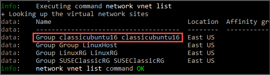

<properties
	pageTitle="Migrate IaaS resources from classic to Azure Resource Manager by using Azure CLI | Microsoft Azure"
	description="This article walks through the platform-supported migration of resources from classic to Azure Resource Manager by using Azure CLI"
	services="virtual-machines-linux"
	documentationCenter=""
	authors="cynthn"
	manager="timlt"
	editor=""
	tags="azure-resource-manager"/>

<tags
	ms.service="virtual-machines-windows"
	ms.workload="infrastructure-services"
	ms.tgt_pltfrm="vm-linux"
	ms.devlang="na"
	ms.topic="article"
	ms.date="07/19/2016"
	ms.author="cynthn"/>

# Migrate IaaS resources from classic to Azure Resource Manager by using Azure CLI

These steps show you how to use Azure command-line interface (CLI) commands to migrate infrastructure as a service (IaaS) resources from the classic deployment model to the Azure Resource Manager deployment model. The article requires the [Azure CLI](../xplat-cli-install.md).

>[AZURE.NOTE] All the operations described here are idempotent. If you have a problem other than an unsupported feature or a configuration error, we recommend that you retry the prepare, abort, or commit operation. The platform will then try the action again.

## Step 1: Prepare for migration

Here are a few best practices that we recommend as you evaluate migrating IaaS resources from classic to Resource Manager:

- Read through the [list of unsupported configurations or features](virtual-machines-windows-migration-classic-resource-manager.md). If you have virtual machines that use unsupported configurations or features, we recommend that you wait for the feature/configuration support to be announced. Alternatively, you can remove that feature or move out of that configuration to enable migration if it suits your needs.
-	If you have automated scripts that deploy your infrastructure and applications today, try to create a similar test setup by using those scripts for migration. Alternatively, you can set up sample environments by using the Azure portal.

## Step 2: Set your subscription and register the provider

For migration scenarios, you need to set up your environment for both classic and Resource Manager. [Install Azure CLI](../xplat-cli-install.md) and [select your subscription](../xplat-cli-connect.md).

Sign-in to your account.
	
	azure login

Select the Azure subscription by using the following command.

	azure account set "<azure-subscription-name>"

>[AZURE.NOTE] Registration is a one time step but it needs to be done once before attempting migration. Without registering you'll see the following error message 

>	*BadRequest : Subscription is not registered for migration.* 

Register with the migration resource provider by using the following command. Note that in some cases, this command times out. However, the registration will be successful.

	azure provider register Microsoft.ClassicInfrastructureMigrate

Please wait five minutes for the registration to finish. You can check the status of the approval by using the following command. Make sure that RegistrationState is `Registered` before you proceed.

	azure provider show Microsoft.ClassicInfrastructureMigrate

Now switch CLI to the `asm` mode.

	azure config mode asm

## Step 3: Option 1 - Migrate virtual machines in a cloud service 

Get the list of cloud services by using the following command, and then pick the cloud service that you want to migrate. Note that if the VMs in the cloud service are in a virtual network or if they have web/worker roles, you will get an error message.

	azure service list

Run the following command to get the deployment name for the cloud service from the verbose output. In most cases, the deployment name is the same as the cloud service name.

	azure service show <serviceName> -vv

Prepare the virtual machines in the cloud service for migration. You have two options to choose from.

If you want to migrate the VMs to a platform-created virtual network, use the following command.

	azure service deployment prepare-migration <serviceName> <deploymentName> new "" "" ""

If you want to migrate to an existing virtual network in the Resource Manager deployment model, use the following command.

	azure service deployment prepare-migration <serviceName> <deploymentName> existing <destinationVNETResourceGroupName> subnetName <vnetName>

After the prepare operation is successful, you can look through the verbose output to get the migration state of the VMs and ensure that they are in the `Prepared` state.

	azure vm show <vmName> -vv

Check the configuration for the prepared resources by using either CLI or the Azure portal. If you are not ready for migration and you want to go back to the old state, use the following command.

	azure service deployment abort-migration <serviceName> <deploymentName>

If the prepared configuration looks good, you can move forward and commit the resources by using the following command.

	azure service deployment commit-migration <serviceName> <deploymentName>

	
## Step 3: Option 2 -  Migrate virtual machines in a virtual network

Pick the virtual network that you want to migrate. Note that if the virtual network contains web/worker roles or VMs with unsupported configurations, you will get a validation error message.

Get all the virtual networks in the subscription by using the following command.

	azure network vnet list
	
The output will look something like this:

In the above example, the **virtualNetworkName** is the entire name **"Group classicubuntu16 classicubuntu16"**.

Prepare the virtual network of your choice for migration by using the following command.

	azure network vnet prepare-migration <virtualNetworkName>

Check the configuration for the prepared virtual machines by using either CLI or the Azure portal. If you are not ready for migration and you want to go back to the old state, use the following command.

	azure network vnet abort-migration <virtualNetworkName>

If the prepared configuration looks good, you can move forward and commit the resources by using the following command.

	azure network vnet commit-migration <virtualNetworkName>

## Step 4: Migrate a storage account

Once you're done migrating the virtual machines, we recommend you migrate the storage account.

Prepare the storage account for migration by using the following command

	azure storage account prepare-migration <storageAccountName>

Check the configuration for the prepared storage account by using either CLI or the Azure portal. If you are not ready for migration and you want to go back to the old state, use the following command.

	azure storage account abort-migration <storageAccountName>

If the prepared configuration looks good, you can move forward and commit the resources by using the following command.

	azure storage account commit-migration <storageAccountName>

## Next steps

- [Platform-supported migration of IaaS resources from classic to Resource Manager](virtual-machines-windows-migration-classic-resource-manager.md)
- [Technical deep dive on platform-supported migration from classic to Resource Manager](virtual-machines-windows-migration-classic-resource-manager-deep-dive.md)
